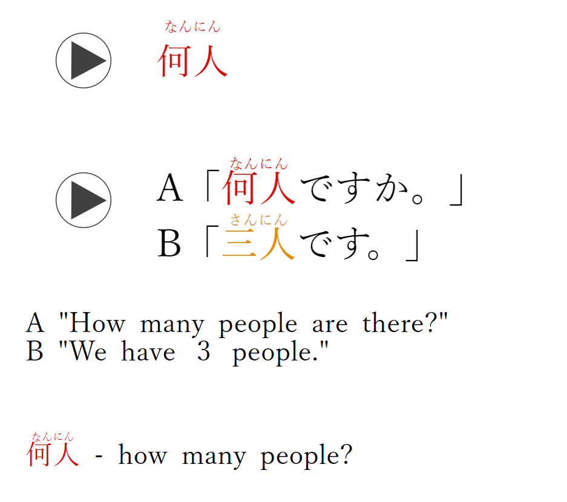

Day 1:

1. あなた  
   あなたはトムさんですか。  
   Are you Tom?  
   あなた - you
   

2. なまえ
   
   名前
   
   [](http://127.0.0.1:9796/#)
   
   A「
   
   おなまえ
   
   お名前
   
   は？」
   
   B「
   
   トム
   
   です。」
   
   [](http://127.0.0.1:9796/#)
   
   A "What's your name?"  
   B "Tom."
   
   なまえ
   
   名前
   
    - name
    

3. そうです  
   A「  
   やまだ  
   山田さんですか。」  
   B「はい、そうです。」  
   A "Are you Yamada?"  
   B "Yes, I am."  
   そうです - yes, that's right
   

4. ええ  
   A「  
   やまだ  
   山田さんですか。」  
   B「ええ、そうです。」  
   A "Are you Yamada?"  
   B "Yes, I am."  
   ええ - yes
   
   
   - **ええ (ē)**: This is an affirmative response, similar to "yes" in English. However, "ええ" (ē) is often considered a bit softer or more polite than "はい" (hai). It's commonly used in polite or formal contexts.

5. いいえ  
   A「  
   やまだ  
   山田さんですか。」  
   C「いいえ。」  
   A "Are you Yamada?"  
   C "No."  
   いいえ - no
   

6. ちが  
   違います  
   A「  
   やまだ  
   山田さんですか。」  
   B「いいえ、  
   ちが  
   違います。  
   たなか  
   田中です。」  
   A "Are you Yamada?"  
   B "No, that is not correct. I am Tanaka."  
   ちが  
   違います - no, that's not correct
   Chiga i mas
   
   

7. ちゃん
   
   かのじょ
   
   彼女
   
   は
   
   ララ
   
   ちゃん
   
   です。
   
   [](http://127.0.0.1:9796/#)
   
   She is Lara.
   
   ちゃん
   
    - endearment honorific
    kanojo = she
    kare = he
   
    
   
   - **は (wa)**: This is a particle in Japanese that indicates the topic of the sentence. It's often translated as "is" or "am" in English.

8. "彼はララちゃんです。" (Kare wa Rara-chan desu.) = "He is Rara-chan,"
   kanojo = she
   kare = he

9. おはよう
   
    - good morning (informal)
   

10. こんばんは
    
     - good evening

11. Brother sister dad mom etc = family (kazoku or かぞくor 家族) :
    
    > かぞく
    > 
    > 家族 (kazoku) - family
    > 
    > にん
    > 
    > 人 (nin) - people/persons
    > 
    > ひとり
    > 
    > 一人 (hitori) - one person/people
    > 
    > ふたり
    > 
    > 二人 (futari) - two people
    > 
    > さんにん
    > 
    > 三人 (san nin) - three people
    > 
    > 家族 は 七人 です。(kazoku wa shichi nin des) - There are  7  people in my family.

```markdown
> Father
> おとう
> お父さん (o to o sa n) - father

> Mother
> おかあ
> お母さん (o ka a sa n) - mother


> Siblings
> きょうだい
> 兄弟 (ki yo o da i) - siblings

> younger brother
> おとうと
> 
> 弟 さん - younger brother (oto oto san)


> older brother
> おにい
> 
> お兄 さん (oni i san)
> 
>  - older brother


> younger sister
> いもうと
> 
> 妹さん (imo oto san) - younger sister

> older sister
> おねえ
お姉さん (o ne e sa n) - older sister


> Parents
> りょうしん
> 
> ご 両親 (go riyoshin)
> 
>  - parents (formal)


> Grandpa
> おじいさん (o ji i san) - grandfather


> おばあさん - grandmother
```

12. どうも (do o mo) - thank you

13. こちら こそ (ko chi ra ko so) - me too, same here

14. Number of people:
    
    - にん
      
      人 (nin) - people/person
      
      ひとり
      
      一人 (hitori) - one person/people
      
      ふたり
      
      二人 (futari) - two people

      さんにん
    
      三人 (sa n ni n) - three people
    
    
      よにん
    
      四人 (yo ni n) - four people
    
    
      ごにん
    
      五人 (go ni n) - five people
    
    
      ろくにん
    
      六人 (ro ku ni n) - six people
    
    
      しちにん
    
      七人 (shi chi ni n / na na ri n) - seven people
    
    
      はちにん
    
      八人 (ha chi ni n) - eight people
    
    
      くにん
    
      九人 (ku ni n / k yu ri n) - nine people
    
    
      じゅうにん
    
      十人 (ji yu o ni n) - ten people

15. 
    Nan nin des ka?
    
    San nin des.

16. おとな
    
    大人 (o to na) - adult

17. こども
    
    子供 (ko do mo) - child

18. おとこのひと
    男の人 - man

19. あなたの名前は何ですか？ お父さんの職業はなんですか？(Anata no namae wa nanidesu ka? Otōsan no shokugyō wa nandesu ka?) = what is your name? what does your father do? 

20. 
