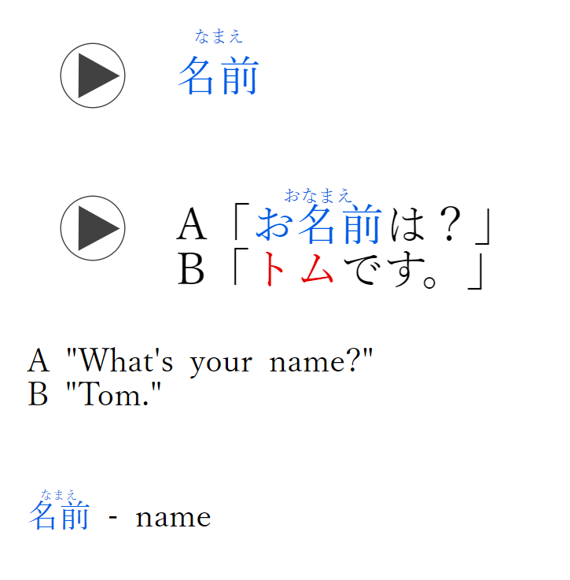
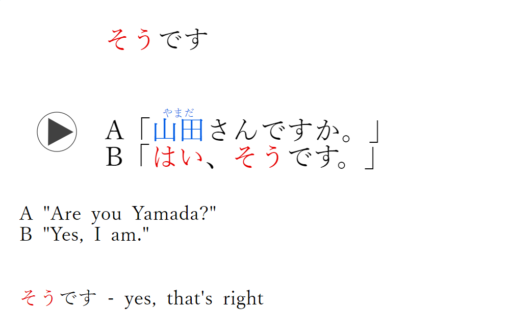
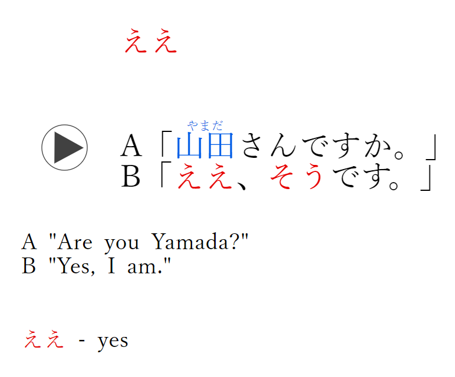
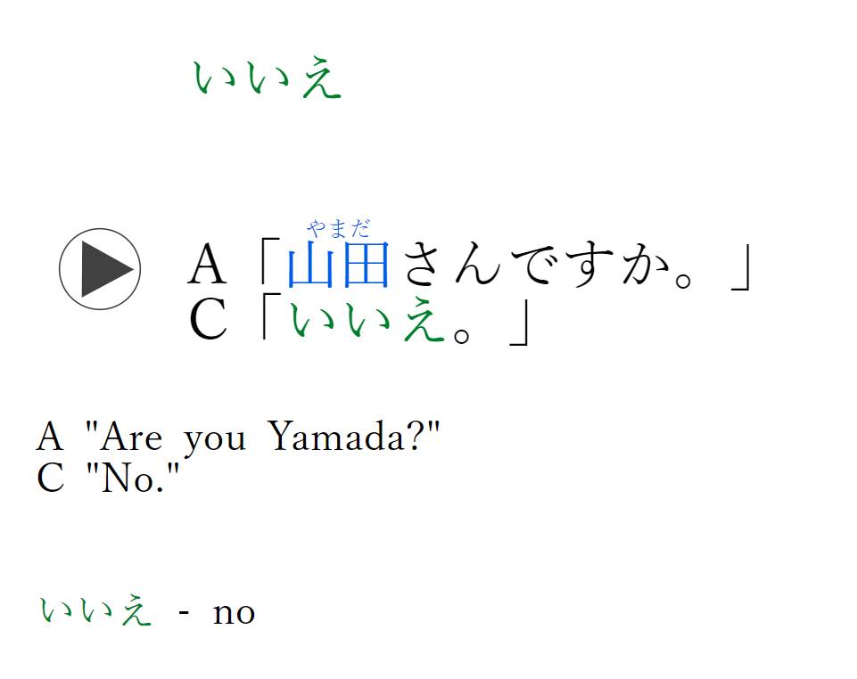
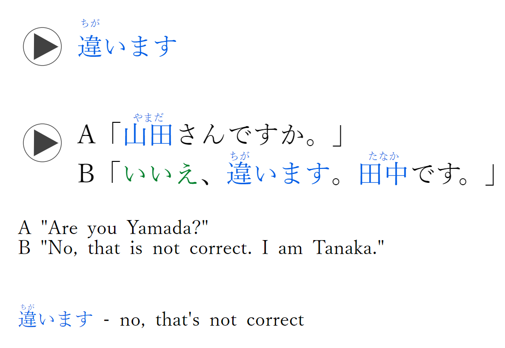
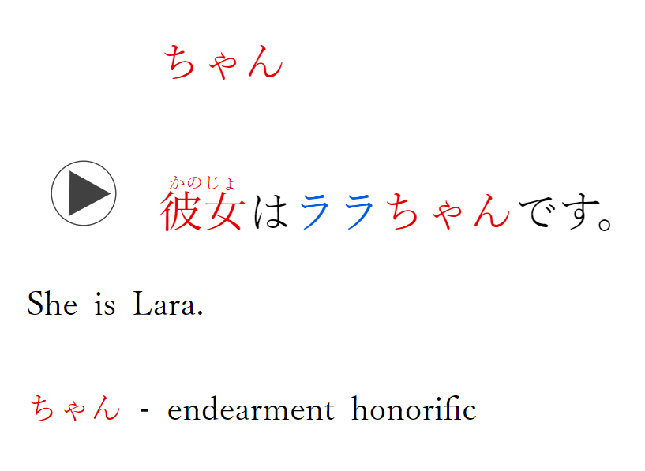
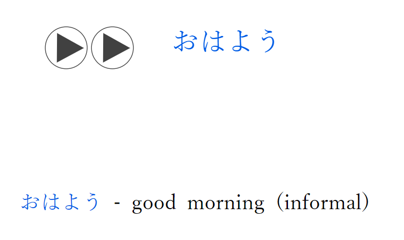

Day 1:

1. あなた  
   あなたはトムさんですか。  
   Are you Tom?  
   あなた - you
   

2. なまえ
   
   名前
   
   
   
   A「
   
   おなまえ
   
   お名前
   
   は？」
   
   B「
   
   トム
   
   です。」
   
   
   
   A "What's your name?"  
   B "Tom."
   
   なまえ
   
   名前
   
    - name
    

3. そうです  
   A「  
   やまだ  
   山田さんですか。」  
   B「はい、そうです。」  
   A "Are you Yamada?"  
   B "Yes, I am."  
   そうです - yes, that's right
   

4. ええ  
   A「  
   やまだ  
   山田さんですか。」  
   B「ええ、そうです。」  
   A "Are you Yamada?"  
   B "Yes, I am."  
   ええ - yes
   
   
   - **ええ (ē)**: This is an affirmative response, similar to "yes" in English. However, "ええ" (ē) is often considered a bit softer or more polite than "はい" (hai). It's commonly used in polite or formal contexts.

5. いいえ  
   A「  
   やまだ  
   山田さんですか。」  
   C「いいえ。」  
   A "Are you Yamada?"  
   C "No."  
   いいえ - no
   

6. ちが  
   違います  
   A「  
   やまだ  
   山田さんですか。」  
   B「いいえ、  
   ちが  
   違います。  
   たなか  
   田中です。」  
   A "Are you Yamada?"  
   B "No, that is not correct. I am Tanaka."  
   ちが  
   違います - no, that's not correct
   Chiga i mas
   
   

7. ちゃん
   
   かのじょ
   
   彼女
   
   は
   
   ララ
   
   ちゃん
   
   です。
   
   
   
   She is Lara.
   
   ちゃん
   
    - endearment honorific
    kanojo = she
    kare = he
   
    
   
   - **は (wa)**: This is a particle in Japanese that indicates the topic of the sentence. It's often translated as "is" or "am" in English.

8. "彼はララちゃんです。" (Kare wa Rara-chan desu.) = "He is Rara-chan,"
   kanojo = she
   kare = he

9. おはよう
   
    - good morning (informal)
   

10. こんばんは
    
     - good evening

11. 
