### In Java, everything is an Object !!!!!!!!!!

1. what are the commands to run a java code? and why?
   You can answer like this:

To run a Java program, you typically use two commands: `javac` and `java`.

1. **`javac`**: This is the Java compiler command. It’s used to compile your Java source code (`.java` files) into bytecode (`.class` files). The command is used as follows:
   
   ```bash
   javac MyProgram.java
   ```
   
   This will produce a `MyProgram.class` file if there are no compilation errors. The `javac` command is necessary because Java is a compiled language. The source code you write needs to be translated into bytecode, which is a format that the Java Virtual Machine (JVM) can understand and execute.

2. **`java`**: This is the Java interpreter command. It’s used to run the bytecode that was generated by the `javac` command. The command is used as follows:
   
   ```bash
   java MyProgram
   ```
   
   This will run the `main` method in the `MyProgram` class. The `java` command starts the JVM and loads the `.class` files (bytecode), then executes the `main` method.

Remember, when using the `java` command, you don’t include the `.class` extension, just the name of the class file.

These commands give you the flexibility to compile your code once and run it anywhere that has a JVM, which is one of the key advantages of Java, known as “write once, run anywhere” (WORA). This is because the JVM interprets the platform-independent Java bytecode into instructions that are understood by the underlying hardware.

In an integrated development environment (IDE), these steps are often done automatically when you build or run your project. But it’s important to understand what’s happening under the hood.

1.
 compiler vs interpreter: python is an interpreter language while C++ is
 compiled language. compile korle ki hoy? puro code ekbare compile/run 
hoy. but enterpreter is like python e jemon line by line execute kora 
jay jupyter e oirokom.  
2. So, for python and JS, when you run your 
code, it does not need to be compiled. so it is dynamic type checking 
and java and C++ are static type checking.  
3. A language is 
statically-typed if the type of a variable is known at compile time 
instead at run time. This allows many type-errors to be caught before 
running the code.  
4. A Java class file is a file (with the . class 
filename extension) containing Java bytecode that can be executed on the
 Java Virtual Machine (JVM).  
5. by compiling and running the code , it generates a main.class in out folder.  
6. public static void main << this method is must. but public class Main can be changed to other names.  
7.
 primitive data types and reference data types in java. when we want to 
store simple values, we use primitive data types. like int num = 5; but 
when we want to store complex values, reference types and objects come 
into play.  
8. Point pointA = new Point(2,5); pointA here is an object which is a reference type.  

# Memory Management and GC (Java Garbage Collection)

9. Heap:  
- Space is used to store objects and JRE classes at runtime.  

- New objects are always created in heap space.  

- References to these objects are store in Stack memory.  
10. Stack memory:  
- Stack memory in java is used for static memory allocation and the execution of a thread LIFO.  

- Frame (stack frame) contains all the data for one function call.  

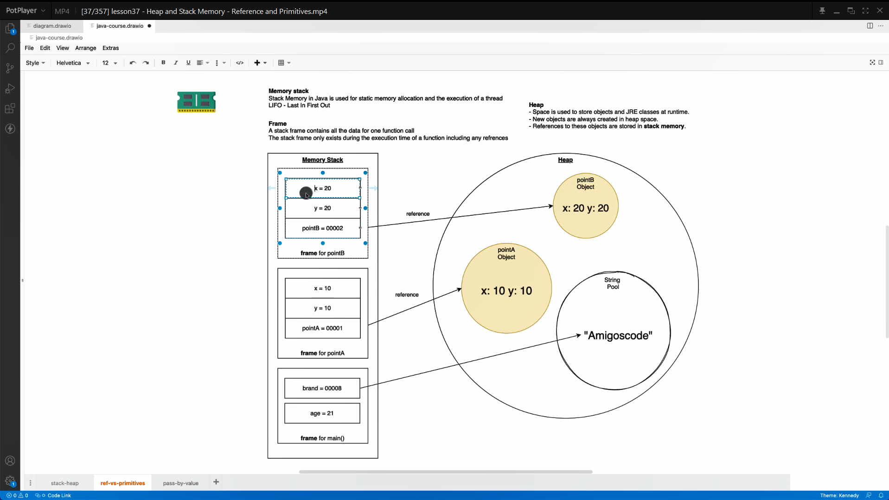

11. Yes, your understanding is correct. In Java:
    
    - The **Heap** is a region of memory used for dynamic memory allocation where the Java Runtime Environment (JRE) stores objects and JRE classes at runtime. New objects are always created in heap space.
    
    - The **Stack** is used for static memory allocation and contains method-specific values that are short-lived. It also contains references to objects in the heap.
    
    Here’s a bit more detail:
    
    - When a new object is created, it’s always stored in the Heap space and stack memory contains the reference to it. Stack memory only contains local primitive variables and reference variables to objects in heap space.
    
    - The Stack is thread-safe because each thread operates in its own stack. But, the Heap is not thread-safe and needs to be guarded by properly synchronizing the code.
    
    - The Stack space is always in a LIFO (Last In First Out) order. It’s a more restricted area compared to the Heap and as such, memory shortage problems like `StackOverFlowError` can happen if a program recurses too deeply.
    
    - On the other hand, the Heap is used when a variable is created using the `new` keyword. The Heap is more flexible when the memory needs to be allocated or deallocated. Memory shortage problems like `OutOfMemoryError` can happen if too many objects are created on the Heap.
    
    Remember, proper management of Heap and Stack memory is crucial for creating a performant and error-free application. üòä

12. ### GC
    
    Sure, I’d be happy to explain Java Garbage Collection (GC) in a beginner-friendly way!
    
    In Java, memory management is mostly handled automatically by the **Garbage Collector (GC)**. Here’s a simple explanation:
    
    1. **What is Garbage Collection?** Garbage Collection is a process that **automatically frees up memory** that is no longer needed by your program. This “no longer needed” memory is what we call “garbage”.
    
    2. **Why do we need it?** In programming, especially in a language like Java, you often create objects. These objects take up memory. When you’re done using an object, ideally, you want to free up the memory it was using, so it can be used for other things. If this doesn’t happen, your program could use up all of the available memory, slowing down your computer or even causing the program to crash. This is known as a **memory leak**. The GC helps prevent memory leaks by automatically reclaiming this memory.
    
    3. **How does it work?** The GC works in the background, and its operation is largely invisible to you as a programmer. It keeps track of all the objects your program has created but is no longer using. When it identifies such objects, it frees up the memory they were using.
    
    4. **When does Garbage Collection happen?** The exact timing of when the GC runs is unpredictable and depends on many factors. Generally, the GC runs when the program is not doing much else or when the program is running low on available memory.
    
    5. **What is an eligible object for GC?** An object is eligible for garbage collection when it is no longer reachable from the root of the object tree - that is, there are no references to the object from other objects or variables.
    
    Remember, while the GC is very helpful, it’s not a silver bullet. As a programmer, you still need to be mindful of how you’re using memory, especially for larger, more complex applications.
    
    I hope this helps! If you have any more questions, feel free to ask. üòä

13. All the instruction 
    written in a Dockerfile are instructions to docker for setting up the 
    image. Now keep in mind, the image is the template/blueprint for the container. 
    The image is what you don't run in the end, You run a container based on
    a image.  

14. for primitives, default values are 0 and for Reference types, default value is null  

15. # Static keyword
* Static keyword indicates that either a property(attribute) or method belongs to the class itself rather than the instance. for example, all the fields in the Person class belongs to alex, which is an instance of class Person. These fields does not belong to the class itself.

```java
public class Main {
    public static void main(String[] args) {
        Person alex = new Person("Alex", "vai", "male");
        Person karim = new Person("Karim", "vai", "male");
    }
}


public class Person {
    private String firstName;
    private String lastName;
    private String gender; 
}
```

* lets say, we need to track the number of people that gets instantiated from this class Person.

```java
public class Main {
    public static void main(String[] args) {
        Person alex = new Person("Alex", "vai", "male");
        Person karim = new Person("Karim", "vai", "male");
    }
}


public class Person {
    public static int count = 0;
    private String firstName;
    private String lastName;
    private String gender; 

    public Person(Sring firstName, String lastName, String gender) {
        this.firstName = firstName;
        this.lastName = lastName;
        this.gender = gender;
        count++;
    }
}
```

* in above code, `public static int count = 0` is a static property and it does not belong to alex nor karim . It belongs to the Person class itself. So for above code, If I go to main method and if I want to print that count, I don't have to say `alex.count` because count belongs to the class because it's static. So how should I access count is this: `Person.count`

```java
public class Main {
    public static void main(String[] args) {
        Person alex = new Person("Alex", "vai", "male");
        Person karim = new Person("Karim", "vai", "male");

        System.out.println(Person.count);
    }
}


public class Person {
    public static int count = 0;
    private String firstName;
    private String lastName;
    private String gender; 

    public Person(Sring firstName, String lastName, String gender) {
        this.firstName = firstName;
        this.lastName = lastName;
        this.gender = gender;
        count++;
    }
}
```

# Use cases of Static:

1. count number of objects created through constructor.

2. declare constants/final variables as static as constans will remain the same throughout all the instances created of that class.

3. some characteristics that is same for all the instances of the class, for example, mathematical operations, like the Math.pi, Math.Pow, Math.Max etc.

# public static void main

*<u>the reason why the main method is static is that JVM doesn't need to create a new instance of Main class in order to invoke the main method.</u>*

main method is under a class right? often times we call it the Main class. So in order to access the method, you need to create an instance of that class and call the method by the created instance. But to avoid it, static keyword is used before main method because we know, static keyword means the method will belong to the class itself and hence, from any other class, we can call it direclty by Main.main(String[] args) . So that we can invoke or run the program from any other class. That's why the JVM needs the main method to be static.

If static keyword was not used before main method, then every time we need to invoke the main method to run the code, every time we would need to create an instance of the Main class.  But at the point JVM runs, there's no object/instance available. So, by using static keyword, JVM can invoke the main method without needing to create an instance of the Main class

- In below code, brand gives error, because brand is not static field and you can not use a non static field inside a static method:

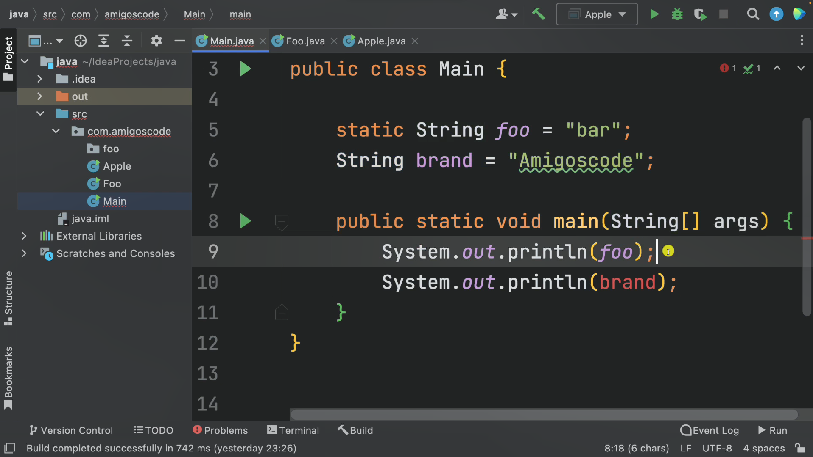

- <u>*<mark>To use a non static field in a static method</mark>*</u>, you need to do it differently like below code: you need to create an instance of the class and use the non static field through the instance    


------

```java
package com.nayemtech;

public class Main {
    public static String staticBrand = "staticBrand";
    public String nonStaticBrand = "nonStaticBrand";
    public static void main(String[] args) {
        System.out.println(staticBrand);
//        System.out.println(nonStaticBrand); //Error!
        //to access the non static field in a static method, let's crate an instance of the class
        Main main = new Main();
        System.out.println(main.nonStaticBrand);
        //System.out.println(this.staticBrand); //Error! bcz "this" keyword is used to refer to the current instance of the class
                                        //but we know static belongs to the class itself, not the instance
    }
}
```

In Java, static methods belong to the class itself, not to any specific instance of the class. This means that static methods can be called without creating an instance of the class.

However, non-static methods and fields belong to instances of the class. To access these non-static members, you need an instance of the class. That’s why you can create an instance within a static method.

In your code, `nonStaticBrand` is a non-static field. To access it within the static `main` method, you create an instance of `Main`:

```java
Main main = new Main();
```

Then, you can access the `nonStaticBrand` field through this instance:

```java
System.out.println(main.nonStaticBrand);
```

This is necessary because `nonStaticBrand` is not a class-level field, but an instance-level field. Each instance of `Main` has its own copy of `nonStaticBrand`.

On the other hand, `this` keyword refers to the current instance of the class. Since static methods do not belong to any instance, `this` cannot be used within a static context, which is why `System.out.println(this.staticBrand);` results in an error. The `staticBrand` field is a class-level field and can be accessed directly in a static context. Hence, `System.out.println(staticBrand);` is the correct way to access it.

# When to use static keyword

3 million of countv variable would be creatd but if used static then just one instance of count

# enums in java:

Sure, I’d be happy to explain Enums in a beginner-friendly way!

1. **What is an Enum?** Enum, short for enumeration, is a special data type in programming languages like Java that allows you to define a variable that can have one of a few predefined values. The values in this enumerated list are called enums.

2. **Why do we need it?** Enums are used when we know the possible values a variable can have, and we want to restrict it to those values to prevent unexpected values and bugs. For example, if we have a variable that represents the days of the week, we can use an enum to ensure that this variable can only hold the values MONDAY, TUESDAY, WEDNESDAY, etc.

3. **How does it work?** In Java, you define an enum using the `enum` keyword. For example, `enum Day { MONDAY, TUESDAY, WEDNESDAY, THURSDAY, FRIDAY, SATURDAY, SUNDAY; }` defines an enum for the days of the week. You can then create a variable of type `Day` and assign it one of the predefined values: `Day day = Day.MONDAY;`.

4. **When do we use Enums?** Enums are used when we want a variable to only have a specific set of values. They are commonly used for things like days of the week, directions (NORTH, SOUTH, EAST, WEST), states of a process (STARTED, RUNNING, STOPPED), etc.

5. **What are the benefits of using Enums?** Enums increase code readability and prevent invalid values from being set. They also allow you to group related constants together in one place, which can make your code easier to understand and maintain.

Remember, while enums can be very useful, they’re not suitable for all situations. If the set of values for a variable is not known at compile time, or can change, then a different data type would be more appropriate.

I hope this helps! If you have any more questions, feel free to ask. üòä

```java
enum Gender {  
  MALE,  
  FEMALE  
}
```

** Also just like creating class, in intellij you get to select enums: 

```java
public enum Gender {  
  MALE,  
  FEMALE  
}
```

final keyword use na kore enum use korar reason holo ei same type er constant gulo ekta group e rakha jasse  

19.
 Each of the primitives(int, float .. ) there is a corresponding Wrapper
 class. the Wrapper class allows us to use the corresponding primitives 
as object. (need to touch on generics in amigos video for more)  

- by using the object (i mean Wrapper class like Integer) you get a bunch of 
  functionalities for example: int n = Integer.min(5,6) ... int n = 
  Integer.ParseInt(someString) ... String s = Integer.toString(55); .. and
  more.  
20. String literals vs String objects  (with String literals, String pool is used while for String objects, Heap memory is used)
    
    In Java, both string literals and string objects represent sequences of characters. However, they are created and handled differently.
    
    1. **String Literals**: String literals are defined directly within double quotes. For example, `String str = "Hello";`. When a string literal is created, the JVM checks the string constant pool first. If the string already exists in the pool, a reference to the pooled instance is returned. If the string doesn’t exist in the pool, a new string instance is created and placed in the pool. This is why string literals are also known as interned strings.
    
    2. **String Objects**: String objects are created with the `new` keyword, like `String str = new String("Hello");`. In this case, a new object is created in the heap memory whether or not an identical string exists in the string constant pool. So it was for the new keyword. But we also have a String literal "Hello", so next, if the String pool already contains "Hello" then the same reference is used else, it creates a new object in String pool for "Hello". So, for `str = new String("Hello")` two objects are created.
    
    The key differences between string literals and string objects are:
    
    - **Memory Usage**: String literals are stored in the string constant pool which is located in the heap memory to promote reusability and efficiency. On the other hand, string objects created with the `new` keyword are stored in the heap memory outside of the string constant pool.
    - **Equality**: When you compare string literals or string objects using the `==` operator, it checks for reference equality. Two string literals that contain the same characters are references to the same object in the string constant pool, so `str1 == str2` would be `true`. However, a string object created with `new` is a distinct object from any string literal, even if they contain the same characters, so `str1 == str3` would be `false`.
    
    Here’s a code example to illustrate this:
    
    ```java
    String str1 = "Hello";  // String literal
    String str2 = "Hello";  // String literal
    String str3 = new String("Hello");  // String object
    
    System.out.println(str1 == str2);  // true
    System.out.println(str1 == str3);  // false
    ```
    
    In general, unless there’s a specific need to create distinct string objects with the `new` keyword, it’s more memory-efficient to use string literals.

21. String 
    formattedString = String.format("like printing Strings in C & extra 
    feature: numToString=%s, num=%s\n", numToString, num);  

22. # for money, never use double. Use `BigDecimal` instead.

23. Throwable is a superclass of all types of Errors and Exceptions.  

24. so, Error and Exception are the subclass of Throwable  

25. 

26. Object -> Throwable -> Exception -> RuntimeException  

27. checked exception = compile time exception  

28. unchecked exception = runtime exception  

------------------------------------

29. <mark>Checked Exception</mark> and <mark>Unchecked Exception</mark> causing trouble.

30. below code shows error during compile because Exception << this is checked exception meaning compile time exception

```java
package com.nayemtech;

public class Main {
    public static void main(String[] args) {
        neg(3, 10);
    }

    public static void neg(int a, int b) throws Exception {
        if (b >= a) {
            throw new Exception("can not subtract b from a because b is bigger than a");
        }

        a -= b;
        System.out.println(a);
    }
}
```

but to fix above checked Exception we need to use:

- try catch block

- throws keyword in the method signature

we already got the throws keyword . now we need try catch:

```java
package com.nayemtech;

public class Main {
    public static void main(String[] args) {
        try {
            neg(3, 10);
        } catch (Exception e) {
            System.out.println("Exception caught: " + e.getMessage());
        }
    }

    public static void neg(int a, int b) throws Exception {
        if (b >= a) {
            throw new Exception("Can not subtract b from a because b is bigger than a");
        }

        a -= b;
        System.out.println(a);
    }
}
```

so this works.

31. *Recaping the Exceptions from amigos:*
    
    **Multiple catch block and converge all the catch block into one, later.**
    
    below catch block will not catch error, because the error that's occuring is Arithmetic Exception, but in the catch block, I'm catching for NumberFormatException only.
    
    ```java
    public class Main {
        public static void main(String[] args) {
            System.out.println("before error");
            try {
                int y = 5/0;
                System.out.println("After Error");
            } catch (NumberFormatException e) {
                System.out.println("Nayem printing the error message by e.getMessage(): " + e.getMessage());
            }
        }
    }
    ```

This works:

```java
package com.nayemtech;

public class Main {
    public static void main(String[] args) {
        System.out.println("before error");
        try {
            int y = 5/0;
            System.out.println("After Error");
        } catch (NumberFormatException | ArithmeticException e) {
            System.out.println("Nayem printing the error message by e.getMessage(): " + e.getMessage());
        }
    }
}
```

but better way is:

```java
package com.nayemtech;

public class Main {
    public static void main(String[] args) {
        System.out.println("before error");
        try {
            int y = 5/0;
            System.out.println("After Error");
        } catch (Exception e) {
            System.out.println("Nayem printing the error message by e.getMessage(): " + e.getMessage());
        }
    }
}
```

### `finally` keyword

* fnal block or the `finally` keyword will always execute regardless. 

```java
package com.nayemtech;

public class Main {
    public static void main(String[] args) {
        System.out.println("before error");
        try {
            int y = 5/0;
            System.out.println("After Error");
        } catch (NumberFormatException | ArithmeticException e) {
            System.out.println("Nayem printing the error message by e.getMessage(): " + e.getMessage());
        } finally {
            System.out.println("`finally block` always run.");
        }
    }
}
```

- Whether there's an exception or not, `finally` always runs:

```java
package com.nayemtech;

public class Main {
    public static void main(String[] args) {
        System.out.println("before error");
        try {
            int y = 5/0;
            System.out.println("After Error");
        } finally {
            System.out.println("`finally block` always run.");
        }
    }
}
```

* `finally` block is mainly used for cleanup purposes.

### 31. Difference Between Error and Exception ()


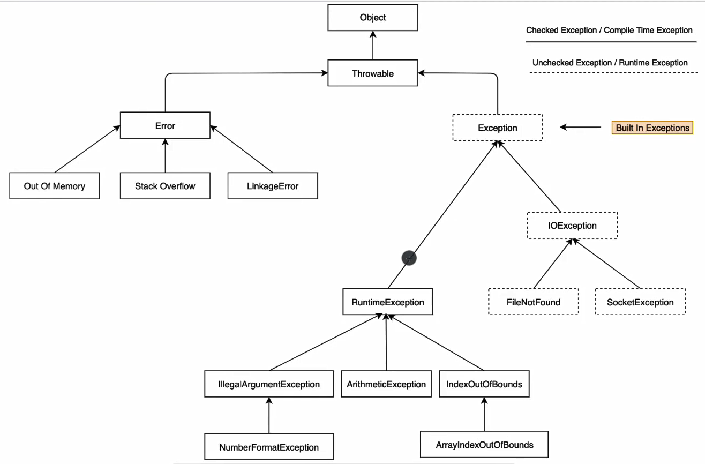

* *An error is a subclass of Throwable that indicates serious problems that a reasonable application should not try to catch*

* eita mane holo, try catch die exception detect kora hoy, error na.

* ekhon abar arek bisoy. Exception abar 2 dhoroner. Checked(compile time) & Unchecked (runtime) Exception. 
  
  * try-catch charao runtime exception declare kora jay
  
  * but to declare compile time exception(checked e), we need to define it with try catch. because before the code runs, the compiler need to detect if any error. And the way it does is by try-catch :
  
  * 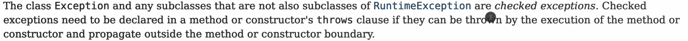
  
  * If we don't handle the checked exception with try-catch(for the compile to detect errors during compile) then when we declare any checked exception, it won't even compile, we will get error, so we either need to add exception to the method signature by throws clause or we need to use try-catchss
  
  * ```java
    package com.nayemtech;
    
    import java.io.File;
    
    public class Main {
        public static void main(String[] args) {
            File file = new File("src/tmp.txt");
            if (!file.exists()) {
                file.createNewFile();
            }
        }
    }
    ```
- - Here, I'm not even allowed to compile, because it will show error. because ioexcepton is checked exception (compile time).  
    So I either need to declare throws in the method signature or use try-catch
  
  - ```java
    //this is working by adding exception to the method signature with throws clause
    package com.nayemtech;
    
    import java.io.File;
    import java.io.IOException;
    
    public class Main {
        public static void main(String[] args) throws IOException {
            File file = new File("src/tmp.txt");
            if (!file.exists()) {
                file.createNewFile();
            }
        }
    }
    ```

- - ```java
    // this is working by adding try-catch
    package com.nayemtech;
    
    import java.io.File;
    import java.io.IOException;
    
    public class Main {
        public static void main(String[] args) {
            try {
                File file = new File("src/tmp.txt");
                if (!file.exists()) {
                    file.createNewFile();
                }
            } catch (IOException e) {
                System.out.println(e.getMessage());
            }
        }
    }
    ```

- In this case, this works because I'm throwing IllegalArgumentException which is a runtime exception(unchecked e).
  
  - ```java
    package com.nayemtech;
    
    public class Main {
        public static void main(String[] args) {
            System.out.println(divide(10, 0));
        }
    
        public static int divide(int a, int b) throws IllegalArgumentException {
            if (b == 0) {
                throw new IllegalArgumentException("can not divide by 0");
            } else {
                return a/b;
            }
        }
    }
    ```

- But this time it does not work because, i'm throwing Exception, it can be either runtime(unchecked) or compile time (checked).
  
  - ```java
    package com.nayemtech;
    
    public class Main {
        public static void main(String[] args) {
            System.out.println(divide(10, 0));
        }
    
        public static int divide(int a, int b) throws Exception {
            if (b == 0) {
                throw new IllegalArgumentException("can not divide by 0");
            } else {
                return a/b;
            }
        }
    }
    ```
* In order to make it work, we need to do the same, add Exception to the method signature or add try-catch:
  
  * ```java
    //working by adding Exception on the method signature
    //warning! don't add Exception to the method signature of main method.
    // if you do, it will be Process finished with exit code 1 but should have been exit code 0.
    //cz the main method needs to run without issues. if problem happens
    //within the main method, then it will stop with exit code 1.
    package com.nayemtech;
    
    public class Main {
        public static void main(String[] args) throws Exception {
            System.out.println(divide(10, 0));
        }
    
        public static int divide(int a, int b) throws Exception {
            if (b == 0) {
                throw new IllegalArgumentException("can not divide by 0");
            } else {
                return a/b;
            }
        }
    }
    ```
- - ```java
    //working by adding try-catch
    package com.nayemtech;
    
    public class Main {
        public static void main(String[] args) {
            try {
                System.out.println(divide(10, 0));
            } catch (Exception e) {
                e.printStackTrace();
            }
        }
    
        public static int divide(int a, int b) throws Exception {
            if (b == 0) {
                throw new Exception("can not divide by 0");
            } else {
                return a/b;
            }
        }
    }
    ```

- Always let the caller deal with the exception.

- Don't use throws on the main method because if problem happens, it may exit the program with exit code 1. In main method use try-catch, so it will exit with exit code 0.

- */warning! don't add Exception to the method signature of main method.
  // if you do, it will be Process finished with exit code 1 but should have been exit code 0.
  //cz the main method needs to run without issues. if problem happens
  //within the main method, then it will stop with exit code 1.*

- <u>A method can either deal with it's own Exception or the method can throw an exception with throws clause so that another method can receive that exception and deal with it.</u>
  
  - ```java
    //method john dealing with it's own exception(not throwing the exception to any other method)
    package com.nayemtech;
    
    public class Main {
        public static void main(String[] args) {
            john();
        }
    
        static void john() {
            try {
                divide(10, 0);
            } catch (Exception e) {
                e.printStackTrace();
            }
        }
    
        static void divide(int a, int b) throws Exception {
            if (b == 0) {
                throw new Exception("can not divide by 0");
            }
        }
    }
    ```
  
  - ```java
    // method john throws the exception to it's caller method karim() and karim() method handles the exception
    package com.nayemtech;
    
    public class Main {
        public static void main(String[] args) {
            karim();
        }
    
        static void karim() {
            try{
                john();
            } catch (Exception e) {
                e.printStackTrace();
            }
        }
    
        static void john() throws Exception { //throws the Exception to Karim
            divide(10, 0);
        }
    
        static void divide(int a, int b) throws Exception { //throws the Exception to John
            if (b == 0) {
                throw new Exception("can not divide by 0");
            }
        }
    }
    ```
31. File
- instead try-catch, use try-with-resources for closing and flusing the file automatically.

# Class and Objects

## toString()

```java
package com.nayemtech;

public class Main {
    public static void main(String[] args) {
        Cat cat = new Cat("Jupyter", 2, "White");
        System.out.println(cat.getName());
        System.out.println(cat);
    }
}


package com.nayemtech;

public class Cat {
    private String name;
    private int age;
    private String color;

    public Cat() {
    }

    public Cat(String name, int age, String color) {
        this.name = name;
        this.age = age;
        this.color = color;
    }

    public String getName() {
        return name;
    }

    public void setName(String name) {
        this.name = name;
    }

    public int getAge() {
        return age;
    }

    public void setAge(int age) {
        this.age = age;
    }

    public String getColor() {
        return color;
    }

    public void setColor(String color) {
        this.color = color;
    }

    //@Override
    public String toString() {
        return "Cat{" +
                "name='" + name + '\'' +
                ", age=" + age +
                ", color='" + color + '\'' +
                '}';
    }
}
```

## using other constructors inside a constructor

```java
    public Cat(String name, int age, String color) {
        this(age, color);
        this.name = name;
    }

    public Cat(int age, String color) {
        this.age = age;
        this.color = color;
    }
```

#### 'this' keyword referes to the current instance of the current class.

- In the code below, this.name = name; means:
  
  - here 'this' is referring to rocky object (current instance of the current class)
  
  - then when rose is initiated (Cat rose = new Cat("Rose", 1, "White");) then 'this' keyword refer to rose object

```java
package com.nayemtech;

public class Main {
    public static void main(String[] args) {

        Cat rocky = new Cat("Rocky", 5, "Red");
        Cat rose = new Cat("Rose", 1, "White");
    }
} 


package com.nayemtech;

public class Cat {
    private String name;
    private int age;
    private String color;

    public Cat(String name, String color) {
        this.name = name;
        this.age = 0;
        this.color = color;
    }
}
```

 <u>Code with no problem:</u>

```java
public Cat(String n) {
    name = n; // works cz not same
    name = name//wont work, in this case to make it work: this.name=name
}

public String getName() {
    return name; //no problem.
    return this.name; //no problem.
}
```

32. This icon in Intellij means current method is overriding another method. In the below pic, toString() in Cat class is overriding toString() in Object class.
* 
- Every class you create in java,  will have some other methods,(they come from Object class). so, <mark>Everything in Java is an Object.</mark> (and so all the class you create, they will inherit methods from Object class by default)
  
  - in the image below, we see the blurred methods are inherited from Object class by default.

- 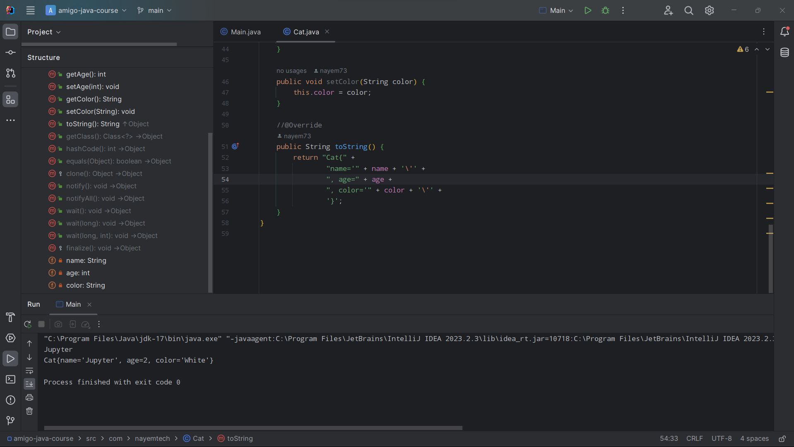
33. Important concept when it comes to comparing Objects:
- If you want to compare two objects, never do it like this : 

- ```java
  Cat cat = new Cat("Jupyter", "White");
  Cat cat2 = new Cat("Jupyter", "White");
  
  System.out.println(cat == cat2); //output = false
  ```

- the above == just compares the heap address or the reference, not the actual properties of the object having same characteristics.

- But output for below code is true:

- ```java
  Cat cat = new Cat("Jupyter", "White");
  Cat cat2 = cat
  
  System.out.println(cat == cat2); //output = true
  ```

- <mark>There is a generate equals() and hashcode() option close to generate getters and setters. </mark>
34. POJO(Plain Old Java Object) = a given object is an ordinary java object that has No association with any framework. in above example, the Cat class is a POJO. the Cat class does not Extend, Implement any class (special class) nor does it use any annotation like @Entity and else.
- Yes, the `Car` class can be considered a POJO (Plain Old Java Object). It’s a simple Java object that doesn’t extend any special classes (other than `Vehicle`, which is also a POJO), implement any special interfaces, or contain any prespecified annotations. It’s not bound by any special restriction other than those forced by the Java Language Specification. The `Car` class adheres to these principles, so it can be considered a POJO.
1. Java Bean is a <mark>class</mark> that has to obey 3 contracts so that other frameworks can do certain things with it. These are the 3 things that a java bean has/ to have:
- - A class must have a noarg constructor. (public)

- - All the properties/fields in the class must be private. To access the private properties of the class we must use getters and setters.

- - A class must implement Serializable (any class that implements Serializable, all it means is that objects can be written in streams(files, databases .. etc ..)). in below code, Car class implements something, so it no longer is a POJO. Rather, it's a Bean.

- ```java
  package com.nayemtech;
  
  import java.io.Serializable;
  import java.math.BigDecimal;
  
  public class Car implements Serializable {
      private String regNumber;
      private BigDecimal price;
  } 
  
  ///Also///
  
  package com.nayemtech;
  
  import java.io.Serializable;
  import java.math.BigDecimal;
  
  @Entity
  public class Car implements Serializable {
      private String regNumber;
      private BigDecimal price;
  } 
  ```

- So bean is used when(for example, in Spring Boot) you have a class that is dependent on a framework.
36. So, I think class in Spring Boot = bean and class in plain old java(without extends or implement other class) = POJO

37. # static keyword:
- static keyword means - property or method belongs to the class itself rather than the instance. For example, in below code, address is static field defined in Person class. So, in main method, when create an instance of Person class named alex or jakir, address can not be accessed through that instance: `System.out.println(jakir.getAddress());` . Because static field belongs to person so instead of instance jakir, we need to say person: `System.out.println(Person.getAddress());`

- ```java
  package com.nayemtech;
  
  import java.util.Arrays;
  
  public class Main {
      public static void main(String[] args) {
          Person alex = new Person("Alex", "Hunt", 33);
          Person jakir = new Person();
          System.out.println(jakir.getAddress()); //won't work.
          System.out.println(jakir.getLastName()); //works
          System.out.println(Person.getAddress()); // works
  
      }
  }
  
  package com.nayemtech;
  
  public class Person {
  private static String address = "Baltic Sea";
  private String firstName;
  private String lastName;
  private int age;
  
  public Person(String firstName, String lastName, int age) {
      this.firstName = firstName;
      this.lastName = lastName;
      this.age = age;
  }
  
  public Person() {
  }
  
  public static String getAddress() {
      return address;
  }
  
  public static void setAddress(String address) {
      Person.address = address;
  }
  
  public String getFirstName() {
      return firstName;
  }
  
  public void setFirstName(String firstName) {
      this.firstName = firstName;
  }
  
  public String getLastName() {
      return lastName;
  }
  
  public void setLastName(String lastName) {
      this.lastName = lastName;
  }
  
  public int getAge() {
      return age;
  }
  
  public void setAge(int age) {
      this.age = age;
  }
  }
  ```

```java
38. # static keyword of main method

JVM can access the main method directly without need to creating instance of main class from anywhere. for example:

package com.nayemtech;

import java.util.Arrays;

public class Main {
  public static void main(String[] args) {
  }
} 


package com.nayemtech;

public class Person {
  private static String address = "Baltic Sea";
  private String firstName;
  private String lastName;
  private int age;

  public static void meth() {
      Main.main();
  }

}
```

- if the above main method had no static keyword then we would have to do:

```java
package com.nayemtech;

import java.util.Arrays;

public class Main {
    public void main(String[] args) {
    }
} 

package com.nayemtech;

public class Person {
    private static String address = "Baltic Sea";
    private String firstName;
    private String lastName;
    private int age;

    public static void meth() {
        Main main = new Main();
        main.main();
    }

}
```

```java
39. # Question: when should you use static and when not?
- when you don't need an instance for using a particular method, you should use static. for example: 

Math.pi
Integer.parseInt()
.. etc are static methods where you don't need to create instances to use that method.
```

40. ## Utility classes
- Utility classes are classes which can be reused throughout every single package

- package: utils
41. User:
    if I write BigDecimal carPrice = new BigDecimal("1217000"); as BigDecimal carPrice = new BigDecimal(1217000); will it work?

ChatGPT:

In Java, the `BigDecimal` class has two constructors: one that takes a `String` as an argument and another that takes a `double` as an argument. The constructor that takes a `double` can lead to precision issues due to the way floating-point numbers are represented in binary.

If you use `BigDecimal carPrice = new BigDecimal(1217000);`, it will compile and run, but it may not give you the exact precision you expect. The `BigDecimal` constructor that takes a `double` is not recommended for precise calculations because of potential rounding errors inherent in floating-point representations.

To ensure precise representation of the decimal value, it is recommended to use the constructor that takes a `String`:

`BigDecimal carPrice = new BigDecimal("1217000");`

This way, you avoid the inaccuracies that can arise from using the `double` constructor. When dealing with currency or other situations where precision is crucial, it's generally safer to use the `String` constructor.

42. would you look at this! if I didn't add toString() to Car class then it wouldn't show the cars when I added `System.out.println(alex);` So I need toString() in all classes which are being used to construct alex (an instance of person class)

----

# Access Modifiers:


1. Protected: can be used for the class itself(Super class) as well as it's subclasses. (Within the same package too?)

### Class level access modifiers are: `public` and `default`:

In Java, there are four access modifiers that you can use at the class level:

1. **public**: The class is accessible by any other class in the Java program, even in different packages.
2. **protected**: This modifier is not applicable for classes. It’s used for variables, constructors, and methods, allowing access within the same package and subclasses in other packages.
3. **default** (no modifier): If you do not specify an access modifier, it’s considered as default. The class is only accessible within the same package.
4. **private**: This modifier is not applicable for classes. It’s used for variables, constructors, and methods, restricting their access within the same class only.

So, for class level, you can use either `public` or `default` access modifiers. The `protected` and `private` access modifiers are not applicable for classes. They are used for members of a class (variables, methods, constructors).

-----

# Encapsulation

1. <u>*Encapsulation in Java is the process by which data (variables) and the code that acts upon them (methods) are integrated as a <mark>single unit</mark>. By encapsulating a class's variables, other classes cannot access them, and only the methods of the class can access them.*</u> Simplified: *<u>Encapsulation is the process where fields and methods are integrated as a single unit which we know as a class. By encapsulating a class's variables, other classes cannot access them, and only the methods of the class can access them.</u>*
* ekta class e jevabe amra field declare kori and pore method toiri kore oi field gulo use kori .... ei jinisgulo je ekta class er vitor e ase .. eitai Encapsulation.

* Encapsulation in Java is a powerful mechanism for storing the data members and data methods of a class together. It is done in the form of a secure field accessible by only the members of the same class.

* Through Encapsulation we can <mark>*hide*</mark> data
2. * In the amigos example, if we don't use private in the BankAccount class, then we can access the amount from outside of that class. So by using private, we won't be able to access amount from outside of that class. Then we use getters and setters to access it but the main advantage here is: by using getters or setters, we can implement logic *<mark> inside the setter method</mark>* for setting the amount. This way, we have full control.

# Inheritance

1. Inheritance allows us to create a class based of an existing class. In below example, Programmer and Manager class are created based on Employee class (Inheriting the fields and methods from the Employee class)

2. Benefit of Inheritance is that we can remove duplicate codes:
   
   
   here, Programmer class and Manager class both inherits  Employee class. If not, then both the programmer class and manager class would need to have the same fields(fileds in Employee class) in both of them classes.

### Multiple Inheritance: (Java does NOT support it)

This is when a class can inherit from more than one superclass. Java does not support multiple inheritance with classes due to the *<u>“Diamond Problem”</u>*. However, a class can implement multiple interfaces, which is a form of multiple inheritance.

### Multi-Level Inheritance: (Java supports it)

This is when a class is derived from a class which is also derived from another class, i.e., a class having more than one parent class but at different levels. In Java, a class can inherit from a superclass, which can itself inherit from another superclass, and this can continue, forming a chain of inheritance.

# Abstract Keyword

1. If we use Abstract keyword on a class, we can not instantiate that class, we then use it through Inheritance.

2. Abstract classes can not be instantiated because Abstract classes are designed to be inherited by other classes where those other classes that inherits the abstract class must follow the contract with the abstract class.

3. It does not make sense to create an(instance of) Animal on it's own. Because we have Cat (class) and Dog (class) which inherits Animal class. So it does not make sense to create an instance of Animal class and we name it dog, because we already have Dog class which inherits Animal class.

4. ```java
   abstract public class Animal {
   
       private String name;
   
   }
   ```
   
   //inside main method
   Dog dog = new Dog("Foo")
   Animal dog = new Dog("Foo")
- Abstract keyword before a class means that class can not be instantiated.
3. Abstract keyword in a mehtod means, that method must be overridden by any subclass.

4. Abstract methods should only exist within abstract classes or interfaces. Abstract methods have no method body. A huge advantage of Abstract method is that, when declared in super class, all the subclasses can use that method in terms of their own variations.

5. 

6. Solid Principles: A class should be closed for modification but open for extension. an Abstract class helps in this regard because it helps avoid code duplication and increase reusability. The purpose is, we can have the class to act as a base for the subclasses. And then we can Encapsulate some common functionalities in one place and let the sub classes implement differences. This is Solid in action

# SOLID principles

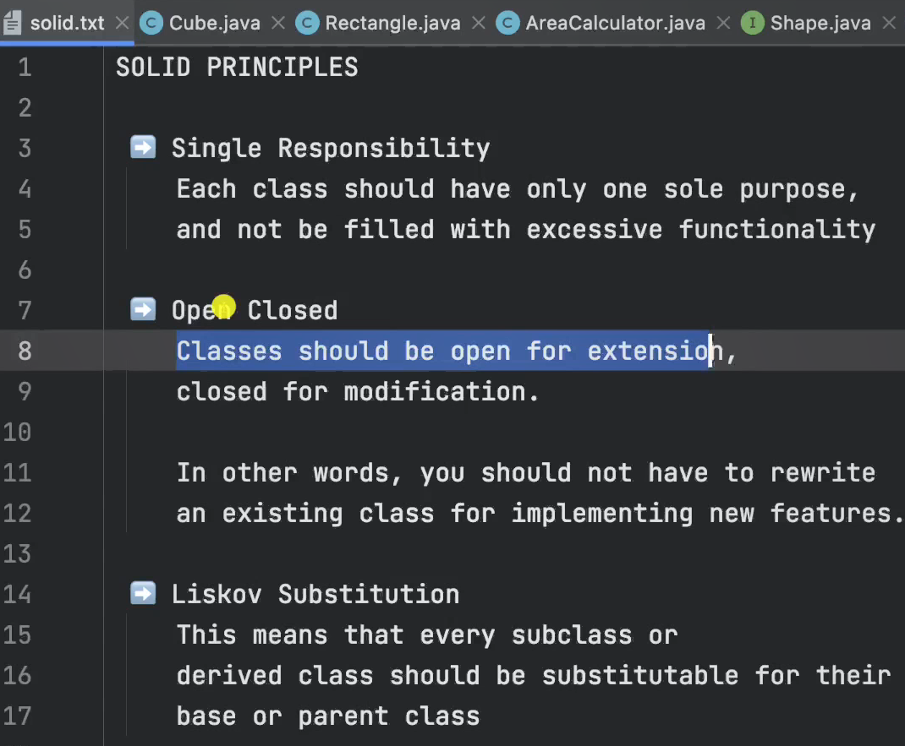


# Liskov Substitution Principle:

> Parent e jei method gulo thakbe, sei sobgulo child e **thaktei** hobe. Child e onnano aro method besi thakuk problem nai, but parent er gulo thaktei hobe.

> Child class should be substitutable by the parent class
> 
> `Shape NoShape = new NoShape();`
> 
> We can see that, here, NoShape can not be substituted by Shape. Hence it breaks Liskov Substitution Principle.

- Liskov’s Substitution Principle prescribes that you can replace an object with an instance of its subtype without corrupting the program. Practically, you can replace a class with its subclass and Java’s inheritance mechanism follows this principle

Sure, let’s consider an example to illustrate the Liskov Substitution Principle (LSP):

Suppose we have a superclass `Bird` and two subclasses `Duck` and `Ostrich`. According to LSP, wherever a `Bird` object is expected, we should be able to use an object of either `Duck` or `Ostrich` without any issues.

```java
class Bird {
    void fly() {
        System.out.println("I can fly");
    }
}

class Duck extends Bird {
    // Duck can also fly, so no issues here
}

class Ostrich extends Bird {
    // Ostrich can't fly, so we have to override the fly method
    @Override
    void fly() {
        throw new UnsupportedOperationException("Can't fly");
    }
}
```

In this case, if we have a method that takes a `Bird` object and calls its `fly` method, it will work fine with a `Duck` object but will fail with an `Ostrich` object. This violates the Liskov Substitution Principle because we can’t substitute a `Bird` object with an `Ostrich` object without altering the correctness of the program.

To correct this, we could refactor our classes to ensure that we’re not making assumptions about behavior that isn’t guaranteed by the superclass.

```java
class Bird {
    // No assumptions about flying here
}

class FlyingBird extends Bird {
    void fly() {
        System.out.println("I can fly");
    }
}

class Duck extends FlyingBird {
    // Duck can fly, so it extends FlyingBird
}

class Ostrich extends Bird {
    // Ostrich can't fly, so it extends Bird
}
```

or,

```java
interface Flyable {
    void fly();
}

class Bird {
    // common bird behavior
}

class Duck extends Bird implements Flyable {
    public void fly() {
        System.out.println("I can fly");
    }
}

class Ostrich extends Bird {
    // Ostrich doesn't implement Flyable because it can't fly
}
```

Now, wherever a `FlyingBird` is expected, we can substitute it with a `Duck`, and wherever a `Bird` is expected, we can substitute it with an `Ostrich` or a `Duck`. This adheres to the Liskov Substitution Principle.

### Liskov Substitution by amigos:

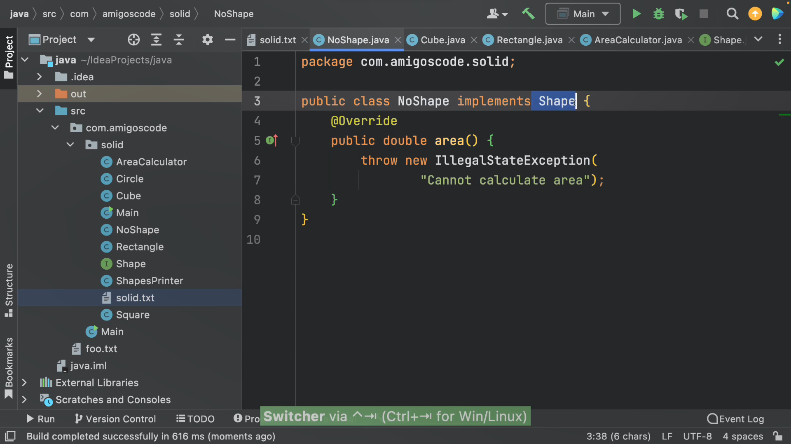

- Here, in above pic, we see subclass NoShape implements the parent class Shape so, we are saying that NoShape is a Shape but it can not have the method defined in Shape. So it can not obey the contract with parent class Shape interface. So we broke the rule.

## Interface Segregation Principle:

#### Liskov substitution and Interface segragation can be understood from the same example (example of social media) in this JavaTechie video https://youtu.be/BM_lSZPMClo

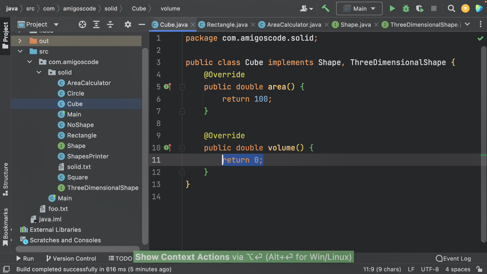

Sure, let’s modify the previous example to demonstrate the **Interface Segregation Principle (ISP)**.

ISP states that clients should not be forced to depend upon interfaces that they do not use. This means having many client-specific interfaces is better than one general-purpose interface.

In the context of the bird example, not all birds can fly. So, it’s better to separate out the `fly` method into a separate interface, say `Flyable`. Only the birds that can fly will implement this interface. Here’s how you could do it:

```java
interface Flyable {
    void fly();
}

class Bird {
    // common bird behavior
}

class Duck extends Bird implements Flyable {
    public void fly() {
        System.out.println("I can fly");
    }
}

class Ostrich extends Bird {
    // Ostrich doesn't implement Flyable because it can't fly
}
```

In this example, `Duck` implements the `Flyable` interface because it can fly, while `Ostrich` does not because it can’t fly. This way, we’re not forcing non-flying birds to implement a method they can’t use, adhering to the Interface Segregation Principle. This also makes the code more maintainable and easy to understand.

Remember, the key idea behind ISP is to keep your system decoupled and thus easier to refactor, change, and redeploy. It’s all about reducing the side effects of change. Hope this helps! 😊

# Dependency Inversion principle

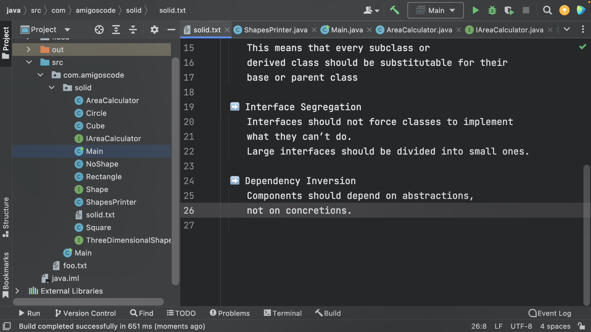

# Interface

1. interface allows us to achieve polymorphism.

2. polymorphism = many forms

3. Interfaces is really useful to achieve polymorphic code. And also, when you want to test your application, Interfaces is useful.

4. an interface can contain these 4 things: (only public is allowed in interface. No private or anything is allowed.) 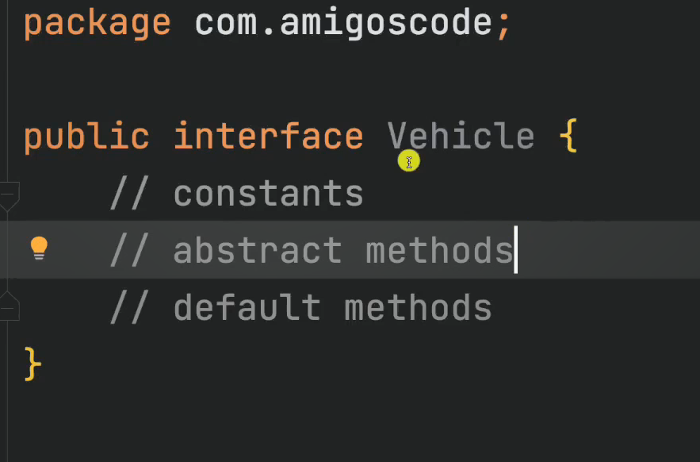

also 4. static methods is allowed inside an interface

```java
package com.amigoscode;

public interface Vehicle {
    //constants
    //abstract methods
    //default methods
    //static methods
}
```

```java
public interface vehicle {
    public void foo(); //this works but writing public is redundant. just void foo(); is fine.
    public abstract void foo(); //will work but there's no need to write abstract cz interface will autamitcally see/convert it as abstract
    void foo(); // correct. public by default and abstract by default
}
```

5. Car, electricScooter and Bicycle < they are a Vehicle and interfaces allows us to remove all of these complexity in here and write better code.

6. age Person class e Car, electricScooter, Bicycle field toiri kora lagtesilo but now with Interface, we will write

7. ```java
   private Vehicle[] vehicles;
   ```

8. default keyword in interface. If used, then all the implements will be able to use it as default.

----------

# SOLID

* SOLID is an acronym for the first 5 object oriented design priciples. It helps us write clean and better code specially on a large code base.

------------------

-------

# 1. Null Pointer Exception

* very common in java
* 3 ways to solve:

```java
1. if (s == NULL)
2. try catch
3. optional<>
```

# Data structures

* Data structures allows us to store, organize and manipulate data.

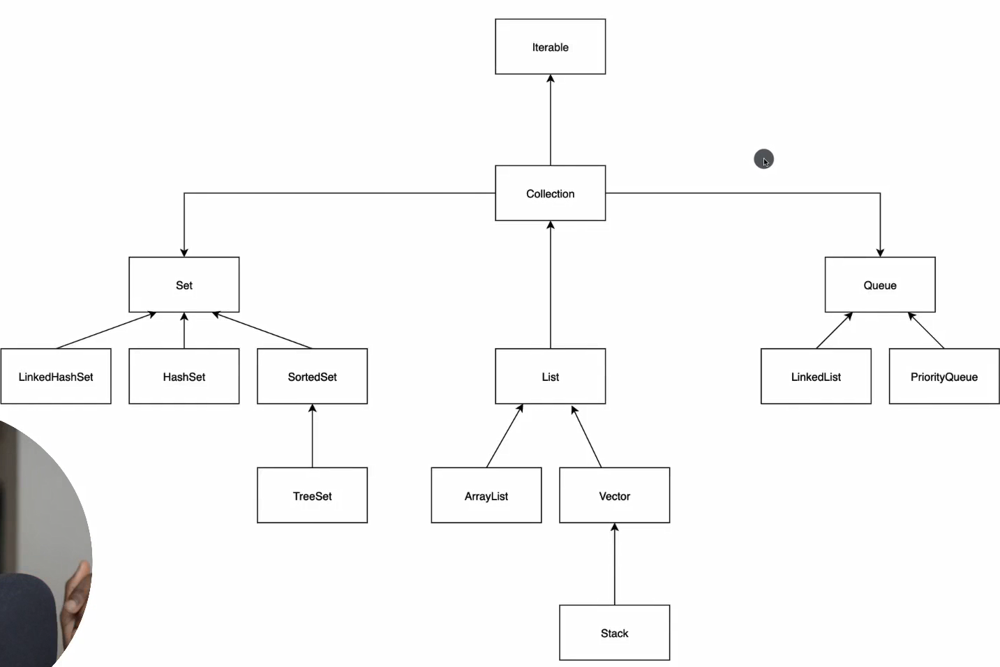

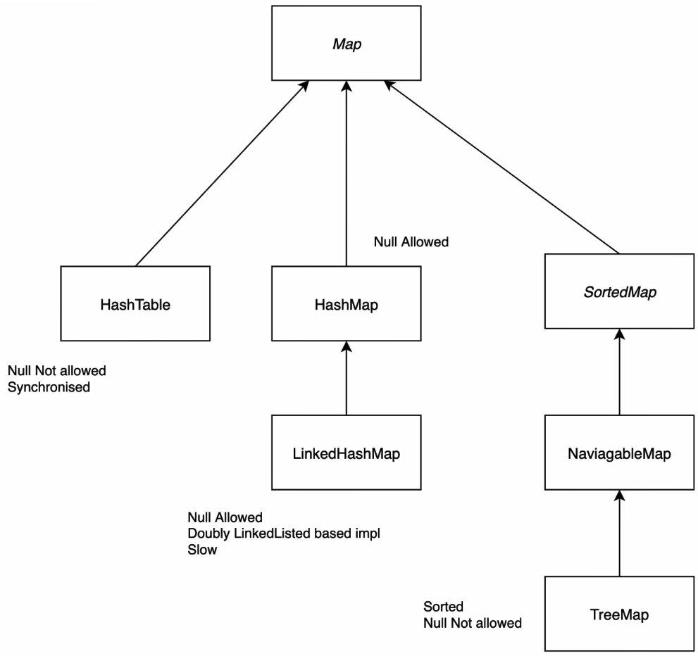

# 1. Array and String

# Comparison Array with C++

Certainly! Let's go through some examples of working with 1D arrays in Java and C++.

### 1. 1D Array Declaration:

#### Java:

```java
int[] arrayJava = {1, 2, 3, 4, 5};
```

#### C++:

```cpp
#include <vector>
std::vector<int> arrayCpp = {1, 2, 3, 4, 5};
```

### 2. Accessing Elements:

#### Java:

```java
int elementJava = arrayJava[2]; // Accessing element at index 2
```

#### C++:

```cpp
#include <iostream>
int elementCpp = arrayCpp[2]; // Accessing element at index 2
```

### 3. Iterating Through 1D Array:

#### Java:

```java
for (int i = 0; i < arrayJava.length; i++) {
    System.out.print(arrayJava[i] + " ");
}
```

#### C++:

```cpp
#include <iostream>
for (int i = 0; i < arrayCpp.size(); i++) {
    std::cout << arrayCpp[i] << " ";
}
```

### 4. Initializing 1D Array:

#### Java:

```java
int[] initializedArrayJava = new int[5]; // Creates an array of size 5
```

#### C++:

```cpp
#include <vector>
std::vector<int> initializedArrayCpp(5); // Creates a vector of size 5
```

### 5. Dynamic 1D Array:

#### Java:

```java
int[] dynamicArrayJava = new int[]{1, 2, 3}; // Creates an array with specified values
```

#### C++:

```cpp
#include <vector>
std::vector<int> dynamicArrayCpp = {1, 2, 3}; // Creates a vector with specified values
```

These examples illustrate the basic operations for working with 1D arrays in Java and C++. Keep in mind that Java uses arrays, and C++ can use vectors for dynamic 1D arrays, providing flexibility in managing memory.

# Comparison 2d Array with C++

Certainly! Let's go through some examples of working with 2D arrays in Java and C++.

### 1. 2D Array Declaration:

#### Java:

```java
int[][] matrix = {
    {1, 2, 3},
    {4, 5, 6},
    {7, 8, 9}
};
```

#### C++:

```cpp
#include <vector>
std::vector<std::vector<int>> matrix = {
    {1, 2, 3},
    {4, 5, 6},
    {7, 8, 9}
};
```

### 2. Accessing Elements:

#### Java:

```java
int element = matrix[1][2]; // Accessing element at row 1, column 2
```

#### C++:

```cpp
#include <iostream>
int element = matrix[1][2]; // Accessing element at row 1, column 2
```

### 3. Iterating Through 2D Array:

#### Java:

```java
for (int i = 0; i < matrix.length; i++) {
    for (int j = 0; j < matrix[i].length; j++) {
        System.out.print(matrix[i][j] + " ");
    }
    System.out.println();
}
```

#### C++:

```cpp
#include <iostream>
for (int i = 0; i < matrix.size(); i++) {
    for (int j = 0; j < matrix[i].size(); j++) {
        std::cout << matrix[i][j] << " ";
    }
    std::cout << std::endl;
}
```

### 4. Initializing 2D Array:

#### Java:

```java
int[][] initializedMatrix = new int[3][2]; // Creates a 3x2 array
```

#### C++:

```cpp
#include <vector>
std::vector<std::vector<int>> initializedMatrix(3, std::vector<int>(2)); // Creates a 3x2 vector
```

### 5. Dynamic 2D Array:

#### Java:

```java
int[][] dynamicMatrix = new int[3][];
dynamicMatrix[0] = new int[2];
dynamicMatrix[1] = new int[3];
dynamicMatrix[2] = new int[1];
```

#### C++:

```cpp
#include <vector>
std::vector<std::vector<int>> dynamicMatrix = {
    {1, 2},
    {3, 4, 5},
    {6}
};
```

These examples illustrate the basic operations for working with 2D arrays in Java and C++. Keep in mind that Java uses arrays, and C++ can use vectors of vectors for dynamic 2D arrays, providing flexibility in managing memory.

# Comparison String with C++

* ***<u>In Java, strings are immutable, meaning once a string is created, its value cannot be changed.</u>***

```java
String immutableStr = "Immutable";
immutableStr = immutableStr + " String"; // Creates a new string object
// but in C++, // Modifies the existing string, not creates a new one.


//java
boolean areEqual = str1.equals(str2); // Use equals() for content comparison
//C++
bool areEqual = (str1 == str2); // Use == for content comparison


//java
char firstChar = str.charAt(0); // Use charAt() to access individual characters
//C++
char firstChar = str[0]; // Use array indexing to access individual characters

//java
String str = "Substring";
String sub = str.substring(3, 7); // Retrieves substring from index 3 to 6
//C++
str.substr()
```

# Comparison with 2d String

In Java, a 2D array of strings is essentially an array of arrays. Let's go through the differences and provide examples for working with 2D strings in Java compared to C++.

### 1. 2D String Declaration:

#### Java:

```java
String[][] matrix = {
    {"Java", "is", "awesome"},
    {"2D", "Array", "Example"}
};
```

#### C++:

```c
#include <vector>
#include <string>
std::vector<std::vector<std::string>> matrix = {
    {"C++", "is", "awesome"},
    {"2D", "Vector", "Example"}
};
```

### 2. Accessing Elements:

#### Java:

```java
String element = matrix[0][1]; // Accessing element at row 0, column 1
```

#### C++:

```c
#include <iostream>
std::string element = matrix[0][1]; // Accessing element at row 0, column 1
```

### 3. Iterating Through 2D String Array:

#### Java:

```java
for (int i = 0; i < matrix.length; i++) {
    for (int j = 0; j < matrix[i].length; j++) {
        System.out.print(matrix[i][j] + " ");
    }
    System.out.println();
}
```

#### C++:

```c
#include <iostream>
for (int i = 0; i < matrix.size(); i++) {
    for (int j = 0; j < matrix[i].size(); j++) {
        std::cout << matrix[i][j] << " ";
    }
    std::cout << std::endl;
}
```

### 4. Initializing 2D String Array:

#### Java:

```java
String[][] initializedMatrix = new String[3][2]; // Creates a 3x2 array
```

#### C++:

```c
#include <vector>
#include <string>
std::vector<std::vector<std::string>> initializedMatrix(3, std::vector<std::string>(2)); // Creates a 3x2 vector
```

### 5. Dynamic 2D String Array:

#### Java:

```java
String[][] dynamicMatrix = new String[3][]; // Creates an array of arrays
dynamicMatrix[0] = new String[2];
dynamicMatrix[1] = new String[3];
dynamicMatrix[2] = new String[1];
```

#### C++:

```c
#include <vector>
#include <string>
std::vector<std::vector<std::string>> dynamicMatrix = {
    {"C++", "Array"},
    {"of", "Vectors", "Example"},
    {"Dynamic"}
};
```

These examples illustrate the basic operations for working with 2D arrays of strings in Java and C++. Keep in mind that Java uses arrays and C++ can use vectors of vectors for dynamic 2D arrays, providing flexibility in managing memory.

# Map

Certainly! Let's explore examples of working with maps in Java and C++.

### 1. Map Declaration:

#### Java:

```java
import java.util.HashMap;
import java.util.Map;

Map<String, Integer> mapJava = new HashMap<>();
mapJava.put("One", 1);
mapJava.put("Two", 2);
mapJava.put("Three", 3);
```

#### C++:

```cpp
#include <unordered_map>
#include <iostream>

std::unordered_map<std::string, int> mapCpp = {
    {"One", 1},
    {"Two", 2},
    {"Three", 3}
};
```

### 2. Accessing Elements:

#### Java:

```java
int valueJava = mapJava.get("Two"); // Accessing value by key
```

#### C++:

```cpp
#include <iostream>
int valueCpp = mapCpp["Two"]; // Accessing value by key
```

### 3. Iterating Through Map:

#### Java:

```java
for (Map.Entry<String, Integer> entry : mapJava.entrySet()) {
    System.out.println(entry.getKey() + ": " + entry.getValue());
}
```

#### C++:

```cpp
for (const auto& entry : mapCpp) {
    std::cout << entry.first << ": " << entry.second << std::endl;
}
```

### 4. Checking if Key Exists:

#### Java:

```java
boolean containsKeyJava = mapJava.containsKey("Two");
```

#### C++:

```cpp
bool containsKeyCpp = (mapCpp.find("Two") != mapCpp.end());
```

### 5. Modifying Map:

#### Java:

```java
mapJava.put("Four", 4); // Adding a new key-value pair
mapJava.replace("Three", 33); // Replacing the value for an existing key
```

#### C++:

```cpp
mapCpp["Four"] = 4; // Adding a new key-value pair
mapCpp["Three"] = 33; // Replacing the value for an existing key
```

These examples illustrate basic operations for working with maps in Java and C++. Keep in mind that Java uses the `Map` interface with implementations like `HashMap`, while C++ has `std::unordered_map` for hash maps. The syntax and methods may vary, so it's essential to refer to the specific documentation for each language.

# Set

Certainly! Let's explore examples of working with sets in Java and C++.

### 1. Set Declaration:

#### Java:

```java
import java.util.HashSet;
import java.util.Set;

Set<String> setJava = new HashSet<>();
setJava.add("Apple");
setJava.add("Banana");
setJava.add("Orange");
```

#### C++:

```cpp
#include <unordered_set>
#include <iostream>

std::unordered_set<std::string> setCpp = {"Apple", "Banana", "Orange"};
```

### 2. Accessing Elements:

#### Java:

```java
boolean containsJava = setJava.contains("Banana");
```

#### C++:

```cpp
#include <iostream>
bool containsCpp = (setCpp.find("Banana") != setCpp.end());
```

### 3. Iterating Through Set:

#### Java:

```java
for (String element : setJava) {
    System.out.println(element);
}
```

#### C++:

```cpp
for (const auto& element : setCpp) {
    std::cout << element << std::endl;
}
```

### 4. Modifying Set:

#### Java:

```java
setJava.add("Grapes");
setJava.remove("Banana");
```

#### C++:

```cpp
setCpp.insert("Grapes");
setCpp.erase("Banana");
```

### 5. Set Operations:

#### Java:

```java
Set<String> setA = new HashSet<>(Set.of("Apple", "Banana", "Orange"));
Set<String> setB = new HashSet<>(Set.of("Banana", "Grapes", "Watermelon"));

Set<String> unionSet = new HashSet<>(setA);
unionSet.addAll(setB);

Set<String> intersectionSet = new HashSet<>(setA);
intersectionSet.retainAll(setB);

Set<String> differenceSet = new HashSet<>(setA);
differenceSet.removeAll(setB);
```

#### C++:

```cpp
#include <unordered_set>
#include <iostream>

std::unordered_set<std::string> setA = {"Apple", "Banana", "Orange"};
std::unordered_set<std::string> setB = {"Banana", "Grapes", "Watermelon"};

std::unordered_set<std::string> unionSet(setA.begin(), setA.end());
unionSet.insert(setB.begin(), setB.end());

std::unordered_set<std::string> intersectionSet;
for (const auto& element : setA) {
    if (setB.count(element) > 0) {
        intersectionSet.insert(element);
    }
}

std::unordered_set<std::string> differenceSet(setA.begin(), setA.end());
for (const auto& element : setB) {
    differenceSet.erase(element);
}
```

These examples illustrate basic operations for working with sets in Java and C++. Keep in mind that Java uses the `Set` interface with implementations like `HashSet`, while C++ has `std::unordered_set` for hash sets. The syntax and methods may vary, so it's essential to refer to the specific documentation for each language.

# Pair

In C++, a `vector<pair<int, int>>` is commonly used to store pairs of integers in a dynamic array. In Java, a similar structure can be achieved using the `ArrayList` class along with the `Pair` class from the `org.apache.commons.lang3.tuple` package or by creating a custom class to represent pairs.

### C++ Code:

```cpp
#include <iostream>
#include <vector>
#include <utility>

int main() {
    std::vector<std::pair<int, int>> vectorOfPairs;

    vectorOfPairs.push_back({1, 2});
    vectorOfPairs.push_back({3, 4});
    vectorOfPairs.push_back({5, 6});

    for (const auto& pair : vectorOfPairs) {
        std::cout << "(" << pair.first << ", " << pair.second << ")" << std::endl;
    }

    return 0;
}
```

### Java Code:

```java
import org.apache.commons.lang3.tuple.Pair;
import java.util.ArrayList;

public class Main {
    public static void main(String[] args) {
        ArrayList<Pair<Integer, Integer>> listOfPairs = new ArrayList<>();

        listOfPairs.add(Pair.of(1, 2));
        listOfPairs.add(Pair.of(3, 4));
        listOfPairs.add(Pair.of(5, 6));

        for (Pair<Integer, Integer> pair : listOfPairs) {
            System.out.println("(" + pair.getLeft() + ", " + pair.getRight() + ")");
        }
    }
}
```

Note: In the Java code above, the `Pair` class is from the Apache Commons Lang library (`org.apache.commons.lang3.tuple`). If you don't have this library, you need to download it and add it to your project. Alternatively, you can create a custom class to represent pairs in Java.

### Custom Pair Class in Java:

```java
import java.util.ArrayList;

class Pair<K, V> {
    private K first;
    private V second;

    public Pair(K first, V second) {
        this.first = first;
        this.second = second;
    }

    public K getFirst() {
        return first;
    }

    public V getSecond() {
        return second;
    }
}

public class Main {
    public static void main(String[] args) {
        ArrayList<Pair<Integer, Integer>> listOfPairs = new ArrayList<>();

        listOfPairs.add(new Pair<>(1, 2));
        listOfPairs.add(new Pair<>(3, 4));
        listOfPairs.add(new Pair<>(5, 6));

        for (Pair<Integer, Integer> pair : listOfPairs) {
            System.out.println("(" + pair.getFirst() + ", " + pair.getSecond() + ")");
        }
    }
}
```

This custom `Pair` class provides a simple way to represent pairs in Java without the need for an external library.

### Now try out myself Alhamdulillah

```java
import java.util.ArrayList;
import java.util.Arrays;
import java.util.List;

public class Main {
    public static void main(String[] args) {

        int[] v = new int[5];
        v[0] = 3;
        System.out.println(Arrays.toString(v));
        System.out.println(v[0] + " " + v[1]);

        //1d String
//        String s1 = new String(); // new String() is redundant. Replace with empty String
        String s1 = "";
        s1 += 'l';
        s1 += "2345";
        System.out.println(s1);

        String s2 = "what country";
        s2 += ' ';
        s2 += "ABCD";
        System.out.println(s2);
        for (int i = 0; i < s2.length(); i++) {
            System.out.print(s2.charAt(i)); // no s2[i] or s2.get(i) for String
        }
        System.out.println();


        //array of String
        String[] s = new String[5];
        s[2] = "ok from string Alhamdulillah";

        System.out.println(Arrays.toString(s));

        for (int i = 0; i < s.length; i++) { // no s.length() with brackets for this array of string string
            System.out.print(s[i]);
        }
        System.out.println();

        for (String string : s) {
            System.out.print(string);
        }
        System.out.println();

        //2d string
        String[][] grid = {
                {"x", "o", "x"},
                {"o", "x", "o"}
        };

        for (int i = 0; i < grid.length; i++){
            for (int j = 0; j < grid[i].length; j++) {
                System.out.print(grid[i][j]);
            }
            System.out.println();
        }
        System.out.println(Arrays.deepToString(grid));
    }

}
```

-----------------

-----------

* Stack Extends Vector and Vector implements List

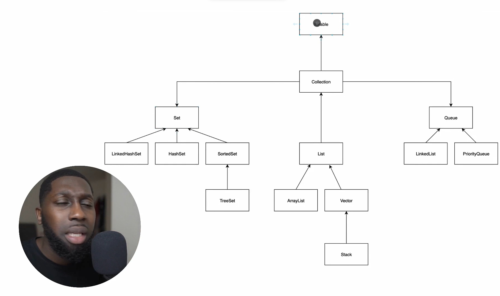

# List

```java
 //List without any parameterized class
        List colors = new ArrayList();
        colors.add("blue");
        colors.add(7);
        colors.add(new Object());
        for (var X: colors) {
            System.out.println(X);
        }

        //List with specific data type 
        List<String> stringList = new ArrayList<>();
        stringList.add("Apple");
        for (String X: stringList) {
            System.out.println(X);
        }

         System.out.println(stringList);

        System.out.println(stringList.size());
        boolean flg = false;
        for (int i = 0; i < stringList.size(); i++) {
            if (stringList.get(i).equals("Banana")) {
                flg = true;
                System.out.println("contains Banana");
            }
        }
        if (!flg) {
            System.out.println("does not contain Banana");
        }
```

* We can not modify below List because it is immutable. to make it work, we need to wrap it with ArrayList

```java
        List<String> listUnmodifiable = List.of("Banana", "Mango");
        System.out.println(listUnmodifiable);

        listUnmodifiable.add("Jackfruit"); // compilaion fail because listUnmodifiable is immutable
```

* after wrapping with ArrayList will work

```java
        List<String> listUnmodifiable = new ArrayList<>(List.of("Banana", "Mango"));
        System.out.println(listUnmodifiable);

        listUnmodifiable.add("Jackfruit"); // compilaion fail because listUnmodifiable is immutable
```

# Stack

* Stack Extends Vector and Vector implements List

* in Stack, type argument cannot be of primitive type. it should be Integer instead of int

```java
// Creating a stack of integers
        Stack<Integer> intStack = new Stack<>();

        // Pushing elements onto the stack
        intStack.push(1);
        intStack.push(2);
        intStack.push(3);

        // Accessing the top element
        int topElement = intStack.peek();
        System.out.println("Top element: " + topElement);

        // Popping elements from the stack
        intStack.pop();

        // Checking if the stack is empty
        boolean isEmpty = intStack.isEmpty();
        System.out.println("Is the stack empty? " + (isEmpty ? "Yes" : "No"));

        // Size of the stack
        System.out.println("Size of the stack: " + intStack.size());

        // Iterating through the stack
        System.out.print("Elements in the stack: ");
        while (!intStack.isEmpty()) {
            System.out.print(intStack.peek() + " ");
            intStack.pop();
        }
```

# Vector

* `Vector` is synchronized. If thread safety is not a concern and performance is critical, `ArrayList` is generally preferred. (it uses synchronized methods internally.)

# Record in java with Queue

```java
public record Person(String name, int age) {}
    //inside method body, No need for explicit fields, getters, equals, hashCode, or toString
```

In this example:

- `Person` is the name of the record.
- `String name` and `int age` are the components of the record. These components act as final fields and are automatically initialized through the constructor.
- The record implicitly generates the following methods:
  - A constructor that initializes the fields.
  - Getter methods for each component.
  - `equals` and `hashCode` methods based on the components.
  - A `toString` method that provides a human-readable string representation.

# Queue

```java
public class Main {
    public static void main(String[] args) {
        Queue<Person> superMarket = new LinkedList<>();
        //or Queue<Person> superMarket = new PriorityQueue<>();

        Person person1 = new Person("Rahim", 33);
        Person person2 = new Person("Karim", 26);

        superMarket.add(person1);
        superMarket.add(person2);
        superMarket.add(person1);  
        //superMarket.offer(person1); //it works too//it adds element;
        //superMarket.poll(); //it removes element

        while (!superMarket.isEmpty()) {
            System.out.println(superMarket.peek());
            superMarket.remove();
            //superMarket.poll();//this removes too
        }

    }

    public static record Person(String name, int age) {}
}
```

# LinkedList

* LInkedList need extra space in memory becaue they need to store the next node and prev node address for doubly linked list

* internally Java uses doubly linked list

# Set

* set is a collection that contains no duplicates.

# Map

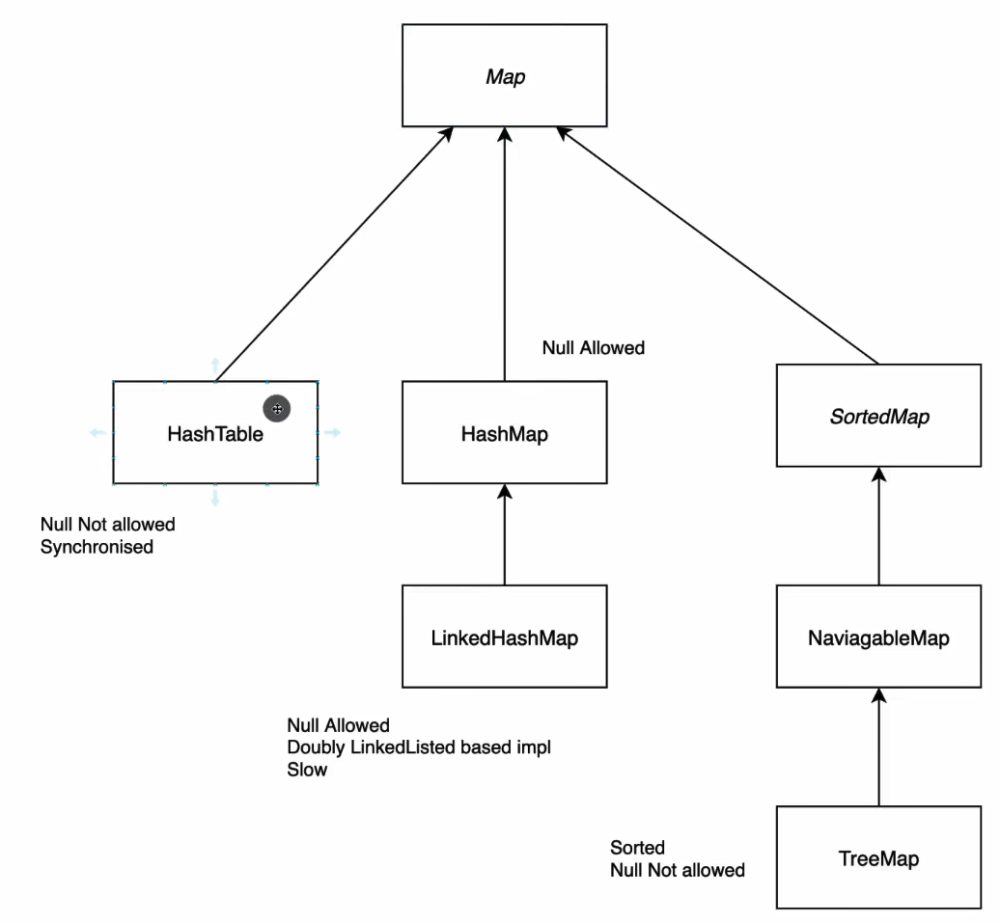

```java
import java.util.*;

public class Main {
    public static void main(String[] args) {
        Map<Integer, Person> mp = new HashMap<>();
        mp.put(2, new Person("Karim", 23));
        mp.put(1, new Person("Rahim", 23));
        mp.put(2, new Person("Karim", 23));
        mp.put(2, new Person("Karim", 24));

        System.out.println(mp);
        System.out.println(mp.size());
        System.out.println(mp.get(2));
        System.out.println(mp.get(9));
        System.out.println(mp.containsKey(4));
        System.out.println(mp.keySet()); //provides the list of keys
        System.out.println(mp.values()); //provides the list of values
        System.out.println(mp.entrySet()); //provides the list of key=value entries

        mp.remove(2);

        // Loop through and print key-value pairs
        for (Map.Entry<Integer, Person> entry : mp.entrySet()) {
            System.out.println("Key: " + entry.getKey() + ", Value: " + entry.getValue());
        }

        System.out.println(mp.getOrDefault(5, new Person("Muhammad", 22))); //if 5 exists then 5 else create new person and print

    }

    public static record Person(String name, int age) {}
}
```

### Hashcode

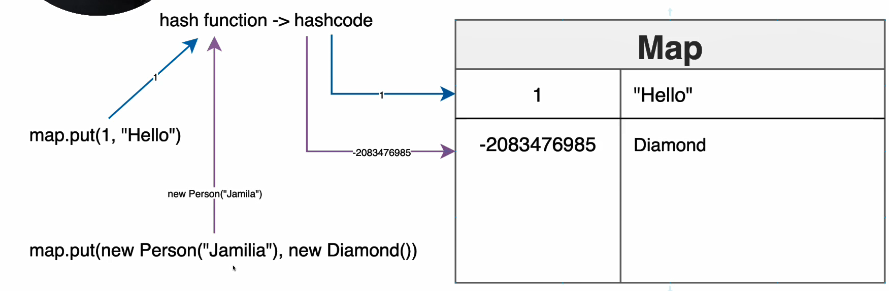

* when I say map.put(1, "Hello") then it goes through a hash function and creates hashcode. the same object will always create the same hascode.

-------

---------

# Generics

* Generics allows us to write better code. It's mainly used for to be able to compile our code, making sure we work with the correct types.

### Example on why generics was introduced by giving an example of compile time checking as well as the ClassCastException error:

* currently I don't have any error except a few warnings(Raw use of parameterized class "List"):

```java
    public static void main(String[] args) {
       List numbers = new ArrayList(); // we will get a warning here:
                                //Raw use of parameterized class 'List'
                                //Raw use of parameterized class 'ArrayList'

        numbers.add(1); // a primitive
        numbers.add("2"); // a string

        for (Object X : numbers) {
            System.out.println(X);
        }
    }
```

* Now, If I try to cast, I wll receive an error (ClassCastException):

```java
public static void main(String[] args) {
       List numbers = new ArrayList(); // we will get a warning here:
                                //Raw use of parameterized class 'List'
                                //Raw use of parameterized class 'ArrayList'

        numbers.add(1);
        numbers.add("2");

        for (Object X : numbers) {
            System.out.println((String)X); //Casting a primtive to a String or vice versa will result in Error
        }
    }
```

* So, wee need generics to help us by forcing the type of the List. Because we don't know whether this will throw an error until we run the code. Because we want to catch these errors at compile time .. Not at runtime.

* So to fix this, we can add generics to List and define a type. Let's say Integer, then this list will only take Integer numbers:

```java
public static void main(String[] args) {
       List<Integer> numbers = new ArrayList(); // we will get a warning here:
                                //Raw use of parameterized class 'List'
                                //Raw use of parameterized class 'ArrayList'

        numbers.add(1);
        numbers.add("2");

        for (Object X : numbers) {
            System.out.println((String)X); //Casting a primtive to a String or vice versa will result in Error
        }
    }
```

* Now We get an error incompatible types. This is exactly what we want! Because This is a compile error. We can see `numbers.add("2")` is giveing us an error.

* So this is how generics is preventing errors from happening during runtime. 

* Let's check out another example: we don't have any error except a few warnings(Raw use of parameterized class 'Comparable' ):

```java
public static void main(String[] args) {
       Comparable number = 10;// warning: Raw use of parameterized class 'Comparable' 
       number.compareTo(20);
}
```

* But if I do it like below, I will get yet again a `ClassCastException`. 

```java
public static void main(String[] args) {
       Comparable number = 10;// warning: Raw use of parameterized class 'Comparable' 
       number.compareTo("20"); // Error! ClassCastException
}
```

* So let's use generics to catch this error, at compiletime and not runtime.

```java
    public static void main(String[] args) {
       Comparable<Integer> number = 10; //Now the warning goes away
       number.compareTo("20"); // but now we get a compile error here
                                  //change number to String
    }
```

* So, the reason we use generics because, it provides compile time checking and it removes the risk of ClassCastException.

# Using generics in java:

* With generics, we have diamond sign<> and inside the diamond sign, we can place any data type. For example `List<String> names`

* When we specify the data type inside the diamond sign<> then it means that class/interface can only work with the datatype that is specified withing <> in above example `List<String> names` , class `List` can only work with String datatype. If we add anything other than String, we will get compiletime error.

```java
List<String> names = new ArrayList<String>();
names.add(2); //Compile error
```

# Naming Convention in generics:

* `List<E>` E=Element

* `Map<K,V>` K=Key, V=Value

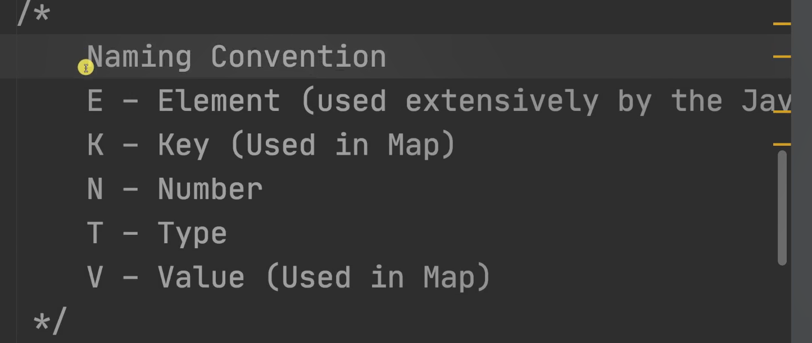

* <u>*Type Parameter:*</u>  `List<E>` : Here, E is a placeholder and it is called Type Parameter

* <u>*Type Argument:*</u>  `List<String>` : Here, when we say String, this is the Type Argument

* <u>*We can use generics with classes, methods and interfaces*</u>

# Generics with classes:

* Let's say we have a class `Box`. Now, I want to put any datatype inside of this `Box` class. Now, the syntax for generics when working with classes is a diamond<> write after the class name. we put T (Type) inside the diamond.

```java
package com.nayemtech;

public class Box<T> {
    private T t;

    public T getT() {
        return t;
    }

    public void setT(T t) {
        this.t = t;
    }
}
```

* Now let's create other classes that we can store inside our Box class. 

```java
    public static void main(String[] args) {
       Box box = new Box<>(); //if we do this, we get the same warning
                    //Raw use of parameterized class 'Box'
       box.setT("123");
       box.setT(456);
    }
```

* So let's pay attention to the warning let's let's define the type parameter with box:

```java
package com.nayemtech;

public class Main {
    public static void main(String[] args) {
       Box<Phone> box = new Box<>();
       box.setT(new Phone("Realme"));
       System.out.println(box.getT());
    }
} 


package com.nayemtech;
public class Box<T> {
    private T t;

    public T getT() {
        return t;
    }

    public void setT(T t) {
        this.t = t;
    }
} 

package com.nayemtech;
public class Phone {
    private final String brand;

    public Phone(String brand) {
        this.brand = brand;
    }

    public String getBrand() {
        return brand;
    }
}

package com.nayemtech;
import java.time.LocalDateTime;
public class Letter {
    private String sender;
    private LocalDateTime date;
    private int age;

    public Letter(String sender, LocalDateTime date, int age) {
        this.sender = sender;
        this.date = date;
        this.age = age;
    }

    public String getSender() {
        return sender;
    }

    public void setSender(String sender) {
        this.sender = sender;
    }

    public LocalDateTime getDate() {
        return date;
    }

    public void setDate(LocalDateTime date) {
        this.date = date;
    }

    public int getAge() {
        return age;
    }

    public void setAge(int age) {
        this.age = age;
    }
}
```

* So, we get the output of above code `com.nayemtech.Phone@eed1f14`

* Let's add the toString() method that will print the instance variables of our Box class

```java
package com.nayemtech;

public class Box<T> {
    private T t;

    public T getT() {
        return t;
    }

    public void setT(T t) {
        this.t = t;
    }

    @Override
    public String toString() {//Added toString()
        return "Box{" +
                "t=" + t +
                '}';
    }
}
```

- But! we get the same output `com.nayemtech.Phone@eed1f14`

- We need to add toString to the Phone class too! Because ultimately I want to print the Realme brand name which is the instance variable of Phone class.

```java
package com.nayemtech;
public class Box<T> {
    private T t;

    public T getT() {
        return t;
    }

    public void setT(T t) {
        this.t = t;
    }

    @Override
    public String toString() { //added toString() to Box as well as Phone
        return "Box{" +
                "t=" + t +
                '}';
    }
} 

package com.nayemtech;
public class Phone {
    private final String brand;

    public Phone(String brand) {
        this.brand = brand;
    }

    public String getBrand() {
        return brand;
    }

    @Override
    public String toString() { //Added toString to Box and Phone
        return "Phone{" +
                "brand='" + brand + '\'' +
                '}';
    }
}
```

- Now we get the desired output: `Phone{brand='Realme'}`

- Now let's also add the other class Letter to our Box class (add toString() first):

```java
package com.nayemtech;

import java.time.LocalDateTime;

public class Letter {
    private String sender;
    private LocalDateTime date;
    private int age;

    public Letter(String sender, LocalDateTime date, int age) {
        this.sender = sender;
        this.date = date;
        this.age = age;
    }

    public String getSender() {
        return sender;
    }

    public void setSender(String sender) {
        this.sender = sender;
    }

    public LocalDateTime getDate() {
        return date;
    }

    public void setDate(LocalDateTime date) {
        this.date = date;
    }

    public int getAge() {
        return age;
    }

    public void setAge(int age) {
        this.age = age;
    }
}
```

- we get output: 
  `Phone{brand='Realme'}
  Letter{sender='Karim vai', date=2024-01-14T19:28:29.429963200, age=46}`

# We can add as many generics type variable as we want:

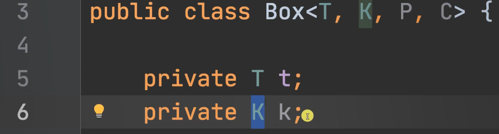

# Generics with methods

- In below code, we will get compile type error because we are passing Character parameter argument to String type. So we need generics to solve it.

```java
package com.nayemtech;

import java.util.ArrayList;
import java.util.List;

public class Main {
    public static void main(String[] args) {
       List<String> store = new ArrayList<>(List.of("Rahim", "Karim"));
       print(store);

       List<Character> store2 = new ArrayList<>(List.of('A', 'B', 'c', 'd'));
       print(store2);
    }

    public static void print(List<String> store) {
        for (String X : store) {
            System.out.println(X.getClass() + " - " + X);
        }
    }
}
```

* Now lets use generics:

```java
package com.nayemtech;

import java.util.ArrayList;
import java.util.List;

public class Main {
    public static void main(String[] args) {
       List<String> store = new ArrayList<>(List.of("Rahim", "Karim"));
       print(store);

       List<Character> store2 = new ArrayList<>(List.of('A', 'd'));
       print(store2);

       List<Integer> store3 = new ArrayList<>(List.of(2,3,5));
       print(store3);

    }

    public static <T> void print(List<T> store) {
        for (T X : store) {
            System.out.println(X.getClass() + " - " + X);
        }
    }
}
```

* We can also do this - our return type is `T` instead of `void`:

```java
    public static <T> T print(List<T> store) {
        for (T X : store) {
            System.out.println(X.getClass() + " - " + X);
        }
    }
```

# Bounded type parameters:

- Let's count how many numbers in an array are bigger than a certain number in another method:

```java
package com.nayemtech;

import java.util.ArrayList;
import java.util.List;

public class Main {
    public static void main(String[] args) {
       List<Integer> numbers = new ArrayList<>(List.of(2,3,1));
       System.out.println(countGreaterThan(numbers, 1));

    }

    public static int countGreaterThan(List<Integer> numbers, Integer number) {
        int count = 0;
        for (int X: numbers) {
            if (X > number) {
                count++;
            }
        }
        return count;
    }
}
```

- But if we were to do this, `List<Double> numbers = new ArrayList<>(List.of(2.0,3.339,1.205));` It won't work anymore because the `countGreaterThan` method receives a list of Integers. So let's make our method a generic. We want to make this generic method so that it can work with numbers (both Integer and Double). 

```java
package com.nayemtech;

import java.util.ArrayList;
import java.util.List;

public class Main {
    public static void main(String[] args) {
       List<Double> numbers = new ArrayList<>(List.of(2.0,3.339,1.205));
       System.out.println(countGreaterThan(numbers, 1));
       //numbers is double which is received by List<T> numbers, which is of Type T.
       //But 1 is int but I'm also receiving it with T number, which is also of Type T.
       //So, first Type T is double, meaning all type T is double, but I'm sending an int in
       //the second type paramter, which expects a double. So, inconsistent behaviour, hence compilation Error!
       // type T can be of any type. But once we define a type T with a certain datatype, that must be consistent throughout the code.
       //if we define a type T as String, then all type T must be String.
       //if we define a type T as int, then all type T must be int.
       //if we define a type T as double, then all type T must be double.
    }

    //did not put any Type inside <> So, compilation Error!
    public static <> int countGreaterThan(List<T> numbers, T number) {
        int count = 0;
        for (T X: numbers) {
            if (X > number) {
                count++;
            }
        }
        return count;
    }
}


wait a second! I forgot to put a datatype inside the <>
also, I forgot to notice that, countGreaterThan method has two paramters, and
both paramter is of type T. so once we define T with a certain datatype, it must be consistent
meaning, we must use the same datatype throughout.
when we pass 2 values in these 2 paramters, we first send double(list of doubles) but in the second paramter,
we try to send 1 which is int. So inconsistent behaviour and compilation error!


so let's fix the code:
public class Main {
    public static void main(String[] args) {
        List<Double> numbers = new ArrayList<>(List.of(2.0,3.339,1.205));
        System.out.println(countGreaterThan(numbers, 1.0));

    }

    public static <T> int countGreaterThan(List<T> numbers, T number) {
        int count = 0;
        for (T X: numbers) {
            // X and number is of type T. and java does not know if type T is number. So it won't allow us to use > operator.
            //that's why I'm casting them to double for now. in below section we'll learn how to deal with this error in better way In Shaa Allah.
            if ((double)X > (double)number) {
                count++;
            }
        }
        return count;
    }
}
```

- But during comparison `if (X > number)` we get an compile time error: `Operator > can not be applied to T, T`

- But we can use > sign for any type of numbers, but the problem is we are not telling this generic method that we are working with numbers, that `T` should be a datatype of numbers. Bounded type parameters comes for solution here.

- Bounded type parameter allows us to create more generic algorithms. It allows us to be more restrict on the types that we want our methods to work with. So let's use bounded type parameter in below code:

```java
package com.nayemtech;

import java.util.ArrayList;
import java.util.List;

public class Main {
    public static void main(String[] args) {
       List<Double> numbers = new ArrayList<>(List.of(2.0,3.339,1.205));
       System.out.println(countGreaterThan(numbers, 1));

    }

    public static <T extends Comparable<T>> int countGreaterThan(List<T> numbers, T number) {
        int count = 0;
        for (T X: numbers) {
            if (X.compareTo(number) > 0) {
                count++;
            }
        }
        return count;
    }
}
```

- anything that extends Comparable interface can use the compareTo method which will return 0 if equal, >0 if greater or <0

- But we got a slight problem in here `System.out.println(countGreaterThan(numbers, 1));` in this line, we should pass `1.0` instead of `1` because:
  
  - In Java, generics are a way to provide stronger type checks at compile time. The generic type `T` in your method signature is a placeholder that will be replaced with a real type when the method is invoked.
    
    In your case, when you’re calling the `countGreaterThan` method with a `List<Double>` and an `Integer`, the compiler tries to infer the type `T` based on the types of the arguments you’re passing. It sees a `List<Double>` and an `Integer`, and it can’t find a single type that would work for both `Double` and `Integer` (since `Double` and `Integer` are siblings in the class hierarchy with a common parent of `Number`). This is why you’re getting a compile-time error.
    
    When you’re working with generics, it’s important to ensure that the types of all arguments match the generic type. So, if you’re passing a `List<Double>`, you should also pass a `Double` as the second argument to match the generic type `T`.
  
  - But! since Double and Integer are siblings in the class hierarchy with a common parent of Number, shouldn't it work when I pass an Integer?
    
    - While it’s true that `Double` and `Integer` are both subclasses of `Number` in Java, the issue here is related to how generics work in Java.
      
      When you define a method with a generic type `<T extends Comparable<T>>`, it means that the type `T` must implement the `Comparable<T>` interface. This interface has a method `compareTo(T o)` which compares the current object with the object `o` of type `T`.
      
      In your case, when you call the method `countGreaterThan(numbers, 1)`, where `numbers` is a `List<Double>`, the compiler tries to infer the type `T` based on the types of the arguments you’re passing. It sees a `List<Double>` and an `Integer`, and it can’t find a single type that would work for both `Double` and `Integer`.
      
      This is because generics in Java are invariant, meaning that even though `Integer` and `Double` are subclasses of `Number`, a `List<Integer>` is not a subtype of `List<Number>`, and a `List<Double>` is not a subtype of `List<Number>`.
      
      So, in the context of generics, `Double` and `Integer` are considered as two completely different types. Therefore, you can’t pass an `Integer` where a `Double` is expected, or vice versa.
* So, from above analysis what we got is: there's two issues why we must pass `1.0` instead of `1` when we passed a double type `List`: 
  
  * first issue: generic type `T` in your method signature is a placeholder that will be replaced with a real type when the method is invoked.
  
  * second issue: If anything extends `Comparable` interface, it must follow the method defined within the Comparable interface: `compareTo(T o)` which compares the current object with the object `o` of type `T`. So, both type must be same for them to be compared. In our case, both numbers List and number variable must be double for them to be compared.

* So now it works!:

```java
package com.nayemtech;

import java.util.ArrayList;
import java.util.List;

public class Main {
    public static void main(String[] args) {
       List<Double> numbers = new ArrayList<>(List.of(2.0,3.339,1.205));
       System.out.println(countGreaterThan(numbers, 1.0));

       List<Integer> numbers2 = new ArrayList<>(List.of(2,3,1));
        System.out.println(countGreaterThan(numbers2, 1));

    }

    public static <T extends Comparable<T>> int countGreaterThan(List<T> numbers, T number) {
        int count = 0;
        for (T X: numbers) {
            if (X.compareTo(number) > 0) {
                count++;
            }
        }
        return count;
    }
}
```

* We can use bounded type parameters to classes, interfaces and methods. In previous example of our `Box` class, lets use bounded type parameters:

```java
public class Box<T extends Comparable<T>> {
    private T t;

    public T getT() {
        return t;
    }

    public void setT(T t) {
        this.t = t;
    }
}
```

* We can use any custom classes or any other classes in the bounded type parameter. in above example, we used the Comparable interface.

# this does not work

- reason: no instance(s) of type variable(s) T exist so that Object conforms to Comparable<T>

```java
public class Main {
    public static void main(String[] args) {
        List<Object> lists = new ArrayList<>(List.of("abcd", 3333, new Main(), LocalDateTime.now(), new BigDecimal("99999.9999")));
        System.out.println(countElements(lists));
    }

    public static <T extends Comparable<T>> int countElements(List<T> lists) {
        int cnt = 0;
        for (T curElement: lists) {
            cnt++;
        }

        return cnt;
    }
}
```

The constraint `<T extends Comparable<T> & Comparator<T>>` requires that the elements in the list implement both `Comparable<T>` and `Comparator<T>`. However, not all of the types you’re using (`String`, `Integer`, `Main`, `LocalDateTime`, `BigDecimal`) implement both of these interfaces.

If you want to satisfy these constraints, you would need to create custom classes that implement both `Comparable<T>` and `Comparator<T>`. However, this might not be necessary or practical depending on what you’re trying to achieve with your code.

If your goal is simply to count the elements in a list, you don’t need these constraints at all. You can use a wildcard (`?`) or a simple generic type parameter (`<T>`) instead. Here’s how you can modify your `countElements` method:

```java
public static int countElements(List<?> lists) {
    int cnt = 0;
    for (Object curElement: lists) {
        cnt++;
    }
    return cnt;
}
```

In this updated `countElements` method, we use a wildcard (`?`) as the type parameter, which means the method can accept a list of any type. This should be helpful for your preparation for the associate software engineer position at Therap BD, especially considering your experience with Java. Good luck with your exam! üòä

# Multiple types in the bounded type parameters

- In below code, we extend multiple interfaces and a default java class Number but there's a rule: if you use classes and interfaces together, class must be at the beginning of the parameter, ahead of any interface. So below code shows error and we need to fix it.

```java
    public interface A{}
    public interface B{}

    public static <T extends Comparable<T> & A & B & Number> int countGreaterThan(List<T> numbers, T number) {
        int count = 0;
        for (T X: numbers) {
            if (X.compareTo(number) > 0) {
                count++;
            }
        }
        return count;
    }
```

- Now it works:

```java
    public interface A{}
    public interface B{}

    public static <T extends Number & Comparable<T> & A & B> int countGreaterThan(List<T> numbers, T number) {
        int count = 0;
        for (T X: numbers) {
            if (X.compareTo(number) > 0) {
                count++;
            }
        }
        return count;
    }
```

* another rule: you can not extend multiple classes. Because Multiple inheritance is not possible in java.

# WildCards

* `?` represents an unknow type. It is called wildcard.

* wildcard 3 types:
  
  * unbounded wildcards
  
  * upperbounded wildcards
  
  * lowerbounded wildcards

### Unbounded WildCards (normal wildcards with just ?)

* Below code works because in the print method, we receive a wildcard type of List, So any type of list that we pass to this method will work. In our case, we passed list of type Object and Integer .. and both works.

```java
package com.nayemtech;

import java.math.BigDecimal;
import java.util.ArrayList;
import java.util.List;

public class Main {
    public static void main(String[] args) {
        List<Object> list = new ArrayList<>(List.of(3,4, new Letter(), "string too", 499.3328, new BigDecimal("4444444932")));
        List<Integer> list2 = new ArrayList<>(List.of(4,2,1));

        print(list);
        print(list2);
    }

    public static void print(List<?> list) { // Unbounded wildcard (these are normal wildcards with just ?)
        for (var X : list) {
            System.out.println(X);
        }
    }
}
```

### Upperbounded wildcards (upper bound kora mane upper(super classes) thakte parbe na)

- we can restrict the types that go inside the upperbounded wildcards.

- Lets say, we want to be able to work with numbers only. So just like the bounded type parameters in generics, we can do this:

```java
package com.nayemtech;

import java.math.BigDecimal;
import java.util.ArrayList;
import java.util.List;

public class Main {
    public static void main(String[] args) {
        List<BigDecimal> list = new ArrayList<>(List.of( new BigDecimal("4444444932"))); //class BigDecimal extends abstract class Number
        List<Integer> list2 = new ArrayList<>(List.of(4,2,1)); // class Integer extends abstract class Number
        List<Number> list3 = new ArrayList<>();

        print(list);
        print(list2);
        print(list3);
    }

    public static void print(List<? extends Number> list) {
        for (var X : list) {
            System.out.println(X);
        }
    }
}
```

* `<? extends Number>` means: *<u>anything that is of type Number and it's child classes</u>*

### Lowerbounded wildcards (lower bound kora mane lower(child classes) thakte parbe na)

* opposite of upperbounded wildcards. for above example, lowerbounded wildcards would be : <u>*anything that is of type Number and it's super classes*</u>

* so for above example, BigDecimal, Integer, Double etc won't work because they are child of Number(as we are extending Number in the print method so it's based on Number class).

* Number implements Serializable.

* we can code like this for lowerbounded wildcards:

```java
package com.nayemtech;

import java.math.BigDecimal;
import java.util.ArrayList;
import java.util.List;

public class Main {
    public static void main(String[] args) {
//        List<BigDecimal> list = new ArrayList<>(List.of( new BigDecimal("4444444932"))); //class BigDecimal extends abstract class Number
        List<Integer> list2 = new ArrayList<>(List.of(4,2,1)); // class Integer extends abstract class Number
        List<Number> list3 = new ArrayList<>();

//        print(list);
        print(list2);
        print(list3);
    }

    public static void print(List<? super Integer> list) {
        for (var X : list) {
            System.out.println(X);
        }
    }
}
```

* here, `<? super Integer>` means: <u><em>anything that is of type Integer and it's super classes</em></u>

* so, BigDecimal list won't work cz it's not a super class of Integer.

# Bounded type parameters vs WildCards

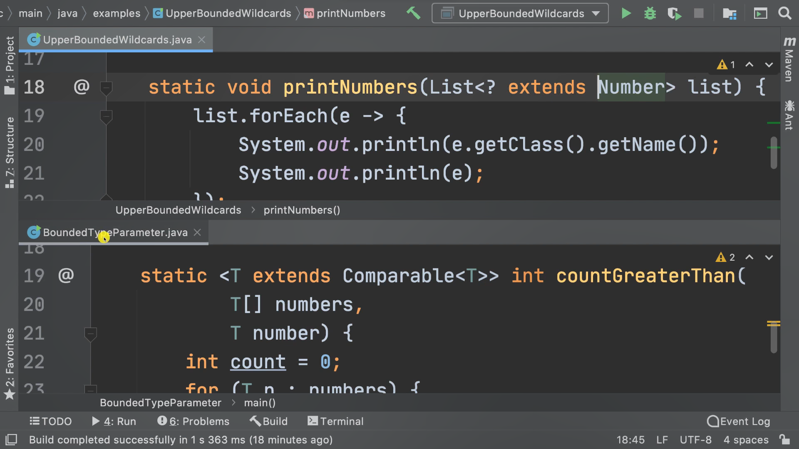

1. Wildcards can only have one bound. With bounded type parameters we can have Multiple types in the bounded type parameter.
   
   * Below screensot shows Wildcards can't have multiple type, it shows error:

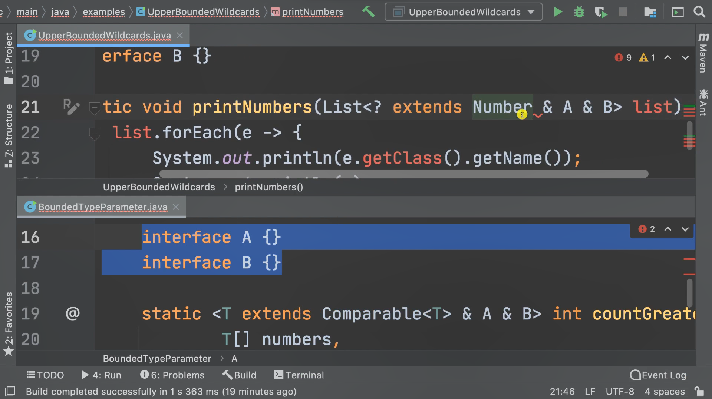

2. Bound type parameters don't have upper or lower bounds.

3. Bounded type parameters allows us to reference the parameter that we use in the bounds throughout that entire class or method. in below screenshot we can see type `T` can be refernced and used throughout the method, whereas wildcards we can't do that because with wildcards we use `?` instead of a specific type(for example `T` in our example).

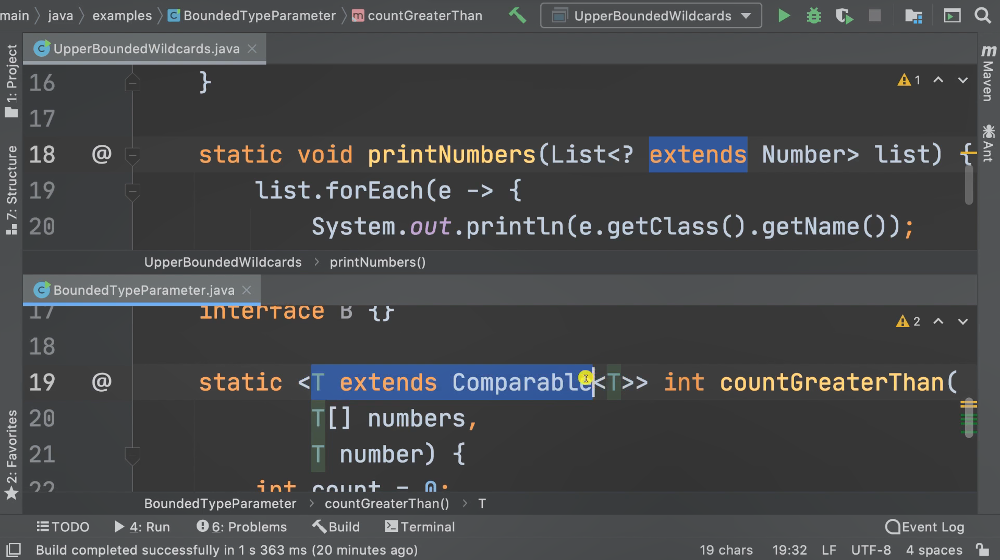

# TypeErasure

* We know that, the reason we use generics, is because it provides strong compile time checking which reduces the risk of ClassCastException and the explicit casting of objects.

* So the compiler uses `TypeErasure` , which is a feature that removes all generic type code in the java bytecode and adds casting if necessary.

* TypeErasure is used for better compilation. When the JVM runs the code that includes generics, the java compiler removes the generics part and adds casting if necessary.

* as an example, in below code, the marked are generics and will be removed:

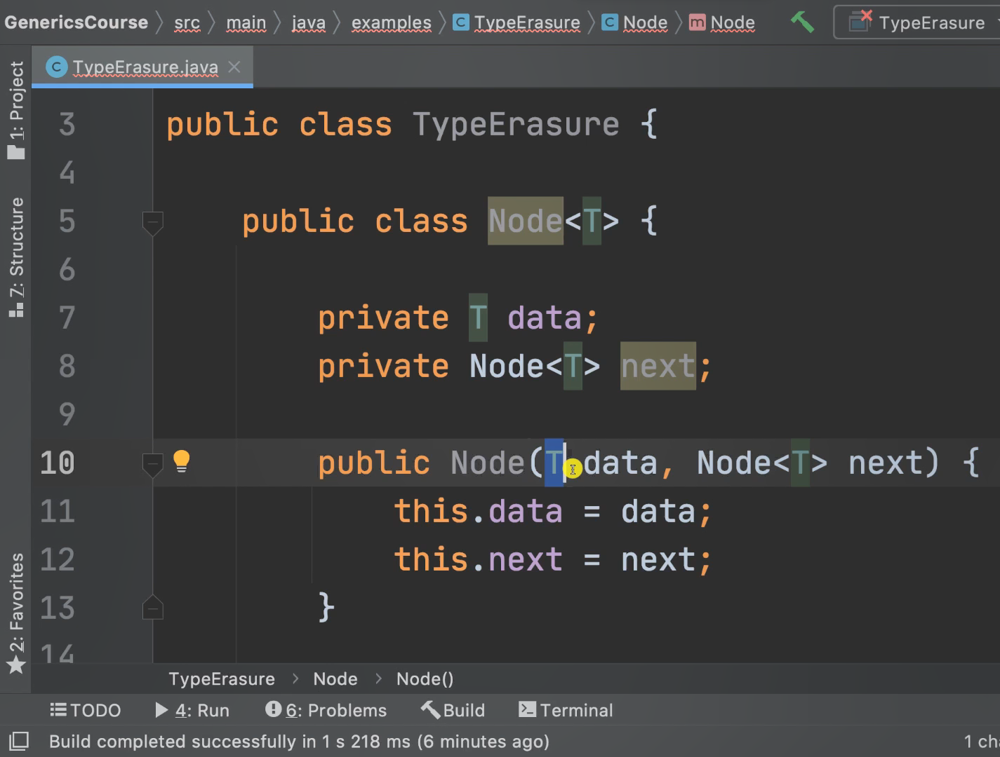

* and they will be casted/transformed by the compiler like below:

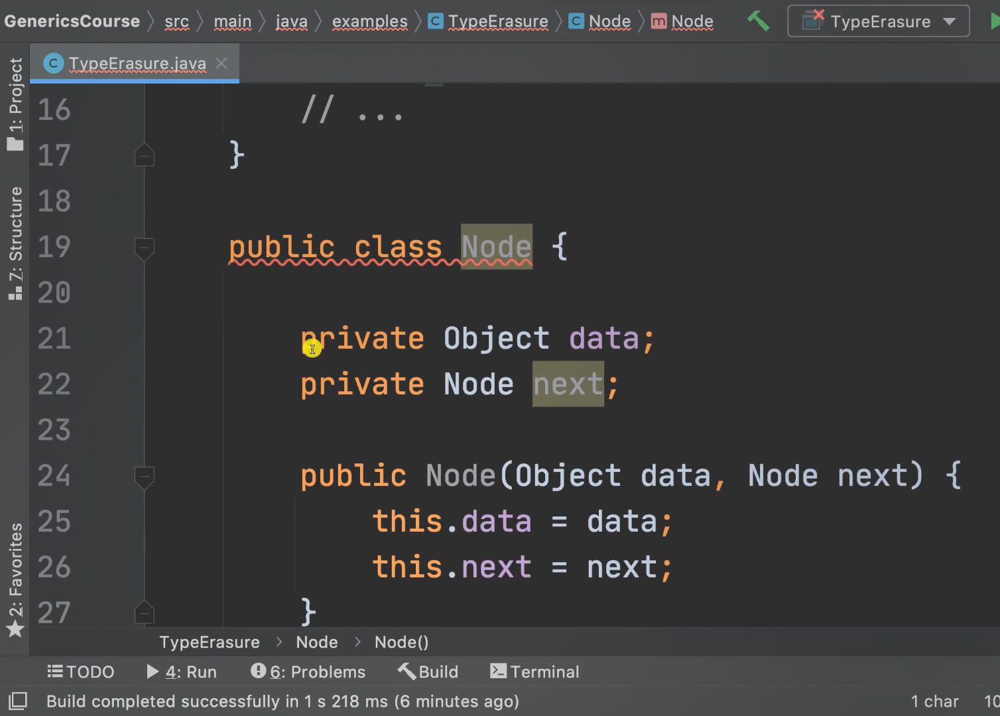

# Optionals in Java

- before optionals, we needed to check with `if (null) then this` `else that`

- The main purpose of an optional, is to explicitly tell, that value in it might not exist and you need to account for that possibility.

- `think of optional as a box.` `The box either contains a value, so we get a box with a value.` `Or, the box contains nothing, so we just get the empty box.`

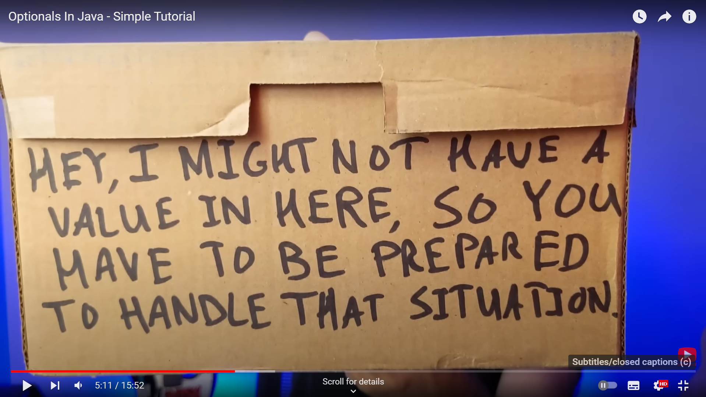

# Testing

* Junit

# Spring Boot

* A set of tools that helps to write java much faster.

* each spring boot application includes an embedded web server

* from spring.io: with Spring Boot, we can build microservices, Reactive, you can write code for any cloud

* In order for a java code to become spring boot, we need to add `@SpringBootApplication` and inside the main method, we have to say `SpringAppliation.run(javamasterclassApplication.class, args);`
  
  (I named Main class as `javamasterclassApplication`)

# If an interviewer asks me, "why did you start with Spring Boot? there are other easier options." - How should I answer it?

You can answer like this:

I chose to start with Spring Boot for several reasons:

1. **Rapid Development**: Spring Boot provides a lot of sensible defaults and conventions that allow developers to start a project quickly without the need for lots of boilerplate code. This makes it a great choice for rapid application development.

2. **Spring Ecosystem**: Spring Boot is part of the larger Spring ecosystem, which provides a wide range of proven solutions for many common technical challenges, such as security, data access, messaging, and more. This means I can leverage these solutions and focus more on the business logic of the application.

3. **Microservices Support**: Spring Boot has excellent support for developing microservices, which are becoming increasingly popular for building scalable and maintainable applications.

4. **Community and Resources**: Spring Boot has a large and active community, which means it’s easy to find help and resources online. There are numerous tutorials, guides, and StackOverflow answers available.

5. **Integration with Other Tools**: Spring Boot integrates well with other tools that I frequently use, such as Maven or Gradle for build automation, and Spring Data JPA for database access.

While there may be other frameworks that are easier to learn initially, I believe that the benefits of Spring Boot make it a worthwhile investment of my time. Of course, the best tool always depends on the specific requirements of the project, and I’m open to learning and using other frameworks as needed.

### Tomcat started on port 8080 but what is Tomcat?

* anyone can send request on a given port, which the servlet container is listening on(in our case 8080) , and then we process the request and then send the response to any given client.

* our embedded webserver, tomcat is listening on port 8080 - what does it mean?

* why use port names as 8080 or 3000 etc?

* Tomcat is one of many embedded web servers. there are others: jetty

* so Now we know about: embedded web servers, tomcat and how to configure it properly.

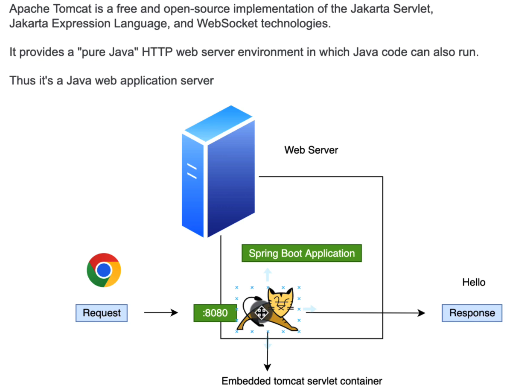

* Let's build a simple API with spring boot. Let's create a method in our Main class.

```java
    @GetMapping("/")
    public String greet() {
        return "Hello";
    }
```

Now, in order to expose this method as a rest endpoint for clients to use as Get requests, we have to use `@GetMapping`. Now. for this to work, we also need this `@RestController` - which means that any method within the class, that has any of these annotations(Get, Post, Put, etc.) , those methods will be exposed as Rest endpoints to create API's that clients can call.

* `@SpringBootApplication`: it's a wrapper for encapsulating @Configuration, @EnableAutoConfiguration, @ComponentScan

* `@RestController`, `@GetMapping`: These are annotations, part of the Spring Web MVC(Model view controller). MVC is a framework that provides a very easy way of implementing MVC architecture in our web applications. Spring MVC abstracts away a lot of messy details you would've to understand and manage yourself if writing servlets manually. Then it allows us to create RESTful services very easily. Annotations of spring web mvc: @Controller, @RestController, @ResponseBody

* Servlet: A process which handles HTTP Requests. A client sends a request and also gets a response.

* `@RestController` is the `@Controller` with `@ResponseBody`. Together this indicates that, the class is Controller class, and all the methods inside the @RestController marked class, will return a JSON response.

* `@ResponseBody`, `@RequestBody`:

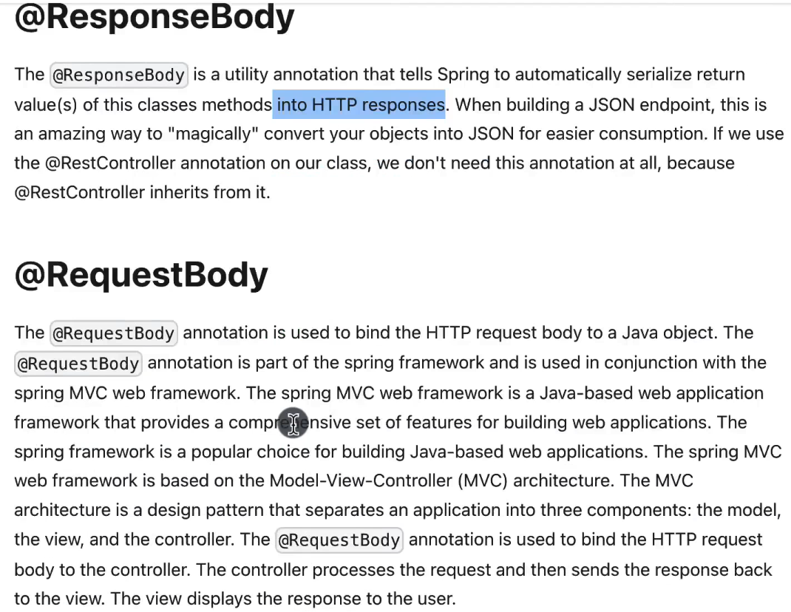

* `@RequestMapping`, `@GetMapping`, `@PostMapping` ........ etc.: 

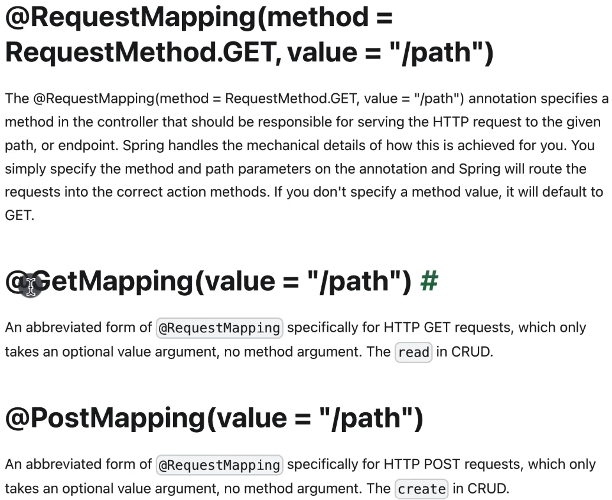

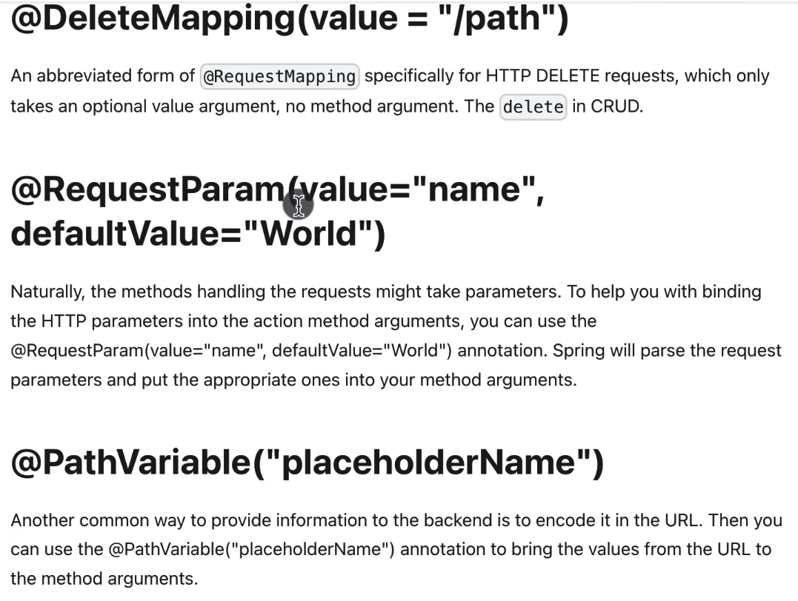

* So, when we mark a class with `@RestController`, then we'll be able to have methods within it, that we can expose as REST Endpoint to create API's

* instead of Returning a String, return a class or something for it to be shown as JSON . Below code returns Json

```java
package com.nayemtech.javamasterclass;

import org.springframework.boot.SpringApplication;
import org.springframework.boot.autoconfigure.SpringBootApplication;
import org.springframework.web.bind.annotation.GetMapping;
import org.springframework.web.bind.annotation.ResponseBody;
import org.springframework.web.bind.annotation.RestController;

import java.util.HashMap;
import java.util.Map;

@SpringBootApplication
@RestController
public class JavamasterclassApplication {

    public static void main(String[] args) {
        SpringApplication.run(JavamasterclassApplication.class, args);
    }

    @GetMapping("/")
    public Map<String, String> greet() {
        Map<String, String> response = new HashMap<>();
         response.put("message", "Hello");
         return response;
    }
}
```

* Below Record also returns Json:

```java
package com.nayemtech.javamasterclass;

import org.springframework.boot.SpringApplication;
import org.springframework.boot.autoconfigure.SpringBootApplication;
import org.springframework.web.bind.annotation.GetMapping;
import org.springframework.web.bind.annotation.ResponseBody;
import org.springframework.web.bind.annotation.RestController;

import java.util.HashMap;
import java.util.Map;

@SpringBootApplication
@RestController
public class JavamasterclassApplication {

    public static void main(String[] args) {
        SpringApplication.run(JavamasterclassApplication.class, args);
    }

    @GetMapping("/")
    public greetResponse greet() {
        return new greetResponse("Hello from record greetResponse, return type = record name");
    }

    public record greetResponse(String helloMessage) {}
}
```

* Record in java:

[A **Record** in Java is a special type of class introduced in Java 14 as a preview feature and finalized in Java 16](https://howtodoinjava.com/java/java-record-type/)[1](https://howtodoinjava.com/java/java-record-type/). [Its primary purpose is to act as a transparent carrier for immutable data](https://howtodoinjava.com/java/java-record-type/)[1](https://howtodoinjava.com/java/java-record-type/). [Records are intended to be used in places where a class is created only to act as a plain data carrier](https://howtodoinjava.com/java/java-record-type/)[1](https://howtodoinjava.com/java/java-record-type/).

Here’s an example of a Record in Java:

```java
public record Employee(Long id, String firstName, String lastName, String email, int age) { }
```

[In the above example, `Employee` is a record type and is used to hold employee information](https://howtodoinjava.com/java/java-record-type/)[1](https://howtodoinjava.com/java/java-record-type/). When we create an `Employee` record, the compiler generates the following:

1. An all-arguments constructor accepting all fields.
2. The `toString()` method that prints the state/values of all fields in the record.
3. The `equals()` and `hashCode()` methods using an invokedynamic based mechanism.
4. Getter methods whose names are similar to field names without the usual POJO/JavaBean `get` prefix i.e. `id()`, `firstName()`, `lastName()`, `email()`, and `age()`.
5. The class extends `java.lang.Record`, which is the base class for all records. [It means a record cannot extend other classes](https://howtodoinjava.com/java/java-record-type/)[1](https://howtodoinjava.com/java/java-record-type/).

[The important difference between a class and a record is that a record aims to eliminate all the boilerplate code needed to set and get the data from the instance](https://howtodoinjava.com/java/java-record-type/)[1](https://howtodoinjava.com/java/java-record-type/). [Records transfer this responsibility to the Java compiler, which generates the constructor, field getters, `hashCode()`, `equals()`, and `toString()` methods](https://howtodoinjava.com/java/java-record-type/)[1](https://howtodoinjava.com/java/java-record-type/).

[Records are a great way to reduce boilerplate code and make your Java applications more concise and efficient](https://howtodoinjava.com/java/java-record-type/)[2](https://medium.com/@dsforgood/exploring-the-java-records-with-example-237cff17873b).

* If we were to create a class insteas of record in above example with same functionality: here, if we were to remove the getter method, we will see a whitelabel page error. So the getter Method is responsible for us to get the string greetMessage in order for us to get the value that we set within the constructor.

```java
package com.nayemtech.javamasterclass;

import org.springframework.boot.SpringApplication;
import org.springframework.boot.autoconfigure.SpringBootApplication;
import org.springframework.web.bind.annotation.GetMapping;
import org.springframework.web.bind.annotation.ResponseBody;
import org.springframework.web.bind.annotation.RestController;

import java.util.HashMap;
import java.util.Map;

@SpringBootApplication
@RestController
public class JavamasterclassApplication {

    public static void main(String[] args) {
        SpringApplication.run(JavamasterclassApplication.class, args);
    }

    @GetMapping("/")
    public greetResponse greet() {
        return new greetResponse("Hello from record greetResponse, return type = record name");
    }

    public class greetResponse {
        private String greetMessage;

        public greetResponse(String greetMessage) {
            this.greetMessage = greetMessage;
        }

        public String getGreetMessage() {
            return greetMessage;
        }
    }
}
```

* The reason why we can get the Json response from above `greetResponse` class is because of a library called `jackson`. We can find it within the External Libraries dropdown list in intellij

* jackson is known as json for java. In order know json serialization and deserialization visit their github and know more

-------

-------

- when I perform localhost:8080/test , why the String I see is not in Json even after I used @RestController annotation, which includes @ResponseBody. So what is going on? explain with example.

```java
@RestController
public class TestController {
@GetMapping("/test")
public String testingJson() {
    String s = "is this in json or not?";
    return s;
} 
}
```

Certainly! Let’s dive into why the response from your Spring Boot controller method isn’t automatically serialized as JSON even though you’ve used `@RestController` and `@ResponseBody`.

1. **`@RestController` and `@ResponseBody`**:
   
   - The `@RestController` annotation combines the functionality of `@Controller` and `@ResponseBody`.
   - When you use `@RestController`, every request handling method in that controller class automatically serializes return objects into an HTTP response.
   - In other words, you don’t need to explicitly use `@ResponseBody` for each method within a `@RestController`.

2. **Your Example**:
   
   - In your example, you’ve created a simple Spring Boot controller with a single method:
     
     ```java
     @RestController
     public class TestController {
        @GetMapping("/test")
        public String testingJson() {
            String s = "is this in json or not?";
            return s;
        }
     }
     ```
   
   - When you access `localhost:8080/test`, the response you see is the plain string `"is this in json or not?"`.
   
   - The reason it’s not automatically serialized as JSON is that Spring Boot doesn’t treat plain strings as JSON by default.

3. **How to Return JSON**:
   
   - To return JSON, you should return a **POJO (Plain Old Java Object)** or a collection of POJOs.
   
   - Spring Boot, with the help of Jackson (a JSON library), will automatically serialize the POJO into JSON.
   
   - Let’s modify your example to return a simple POJO instead:
     
     ```java
     @RestController
     public class TestController {
        @GetMapping("/test")
        public MyResponse testingJson() {
            return new MyResponse("is this in json or not?");
        }
     }
     
     class MyResponse {
        private String message;
     
        public MyResponse(String message) {
            this.message = message;
        }
     
        // Getter and setter (or use Lombok for simplicity)
     }
     ```
   
   - In this modified example, the `MyResponse` object will be automatically serialized into JSON when you access `/test`.

4. **Summary**:
   
   - If you want to return JSON, create a POJO and let Spring Boot handle the serialization.
   - If you return plain strings, Spring Boot treats them as plain text, not JSON.

[Remember that Spring Boot’s default behavior is to serialize POJOs into JSON, so using POJOs is the recommended approach for returning structured data in your RESTful APIs](https://stackoverflow.com/questions/44839753/returning-json-object-as-response-in-spring-boot)[1](https://stackoverflow.com/questions/44839753/returning-json-object-as-response-in-spring-boot)[2](https://www.baeldung.com/spring-controller-vs-restcontroller)[3](https://www.baeldung.com/spring-boot-json)[4](https://docs.spring.io/spring-framework/reference/web/webmvc/mvc-controller/ann-methods/responsebody.html)[5](https://stackabuse.com/controller-and-restcontroller-annotations-in-spring-boot/). 

-------

- To return Json, I can also use ResponseEntity with a Map: (If I don't use Map, and only use String as the parameter type of ResponseEntity, it will still return plain text, not json)

- below code returns Json:

```java
@RestController
public class TestController {

    @GetMapping("/test")
    @ResponseBody
    public ResponseEntity<Map<String, String>> testingJson() {
        String s = "is this in json or not?";
        Map<String, String> response = new HashMap<>();
        response.put("s", s);
        return ResponseEntity.ok().body(response);
    }
}
```

- below code returns plain text:

```java
@RestController
public class TestController {

    @GetMapping("/test")
    @ResponseBody
    public ResponseEntity<String> testingJson() {
        String s = "is this in json or not?";
        String response = s;
        return ResponseEntity.ok().body(response);
    }
}
```

In the provided code snippet, the `ResponseEntity<String>` indeed returns plain text instead of JSON. Let’s understand why and how to modify it to return JSON.

1. **Explanation**:
   
   - The `ResponseEntity<String>` indicates that the response body is a plain string (`String` type).
   - When you return a plain string, Spring Boot treats it as plain text, not JSON.
   - To return JSON, we need to provide an object (usually a POJO) that Spring Boot can automatically serialize into JSON.

2. **How to Return JSON**:
   
   - To return JSON, create a simple POJO (Plain Old Java Object) and let Spring Boot handle the serialization.
   
   - Here’s an example using a custom class:
     
     ```java
     @RestController
     public class TestController {
        @GetMapping("/test")
        public ResponseEntity<MyResponse> testingJson() {
            String s = "is this in json or not?";
            MyResponse response = new MyResponse(s);
            return ResponseEntity.ok().body(response);
        }
     }
     
     class MyResponse {
        private String message;
     
        public MyResponse(String message) {
            this.message = message;
        }
     
        // Getter and setter (or use Lombok for simplicity)
     }
     ```
   
   - In this modified example, the `MyResponse` object will be automatically serialized into JSON when you access `/test`.

3. **Summary**:
   
   - If you want to return JSON, create a POJO and let Spring Boot handle the serialization.
   - If you return plain strings directly, Spring Boot treats them as plain text, not JSON.

--------

- you said "When you use @RestController, every request handling method in that controller class automatically serializes return objects into an HTTP response." but doesn't the @RestController is used for @ResponseBody and it serializes return objects into Json? why you sai HTTP? explain in depth

Certainly! Let’s dive into the details of how `@RestController`, `@ResponseBody`, and HTTP responses work in Spring.

1. **`@RestController` and `@ResponseBody`**:
   
   - The `@RestController` annotation is a specialized version of the `@Controller` annotation.
   - When you use `@RestController`, it combines the functionality of `@Controller` and `@ResponseBody`.
   - Here’s what each of these annotations does:
     - `@Controller`: Marks a class as a Spring MVC controller. It handles HTTP requests and returns a view (HTML page) or a model (data) to be rendered by a view.
     - `@ResponseBody`: Indicates that the return value of a method should be serialized directly into the HTTP response body (usually as JSON or XML).
   - When you use `@RestController`, every request handling method within that controller class is implicitly annotated with `@ResponseBody`. This means that the return objects from those methods are automatically serialized into the HTTP response body.

2. **HTTP Responses**:
   
   - An HTTP response consists of several components:
     - **Status Code**: A numeric code indicating the result of the request (e.g., 200 for OK, 404 for Not Found, etc.).
     - **Headers**: Additional metadata about the response (e.g., content type, caching instructions, etc.).
     - **Body**: The actual content of the response (e.g., HTML, JSON, plain text, etc.).
   - The response body can be in various formats, including JSON, XML, HTML, plain text, and more.
   - When we say “HTTP response,” we’re referring to the entire package that includes the status code, headers, and response body.

3. **Why Mention “HTTP”**:
   
   - When I mentioned “HTTP response,” I was referring to the complete response that includes both the status code and the serialized response body.
   - The term “HTTP” emphasizes that we’re dealing with the communication protocol used for web requests and responses.
   - In the context of Spring Boot, the response body (which can be serialized as JSON, XML, etc.) is an integral part of the overall HTTP response.

4. **Returning JSON**:
   
   - When you return an object (such as a POJO) from a method in a `@RestController`, Spring Boot automatically serializes it into JSON (unless otherwise specified).
   - This behavior is due to the combination of `@RestController` and `@ResponseBody`.
   - If you return a plain string (like `"is this in json or not?"`), Spring Boot treats it as plain text, not JSON.

5. **Summary**:
   
   - The use of `@RestController` ensures that your response objects are automatically serialized into the appropriate format (e.g., JSON) for HTTP responses.
   - The term “HTTP response” encompasses the entire response, including both the status code and the serialized body.

-------

The `@ResponseBody` annotation tells a controller that the object returned is automatically serialized into JSON and passed back into the HttpResponse object.

-----

--------

# Json:

* Json = Javascript object Notation

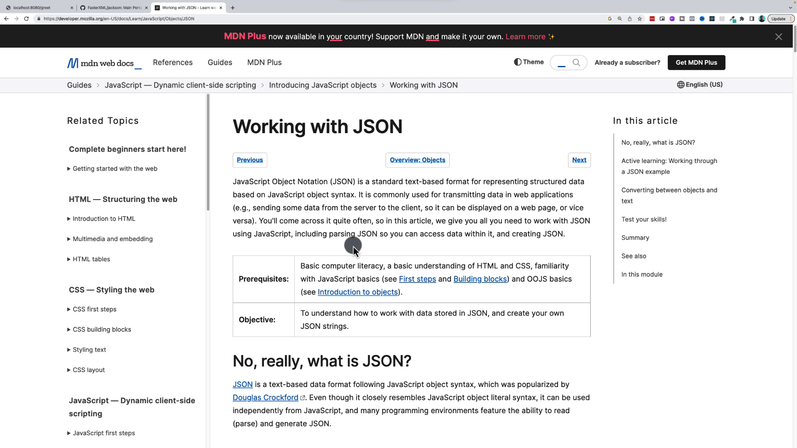

* How to denote various datatype in Json. inside square brackets are objects/strings. Third brackets are array.

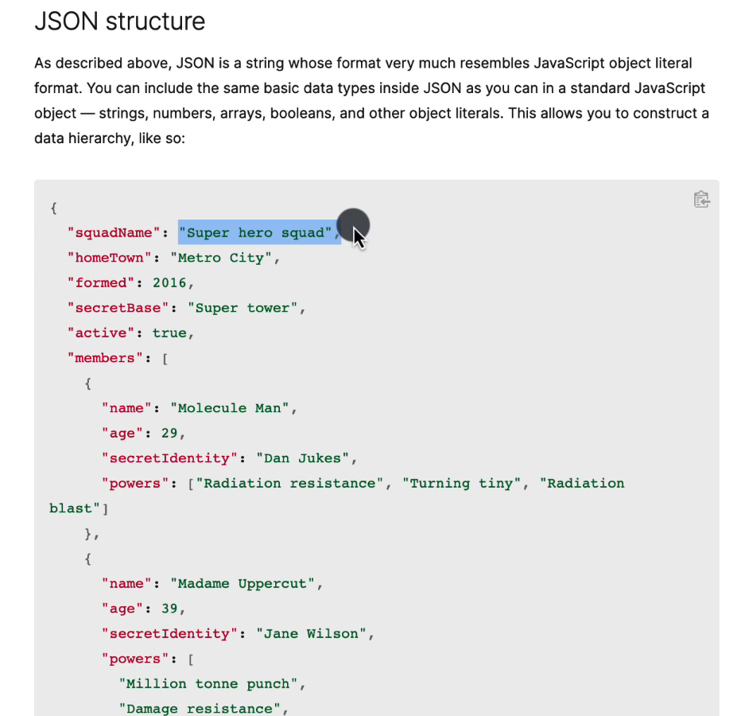

# two other dataTypes when taking your java objects to JSON.

1. Object and Objects within Object

2. Array

# Http

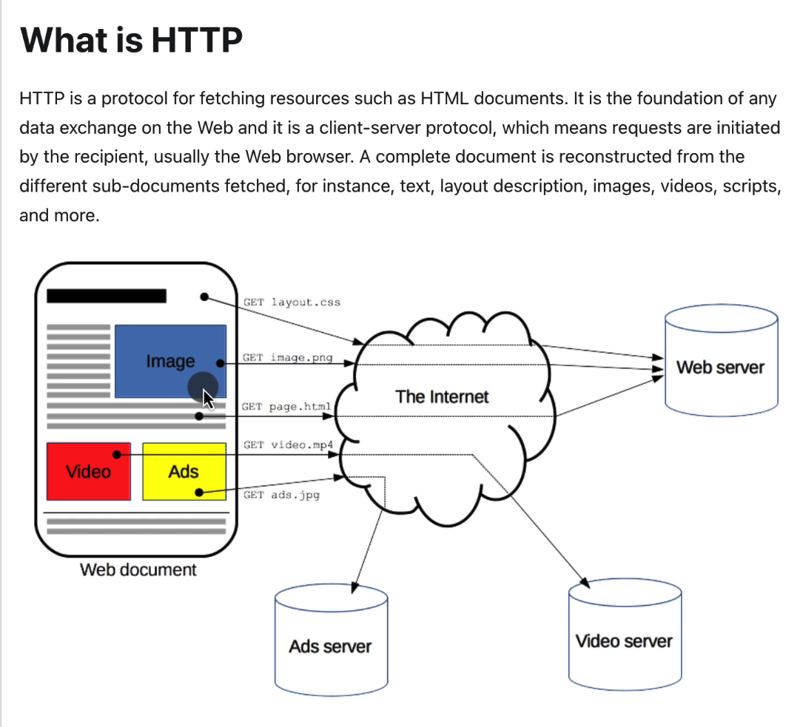

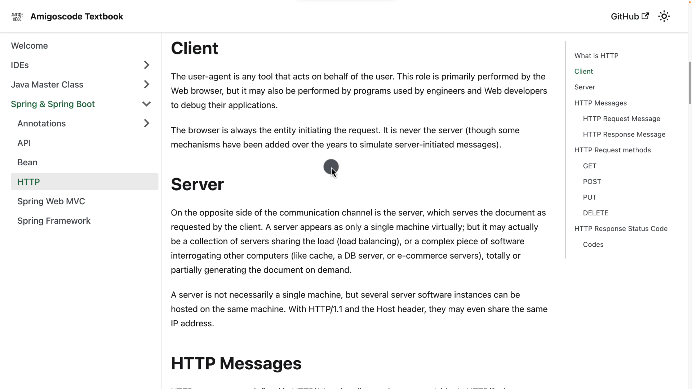

* in below diagram: W've got clients(with the mobile app or chrome browser) -> clients, they perform HTTP requests(Get, Post, Put, Delete) -> These HTTP requests go across the internet -> to the server -> the server process the request that comes from the client -> then it sends back the response (so the response is what exactly the client has requested.(pic/video/doc/webpage etc) -> then the picture(requested file) is viewed in the webpage

* So, Http is basically the client-server communicating over the internet

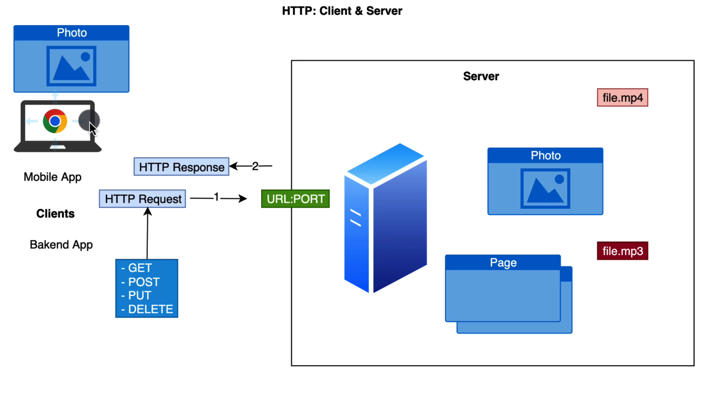

# URL

* URL = universal Resource Locator

# http vs https

* https means the connection between client and server is encrypted (handshake and stuff)

# API

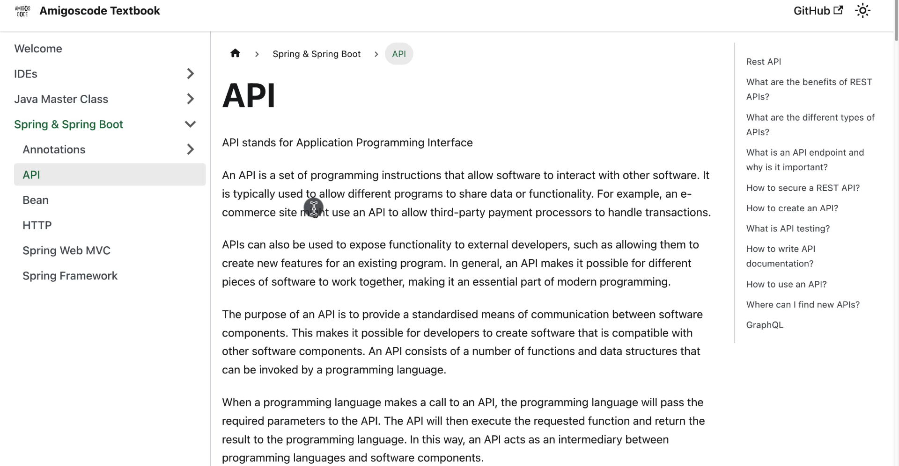

* API is a way for two programs to talk to each other! 

* API is a set of programming instructions that allow software to interact with other software.

* When we talk about API we generally mean - A webservice that can handle HTTP Requests that are sent to it, Do some work and then return a response. These webservices are called REST services or RESTful services.

# API vs REST API

* An API is a set of rules for software interaction, while a REST API is a type of API that follows REST principles and is typically used for web services.

* REST uses functions like GET, POST, PUT, DELETE

* 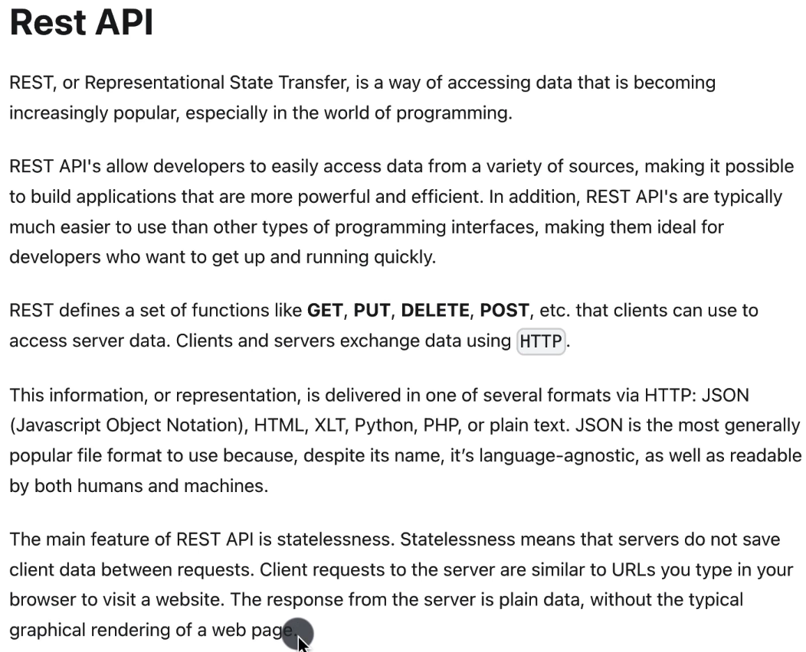

* [“REST Principles” refer to the six guiding principles or constraints of the RESTful architecture](https://restfulapi.net/)[1](https://restfulapi.net/)[2](https://www.ibm.com/topics/rest-apis):
  
  1. [**Uniform Interface**: The interface must uniquely identify each resource involved in the interaction between the client and the server](https://restfulapi.net/)[1](https://restfulapi.net/). [It should have uniform representations in the server response](https://restfulapi.net/)[1](https://restfulapi.net/). [Each resource representation should carry enough information to describe how to process the message](https://restfulapi.net/)[1](https://restfulapi.net/).
  2. [**Client-Server**: This design pattern enforces the separation of concerns, which helps the client and the server components evolve independently](https://restfulapi.net/)[1](https://restfulapi.net/).
  3. [**Statelessness**: Each request from client to server must contain all the information needed to understand and process the request](https://restfulapi.net/)[1](https://restfulapi.net/)[2](https://www.ibm.com/topics/rest-apis). [It means that the server does not store any data related to a client request](https://www.ibm.com/topics/rest-apis)[2](https://www.ibm.com/topics/rest-apis).
  4. [**Cacheable**: Resources should be cacheable on the client or server side](https://www.ibm.com/topics/rest-apis)[2](https://www.ibm.com/topics/rest-apis). [Server responses also need to contain information about whether caching is allowed for the delivered resource](https://www.ibm.com/topics/rest-apis)[2](https://www.ibm.com/topics/rest-apis).
  5. [**Layered System**: The calls and responses go through different layers](https://www.ibm.com/topics/rest-apis)[2](https://www.ibm.com/topics/rest-apis). [Neither the client nor the server can tell whether it communicates with the end application or an intermediary](https://www.ibm.com/topics/rest-apis)[2](https://www.ibm.com/topics/rest-apis).
  6. [**Code on Demand**: In certain cases, responses can also contain executable code](https://www.ibm.com/topics/rest-apis)[2](https://www.ibm.com/topics/rest-apis).
  
  [These principles help you design and implement RESTful APIs](https://restfulapi.net/)[1](https://restfulapi.net/)[2](https://www.ibm.com/topics/rest-apis).

--------------------

---------------------

# Postman

* why use postman? because we can't perform post, put or delete request from our browser

# How we are going to start building our API

-----

# Dependency injection:

* If we want our classes(Model, service, controller, Repository/Dao) to be instantiated without using the new keyword to create objects and instantiate by this way, we need to use special annotations.

* in our controller class, we use @RestController and Spring will intantiate this class by craeting new instance of our controller class, which is known as bean that we can access throughout our entire application.

* @Service, @Repository is an alias for @component both will work. We use @Service for specifying it as  a service class where we perform business logic.

* So, Spring uses these annotations(@Component, @Service, @Repository, @Controller) and creates new instances of these classes automatically and we can inject them to other classes(who needs(depends on) those classes) through constructor which is called dependency injection. So where are these class stored? They are stored within an object called `Application Context`.

* Application Context provides basic functionalities for managing Beans.

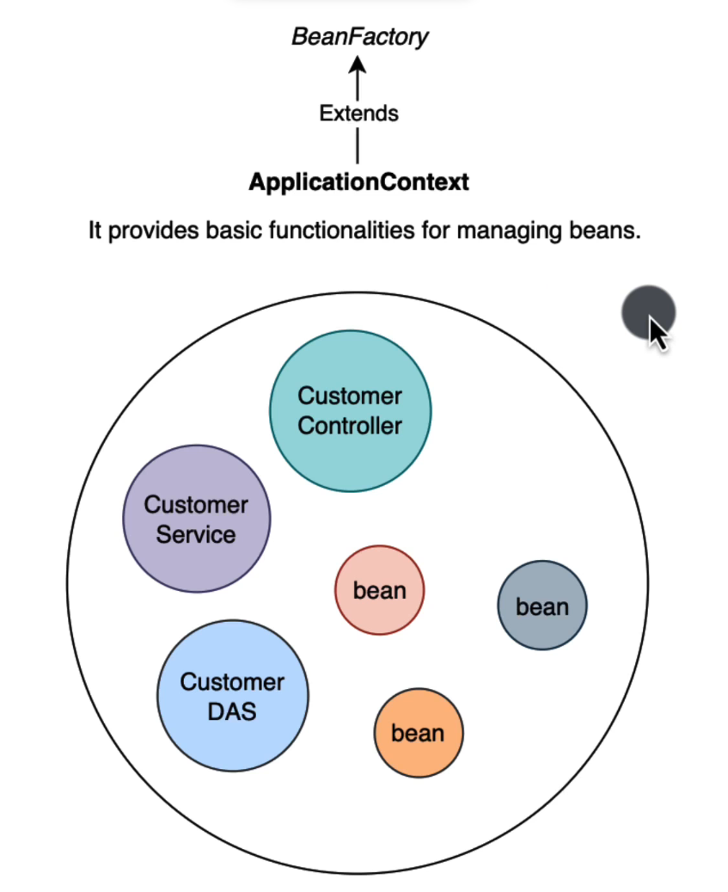

* `So, Application Context provides basic functionalities for managing Beans. That's all! So when we add those annotations stated above, Spring initializes those objects for us and then they get stored within the Application Context.`

* Now, if we want to use these beans( objects within the circle of above picture) within our application, we can just use `dependency injection` and we can use the beans.

* Now If we have a CustomerController class and CustomerController says, "hey I need an instance of CustomerService" and then Spring says, "okay, cool, within the Application Context, I've got CustomerService, let me give it to you." [[CustomerService is available inside Application Context because we used @Service annotation in CustomerService class]]

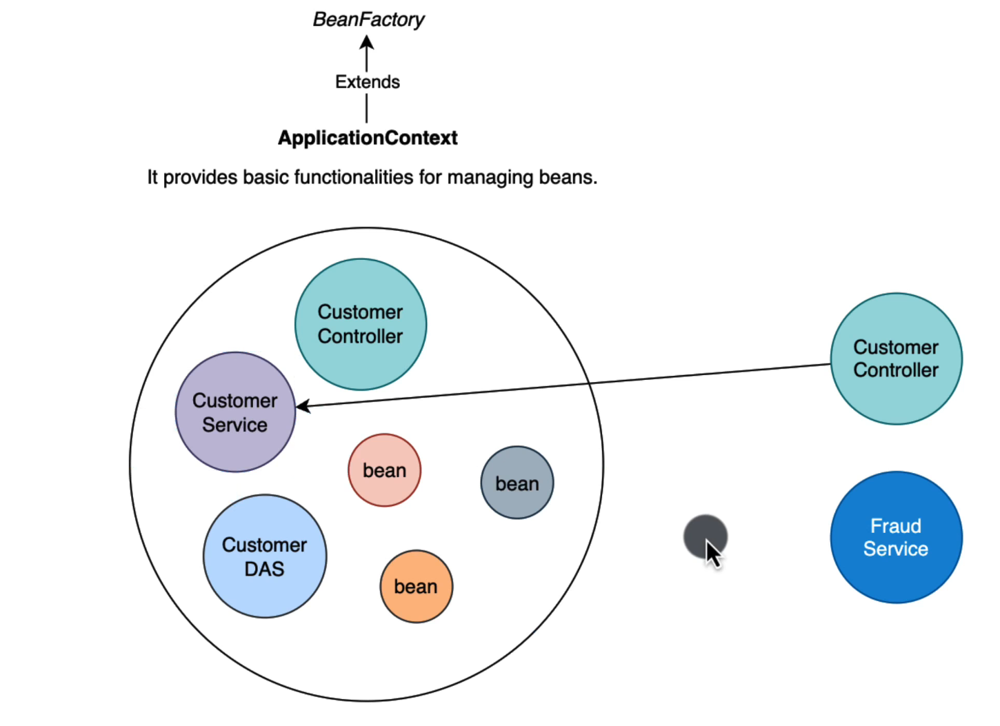

* Similarly, If we had another class called FraudService that needs an instance of CustomerService, it doesn't need to create the instance of CustomerService again because it's managed for us - it can get it from within the Application Context. `So this is what's happening within the constructor`.

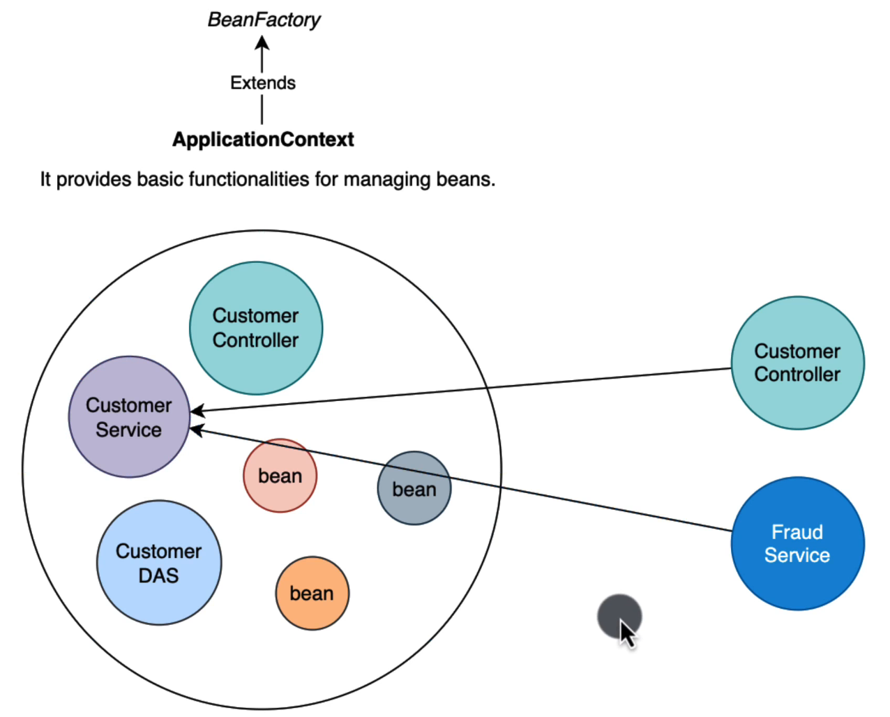

* So, abive operation is happening within the constructor. In the below constructor, the parameter `CustomerService customerService` comes from the `ApplicationContext`, which is injected for us automatically and then it gets assigned to instance field `private final CustomerService customerService`.

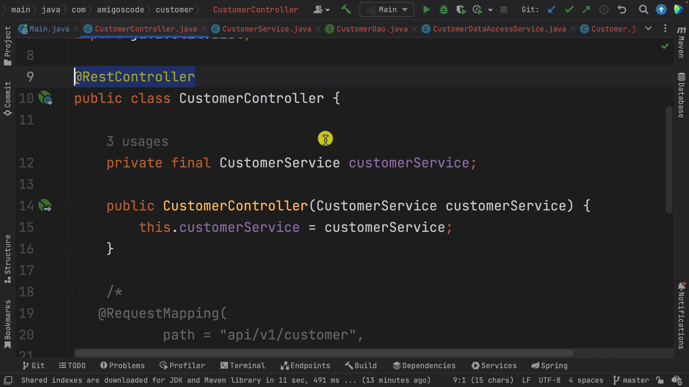

* Before in old versions of Spring, we had to say `@Autowired` above the constructor. and adding `@Autowired` above the constructor meant: please go and find `CustomerService customerService` bean for us and inject it. So meaning, take the customerService bean from the ApplicationContext and assign it to customerService instance field when we said `this.customerService = customerService` inside the constructor.

# IOC (Inversion of Control)

* BeanFactory is an interface and it *<u>represents</u>* the Spring Inversion of Control (IoC), which is implemented by dependency injection. So, dependency injection is a way for achieving Inversion of Control.

* interface ApplicationContext extends BeanFactory

# Viewing beans

* inside Main class write, we can print beans with `ConfigurableApplicationContext`

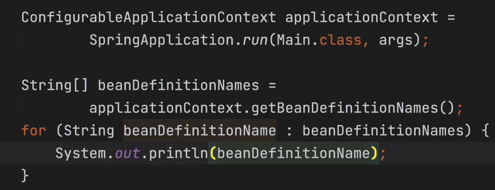

* there's another way to view the beans using Spring Actuator.

# Bean Scopes

* Bean Scopes is the `Visibility` and `LifeCycle` of the bean throughout the application lifecycle.

* Singleton Scope is default.

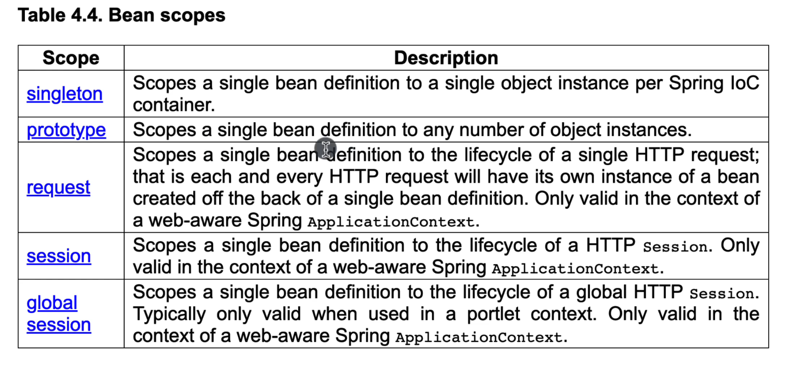

- you can change the scope of your bean with `@Scope(value = ConfigurableBeanFactory.SCOPE_SINGLETON`.

# Bean

* Bean is an object that the Spring container instantiates, assembles and manages the entire lifecycle for us.

* Now, if we want to use the beans within our application, we can just use `dependency injection` and we can use the beans.

* So, we create beans by using these annotations @RestController, @Service, @Repository etc.

* There are times when we need to create our own beans instead of using above annotations:

* At this point, below foo object is outside of our ApplicationContext and is not managed for us, so foo is not currently a bean. 

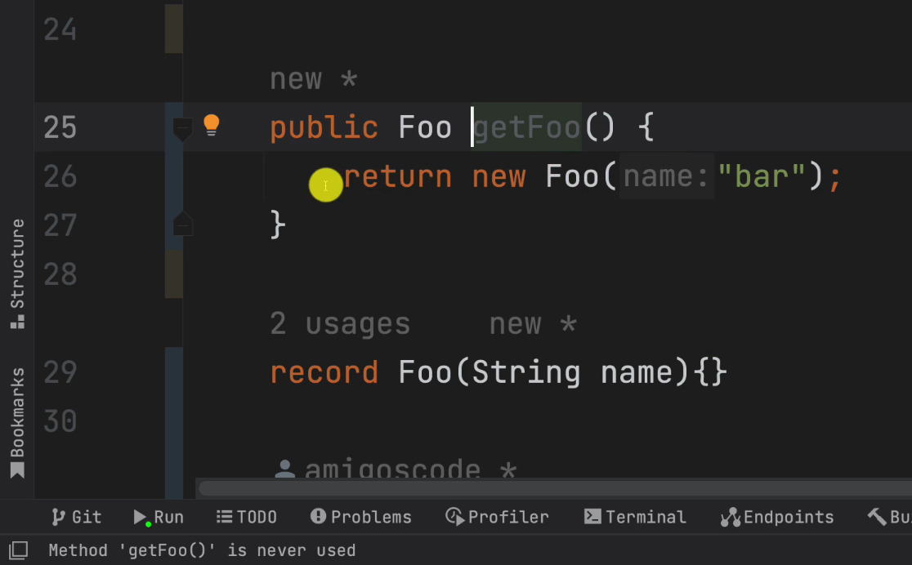

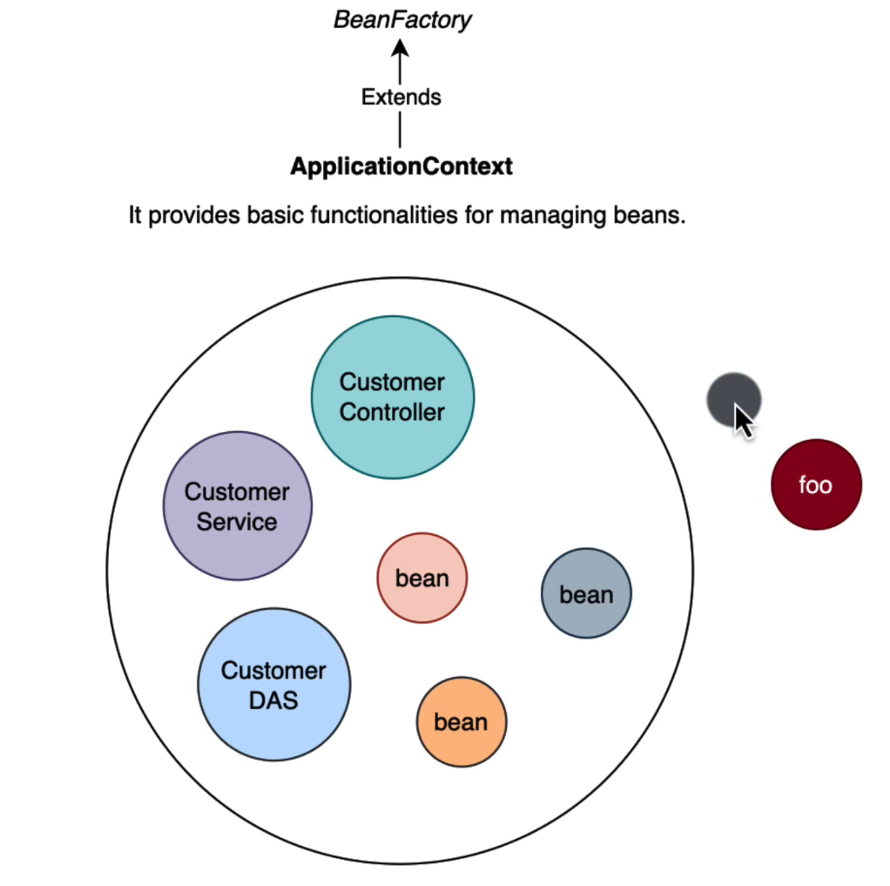

* So, if we want it to be managed by Spring, we need `@Bean` annotation.

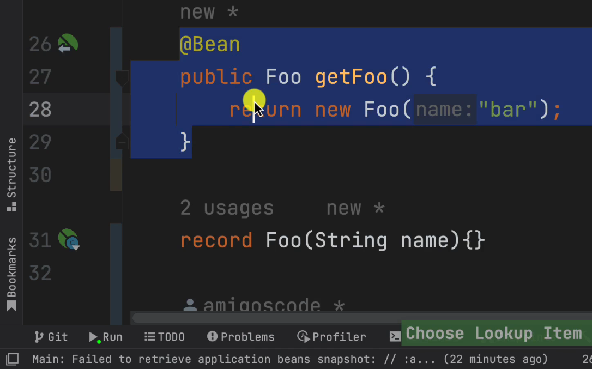

- So now this becomes a bean, which means, instead of being managed by us, it's put inside the ApplicationContext. Now foo is managed by Spring.

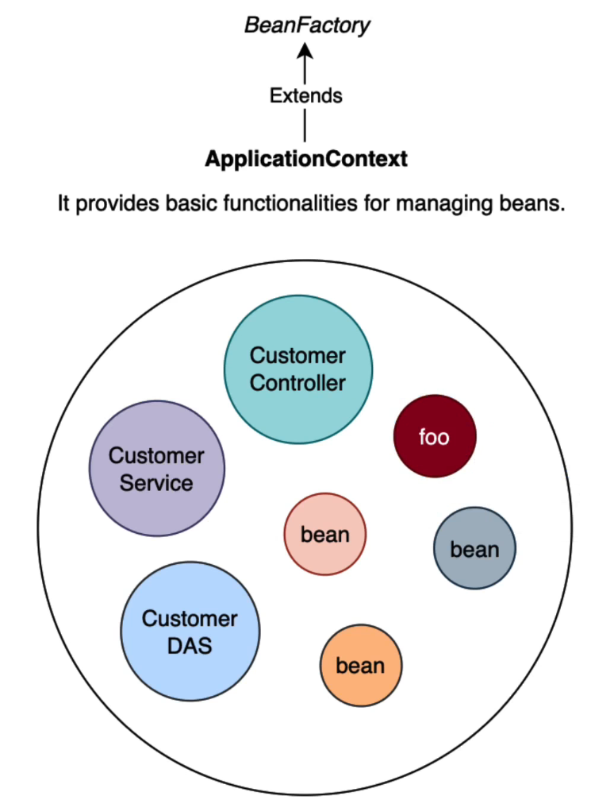

- **<u>Now lets use this bean that we created:</u>**

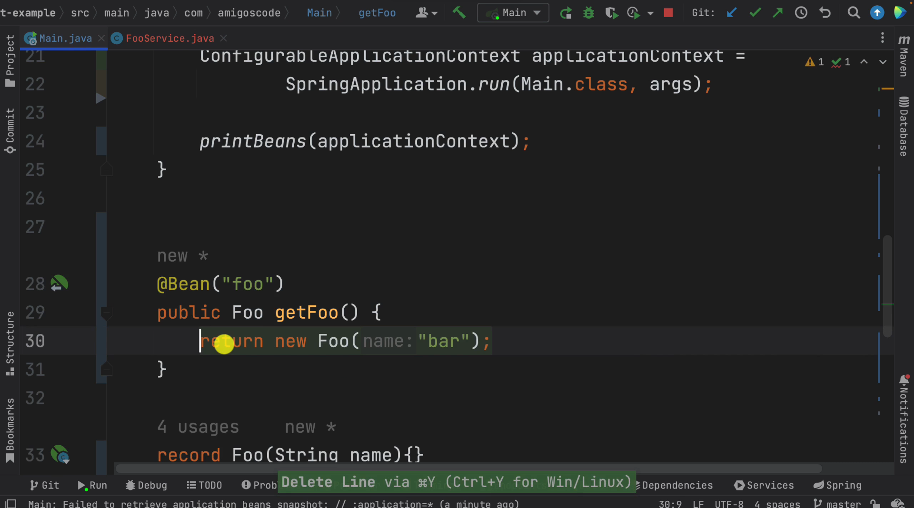


Question: Do you need to add @Service for FooService? this means this will create the FooService class bean but we need bean for foo which we got by declaring @Bean above Foo class object.

# Spring data JPA

* Java/jakarta persistance API

* JPA allows us to map java classes to database tables and we can use Entity classes to directly interact with database tables without needing us to write specific SQL queries to create tables.
