# Class is the blueprint for objects. but what is an object?

An object is the instance of a class. When a class is defined, no memory is allocated but when it is instantiated (i.e., an object is created) memory is allocated.

An object includes both data (the attributes or properties of the object) and methods (the functions that handle the object’s data). It serves two main purposes:

1. **Data Abstraction**: An object provides a simple way to structure and package related data. For example, a `Student` object might contain data about a student such as `name`, `id`, and `grades`.

2. **Encapsulation**: Objects encapsulate both data and the methods that operate on that data, protecting the internal state of the object and providing a clear interface for interacting with the object.

[Utilizing Java Arrays](https://chat.openai.com/share/2ac999dc-1484-4aef-8e2c-f67f8bf0b09b)

how do I utilize these two types of array? int[] a and Cat[] cats and what is their difference with `int arr = new int[5]`

```java
 int[] a;
 int arr[] = new int[5]; //C style array
 int[] arr = new int[5]; //java default style array
 Cat[] cats;

 ---------

 int[] nums = {5,6};
//or, int nums[] = {5,6}; //again, this is C style
 System.out.println(Arrays.toString(nums));
```

> ChatGPT

In your Java code, you've declared three different types of arrays: `int[] a`, `Cat[] cats`, and `int[] arr`. Let me explain each of them:

1. **int[] a:**
   
   - This declares an array of integers named `a`. However, you haven't initialized it yet, so it's currently just a reference to an array of integers.
   
   - To use it, you need to initialize it by assigning a new array to it. For example:
     
     javaCopy code
     
     `int[] a = new int[3]; // Creates an integer array of size 3 a[0] = 1; a[1] = 2; a[2] = 3;`
   
   - Now, you can access and modify elements in the array using indices (e.g., `a[0]`, `a[1]`, etc.).

2. **Cat[] cats:**
   
   - This declares an array of `Cat` objects named `cats`. Similar to the `int` array, you need to initialize it before using it.
   
   - Assuming you have a `Cat` class with a constructor that takes name and color parameters, you can initialize the array like this:
     
     javaCopy code
     
     `Cat[] cats = new Cat[2]; // Creates an array of Cat objects with a size of 2 cats[0] = new Cat("Jupyter", "White"); cats[1] = new Cat("Mittens", "Black");`
   
   - Now, `cats` is an array containing two `Cat` objects.

3. **int arr[] = new int[5]:**
   
   - This declares and initializes an array of integers named `arr` with a size of 5. It's equivalent to `int[] arr = new int[5];`.
   - You can access and modify elements in this array using indices just like with the `int[] a` array.

In summary, the main difference between `int arr[] = new int[5]` and the other two declarations (`int[] a` and `Cat[] cats`) is that the former initializes the array at the time of declaration, while the latter two need separate initialization statements to assign a new array to them. Additionally, `int[] a` is an array of integers, and `Cat[] cats` is an array of objects of type `Cat`.

> You

Also, what is the difference with above 3 different array types with `int[] a2 = {5,6};`

> ChatGPT

The declaration `int[] a2 = {5, 6};` is a shorthand syntax for creating and initializing an integer array in a single line. Let's compare it with the previous three array types:

1. **int[] a:**
   
   javaCopy code
   
   `int[] a;`
   
   - This declares an array of integers but doesn't initialize it. You need a separate statement to create a new array and assign it to `a`.

2. **int arr[] = new int[5]:**
   
   javaCopy code
   
   `int arr[] = new int[5];`
   
   - This declares and initializes an array of integers named `arr` with a size of 5 in a single line.

3. **int[] a2 = {5, 6};:**
   
   javaCopy code
   
   `int[] a2 = {5, 6};`
   
   - This declares and initializes an array of integers named `a2` with elements 5 and 6. It's a more concise way of creating and initializing an array.

The main difference lies in the initialization syntax. The third option, `int[] a2 = {5, 6};`, is a convenient way to create a small array with specific values directly. It's equivalent to the following more verbose code:

javaCopy code

`int[] a2 = new int[2]; a2[0] = 5; a2[1] = 6;`

So, in summary, the main difference is the shorthand initialization syntax for arrays with specific values in the case of `int[] a2 = {5, 6};`, making the code more concise and readable when you know the values at the time of declaration.

---------------------------------------------------------------------

# `null` is a special keyword representing the **absence of a reference to an object.** It's not an object itself, nor a type.

# Diff between C++ and Java:

Sure, let’s compare C++ and Java, two powerful programming languages:

**Programming Paradigm**:

1. - [**C++**: It supports both structured and object-oriented programming](https://www.javatpoint.com/features-of-java)[1](https://www.javatpoint.com/features-of-java).
   - [**Java**: It is a purely object-oriented programming language](https://www.javatpoint.com/features-of-java)[1](https://www.javatpoint.com/features-of-java).

**Inheritance**:

2. - [**C++**: It supports both single and multiple inheritance](https://www.javatpoint.com/features-of-java)[1](https://www.javatpoint.com/features-of-java).
   - [**Java**: It only supports single inheritance](https://www.javatpoint.com/features-of-java)[1](https://www.javatpoint.com/features-of-java).

3. **Pointers**:
   
   - [**C++**: It supports explicit pointers](https://www.javatpoint.com/features-of-java)[1](https://www.javatpoint.com/features-of-java).
   - **Java**: It does not support explicit pointers. [This feature is removed to prevent unauthorized access to memory](https://www.javatpoint.com/features-of-java)[1](https://www.javatpoint.com/features-of-java).

4. **Memory Management**:
   
   - **C++**: Developers have direct control over memory management. [This means they are responsible for allocating and deallocating memory](https://www.javatpoint.com/features-of-java)[1](https://www.javatpoint.com/features-of-java).
   - [**Java**: It handles memory management automatically using garbage collection](https://www.javatpoint.com/features-of-java)[1](https://www.javatpoint.com/features-of-java).

5. **Platform Dependency**:
   
   - [**C++**: It is platform-dependent](https://www.javatpoint.com/features-of-java)[1](https://www.javatpoint.com/features-of-java).
   - [**Java**: It is platform-independent, which means Java follows the WORA rule (Write Once, Run Anywhere)](https://www.javatpoint.com/features-of-java)[1](https://www.javatpoint.com/features-of-java).

**Use Cases**:

6. - [**C++**: It is commonly used for system programming, game development, and embedded systems](https://www.javatpoint.com/features-of-java)[1](https://www.javatpoint.com/features-of-java).
   - [**Java**: It is widely used for web applications, enterprise applications, mobile applications, server-side technology, and big data analytics](https://www.interviewbit.com/blog/features-of-java/)[2](https://www.interviewbit.com/blog/features-of-java/).

Both languages have their strengths and are better suited to different types of tasks. The choice between C++ and Java depends on the specific requirements of the project.

# why pointer is not used in Java? give me code examples with in depth detail explanation.

Java deliberately chose not to include pointers, and there are several key reasons for this:

**1. Security:**

- Pointers allow direct access to memory addresses, which can be dangerous and lead to security vulnerabilities. By not having pointers, Java makes it harder for malicious code to exploit memory access and manipulate data.
- Imagine a pointer pointing to a private variable. By manipulating the pointer, unauthorized access and modification of the variable becomes possible, bypassing access controls.

**2. Simplicity and Readability:**

- Pointers can be complex to understand and use, especially for beginners. Java aims to be a relatively simple and readable language, and removing pointers helps achieve that goal.
- Code using pointers can be more challenging to debug and maintain.

**3. Automatic Garbage Collection:**

- With pointers, memory management becomes the programmer's responsibility, leading to potential memory leaks and dangling pointers. Java uses automatic garbage collection (GC), which automatically frees memory that is no longer needed, simplifying memory management and reducing errors.

**Code Examples:**

**Example 1: Accessing data through references vs. pointers (C vs. Java):**

C++

```cpp
int* ptr = &x; // pointer to memory address of x
*ptr = 10; // change value at memory address pointed to by ptr

int y = 5;
ptr = &y; // now ptr points to y's memory address
*ptr = 20; // change value of y
```

Java

```java
int x = 5;
// Java doesn't allow direct pointer manipulations

int y = 10;
// Java references automatically update objects when assigned
x = y; // x now refers to the same object as y (value becomes 10)
```

**Example 2: Memory Leak (C vs. Java):**

C++

```cpp
int* ptr = malloc(100); // allocate memory (not automatically freed)
*ptr = 42;

// forget to free memory pointed to by ptr
// memory leak occurs

free(ptr); // proper memory deallocation
```

Java

```java
int[] arr = new int[100]; // allocate memory (automatically freed)
arr[0] = 42;

// no need to manually free memory

// Java GC automatically reclaims unused objects and arrays
```

These examples showcase how pointers can lead to complex memory management and potential issues, while Java simplifies things by using references and automatic garbage collection.

**Additional Notes:**

- While Java doesn't have explicit pointers, it internally uses them for some tasks like accessing native code.
- Other languages like C# offer similar benefits to Java without completely excluding pointers, providing more flexibility for experienced programmers.

I hope this comprehensive explanation clarifies why pointers are not used in Java and the benefits of this design choice.

# Wrapper class vs primitives

Great question! In Java, `int` and `Integer` are used in different scenarios due to their nature. Here’s a comparison:

1. **`int`**:
   
   - `int` is a **primitive data type** in Java.
   - It is used to store integer values (whole numbers without a decimal point).
   - It has a default value of 0.
   - It does not have methods associated with it because it’s not an object.

2. **`Integer`**:
   
   - `Integer` is a **wrapper class** for the `int` primitive data type.
   - It is used when you need an object representation of an `int`.
   - It can hold `null` value, which is not possible with `int`.
   - It has several useful methods for operations such as converting to string, comparing two numbers, etc.

Here’s why you might use `Integer` instead of `int`:

- **Nullability**: If you need to represent a variable that can be `null`, you would use `Integer`. An `int` cannot be `null`.
- **Collections**: Java’s collection classes, like `ArrayList` and `HashMap`, cannot hold primitive types. They can only hold objects. So if you want to store `int` values in these collections, you would need to use `Integer`.
- **Generics**: Java’s generic types do not work with primitive types. If you’re writing generic code, you would need to use `Integer`.

So, while `int` and `Integer` can both be used to hold integer values, they have different uses and are not always interchangeable. The choice between `int` and `Integer` depends on what you need for your specific situation.

# is Integer in java immutable like String in java? Are all the wrapper class in Java immutable?

[Yes, all wrapper classes in Java are immutable](https://prutor.ai/primitive-wrapper-classes-are-immutable-in-java/)[1](https://prutor.ai/primitive-wrapper-classes-are-immutable-in-java/). [This includes `Integer`, `Byte`, `Long`, `Float`, `Double`, `Character`, `Boolean`, and `Short`](https://prutor.ai/primitive-wrapper-classes-are-immutable-in-java/)[1](https://prutor.ai/primitive-wrapper-classes-are-immutable-in-java/). [Once an object of these classes is created, its state cannot be changed](https://prutor.ai/primitive-wrapper-classes-are-immutable-in-java/)[2](https://stackoverflow.com/questions/4117793/are-java-wrapper-classes-really-immutable)[1](https://prutor.ai/primitive-wrapper-classes-are-immutable-in-java/).

For example, consider the following code:

```java
Integer a = 5;  // An Integer object is created with the value 5.
a = a + 10;     // A new Integer object is created with the value 15. The original object remains unmodified.
```

In this example, when we do `a = a + 10`, we’re not changing the original `Integer` object that `a` was referencing. [Instead, we’re creating a new `Integer` object with the value `15` and updating `a` to reference this new object](https://prutor.ai/primitive-wrapper-classes-are-immutable-in-java/)[3](https://stackoverflow.com/questions/12370544/why-are-java-wrapper-classes-immutable)[2](https://stackoverflow.com/questions/4117793/are-java-wrapper-classes-really-immutable).

The immutability of wrapper classes in Java is a design decision that provides several benefits, such as:

- [**Thread Safety**: Immutable objects are inherently thread-safe as they cannot change state after construction](https://prutor.ai/primitive-wrapper-classes-are-immutable-in-java/)[3](https://stackoverflow.com/questions/12370544/why-are-java-wrapper-classes-immutable).
- [**Hashing**: Immutable objects are good Map keys and Set elements, as their hashcode doesn’t change once created](https://prutor.ai/primitive-wrapper-classes-are-immutable-in-java/)[3](https://stackoverflow.com/questions/12370544/why-are-java-wrapper-classes-immutable).
- [**Security**: Immutable objects are inherently protected from modification by malicious code or accidents](https://stackoverflow.com/questions/12370544/why-are-java-wrapper-classes-immutable)[3](https://stackoverflow.com/questions/12370544/why-are-java-wrapper-classes-immutable).

# Autoboxing and Unboxing

Autoboxing is a feature in Java that allows automatic conversion of primitive data types into their corresponding wrapper class objects, and vice versa. This feature was introduced to simplify the process of working with primitive types and their corresponding wrapper classes, making the code more concise and readable.

Here's how autoboxing works:

1. **Primitive to Wrapper Conversion**: When you assign a primitive value to a reference variable of its corresponding wrapper class, autoboxing automatically converts the primitive value into an object of the wrapper class.

2. **Wrapper to Primitive Conversion**: Similarly, when you assign an object of a wrapper class to a variable of its corresponding primitive type, autoboxing automatically extracts the primitive value from the wrapper object.

Autoboxing is particularly useful in scenarios where you need to work with collections that only accept objects, such as `ArrayList` or `HashMap`, but you want to use primitive types.

Here's an example to illustrate autoboxing:

```java
public class AutoboxingExample {
    public static void main(String[] args) {
        //No autoboxing
        Integer var = new Integer(20); // A new Integer object is created with the value 20.
        var = new Integer(30); // A new Integer object is created with the value 30.
        //this is depricated though: Integer(int)

        // Autoboxing: primitive to wrapper conversion
        Integer numWrapper = 10; // Autoboxing: int to Integer
        Double doubleWrapper = 3.14; // Autoboxing: double to Double
        Boolean boolWrapper = true; // Autoboxing: boolean to Boolean

        // Unboxing: wrapper to primitive conversion
        int numPrimitive = numWrapper; // Unboxing: Integer to int
        double doublePrimitive = doubleWrapper; // Unboxing: Double to double
        boolean boolPrimitive = boolWrapper; // Unboxing: Boolean to boolean

        System.out.println("numWrapper: " + numWrapper);
        System.out.println("doubleWrapper: " + doubleWrapper);
        System.out.println("boolWrapper: " + boolWrapper);

        System.out.println("numPrimitive: " + numPrimitive);
        System.out.println("doublePrimitive: " + doublePrimitive);
        System.out.println("boolPrimitive: " + boolPrimitive);
    }
}
```

In this example:

- Autoboxing occurs when primitive values (`int`, `double`, `boolean`) are assigned directly to wrapper class variables (`Integer`, `Double`, `Boolean`).
- Unboxing occurs when wrapper class objects are assigned directly to primitive variables.
- Autoboxing and unboxing simplify the code by automatically converting between primitive types and their corresponding wrapper classes as needed.

# How Hashmap works under the hood

# Stack memory Vs Heap memory

A strong answer to the interviewer's question about stack vs heap memory in Java should cover several key points:

**1. Explain the different purposes:**

- **Stack:**
  
  - Stores method call information (local variables, parameters, return address)
  - Faster access due to LIFO (Last-In-First-Out) ordering
  - Limited size and short-lived memory (automatically deallocated when method exits)

- **Heap:**
  
  - Stores objects and their data
  - Dynamically allocated and deallocated by the garbage collector
  - Larger size but slower access than stack

**2. Highlight key differences:**

- **Memory management:** Stack is automatic (LIFO), heap requires garbage collection.
- **Accessibility:** Stack is thread-specific, heap is globally accessible.
- **Data types:** Stack stores primitives and references, heap stores objects.
- **Size:** Stack is smaller and fixed, heap is larger and dynamic.
- **Performance:** Stack is faster for simple data, heap is slower but suitable for larger objects.

**3. Provide real-world examples:**

- Use common Java scenarios to illustrate when each memory type is used.
- For example, explain how local variables in a method reside on the stack, while objects created within the method live on the heap.

**4. Go beyond the basics:**

- Briefly mention advanced topics like generational garbage collection in the heap.
- Show awareness of potential issues like stack overflow and memory leaks.

**5. Tailor your answer to the interviewer:**

- Consider the interviewer's background and the specific role you're applying for.
- If possible, connect your explanation to the requirements of the position.

**Bonus:**

- If time allows, share your understanding of potential trade-offs when choosing between stack and heap for specific situations.

**Remember:**

- Be confident and concise in your explanation.
- Use clear and technical terms accurately.
- Show enthusiasm and willingness to learn more.

By following these tips, you can deliver a comprehensive and impressive answer to the "stack vs heap memory in Java" question, showcasing your understanding of Java memory management concepts.

# Literal = Constant

- Constant values that appear directly in a program.

- for example:

```java
String s = "Hello";
System.our.println("How are you?");
```

in above example, `Hello` is a String literal as well as `How are you?` is also a String literal.

similaryl, there are character literals, Double, Integer etc. literals

# Garbage Collection

- **Define Garbage Collection:** Explain that it's an automatic process in Java that identifies and reclaims unused memory occupied by objects. This eliminates the need for manual memory management like in C/C++.
- **Describe its Working:** Highlight the key steps:
  - Objects are created on the heap, a dedicated memory region.
  - The Garbage Collector (GC) tracks object references and determines reachability (objects still used by the program).
  - Unreachable objects are marked for deletion.
  - GC reclaims their memory, making it available for new objects.

# Exception Handling

# Shallow Copy VS Deep Copy

1. Shallow Copy:

```java
ArrayList<String> originalList = new ArrayList<String>();
originalList.add("element 1");
originalList.add("element 2");

ArrayList<String> shallowCopy = originalList;
// ---- or ----
Vehicle vehicle1 = new Vehicle();
Vehicle vehicle2 = vehicle1; //Shallow copy
```

2. Deep Copy:

```java
ArrayList<String> originalList = new ArrayList<String>();
originalList.add("element 1");
originalList.add("element 2");

ArrayList<String> deepCopy = new ArrayList<String>(originalList);
```

# did not think it was recursion!!

```java
package com.nayemtech;

public class Car extends Vehicle{
    public String brand;

    public Car(String vehicleType, String brand) {
        super(vehicleType);
        this.brand = brand;
    }

    public Car() {
    }

    @Override
    public void RealVehicle() {
        //super.RealVehicle();
        System.out.println("ok from Car");
        System.out.println("ok from Car");
        RealVehicle();
    }
}
```

# Strongly Typed Language - Java

Java is considered a strongly typed language. [This means that every variable must be declared with a data type](https://www.thoughtco.com/strongly-typed-2034295)[1](https://www.thoughtco.com/strongly-typed-2034295). [Once a variable is declared, its data type cannot change](https://www.thoughtco.com/strongly-typed-2034295)[1](https://www.thoughtco.com/strongly-typed-2034295). This is important for a few reasons:

1. **Type Safety**: Strong typing prevents type errors. [For example, you can’t assign a string to an integer variable](https://stackoverflow.com/questions/66756725/java-being-strongly-typed)[2](https://stackoverflow.com/questions/66756725/java-being-strongly-typed). [This helps catch errors at compile time rather than at runtime](https://stackoverflow.com/questions/2690544/what-is-the-difference-between-a-strongly-typed-language-and-a-statically-typed)[3](https://stackoverflow.com/questions/2690544/what-is-the-difference-between-a-strongly-typed-language-and-a-statically-typed).

2. [**Predictability**: Because each variable has a specific type, you can predict how it will behave in different situations](https://coderanch.com/t/522430/java/Strongly-typed-Weakly-typed-languages)[4](https://coderanch.com/t/522430/java/Strongly-typed-Weakly-typed-languages).

3. [**Readability and Maintainability**: When reading code, knowing the type of each variable can make the code easier to understand](https://coderanch.com/t/522430/java/Strongly-typed-Weakly-typed-languages)[4](https://coderanch.com/t/522430/java/Strongly-typed-Weakly-typed-languages).

Here’s an example of strong typing in Java:

```java
int x = 10; // This is valid
x = "Hello"; // This will cause a compile-time error
```

In the above example, `x` is declared as an `int`. [Trying to assign a `String` to `x` will result in a compile-time error, demonstrating Java’s strong typing](https://stackoverflow.com/questions/66756725/java-being-strongly-typed)[2](https://stackoverflow.com/questions/66756725/java-being-strongly-typed).

[It’s important to note that while Java is strongly typed, it does allow for certain type conversions, but they must be done explicitly](https://stackoverflow.com/questions/66756725/java-being-strongly-typed)[2](https://stackoverflow.com/questions/66756725/java-being-strongly-typed). [For example, you can convert an `int` to a `long`, but you have to do it explicitly like this: `long y = (long) x;`](https://stackoverflow.com/questions/66756725/java-being-strongly-typed)[2](https://stackoverflow.com/questions/66756725/java-being-strongly-typed).

# Generics. What is it and why we need it.

# Difference between .equals() and == in java

- .equals() is a method where == is a comparison operator.

- == is used for reference comparison. It checks if two objects have the same address. where the .equals() method is for comparing the contents inside that memory address.

- so, we know strings are immutable in java thats why using == wont work

### something to note:

```java
If both String and Integer are immutable then why these two different behaviour?


//String behaviour: prints that s and t are different
public static void main(String[] args) {

    String s = "ok";
    String t = "o";
    t += "k";

    if (s == t) {
      System.out.println("same");
    } else {
      System.out.println("different");
      System.out.println(s + t);
    }
  }


//Integer behaviour: prints that s and t are same
public static void main(String[] args) {

    Integer s = 100;
    Integer t = 10;

    t *= 10;

    if (s == t) {
      System.out.println("same");
    } else {
      System.out.println("different");
      System.out.println(s + t);
    }
  }


//Wow! not it prints different!!!!!!
```

- Here's the reason for above 3 behaviour:

The difference in behavior you’re seeing is due to how Java handles `String` and `Integer` objects, and the difference between using `==` and `.equals()` for comparison.

In the `String` example, when you do `t += "k";`, a new `String` object is created because `String` is immutable. So `s` and `t` are not the same object, they are two different objects that contain the same sequence of characters. When you use `==` to compare `s` and `t`, it checks whether they refer to the exact same object, not whether they have the same value. Since `s` and `t` are different objects, `s == t` is `false`, and “different” is printed.

In the `Integer` example, `Integer` objects are also immutable, so when you do `t *= 10;`, a new `Integer` object is created. However, Java does some behind-the-scenes optimizations for small `Integer` values. All `Integer` objects with values between -128 and 127 are cached and reused by Java for efficiency. So when `t` is set to `100`, it actually refers to the same `Integer` object as `s`. That’s why `s == t` is `true`, and “same” is printed.

If you want to compare the values of `String` or `Integer` objects, you should use the `.equals()` method, which checks whether the objects have the same value, not whether they are the same object. For example, `s.equals(t)` would be `true` in the `String` example, because `s` and `t` have the same value, even though they are different objects.

Here’s how you can modify the `String` example to use `.equals()`:

```java
public static void main(String[] args) {
    String s = "ok";
    String t = "o";
    t += "k";

    if (s.equals(t)) {
        System.out.println("same");
    } else {
        System.out.println("different");
    }
}
```

This will print “same”, because `s` and `t` have the same value.

# Java is Pass by Value, not pass by reference

- When you work with primitives, you don't worry because it always makes copy. However, confusion arises when you work with object or reference types.

- This figure shows you don't need to worry about primitives:


- The below figure shows, it works like pass by reference for arrays as well as List:


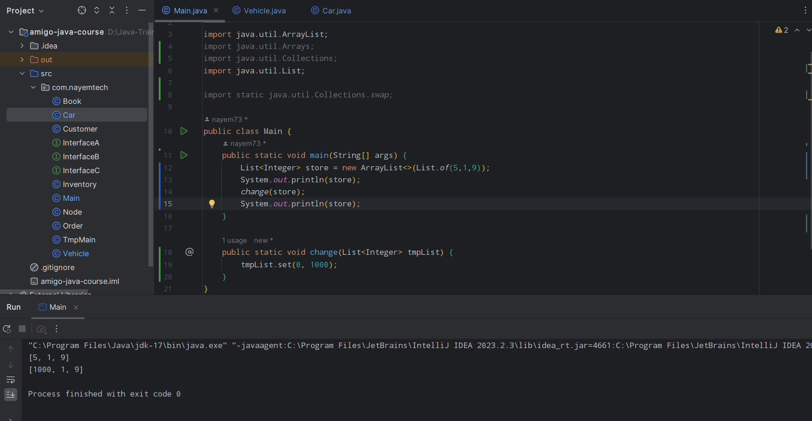

# java.util.collections

Sure, the `java.util.Collections` class provides several utility methods for Collection classes. Here are a few examples:

1. **Sorting**: You can use `Collections.sort(list)` to sort a list in ascending order. If you want to sort in descending order, you can use `Collections.sort(list, Collections.reverseOrder())`.

```java
List<Integer> numbers = new ArrayList<>(List.of(5,3,1));
Collections.sort(numbers);
System.out.println(numbers);  // prints [1, 3, 5]
Collections.sort(numbers, Collections.reverseOrder());
System.out.println(numbers);  // prints [5, 3, 1]
```

2. **Searching**: `Collections.binarySearch(list, key)` can be used to search for a key in a sorted list. It returns the index of the key if it exists in the list, otherwise it returns `-(insertion point - 1)`.

```java
List<Integer> numbers = new ArrayList<>(List.of(1,3,5));
int index = Collections.binarySearch(numbers, 3);
System.out.println(index);  // prints 1
```

3. **Finding Min and Max**: `Collections.min(collection)` and `Collections.max(collection)` return the minimum and maximum element of a collection respectively.

```java
List<Integer> numbers = new ArrayList<>(List.of(5,3,1));
int min = Collections.min(numbers);
int max = Collections.max(numbers);
System.out.println(min);  // prints 1
System.out.println(max);  // prints 5
```

4. **Shuffling**: `Collections.shuffle(list)` randomly permutes the elements in a list.

```java
List<Integer> numbers = new ArrayList<>(List.of(5,3,1));
Collections.shuffle(numbers);
System.out.println(numbers);  // prints the list in random order
```

5. **Filling**: `Collections.fill(list, obj)` replaces all of the elements of a list with the specified object.

```java
List<Integer> numbers = new ArrayList<>(List.of(5,3,1));
Collections.fill(numbers, 0);
System.out.println(numbers);  // prints [0, 0, 0]
```

These are just a few examples. The `Collections` class provides many more utility methods that you might find useful. Remember to import the `java.util.Collections` class at the beginning of your code to use these methods. Also, some of these methods, like `binarySearch`, work properly only on certain types of lists (like ArrayList), and may throw an exception on others (like LinkedList). So, always check the Java documentation for the method you’re using to understand its behavior.

# Singleton class

- It is a class where only one instance of that class can ever exist! This is typically done by:
  
  - 1. creating a private and static instance of the Singleton class itself.
    
    2. Ensuring all the constructors are private so that we can't create any instance of this Singleton class a second time.
    
    3. Creating a static method that returns a reference to the instance.

```java
package com.nayemtech;

public class Singleton {
    private static Singleton singleton = new Singleton();

    private Singleton() {

    }

    public static Singleton getSingleton() {
        return singleton;
    }
} 

package com.nayemtech;

public class Main {
    public static void main(String[] args) {
        Singleton singleton;
        Singleton singleton1;

        singleton = Singleton.getSingleton();
        singleton1 = Singleton.getSingleton();

        System.out.println(singleton); //both are same
        System.out.println(singleton1); //both are same
    }
}
```

### Should we

# static vs non static call rules

- static methods or fields belong to the class itself, hence, an instance of a class should be able to access anything that belongs to the class

- you can not access an instance field or method from a static method.

# <mark>Can you override static methods?</mark> (static methods are static binding[compile time polymorphism/early binding] while instace methods are dynamic binding[Run time polymorphism/Late binding] - hence static methods can't be overriden. Because we know override happens during runtime)

<mark>No, you cannot override static methods in Java.</mark> Here's a breakdown of why and the concepts involved:

**Method Overriding**

Method overriding is a fundamental concept in object-oriented programming that allows subclasses to redefine inherited methods from parent classes. When you call an overridden method, the specific implementation used depends on the object's actual type at runtime (dynamic binding). This is a key aspect of polymorphism, enabling flexible behavior based on object inheritance.

**Static Methods vs. Instance Methods**

Java differentiates between static and instance methods:

- **Static methods:** Belong to the class itself, not a specific object instance. You call them using the class name, not an object reference (e.g., `Math.sqrt(4)`). They are resolved at compile time (static binding).

- **Instance methods:** Operate on a particular object instance. You call them using an object reference (e.g., `object.toString()`). Their resolution happens at runtime (dynamic binding).

**Why Static Methods Cannot Be Overridden**

Since static methods are bound at compile time, the method to be called is determined when the code is compiled, not when it runs. There's no concept of "overriding" at runtime because the specific method is already known beforehand.

In contrast, with instance methods, the object type determines the actual method to be called at runtime. This allows overriding to take effect based on inheritance.

**Consequences of Defining a Static Method in a Subclass**

If you define a method with the same signature (name and parameter list) as a static method in the parent class, it's not considered overriding. This creates a situation called method hiding.

- When you call the method using the subclass reference, the subclass's method will be executed.
- However, if you call it using the parent class reference, the parent class's static method will still be called (since the binding happens at compile time).

This can lead to unexpected behavior if not understood correctly.

**In-Depth Analysis**

Here's a deeper look at the concepts involved:

1. **Dynamic vs. Static Binding:** Overriding relies on dynamic binding, where the actual method to be called is determined at runtime based on the object's type. Static methods lack this flexibility because their binding happens at compile time.

2. **Inheritance and Polymorphism:** Overriding is a core concept of inheritance and polymorphism. Subclasses can provide specialized implementations of inherited methods, allowing for different behavior based on the object type. Static methods, by design, are not meant to be overridden as they belong to the class itself, not individual objects.

3. **Use Cases of Static Methods:** Static methods are typically used for utility functions that don't require object state or for constants. They are well-suited for scenarios where the functionality belongs to the class itself, not specific objects.

**Conclusion**

While you cannot override static methods in Java, understanding the concepts behind method overriding, static methods, and their binding mechanisms is crucial for writing clean and maintainable object-oriented code. If you need to provide specialized behavior based on object type, consider using instance methods and inheritance.

# static block

- static block gets executed at the time of class loading. So, it gets executed before the main method runs. so static block should be outside any method, constructor, or other block.

```java
package com.nayemtech;

public class Main {
    public static void main(String[] args) {
        System.out.println("from main method");
    }

    static {
        System.out.println("from static");
    }
}
```

- In the below code, "from instance block" will not be printed because:

```java
public class Main {
    public static void main(String[] args) {
        System.out.println("from main method");

    }

    {
        System.out.println("from instance block");
    }
}


//this code will print it though. ignore it now to understand above
public class Main {
    public static void main(String[] args) {
        System.out.println("from main method");
        {
            System.out.println("from instance block");
        }
    }
}
```

In your code, the block `{ System.out.println("from instance block"); }` is not a static block, but an instance initializer block. Instance initializer blocks are used to initialize instance variables and are executed each time the class is instantiated.

However, in your `Main` class, you never create an instance of the class. Therefore, the instance initializer block is never executed, and “from instance block” is never printed.

If you want “from instance block” to be printed each time an instance of the class is created, you should create an instance of the class in your `main` method:

```java
public class Main {
    {
        System.out.println("from instance block");
    }

    public static void main(String[] args) {
        System.out.println("from main method");
        new Main();
    }
}


//output:
from main method
from instance block
```

In this code, “from instance block” will be printed each time `new Main();` is executed because it creates a new instance of the `Main` class, which triggers the instance initializer block.

> in java, give me an example showcasing how instance initialiezer block is used.

Sure, in Java, instance initializer blocks are used to initialize instance variables. They are executed each time an instance of the class is created. The instance initializer block is defined inside the class and outside the method and is created when an instance of the class is created.

Here’s an example:

```java
class Test {
    int num;

    // instance initializer block
    {
        num = 10;
        System.out.println("Instance initializer block called");
    }

    Test() {
        System.out.println("Constructor called");
    }

    public static void main(String[] args) {
        Test t1 = new Test();
        Test t2 = new Test();
    }
}
```

In this example, the instance initializer block sets the value of `num` to 10. This block is called every time an instance of `Test` is created, before the constructor is called. So, when you run this program, you’ll see that “Instance initializer block called” is printed before “Constructor called” for each instance of the class.

The output will be:

```
Instance initializer block called
Constructor called
Instance initializer block called
Constructor called
```

This shows that the instance initializer block is called each time an instance of the class is created, before the constructor. It’s a way to centralize shared code that needs to be run during object creation, rather than duplicating the code in multiple constructors. It’s especially useful when a class has multiple constructors, as the instance initializer block contains code that must be executed regardless of which constructor is used to create the object. It helps to reduce redundancy. However, it’s generally recommended to use constructors to initialize instance variables, unless there’s a specific need to use an instance initializer block.

# Comparator and Comparable

# other lesser known features in Java:

- I did not know about this blocks. So tell me if there is anything uncommon like this in java that maybe i am unaware of?

Sure, here are some lesser-known features and concepts in Java that you might find interesting:

1. **Anonymous Classes:** These are classes that are declared and instantiated at the same time, usually when you need to use a class only once. They’re often used in GUI programming.
   
   ```java
   new Thread() {
      public void run() {
          System.out.println("Hello from the anonymous class!");
      }
   }.start();
   ```

2. **Lambda Expressions:** Introduced in Java 8, lambda expressions provide a clear and concise way to represent one method interface using an expression. They are commonly used with functional interfaces and streams.
   
   ```java
   List<String> list = Arrays.asList("A", "B", "C");
   list.forEach(element -> System.out.println(element));
   ```

3. **Method References:** Also introduced in Java 8, method references provide a way to refer to a method without executing it. They’re often used with functional interfaces and streams.
   
   ```java
   List<String> list = Arrays.asList("A", "B", "C");
   list.forEach(System.out::println);
   ```

4. **Try-With-Resources:** This feature, introduced in Java 7, allows you to declare resources to be used in a try block with the assurance that the resources will be closed when they are no longer needed.
   
   ```java
   try (BufferedReader br = new BufferedReader(new FileReader("file.txt"))) {
      // Use the BufferedReader
   } catch (IOException e) {
      // Handle the exception
   }
   ```

5. **Var Keyword:** Introduced in Java 10, the `var` keyword allows you to declare a local variable without specifying its type. The compiler will infer the type based on the value of the variable.
   
   ```java
   var list = new ArrayList<String>();  // The compiler infers that list is of type ArrayList<String>
   ```

6. **Default and Static Methods in Interfaces:** Since Java 8, interfaces can have default and static methods, allowing behavior to be added to interfaces without breaking existing implementations.
   
   ```java
   interface MyInterface {
      default void defaultMethod() {
          System.out.println("This is a default method");
      }
   
      static void staticMethod() {
          System.out.println("This is a static method");
      }
   }
   ```

7. **Optional Class:** Introduced in Java 8, the `Optional` class is a container object that may or may not contain a non-null value. It’s used to represent nullable return types and help prevent `NullPointerException`.
   
   ```java
   Optional<String> optional = Optional.ofNullable(getStringThatMayReturnNull());
   ```

These are just a few examples. Java is a rich language with many features, and it’s always evolving with new versions. I hope you find these examples helpful and interesting! 😊

- thanks fo giving me. can you give some more that are asked in interviews?

Absolutely, here are some more advanced Java concepts that are often brought up in interviews:

1. **Java Memory Model:** Understanding how Java manages memory can be crucial, especially when dealing with multi-threading and performance optimization. Key concepts include the stack and heap, garbage collection, and how Java handles memory leaks.

2. **Concurrency and Multi-threading:** Java provides built-in support for multi-threaded programming and synchronization, which is a common topic in interviews. Key concepts include the `Thread` class, the `Runnable` interface, synchronized blocks, and the `wait` and `notify` methods.

3. **Java Collections Framework:** The Collections Framework is a set of classes and interfaces that implement commonly reusable collection data structures. Understanding the differences between `List`, `Set`, `Map`, and knowing when to use each, is important.

4. **Generics:** Generics add stability to your code by allowing you to specify the exact type of your collections at compile time.

5. **Exception Handling:** Knowing how to handle exceptions is crucial for writing robust and fault-tolerant programs. Key concepts include checked vs unchecked exceptions, error handling strategies, and custom exceptions.

6. **Java I/O:** Java’s Input/Output (I/O) is based on streams, which can represent many different kinds of data sources and targets. Key concepts include byte streams, character streams, buffered streams, standard I/O, file I/O, and object serialization.

7. **Java 8 Features:** Java 8 introduced many new features like lambda expressions, method references, functional interfaces, Stream API, and more. These are now commonly used and often asked about in interviews.

8. **JVM Internals:** Understanding the internals of Java Virtual Machine (JVM) can be important, especially for performance tuning and debugging. Key concepts include the class loader subsystem, runtime data areas, execution engine, and garbage collector.

9. **Design Patterns:** Design patterns represent the best practices used by experienced object-oriented software developers. They are solutions to general problems that software developers faced during software development.

10. **JDBC, JPA, Hibernate:** These technologies are used for interacting with databases. Understanding them is crucial for back-end development roles.

Remember, the depth of your knowledge in each of these areas can depend on the specific role you’re interviewing for. For example, a back-end developer role might require more knowledge of databases and server-side technologies, while a front-end role might require more knowledge of GUI development. Good luck with your interviews! 😊

- <u>***if an interviewer asks me, "How can you create an immutable class in Java?" - How should I answer?***</u>

To create an immutable class in Java, you need to follow several key principles:

1. Declare the class as `final` to prevent inheritance.
2. Declare all fields as `private` and `final` to ensure they cannot be modified after object construction.
3. Do not provide any setter methods for modifying the state of the object.
4. If the class contains mutable fields (e.g., if you're dealing with mutable objects like arrays or collections), make sure to return copies of these fields instead of returning the original references.
5. If any methods return mutable objects held by the class, ensure that they return copies of those objects instead of the originals.

Here's an example demonstrating these principles:

```java
public final class ImmutableClass {
    private final int immutableField;
    private final String immutableString;
    private final List<Integer> immutableList;

    public ImmutableClass(int immutableField, String immutableString, List<Integer> immutableList) {
        this.immutableField = immutableField;
        this.immutableString = immutableString;
        // Creating a copy of the list to maintain immutability
        this.immutableList = new ArrayList<>(immutableList);
    }

    public int getImmutableField() {
        return immutableField;
    }

    public String getImmutableString() {
        return immutableString;
    }

    // Returning a copy of the list to maintain immutability
    public List<Integer> getImmutableList() {
        return new ArrayList<>(immutableList);
    }
}
```

With this implementation, once an object of `ImmutableClass` is created, its state cannot be changed, ensuring immutability.

- in your above response, what did you mean by point 4 and point 5? explain with your above code example.

Certainly! Let's break down points 4 and 5 in the context of the provided code example:

Point 4: If the class contains mutable fields, return copies instead of originals.
In the `ImmutableClass` example, suppose we have a field that is a mutable object, like a `List<Integer>` called `immutableList`. To maintain immutability, we don't want external code to modify the contents of this list. Therefore, in the constructor, instead of directly assigning the reference of `immutableList`, we create a new `ArrayList` and copy the contents of the provided list into it. This ensures that changes made to the original list outside the class won't affect the internal state of the `ImmutableClass` object.

```java
public ImmutableClass(int immutableField, String immutableString, List<Integer> immutableList) {
    this.immutableField = immutableField;
    this.immutableString = immutableString;
    // Creating a copy of the list to maintain immutability
    this.immutableList = new ArrayList<>(immutableList);
}
```

Point 5: If methods return mutable objects held by the class, return copies instead of originals.
In the `ImmutableClass` example, the `getImmutableList()` method returns a reference to the internal list `immutableList`. To ensure immutability, we don't want external code to directly modify this list. Therefore, instead of returning the original list reference, we return a copy of the list using `new ArrayList<>(immutableList)`. This way, modifications made to the returned list by external code won't affect the internal state of the `ImmutableClass` object.

```java
public List<Integer> getImmutableList() {
    return new ArrayList<>(immutableList);
}
```

By following these practices, you ensure that even if your class contains mutable fields or returns mutable objects, the overall immutability of the class is maintained, preventing unintended modifications to its state.


Explore

# tricky java questions

- [How can you create an immutable class in Java?](https://www.testgorilla.com/blog/tricky-java-interview-questions-answers/)[1](https://www.testgorilla.com/blog/tricky-java-interview-questions-answers/)

- [What is the difference between a checked and an unchecked exception in Java?](https://www.javacodestuffs.com/2020/05/top-20-tricky-java-interview-questions.html)[2](https://www.javacodestuffs.com/2020/05/top-20-tricky-java-interview-questions.html)

- [How does the HashMap class work internally in Java?](https://bing.com/search?q=similar+tricky+interview+questions+in+java)[3](https://bing.com/search?q=similar+tricky+interview+questions+in+java)

- [What is the difference between the == and the equals() methods in Java?](https://talent500.co/blog/java-tricky-interview-questions/)[4](https://talent500.co/blog/java-tricky-interview-questions/)

- [How can you implement a singleton design pattern in Java?](https://codequotient.com/blog/java-programming-questions-interview/)[5](https://codequotient.com/blog/java-programming-questions-interview/)

- [What is the difference between a shallow copy and a deep copy in Java?](https://www.javaguides.net/2021/11/java-string-tricky-interview-coding.html)[6](https://www.javaguides.net/2021/11/java-string-tricky-interview-coding.html)

- How can you avoid memory leaks in Java?

- What is the difference between a static and a dynamic binding in Java?

- How can you achieve multiple inheritance in Java?

- What is the difference between a final, a finally, and a finalize keyword in Java?

- [How can you achieve multiple inheritance in Java?](https://codequotient.com/blog/java-programming-questions-interview/)[3](https://codequotient.com/blog/java-programming-questions-interview/)

- [What is the difference between a final, a finally, and a finalize keyword in Java?](https://data-flair.training/blogs/tricky-java-interview-questions/)[4](https://data-flair.training/blogs/tricky-java-interview-questions/)

- How can you create a custom exception class in Java?

# Date and Time

```java
import java.time.LocalDate;
import java.time.Period;

public class Main {
    public static void main(String[] args) {
        // Get the current date
        LocalDate currentDate = LocalDate.now();
        System.out.println("Current date: " + currentDate);

        // Define another date
        LocalDate futureDate = LocalDate.of(2025, 12, 31);
        System.out.println("Future date: " + futureDate);

        // Calculate the period between the two dates
        Period period = Period.between(currentDate, futureDate);

        // Print the period
        System.out.println("Period: " + period.getYears() + " years, " 
                           + period.getMonths() + " months, and " 
                           + period.getDays() + " days");
    }
}
```

No, the `Period` class in Java does not have a `getHours` method. The `Period` class is used to represent a quantity of time in terms of years, months, and days, so it provides `getYears`, `getMonths`, and `getDays` methods.

If you need to work with hours, minutes, and seconds, you might want to use the `Duration` class instead. The `Duration` class represents a quantity of time in terms of seconds and nanoseconds, and it provides methods like `toHours`, `toMinutes`, and `toSeconds`.

Here’s an example of how you can calculate the duration between two `LocalDateTime` objects:

```java
LocalDateTime startDateTime = LocalDateTime.of(2022, 1, 1, 6, 0);
LocalDateTime endDateTime = LocalDateTime.of(2022, 1, 1, 9, 0);

Duration duration = Duration.between(startDateTime, endDateTime);

long hours = duration.toHours();
System.out.println(hours);  // Prints 3
```

In this example, `Duration.between` is used to calculate the duration between `startDateTime` and `endDateTime`, and `toHours` is used to get the duration in hours. 📚

# Tricky but Common Java Interview Questions

- in java, can an interface extend from a class?

No, in Java, an interface cannot extend a class. An interface can only extend other interfaces1. This is because classes contain implementation details that cannot be specified within an interface. If you want to share code among all instances of an interface, you can use a (possibly abstract) class as a parent for any classes that need to implement that interface. However, if you have a situation where you want to ensure that any class that implements a certain interface also extends a certain class, you would need to manually ensure this in your code, as Java does not provide a way to enforce this at the language level.

1. ---------------------

Sure, here are some tricky scenarios in Java that you might find interesting:

1. **Unicode in Comments**: Java supports Unicode characters in its source code, which includes comments. This can lead to some unexpected behavior. [For example, consider the following code](https://www.javatpoint.com/tricky-java-interview-questions)[1](https://www.javatpoint.com/tricky-java-interview-questions):

```java
public class A {
    public static void main(String args[]) {
        //\u000d System.out.println("hello");
    }
}
```

You might expect this code to do nothing since the `println` statement appears to be commented out. However, `\u000d` is the Unicode representation of a carriage return, so the Java compiler interprets this as a new line. [As a result, “hello” is printed to the console](https://www.javatpoint.com/tricky-java-interview-questions)[1](https://www.javatpoint.com/tricky-java-interview-questions).

2. **String Comparison**: When comparing `String` objects in Java, it’s important to use the `equals()` method rather than the `==` operator. [The `==` operator checks whether two references point to the exact same object, not whether two strings contain the same characters](https://www.javatpoint.com/tricky-java-interview-questions)[1](https://www.javatpoint.com/tricky-java-interview-questions). For example:

```java
String s1 = "Java";
String s2 = "Java";
StringBuilder sb1 = new StringBuilder();
sb1.append("Ja").append("va");
System.out.println(s1 == s2);  // true
System.out.println(s1.equals(s2));  // true
System.out.println(sb1.toString() == s1);  // false
System.out.println(sb1.toString().equals(s1));  // true
```

3. **Exception Handling**: The order of catch blocks matters. [If you try to catch a superclass exception type before a subclass exception type, you’ll get a compile error](https://flexiple.com/exception-handling-in-java/interview-questions)[2](https://flexiple.com/exception-handling-in-java/interview-questions). For example:

```java
try {
    // some code
} catch (Exception e) {
    // handle exception
} catch (IOException e) {
    // handle IO exception
}
```

In this code, `IOException` is a subclass of `Exception`. [The `catch (IOException e)` block is unreachable because the `catch (Exception e)` block above it will catch all exceptions, including `IOExceptions`](https://flexiple.com/exception-handling-in-java/interview-questions)[2](https://flexiple.com/exception-handling-in-java/interview-questions).

4. [**Array and List Conversion**: Converting an array to a list and then trying to modify the list can lead to an `UnsupportedOperationException`](https://www.javatpoint.com/tricky-java-interview-questions)[1](https://www.javatpoint.com/tricky-java-interview-questions). [This is because `Arrays.asList()` returns a fixed-size list backed by the original array](https://www.javatpoint.com/tricky-java-interview-questions)[1](https://www.javatpoint.com/tricky-java-interview-questions). For example:

```java
int[] array = {6,9,8};
List<Integer> list = new ArrayList<>();
list.add(array[0]);
list.add(array[2]);
list.set(1, array[1]);
list.remove(0);
System.out.println(list);
```

[In this code, `list.remove(0)` will throw an `UnsupportedOperationException`](https://www.javatpoint.com/tricky-java-interview-questions)[1](https://www.javatpoint.com/tricky-java-interview-questions).

These are just a few examples of tricky scenarios in Java. [There are many more, especially when dealing with more complex topics like multithreading, generics, and the Java Memory Model](https://www.testgorilla.com/blog/tricky-java-interview-questions-answers/)[3](https://www.testgorilla.com/blog/tricky-java-interview-questions-answers/)[1](https://www.javatpoint.com/tricky-java-interview-questions)[4](https://codequotient.com/blog/java-programming-questions-interview/)[5](https://www.geeksforgeeks.org/top-50-array-coding-problems-for-interviews/)[2](https://flexiple.com/exception-handling-in-java/interview-questions).

2. ---------------

<style>
 table {
 border: 1px solid #c4c7c5;
 border-radius: 4px;
 font-size: 16px;
 }
 th {
 padding: 18px 16px;
 text-align: left;
 }
 td {
 padding: 16px;
 border-top: 1px solid #c4c7c5;
 }
 button.js-code-copy {
 display: none;
 }
 .katex-mathml{
 display: block;
 text-align: center;
 }
 .katex-html {
 display: none;
 }

</style>

Sure, here are some more tricky scenarios in Java that are commonly asked in interviews:

1. [**Singleton Class**: A singleton class is a class that can have only one object (an instance of the class) at a time](https://talent500.co/blog/java-tricky-interview-questions/)[1](https://talent500.co/blog/java-tricky-interview-questions/). Here’s how you can create a singleton class:

```java
public class Singleton {
    private static Singleton single_instance = null;

    public String s;

    private Singleton() {
        s = "Hello I am a singleton!";
    }

    public static Singleton getInstance() {
        if (single_instance == null)
            single_instance = new Singleton();

        return single_instance;
    }
}
```

2. **String vs StringBuffer vs StringBuilder**: `String` is immutable, which means once it’s created, it cannot be changed. [On the other hand, `StringBuffer` and `StringBuilder` are mutable, meaning their objects can change over time](https://talent500.co/blog/java-tricky-interview-questions/)[1](https://talent500.co/blog/java-tricky-interview-questions/). [The difference between `StringBuffer` and `StringBuilder` is that `StringBuffer` is thread-safe and synchronized, while `StringBuilder` is not](https://talent500.co/blog/java-tricky-interview-questions/)[1](https://talent500.co/blog/java-tricky-interview-questions/).

3. [**Fail-Fast vs Fail-Safe**: Fail-fast iterators throw a `ConcurrentModificationException` if a collection is modified while iterating over it](https://talent500.co/blog/java-tricky-interview-questions/)[1](https://talent500.co/blog/java-tricky-interview-questions/). [On the other hand, fail-safe iterators don’t throw any exceptions because they operate on a cloned copy of the collection, not on the original collection](https://talent500.co/blog/java-tricky-interview-questions/)[1](https://talent500.co/blog/java-tricky-interview-questions/).

4. [**HashMap Null Keys/Values**: `HashMap` allows one null key and multiple null values](https://talent500.co/blog/java-tricky-interview-questions/)[1](https://talent500.co/blog/java-tricky-interview-questions/). [It uses the `equals()` and `hashCode()` methods for comparison](https://talent500.co/blog/java-tricky-interview-questions/)[1](https://talent500.co/blog/java-tricky-interview-questions/).

5. [**Java Memory Leak**: A memory leak in Java occurs when objects are no longer needed, but they are still being referenced from the root of the object graph, which is usually a classloader](https://talent500.co/blog/java-tricky-interview-questions/)[1](https://talent500.co/blog/java-tricky-interview-questions/). [This is a common interview question, and understanding how garbage collection works in Java can help you answer it](https://talent500.co/blog/java-tricky-interview-questions/)[1](https://talent500.co/blog/java-tricky-interview-questions/).

6. [**Liskov Substitution Principle (LSP)**: LSP is a principle of Object Oriented Design and it states that, in a computer program, if `S` is a subtype of `T`, then objects of type `T` may be replaced with objects of type `S` without altering any of the desirable properties of that program](https://talent500.co/blog/java-tricky-interview-questions/)[1](https://talent500.co/blog/java-tricky-interview-questions/).

Remember, these are just a few examples. [Java is a vast language with many tricky scenarios that can come up, especially in a complex system or when dealing with advanced features like multithreading, generics, and the Java Memory Model](https://www.geeksforgeeks.org/java-interview-questions/)[2](https://www.geeksforgeeks.org/java-interview-questions/)[3](https://www.interviewbit.com/java-interview-questions/)[4](https://www.simplilearn.com/tutorials/java-tutorial/java-interview-questions)[5](https://www.indeed.com/career-advice/interviewing/java-basic-interview-questions)[6](https://www.hipeople.io/interview-questions/tricky-java-interview-questions)[1](https://talent500.co/blog/java-tricky-interview-questions/). It’s always a good idea to keep learning and practicing to get a good grasp of these concepts. Good luck with your Java journey! 😊

3. -----------------

Absolutely! Here are some more common tricky scenarios in Java that are often asked in interviews:

1. [**CyclicBarrier vs CountDownLatch**: These are both used to implement scenarios where one thread waits for one or more threads to complete their tasks before starting its processing](https://www.javacodestuffs.com/2020/05/top-20-tricky-java-interview-questions.html)[1](https://www.javacodestuffs.com/2020/05/top-20-tricky-java-interview-questions.html). [The main difference is that you can reuse `CyclicBarrier` even if the barrier is broken, but you cannot reuse `CountDownLatch`](https://www.javacodestuffs.com/2020/05/top-20-tricky-java-interview-questions.html)[1](https://www.javacodestuffs.com/2020/05/top-20-tricky-java-interview-questions.html)[`CyclicBarrier` is often used when a task is repeated, while `CountDownLatch` is used for a one-time task](https://www.javacodestuffs.com/2020/05/top-20-tricky-java-interview-questions.html)[1](https://www.javacodestuffs.com/2020/05/top-20-tricky-java-interview-questions.html).

2. [**Multiple Main Methods**: Yes, you can have multiple main methods in a class](https://www.javacodestuffs.com/2020/05/top-20-tricky-java-interview-questions.html)[1](https://www.javacodestuffs.com/2020/05/top-20-tricky-java-interview-questions.html). While starting the application, you mention the class name to be run. [The JVM will look for the main method only in the class whose name you have mentioned](https://www.javacodestuffs.com/2020/05/top-20-tricky-java-interview-questions.html)[1](https://www.javacodestuffs.com/2020/05/top-20-tricky-java-interview-questions.html). [Hence there is no conflict amongst the multiple classes having the main method](https://www.javacodestuffs.com/2020/05/top-20-tricky-java-interview-questions.html)[1](https://www.javacodestuffs.com/2020/05/top-20-tricky-java-interview-questions.html).

3. [**LinkedList vs ArrayList**: `ArrayList` is an implementation of the List interface that is based on an array](https://www.javacodestuffs.com/2020/05/top-20-tricky-java-interview-questions.html)[1](https://www.javacodestuffs.com/2020/05/top-20-tricky-java-interview-questions.html)[`ArrayList` internally handles the resizing of this array when the elements are added or removed](https://www.javacodestuffs.com/2020/05/top-20-tricky-java-interview-questions.html)[1](https://www.javacodestuffs.com/2020/05/top-20-tricky-java-interview-questions.html). [You can access its elements in constant time by their index in the array](https://www.javacodestuffs.com/2020/05/top-20-tricky-java-interview-questions.html)[1](https://www.javacodestuffs.com/2020/05/top-20-tricky-java-interview-questions.html). [On the other hand, `LinkedList` elements contain links to the previous and next element in the list](https://www.javacodestuffs.com/2020/05/top-20-tricky-java-interview-questions.html)[1](https://www.javacodestuffs.com/2020/05/top-20-tricky-java-interview-questions.html). [This allows for efficient insertion or removal of elements from any position in the list](https://www.javacodestuffs.com/2020/05/top-20-tricky-java-interview-questions.html)[1](https://www.javacodestuffs.com/2020/05/top-20-tricky-java-interview-questions.html).

4. **Java Thread Lifecycle**: Understanding the lifecycle of a thread in Java is crucial. [A thread in Java has several states: New, Runnable, Running, Waiting/Blocked/Sleeping, and Terminated](https://www.javacodestuffs.com/2020/05/top-20-tricky-java-interview-questions.html)[2](https://www.geeksforgeeks.org/java-interview-questions/). [It’s important to understand how a thread transitions from one state to another](https://www.javacodestuffs.com/2020/05/top-20-tricky-java-interview-questions.html)[2](https://www.geeksforgeeks.org/java-interview-questions/).

5. **Platform Independence**: Java is known as a “write once, run anywhere” language. [This means that Java code is compiled into bytecode that can run on any machine, regardless of its underlying hardware and operating system, as long as a Java Virtual Machine (JVM) is installed](https://www.javacodestuffs.com/2020/05/top-20-tricky-java-interview-questions.html)[2](https://www.geeksforgeeks.org/java-interview-questions/).

6. **Java Features**: Java has several features that make it a powerful programming language. [Some of these include its simplicity, object-oriented nature, platform independence, robustness, security, and high performance](https://www.javacodestuffs.com/2020/05/top-20-tricky-java-interview-questions.html)[2](https://www.geeksforgeeks.org/java-interview-questions/).

7. [**Reflection in Java**: Reflection is a feature in Java that allows an executing Java program to examine or “introspect” upon itself, and manipulate internal properties of the program](https://www.javacodestuffs.com/2020/05/top-20-tricky-java-interview-questions.html)[3](https://www.interviewbit.com/java-interview-questions/). [It’s a powerful tool for obtaining information about classes, interfaces, fields, and methods at runtime](https://www.javacodestuffs.com/2020/05/top-20-tricky-java-interview-questions.html)[3](https://www.interviewbit.com/java-interview-questions/).

Remember, these are just a few examples. [Java is a vast language with many tricky scenarios that can come up, especially in a complex system or when dealing with advanced features like multithreading, generics, and the Java Memory Model](https://www.javacodestuffs.com/2020/05/top-20-tricky-java-interview-questions.html)[2](https://www.geeksforgeeks.org/java-interview-questions/)[3](https://www.interviewbit.com/java-interview-questions/)[4](https://www.simplilearn.com/tutorials/java-tutorial/java-interview-questions)[5](https://www.indeed.com/career-advice/interviewing/java-basic-interview-questions)[6](https://www.hipeople.io/interview-questions/tricky-java-interview-questions)[1](https://www.javacodestuffs.com/2020/05/top-20-tricky-java-interview-questions.html). It’s always a good idea to keep learning and practicing to get a good grasp of these concepts. Good luck with your Java journey! 😊

4. -----

Absolutely! Here are some more common tricky scenarios in Java that are often asked in interviews:

1. **Platform Independence**: Java is known as a “write once, run anywhere” language. [This means that Java code is compiled into bytecode that can run on any machine, regardless of its underlying hardware and operating system, as long as a Java Virtual Machine (JVM) is installed](https://www.geeksforgeeks.org/java-interview-questions/)[1](https://www.geeksforgeeks.org/java-interview-questions/).

2. **Java Thread Lifecycle**: Understanding the lifecycle of a thread in Java is crucial. [A thread in Java has several states: New, Runnable, Running, Waiting/Blocked/Sleeping, and Terminated](https://www.geeksforgeeks.org/java-interview-questions/)[1](https://www.geeksforgeeks.org/java-interview-questions/). [It’s important to understand how a thread transitions from one state to another](https://www.geeksforgeeks.org/java-interview-questions/)[1](https://www.geeksforgeeks.org/java-interview-questions/).

3. **Java Features**: Java has several features that make it a powerful programming language. [Some of these include its simplicity, object-oriented nature, platform independence, robustness, security, and high performance](https://www.geeksforgeeks.org/java-interview-questions/)[1](https://www.geeksforgeeks.org/java-interview-questions/).

4. [**Reflection in Java**: Reflection is a feature in Java that allows an executing Java program to examine or “introspect” upon itself, and manipulate internal properties of the program](https://www.geeksforgeeks.org/java-interview-questions/)[1](https://www.geeksforgeeks.org/java-interview-questions/). [It’s a powerful tool for obtaining information about classes, interfaces, fields, and methods at runtime](https://www.geeksforgeeks.org/java-interview-questions/)[1](https://www.geeksforgeeks.org/java-interview-questions/).

5. **Importing the Same Class or Package Twice**: In Java, it is possible to import the same class or package twice. [However, it doesn’t have any impact on the runtime because the Java compiler is smart enough to include only one copy of each class](https://www.geeksforgeeks.org/java-interview-questions/)[2](https://www.interviewbit.com/java-interview-questions/).

6. **Sub Packages**: In Java, importing a package does not automatically import its sub-packages. [Therefore, if a package has sub-packages, it will not suffice to import only the main package](https://www.interviewbit.com/java-interview-questions/)[2](https://www.interviewbit.com/java-interview-questions/).

7. [**Liskov Substitution Principle (LSP)**: LSP is a principle of Object Oriented Design and it states that, in a computer program, if `S` is a subtype of `T`, then objects of type `T` may be replaced with objects of type `S` without altering any of the desirable properties of that program](https://talent500.co/blog/java-tricky-interview-questions/)[3](https://talent500.co/blog/java-tricky-interview-questions/).

Remember, these are just a few examples. [Java is a vast language with many tricky scenarios that can come up, especially in a complex system or when dealing with advanced features like multithreading, generics, and the Java Memory Model](https://www.hipeople.io/interview-questions/tricky-java-interview-questions)[4](https://www.hipeople.io/interview-questions/tricky-java-interview-questions)[5](https://www.javacodestuffs.com/2020/05/top-20-tricky-java-interview-questions.html)[6](https://www.javatpoint.com/tricky-java-interview-questions)[1](https://www.geeksforgeeks.org/java-interview-questions/)[2](https://www.interviewbit.com/java-interview-questions/)[3](https://talent500.co/blog/java-tricky-interview-questions/). It’s always a good idea to keep learning and practicing to get a good grasp of these concepts. Good luck with your Java journey! 😊

5. -----

Absolutely, I’m glad you found the previous examples helpful. Here are some more tricky Java scenarios that are often asked in interviews:

1. **Java Thread Lifecycle**: Understanding the lifecycle of a thread in Java is crucial. [A thread in Java has several states: New, Runnable, Running, Waiting/Blocked/Sleeping, and Terminated](https://www.interviewbit.com/java-interview-questions/)[1](https://www.interviewbit.com/java-interview-questions/). [It’s important to understand how a thread transitions from one state to another](https://www.interviewbit.com/java-interview-questions/)[1](https://www.interviewbit.com/java-interview-questions/).

2. **Platform Independence**: Java is known as a “write once, run anywhere” language. [This means that Java code is compiled into bytecode that can run on any machine, regardless of its underlying hardware and operating system, as long as a Java Virtual Machine (JVM) is installed](https://www.interviewbit.com/java-interview-questions/)[2](https://www.geeksforgeeks.org/java-interview-questions/).

3. **Java Features**: Java has several features that make it a powerful programming language. [Some of these include its simplicity, object-oriented nature, platform independence, robustness, security, and high performance](https://www.interviewbit.com/java-interview-questions/)[2](https://www.geeksforgeeks.org/java-interview-questions/).

4. [**Reflection in Java**: Reflection is a feature in Java that allows an executing Java program to examine or “introspect” upon itself, and manipulate internal properties of the program](https://www.geeksforgeeks.org/java-interview-questions/)[2](https://www.geeksforgeeks.org/java-interview-questions/). [It’s a powerful tool for obtaining information about classes, interfaces, fields, and methods at runtime](https://www.interviewbit.com/java-interview-questions/)[2](https://www.geeksforgeeks.org/java-interview-questions/).

5. **Importing the Same Class or Package Twice**: In Java, it is possible to import the same class or package twice. [However, it doesn’t have any impact on the runtime because the Java compiler is smart enough to include only one copy of each class](https://www.interviewbit.com/java-interview-questions/)[1](https://www.interviewbit.com/java-interview-questions/).

6. **Sub Packages**: In Java, importing a package does not automatically import its sub-packages. [Therefore, if a package has sub-packages, it will not suffice to import only the main package](https://www.interviewbit.com/java-interview-questions/)[1](https://www.interviewbit.com/java-interview-questions/).

7. [**Liskov Substitution Principle (LSP)**: LSP is a principle of Object Oriented Design and it states that, in a computer program, if `S` is a subtype of `T`, then objects of type `T` may be replaced with objects of type `S` without altering any of the desirable properties of that program](https://talent500.co/blog/java-tricky-interview-questions/)[3](https://talent500.co/blog/java-tricky-interview-questions/).

Remember, these are just a few examples. [Java is a vast language with many tricky scenarios that can come up, especially in a complex system or when dealing with advanced features like multithreading, generics, and the Java Memory Model](https://www.hipeople.io/interview-questions/tricky-java-interview-questions)[4](https://www.hipeople.io/interview-questions/tricky-java-interview-questions)[5](https://www.testgorilla.com/blog/tricky-java-interview-questions-answers/)[6](https://bing.com/search?q=more+common+tricky+Java+interview+questions)[1](https://www.interviewbit.com/java-interview-questions/)[3](https://talent500.co/blog/java-tricky-interview-questions/)[2](https://www.geeksforgeeks.org/java-interview-questions/). It’s always a good idea to keep learning and practicing to get a good grasp of these concepts. Good luck with your Java journey! 😊

# Java Common Interview Questions

1. -------

<style>
 table {
 border: 1px solid #c4c7c5;
 border-radius: 4px;
 font-size: 16px;
 }
 th {
 padding: 18px 16px;
 text-align: left;
 }
 td {
 padding: 16px;
 border-top: 1px solid #c4c7c5;
 }
 button.js-code-copy {
 display: none;
 }
 .katex-mathml{
 display: block;
 text-align: center;
 }
 .katex-html {
 display: none;
 }

</style>

Sure, here are some common Java interview questions that are often asked:

1. **Is Java Platform Independent?** Yes, Java is a Platform Independent language. Unlike many programming languages, the Java compiler compiles the program to form a bytecode or .class file. [This file is independent of the software or hardware running but needs a JVM (Java Virtual Machine) file preinstalled in the operating system for further execution of the bytecode](https://www.geeksforgeeks.org/java-interview-questions/)[1](https://www.geeksforgeeks.org/java-interview-questions/).

2. **What are the top Java Features?** Java is one of the most famous and most used languages in the real world, there are many features in Java that makes it better than any other language. [Some of them are: simplicity, platform independence, interpreted nature, robustness, object-oriented, security, high performance, dynamic, distributed, multithreaded, and architecture neutrality](https://www.geeksforgeeks.org/java-interview-questions/)[1](https://www.geeksforgeeks.org/java-interview-questions/).

3. **What is JVM?** JVM stands for Java Virtual Machine. It is a Java interpreter. [It is responsible for loading, verifying, and executing the bytecode created in Java](https://www.geeksforgeeks.org/java-interview-questions/)[1](https://www.geeksforgeeks.org/java-interview-questions/).

4. **How do you reverse a string in Java?** There is no reverse() utility method in the String class. However, you can create a character array from the string and then iterate it from the end to the start. [You can append the characters to a string builder and finally return the reversed string](https://www.geeksforgeeks.org/java-interview-questions/)[2](https://www.digitalocean.com/community/tutorials/java-programming-interview-questions).

5. [**How do you swap two numbers without using a third variable in Java?** Swapping numbers without using a third variable is a three-step process that’s better visualized in code](https://www.geeksforgeeks.org/java-interview-questions/)[2](https://www.digitalocean.com/community/tutorials/java-programming-interview-questions):

```java
b = b + a; // now b is sum of both the numbers
a = b - a; // b - a = (b + a) - a = b (a is swapped)
b = b - a; // (b + a) - b = a (b is swapped)
```

6. [**Write a Java program to check if a vowel is present in a string.** The following example code shows how to use a regular expression to check whether the string contains vowels](https://www.geeksforgeeks.org/java-interview-questions/)[2](https://www.digitalocean.com/community/tutorials/java-programming-interview-questions):

```java
public static boolean stringContainsVowels(String input) {
    return input.toLowerCase().matches(".*[aeiou].*");
}
```

7. **Write a Java program to check if the given number is a prime number.** You can write a program to divide the given number n, by a number from 2 to n /2 and check the remainder. [If the remainder is 0, then it’s not a prime number](https://www.geeksforgeeks.org/java-interview-questions/)[2](https://www.digitalocean.com/community/tutorials/java-programming-interview-questions).

Remember, these are just a few examples. [Java is a vast language with many common scenarios that can come up, especially in a complex system or when dealing with advanced features like multithreading, generics, and the Java Memory Model](https://www.geeksforgeeks.org/java-interview-questions/)[1](https://www.geeksforgeeks.org/java-interview-questions/)[2](https://www.digitalocean.com/community/tutorials/java-programming-interview-questions). It’s always a good idea to keep learning and practicing to get a good grasp of these concepts. Good luck with your Java journey! 😊

2. ----

<style>
 table {
 border: 1px solid #c4c7c5;
 border-radius: 4px;
 font-size: 16px;
 }
 th {
 padding: 18px 16px;
 text-align: left;
 }
 td {
 padding: 16px;
 border-top: 1px solid #c4c7c5;
 }
 button.js-code-copy {
 display: none;
 }
 .katex-mathml{
 display: block;
 text-align: center;
 }
 .katex-html {
 display: none;
 }

</style>

You’re welcome! Here are some more common Java interview questions:

1. **What is JIT?** JIT stands for Just-In-Time compiler. [It’s a part of the JVM that improves the performance of Java applications by compiling bytecodes to native machine code at runtime](https://www.geeksforgeeks.org/java-interview-questions/)[1](https://www.geeksforgeeks.org/java-interview-questions/).

2. [**What are Memory storages available with JVM?** JVM has various memory areas allocated for different purposes: Heap area (for all object allocations), Method area (for class level data), Stack area (for method execution), PC registers (to hold the address of the current executing instruction when a method is invoked), and Native method stacks (for native method execution)](https://www.geeksforgeeks.org/java-interview-questions/)[1](https://www.geeksforgeeks.org/java-interview-questions/).

3. [**What is a classloader?** A classloader is a subsystem of JVM that is used to load class files](https://www.geeksforgeeks.org/java-interview-questions/)[1](https://www.geeksforgeeks.org/java-interview-questions/). [There are three built-in classloaders in Java: Bootstrap ClassLoader, Extensions ClassLoader, and System/Application ClassLoader](https://www.geeksforgeeks.org/java-interview-questions/)[1](https://www.geeksforgeeks.org/java-interview-questions/).

4. **Difference between JVM, JRE, and JDK.** JVM (Java Virtual Machine) is an abstract machine that provides a runtime environment in which Java bytecode can be executed. JRE (Java Runtime Environment) is a software package that contains what is required to run a Java program. It includes the JVM, core libraries, and other additional components to run applications and applets written in Java. JDK (Java Development Kit) is a software development environment used for developing Java applications and applets. [It includes the JRE, an interpreter/loader (java), a compiler (javac), an archiver (jar), a documentation generator (javadoc), and other tools needed in Java development](https://www.geeksforgeeks.org/java-interview-questions/)[1](https://www.geeksforgeeks.org/java-interview-questions/).

5. **What do you know about Java security?** Java is designed to be a secure programming language. [It provides several security features such as bytecode verification, sandboxing, secure class loading, and a security manager that allows users to implement custom security policies](https://www.geeksforgeeks.org/java-interview-questions/)[1](https://www.geeksforgeeks.org/java-interview-questions/).

6. **What’s your experience with network programming?** Network programming in Java is quite straightforward because of its robust API. [Java provides support for TCP/IP and UDP protocols, and it has classes that make it easy to create network connections, send and receive data, and implement higher-level protocols](https://www.geeksforgeeks.org/java-interview-questions/)[1](https://www.geeksforgeeks.org/java-interview-questions/).

7. **How much programming in Java did you do in your previous position?** This question is more personal and depends on your past experience. [You could talk about the projects you’ve worked on, the technologies you’ve used, and the results you’ve achieved](https://www.geeksforgeeks.org/java-interview-questions/)[1](https://www.geeksforgeeks.org/java-interview-questions/).

Remember, these are just a few examples. [Java is a vast language with many common scenarios that can come up, especially in a complex system or when dealing with advanced features like multithreading, generics, and the Java Memory Model](https://www.geeksforgeeks.org/java-interview-questions/)[1](https://www.geeksforgeeks.org/java-interview-questions/). It’s always a good idea to keep learning and practicing to get a good grasp of these concepts. Good luck with your Java journey! 😊

3. ---

# Java Techie - Java Collection Interview Questions

### Comparable vs Comparator

- Comparable sorts based on single value

- to compare and sort with multiple values, we need Comparator.

# Java Techie - Core Java Interview Questions

- for inheritance between different type (class & interface), we use implements and for inheritance between same type (class & class) or (interface & interface) we use extends

In Java, an interface **extends** from another interface, not implements. Here’s a quick explanation:

- **Extends**: When one interface extends another, it inherits all of the methods of the parent interface. It’s similar to class inheritance, but with interfaces, there’s no actual code being inherited, just method signatures. An interface can extend multiple interfaces, which is something a class can’t do.

- **Implements**: The term “implements” is used when a class uses an interface. When a class implements an interface, it promises to provide implementations for all the methods declared in the interface.

Here’s a simple example:

```java
interface ParentInterface {
    void parentMethod();
}

interface ChildInterface extends ParentInterface {
    void childMethod();
}

class MyClass implements ChildInterface {
    public void parentMethod() {
        // Implementation of parentMethod
    }

    public void childMethod() {
        // Implementation of childMethod
    }
}
```

In this example, `ChildInterface` extends `ParentInterface`, and `MyClass` implements `ChildInterface`. As a result, `MyClass` must provide implementations for both `parentMethod` and `childMethod`. Hope this helps! 😊

- in java, can an interface implement a class?

No, in Java, an interface **cannot** implement a class. Interfaces in Java can only extend other interfaces. Here’s why:

- **Interfaces** are a contract or a blueprint for a class. They can contain only constants, method signatures, default methods, static methods, and nested types. They cannot contain any implementation details.

- A **class** implements an interface to inherit the abstract methods of the interface. It provides the actual implementation of these methods.

So, while a class can implement an interface, the reverse is not true. An interface cannot implement a class. It can, however, extend another interface, inheriting its method signatures. I hope this clears up your doubt! 😊

2. ------

In Java, the `extends` keyword must come before the `implements` keyword. The correct syntax is:

```java
public class Car extends Vehicle implements InterfaceA, InterfaceB {}
```

This means that the `Car` class is inheriting from the `Vehicle` class and implementing the `InterfaceA` interface. If you try to put `implements` before `extends`, you will get a syntax error. Java requires this specific order. I hope this clears up your doubt! 😊

3. --------
- usually we achieve Encapsulation in our Entity class or DTO class

- Inheritance -> usually in our Service class or DAO class
4. ----

if you are returning any parent object as a return type in an interface/parent class, then in the child class, we can return the child object of that parent object.

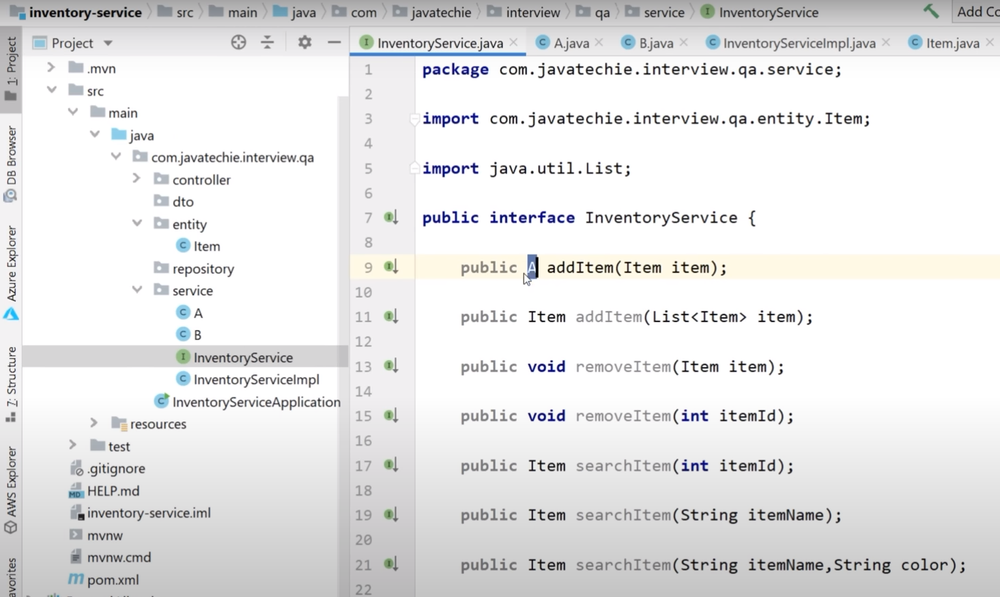

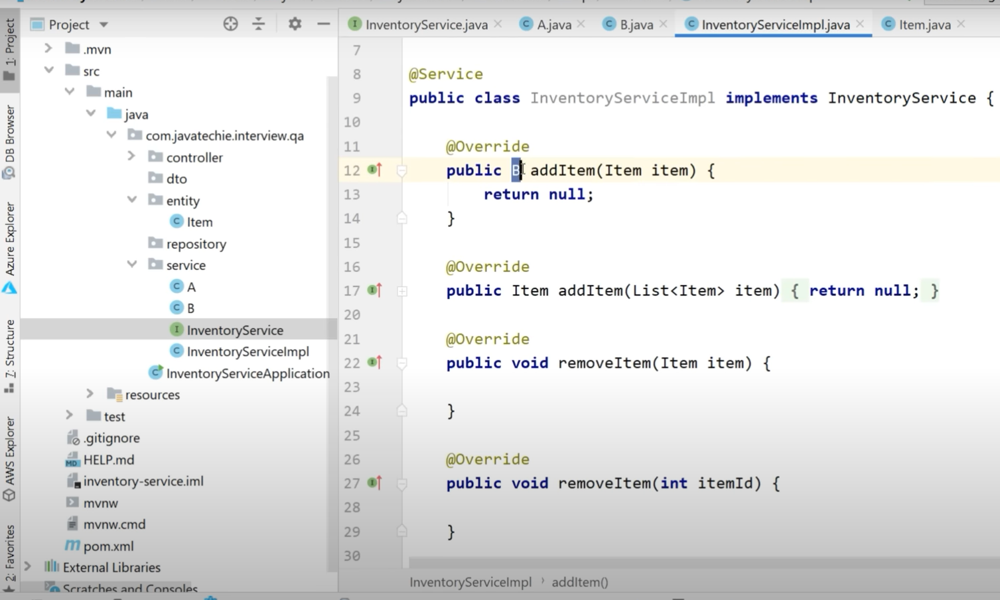

5. ------

This is also Dynamic/runtime polymorphism where we inject the parent/class interface (InventoryService) instead of the child(InventoryServiceImpl) for dependecy injection.


Because, I may have multiple implementations of the InventoryService.

6. ----

For an overriden method in the child class, if that method in child throws exception, then parent class method needs to throw exception as well. But if parent class method throws exception, then child class may or may not throw it, no problem.

7. ----

```java
//this code prints "from Child Car class"

public class Main {
    public static void main(String[] args) {
       Vehicle vehicle = new Car();
       vehicle.m1();
    }
} 


package com.nayemtech;
public class Vehicle {
    public void m1() {
        System.out.println("from parent Vehicle class");
    }
}


package com.nayemtech;
public class Car extends Vehicle  {
    @Override
    public void m1() {
        System.out.println("from Child Car class");
    }
}
```

Just as I know, above code will first go to the child class Car because we instantiated a Car object with reference of Vehicle object. So JVM will go to Car class first and will print  `from Child Car class` 

But what happens if the child class Car did not have the overridden method m1() in it? in that case, the JVM will first visit the Car class as usual but since there's no m1 method in it, JVM will look for the m1 method in the parent class Vehicle, and execute the m1 method there without Any compilation error.

```java
//this code prints "from parent Vehicle class"

public class Main {
    public static void main(String[] args) {
       Vehicle vehicle = new Car();
       vehicle.m1();
    }
} 


package com.nayemtech;
public class Vehicle {
    public void m1() {
        System.out.println("from parent Vehicle class");
    }
}


package com.nayemtech;
public class Car extends Vehicle  {

}
```

----

Below code will print 45

```java
output is 45

public class Main {
    public static void main(String[] args) {
       Vehicle vehicle = new Car();
       System.out.println(vehicle.X);
    }
} 


package com.nayemtech;
public class Vehicle {
   int X = 45;
}


package com.nayemtech;
public class Car extends Vehicle  {
    int X = 55555;
}
```

The output is `45` because of the way Java handles variable hiding and polymorphism.

In your code, `Vehicle vehicle = new Car();` creates a new `Car` object, but the reference type is `Vehicle`. When you access the field `X`, Java looks at the reference type (`Vehicle`), not the actual object type (`Car`), and therefore it accesses the `X` in the `Vehicle` class, not the `X` in the `Car` class.

This is known as variable hiding. The `X` in `Car` hides the `X` in `Vehicle`. But when you access `X`, Java uses the reference type to determine which `X` to use. If you want to access the `X` in `Car`, you need to have a reference of type `Car`.

```java
this code will show error. It won't access the field X from the object type Car, but will will try to access
from the reference type Vehicle, but since there's no field called X there, it will result in a compilation error

public class Main {
    public static void main(String[] args) {
       Vehicle vehicle = new Car();
       System.out.println(vehicle.X);
    }
} 


package com.nayemtech;
public class Vehicle {

}


package com.nayemtech;
public class Car extends Vehicle  {
    int X = 55555;
}
```

-------

- if you throw Exception in an overriden method in child class, parent class needs to throw Exception in that method as well. but if parent class throws Exception, it's a matter of Parent class, child class may or may not throw then, no problem


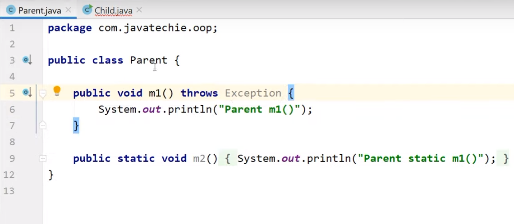

------

You can not override static methods or private methods. because static methods belong to the parent class itself.

-----

### default method in interfaces

The purpose of default method - to not force the implementation to override the method.

if we have default method in an interface, we can add method body. The purpose of it is, the classes that implements this interface, are not forced to override this method bcz it has method body.

Static method in interface also does the same. maybe?

before java 8 it was not possible. You had to override any and all methods.

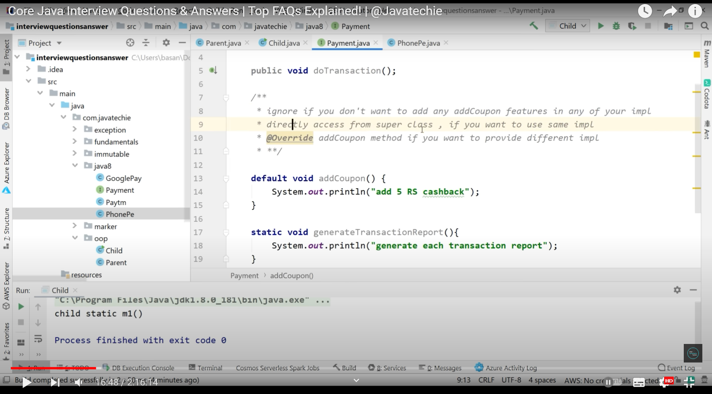

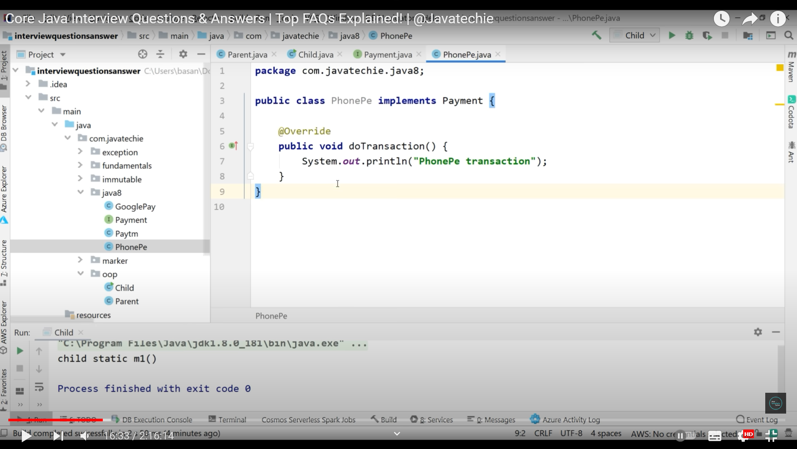

-----

### why must we have to add method body in default method and in static method in interfaces?

- because, in interfaces what's the purpose of declaring abstract methods? the purpose is that subclasses must override the abstract method and write their own implementations. But, we know, static method belongs to the class itself, so child classes can't override it, hence there's no meaning in declaring static methods that's abstract. So we must add method body to it.

- and for default methods, we may or may not override it in the subclass. Since maybe we don't override it in the subclass, hence we also need an implemented code (method body) inside the default methods. So subclasses either inherit the implemented default method directly or override it as per necessity of the subclass.

-------

### testing the behaviour of `default` method, `static` method and normal method in an interface.

```java
package com.nayemtech;
public interface InterfaceA {
    static void staticMethod() {
        System.out.println("static method in interfaceA belongs to the interface itself");
    }

    default void defaultMethod() {
        System.out.println("default method in interfaceA does not force me to override in implemented class. " +
                "I may or may not override it in the implemented class");
    }

    void normalMethod();
}

public class Main {
    public static void main(String[] args) {
       InterfaceA a = new TmpMain();
       a.defaultMethod();
       a.normalMethod();
       InterfaceA.staticMethod();
    }
} 


output:

default method in interfaceA does not force me to override in implemented class. I may or may not override it in the implemented class
normal method in the implemented class forced me to override
static method in interfaceA belongs to the interface itself
```

-------

### final, finally and finalize

- final is a keyword

- finally is a block

- finalize is a method of object class (used to cleanup unused objects)

- finally and finalize are used for cleanup purposes

if something in our code is null or, if garbage collector finds any objects that is not used and we call the `System.gc()` , then the finalize() method is called.

----

### what is equals and hashcode method and it's contract?

- If hashcode of two objects is same, there's no guarantee that the equals method of these two objects will be same.


- in below code, the Set prints both customer1 and customer2 even though both are same. Because we did not override equals() and hashCode() method in the Customer Class. If we added that, set will only print one object because equals() and hashcode() ensures the uniqueness.

```java
public class Main {
    public static void main(String[] args) {
       Customer customer1 = new Customer(3, "Nayem");
       Customer customer2 = new Customer(3, "Nayem");

       Set<Customer> st = new HashSet<>();
       st.add(customer1);
       st.add(customer2);

       System.out.println(st);

        System.out.println(customer1 == customer2); //output false
        System.out.println(customer1.equals(customer2)); //output true

        String s1 = new String("ok");
        String s2 = new String("ok");

        String s3 = "ok";
        String s4 = "ok";
        String s5 = "o";
        s5 += "k";

        System.out.println("string: " + (s1 == s2)); //output false
        System.out.println("string: " + (s3 == s4)); //output true because, for
                                   //for string literals it is stored in the string constant pool.
                                   //and for a new string literal, jvm checks if there's any literal that's same          
                                   //in the current string pool, if same, then it just assigns the same memory.
        System.out.println("string: " + (s3 == s5)); //output false
                          //because Strings are immutable. Once changed, new object is creatd.
    }
}
```

Overriding only the `equals()` method might seem sufficient if you’re only interested in comparing two objects for equality. However, when you use objects as keys in a `HashMap` or elements in a `HashSet`, both `equals()` and `hashCode()` methods are used, and they need to be consistent with each other. Here’s why:

1. **Performance**: `HashMap` and `HashSet` use a hash table data structure for storing elements. When you add an element, it uses the `hashCode()` method to determine the “bucket” where the element should be placed. If two objects are equal (according to the `equals()` method), they should ideally have the same hash code so that they land in the same bucket. This makes the lookup operation very fast, as it can directly go to the correct bucket using the hash code, instead of having to scan through all elements.

2. **Correctness**: If two equal objects have different hash codes, they would be placed in different buckets. Now, when you try to search for an element in the `HashMap` or `HashSet`, it would look in the wrong bucket (based on the hash code) and fail to find the element, even though it’s present in the collection. This would lead to incorrect behavior of the `HashMap` or `HashSet`.

<u>*So, if you override `equals()`, you should also override `hashCode()` to ensure that equal objects have the same hash code. This is known as the contract between `equals()` and `hashCode()`, and is crucial for the correct functioning of collections like `HashMap` and `HashSet`*</u>

------

- what is exception and it's hierarchy?

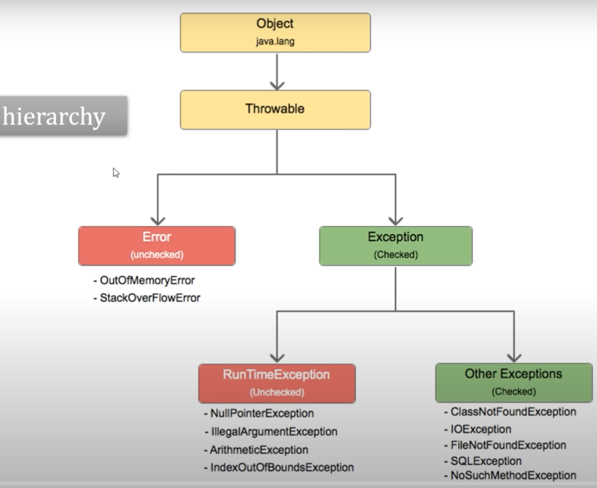


### write custom exception

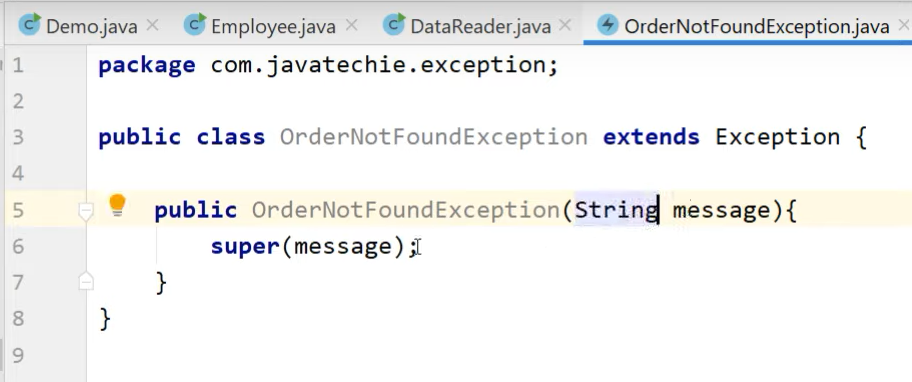

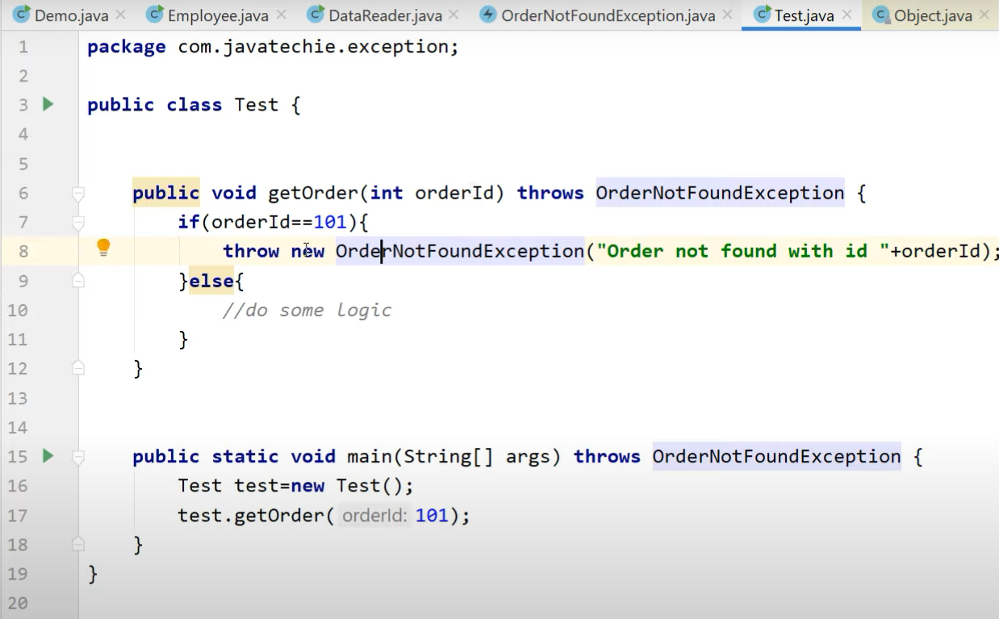

### what is throw and throws keyword

- throws keyword delegates the exception back to the method caller - whoever called this method must deal with this exception with try-catch block or use throws clause in the method signature to pass this exception to the next method caller.

- we use throw keyword to throw an exception.

### order of exception

- parent class must be below the subclass. you know why: if the parent class is before the subclass, parent class will catch the exception, the subclass below will be redundant.


### try, catch, finally return order

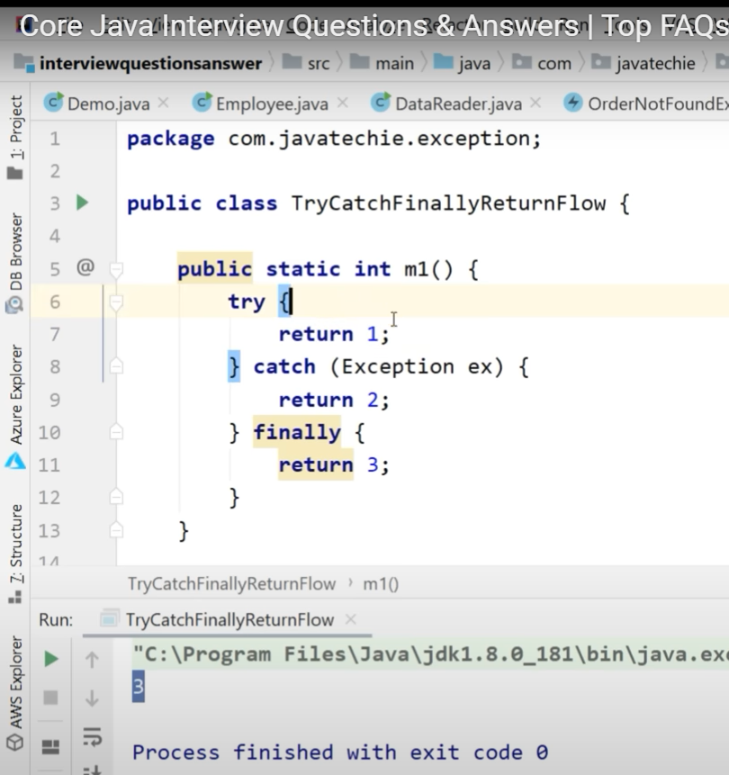

- we can see above pic output is 3. Because, it goes to the `try` first and since there's no logical statement that causes exception, it should not go to the `catch` block, so it should return 1. But, we know `finally` block is always executed, so instead of returning 1, it goes to the `finally` block and returns 3 from there.

- So in here, if we did not have `finally` block, it would've returned 1:

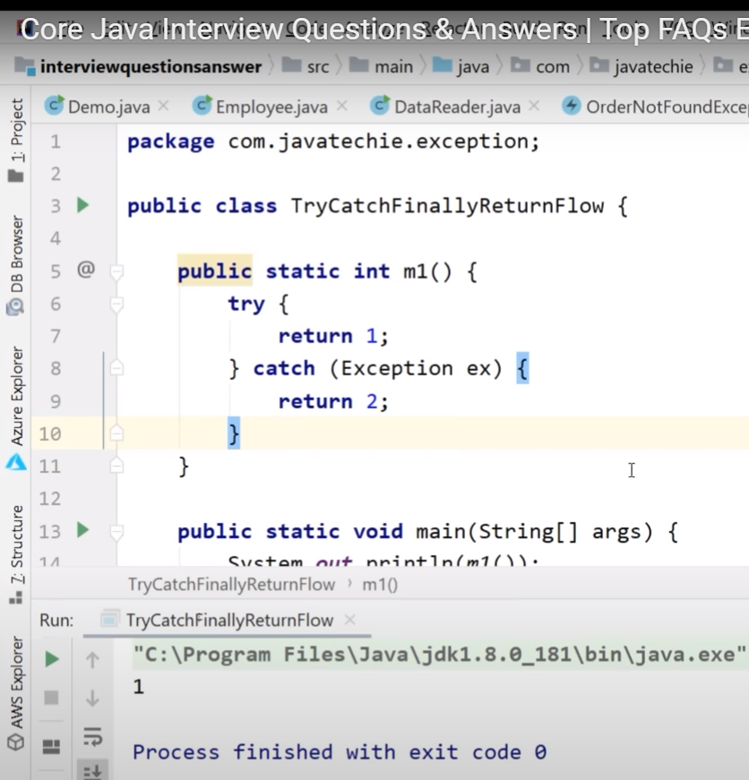

- same as the firs code picture, if we had an exception and also we have finally block, although it goes to the catch block, but since finally is always executed, it returns 3 from the finally block:


- and if we did not have the finally block, then it retuns 2 from the catch block:


### is there any scenario where you can break the rule of `finally`?

- inside finally, System.exit(0) or forcefully throw some exception from the finally itself.

- Now there's no output:

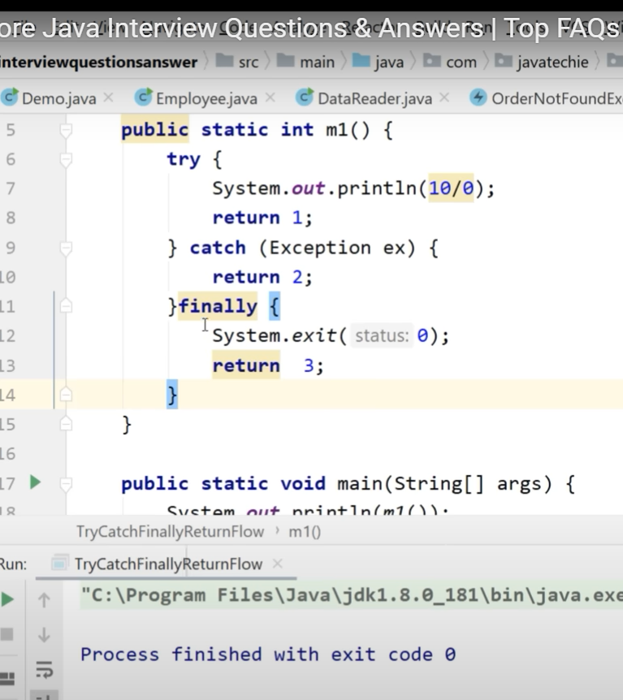

### How many way can we create String object?

There's these two ways: using new keyword and using String literals:

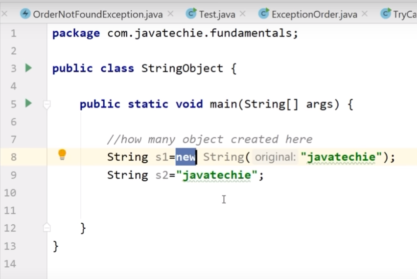

- How many objects are created in these both ways?
- if you use new keyword then, two objects are created: one is stored in heap because of the new keyword, and another, because of the literal "javatechie", will be stored in String Constant Pool area

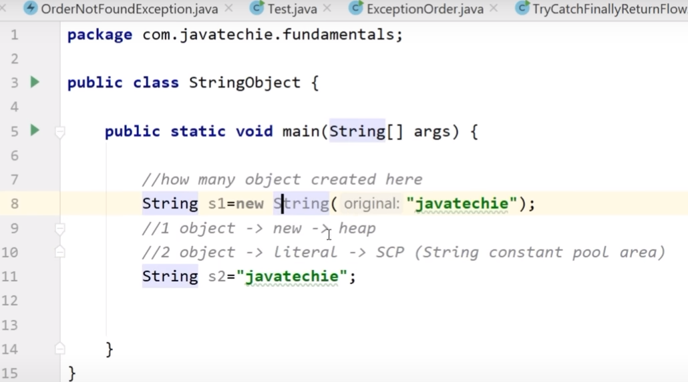

- Now, when I create s2 in above image using just literals, it will create one object. but first jvm will check if the same literal is present in the String Constant Pool or not. If it's already present, then it won't create a new object in String Constant Pool, it will use the same reference of the existing one.

- So, when we create s2 with "javatechie", no new object will be created since "javatechie" already exists in the String Constant Pool created by s1.

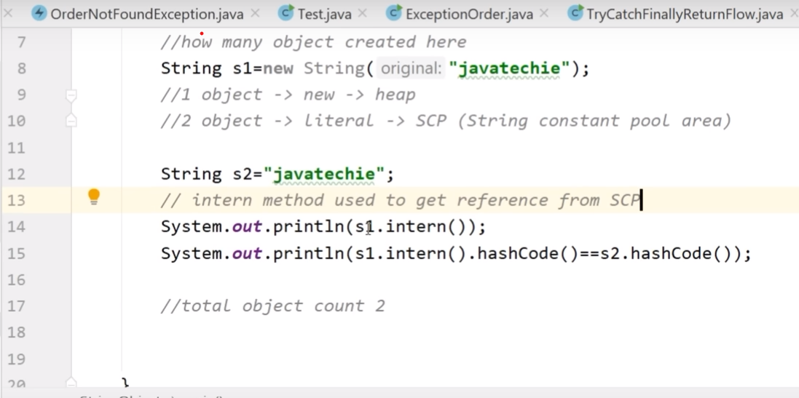

### Strings are immutable

```java
      String s1 = "ok";
      String s2 = "ok";
      System.out.println(s1 == s2); //true
----------------------------------------------

       String s1 = "ok";
       String s2 = "o";
       s2 += "k";
       System.out.println(s1 == s2); //false
```

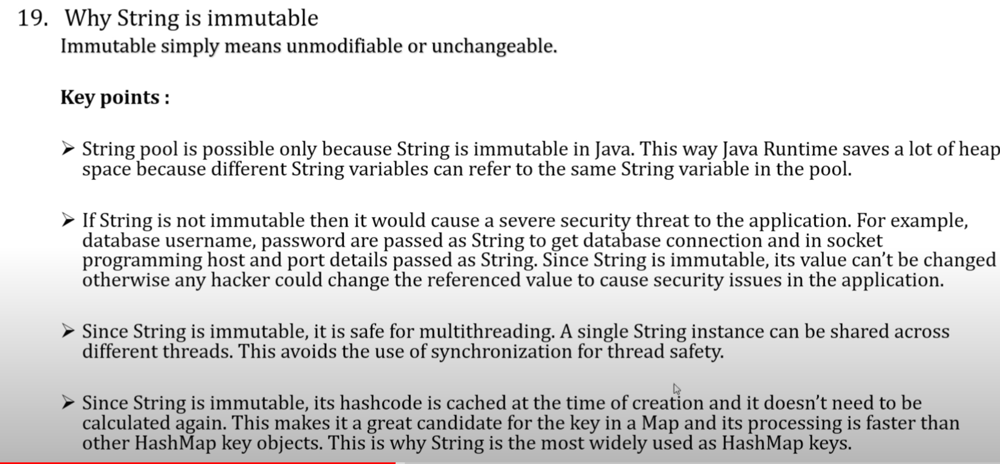

### String, StringBuilder, StringBuffer

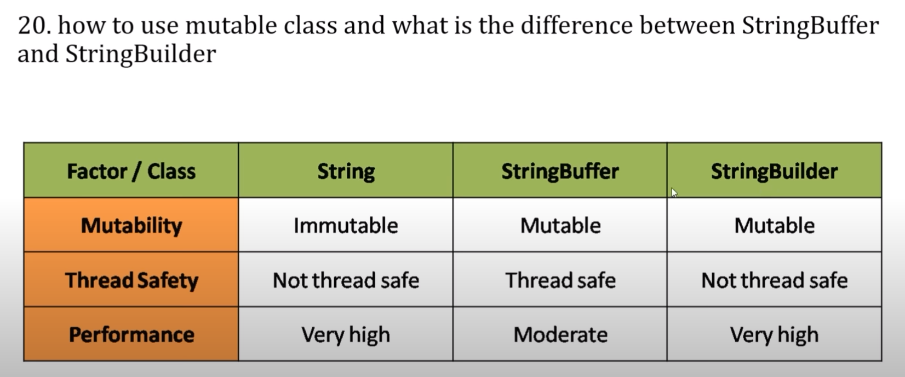

- we use StringBuilder instead of String when there's lots of concatenation or String Modification operation.

```java
    public static void main(String[] args) {
       String s1 = "java";
       String s2 = s1.concat("techie");
       System.out.println(s1);
       System.out.println(s2);

       System.out.println("StringBuilder:");
       StringBuilder sb1 = new StringBuilder("java");
       sb1.append("techie");
       System.out.println(sb1);

       System.out.println("StringBuffer");
       StringBuffer sbf1 = new StringBuffer("java");
       sbf1.append("techie");
       System.out.println(sbf1);
    } 

output:
java
javatechie
StringBuilder:
javatechie
StringBuffer
javatechie
```

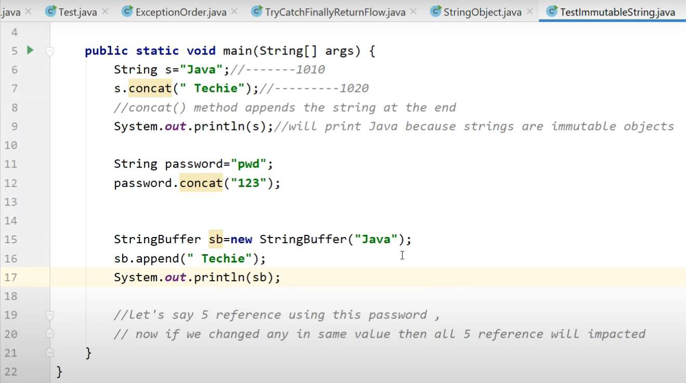


- StringBuilder and StringBuffer both outputs same: Java Techie

### write your own custom immutable class

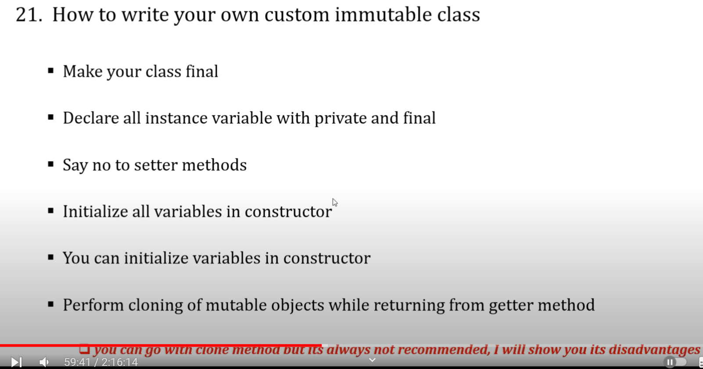

### Marker interface /tagging interface (serializable is a marker interface - empty interface)


# D:\TBD from CorruptDisk\become-a-java-developer-and-get-the-job\09 - OOPS and Java  Polymorphism, Abstraction, Encapsulation


<u>overloading</u>: method overloading, constructor overloading, operator (just with + operator for string and integer - java does not support operator overloading)

- Java does not explicitly support operator overloading. I can just use + operator for concatenating a string or adding two integers.
