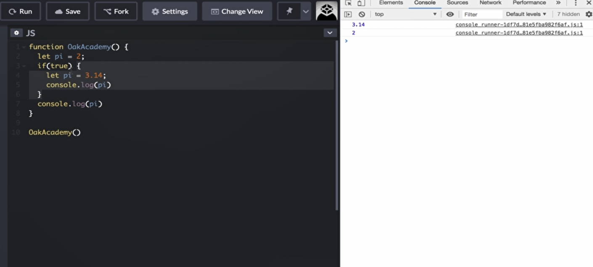

# React Hooks, React state, React component ...

https://chatgpt.com/share/c7cc2b93-e712-49be-a57d-d14451bc1aab

# learning ES2015 (also known as ES6) is a great idea and will be very beneficial for working with React. ES2015 introduces many features and improvements that are widely used in modern JavaScript development, including React. Here are a few ES2015 features that are particularly useful:

### Key ES2015 Features for React Development:

1. **Arrow Functions**:
   
   - More concise syntax for writing functions.
     
     ```javascript
     const greet = (name) => `Hello, ${name}`;
     ```

2. **Classes**:
   
   - A new syntax for creating objects and dealing with inheritance, useful for creating React components (though functional components are often preferred).
     
     ```javascript
     class Person {
     constructor(name) {
       this.name = name;
     }
     
     greet() {
       return `Hello, ${this.name}`;
     }
     }
     ```

3. **Template Literals**:
   
   - Easier string interpolation.
     
     ```javascript
     const name = 'world';
     console.log(`Hello, ${name}!`);
     ```

4. **Destructuring**:
   
   - Extracting values from arrays or properties from objects into distinct variables.
     
     ```javascript
     const {name, age} = {name: 'Alice', age: 25};
     console.log(name); // 'Alice'
     ```

5. **Modules**:
   
   - Import and export syntax for modular code.
     
     ```javascript
     // export
     export const add = (a, b) => a + b;
     ```
   
   // import
   import { add } from './math';
   
   ```
   
   ```

6. **Spread and Rest Operators**:
   
   - For expanding or gathering elements.
     
     ```javascript
     const numbers = [1, 2, 3];
     const newNumbers = [...numbers, 4]; // [1, 2, 3, 4]
     ```

7. **Promises**:
   
   - For asynchronous operations.
     
     ```javascript
     const fetchData = () => {
     return new Promise((resolve, reject) => {
       // some async operation
     });
     };
     ```

### Why It's Beneficial:

- **Modern Syntax**: ES2015 brings a cleaner and more readable syntax to JavaScript, making your codebase easier to maintain.
- **Performance**: Many ES2015 features can lead to better performance and more efficient code.
- **Compatibility**: Most modern browsers and environments support ES2015, and tools like Babel can transpile ES2015 to ES5 for wider compatibility.

### Getting Started:

1. **Learn by Doing**: As you learn React, practice using ES2015 features in your projects.
2. **Resources**: Use tutorials and courses that cover modern JavaScript (ES6+) alongside React. Websites like MDN Web Docs are excellent for learning JavaScript features.

By learning ES2015, you'll not only become proficient in React but also develop a strong foundation in modern JavaScript, making you a more versatile developer. Keep up the great work! 🚀

If you have any more questions or need guidance on specific features, feel free to ask!

# Javascript

- let, const are block scopes.

  

# What problems does React solves?

Let me explain the key problems that React solves in web development:

1. **DOM Manipulation Complexity**
   Before React, directly manipulating the DOM was tedious and error-prone. Developers had to write code like:
   
   ```javascript
   document.getElementById('user-name').innerHTML = user.name;
   document.getElementById('user-email').innerHTML = user.email;
   ```
   
   React simplifies this with declarative code:
   
   ```javascript
   function UserProfile({ user }) {
   return (
    <div>
      <div>{user.name}</div>
      <div>{user.email}</div>
    </div>
   );
   }
   ```

2. **State Management**
   Without React, keeping the UI in sync with data changes was challenging. You'd need to manually track what needed updating. React automatically re-renders components when their state changes:
   
   ```javascript
   function Counter() {
   const [count, setCount] = useState(0);
   return (
    <button onClick={() => setCount(count + 1)}>
      Count: {count}
    </button>
   );
   }
   ```

3. **Code Organization & Reusability**
   React's component-based architecture means you can break down complex UIs into smaller, reusable pieces. Instead of having one giant file with all your UI code, you can create focused components:
   
   ```javascript
   function Header() { /* ... */ }
   function Sidebar() { /* ... */ }
   function MainContent() { /* ... */ }
   
   function App() {
    return (
    <>
    <Header />
    <Sidebar />
    <MainContent />
    </>
    );
   }
   ```

4. **Performance Optimization**
   React's Virtual DOM efficiently updates only what needs to change, rather than re-rendering the entire page. This makes React applications faster and more responsive.

5. **Cross-Platform Development**
   The React paradigm has enabled frameworks like React Native for mobile development and React-VR for virtual reality, allowing developers to use similar skills across platforms.

6. **Large-Scale Application Development**
   React's unidirectional data flow and component-based architecture make it easier to build and maintain large applications by making the code more predictable and easier to debug.

These solutions have made React particularly valuable for building complex, interactive web applications where UI state needs to be managed efficiently and consistently.

# Designing your React app

Let me break this down to help you understand these technologies in the context of React styling:

These technologies fall into different categories of styling solutions for React:

1. Native Web Technologies:
- CSS: The fundamental styling language for web

- HTML: The markup language that CSS styles are applied to
2. CSS Frameworks:
- Bootstrap: The oldest and most popular CSS framework
  
  - Provides pre-built components and utility classes
  - Can be used with React through react-bootstrap or reactstrap
  - More traditional approach with predefined components
3. Utility-First CSS Frameworks:
- Tailwind CSS: A modern utility-first framework
  
  - Provides low-level utility classes to build designs
  - Highly customizable
  - Used directly in your JSX className props
  - Popular choice for modern React applications
4. Component Libraries/UI Frameworks:
- Material UI (MUI): Complete React component library
  
  - Implements Google's Material Design
  - Comes with built-in components, icons, and themes
  - Has its own styling solution using emotion
  - Good for enterprise applications

- Chakra UI: Modern component library
  
  - Built on top of emotion
  - Focuses on accessibility and composability
  - Provides theme-aware components
  - Good for rapid development

- DaisyUI: 
  
  - Built on top of Tailwind CSS
  - Provides pre-built components using Tailwind classes
  - Lighter weight than full UI frameworks
  - Good middle ground between utility classes and components

Typical Usage Scenarios:

1. For complete control and custom designs:
- Pure CSS or CSS Modules
- Tailwind CSS
2. For rapid development with pre-built components:
- Material UI
- Chakra UI
3. For utility classes with some components:
- Tailwind CSS + DaisyUI
4. For traditional development:
- Bootstrap

The choice depends on your needs:

- Need full control? → CSS or Tailwind
- Need pre-built components? → MUI or Chakra UI
- Want both? → Tailwind + DaisyUI
- Working on enterprise app? → Material UI
- Need quick prototyping? → Chakra UI or Bootstrap

#### what is emotion?

Emotion is a CSS-in-JS library that allows you to write CSS styles directly in your JavaScript/React code. Let me explain:

CSS-in-JS means:

- You write your CSS using JavaScript
- Styles are scoped to components by default
- Dynamic styles can be created based on props
- No need for separate CSS files

Here's how Emotion works:

```jsx
// Using Emotion's styled components
import styled from '@emotion/styled'

const Button = styled.button`
  background-color: ${props => props.primary ? 'blue' : 'gray'};
  color: white;
  padding: 10px 20px;
  border: none;
  border-radius: 4px;
`

// Usage
function App() {
  return (
    <div>
      <Button>Normal Button</Button>
      <Button primary>Primary Button</Button>
    </div>
  )
}
```

Key benefits of Emotion:

1. Dynamic styling based on props or state
2. Automatic vendor prefixing
3. No style conflicts (generates unique class names)
4. Better developer experience with full JavaScript capabilities
5. Better performance through optimized style injection

This is why libraries like Material UI and Chakra UI use Emotion under the hood - it provides them with:

- Theme support
- Dynamic styling capabilities
- Component-level style isolation
- Better runtime performance
- Strong TypeScript support

When someone says a UI library is "built on Emotion", it means they're using Emotion as their styling engine to handle all the CSS generation and management.

An enterprise application typically refers to software built for large organizations/businesses with these characteristics:

1. Scale & Complexity
- Handles large number of users
- Complex business logic/workflows
- Multiple user roles and permissions
- Needs to integrate with other business systems
2. Requirements
- High reliability/uptime
- Strong security measures
- Consistent UI/UX across many features
- Must follow company brand guidelines
- Accessibility compliance (like WCAG)
- Audit logging
- Data validation
3. Examples:
- HR Management Systems
- Customer Relationship Management (CRM)
- Enterprise Resource Planning (ERP)
- Financial Management Systems
- Inventory Management
- Business Intelligence Dashboards

This is why Material UI (MUI) is often chosen for enterprise apps because it provides:

- Complete set of professional components
- Built-in accessibility
- Consistent design language
- Extensive documentation
- Enterprise-level support
- Theming system for brand compliance
- Production-ready components
- Form validation
- Data grid for complex data
- Date/time pickers
- Rich text editors

In contrast, simpler websites or consumer apps might not need such comprehensive solutions and could work fine with lighter options like Tailwind or basic CSS.

-----------

# https://github.com/sangammukherjee/25-reactjs-interview-projects/blob/master/src/components/load-more-data/index.jsx

Let's clarify the usage of `setProducts` and how the "previous state" works in React.

### Understanding `setProducts`

`setProducts` is a state updater function provided by the `useState` hook in React. The `useState` hook returns an array with two elements:

1. The current state value (in this case, `products`).
2. A function to update the state value (in this case, `setProducts`).

### Functional Updates

When you pass a function to `setProducts`, React automatically provides the previous state as the argument to this function. This is known as a "functional update."

Here’s a detailed explanation:

1. **State Initialization**:
   
   ```javascript
   const [products, setProducts] = useState([]);
   ```
   
   - `products` is the current state, initialized to an empty array.
   - `setProducts` is the function used to update the `products` state.

2. **Updating State with a Function**:
   
   ```javascript
   setProducts((prevData) => [...prevData, ...result.products]);
   ```
   
   - Here, `setProducts` is called with a function.
   - React calls this function with the previous state (`prevData`).
   - `prevData` represents the state before the update.
   - The function returns a new array that combines the previous state (`prevData`) with the new products (`result.products`).

### Why Use Functional Updates?

Using functional updates is particularly useful when the new state depends on the previous state. React guarantees the function will receive the most up-to-date state.

### Comparison with Array `.map`

When you use `products.map((data) => ...)`, `products` is an array, and `data` represents each element of the array. This is different from the state update function where `prevData` represents the entire previous state of `products`.

### Example of Functional Update

Here’s a simplified example to illustrate:

```javascript
import { useState } from "react";

function ExampleComponent() {
  const [numbers, setNumbers] = useState([1, 2, 3]);

  const addNumber = () => {
    const newNumber = 4;
    setNumbers((prevNumbers) => [...prevNumbers, newNumber]);
  };

  return (
    <div>
      <ul>
        {numbers.map((number) => (
          <li key={number}>{number}</li>
        ))}
      </ul>
      <button onClick={addNumber}>Add Number</button>
    </div>
  );
}
```

- Initially, `numbers` is `[1, 2, 3]`.
- When `addNumber` is called, `setNumbers` is invoked with a function.
- `prevNumbers` is `[1, 2, 3]` (the previous state).
- The function returns `[1, 2, 3, 4]`, updating the state to include the new number.

### Conclusion

`prevData` (or any other name you choose for the parameter) is not a variable declared elsewhere in your code. It is a parameter provided by React to the function you pass to `setProducts`. This ensures you always have the most recent state when performing updates that depend on the previous state.


# Dynamic Property Access

*In JavaScript (and React), **dynamic property access** allows you to access or modify <mark>an object property using a variable, rather than a fixed name.</mark> This is done using **bracket notation** (`[]`), which is different from the typical **dot notation** (`.`) you're probably used to in C++. Let’s break it down step by step.*

### 1. Dot Notation vs Bracket Notation

#### Dot Notation:

In C++, if you want to access an object's property, you would typically do it with a fixed name, like:

```c
struct Person {
    std::string name;
    int age;
};

Person person;
person.name = "John";
std::cout << person.name; // Outputs "John"
```

In JavaScript, you'd do something similar using **dot notation**:

```javascript
const person = {
  name: 'John',
  age: 30
};

console.log(person.name); // Outputs "John"
```

But the problem is that in JavaScript, sometimes you may not know the property name ahead of time, so you need a more flexible way to access it.

#### Bracket Notation:

**Bracket notation** allows you to access an object's property dynamically using a variable or expression inside the brackets:

```javascript
const person = {
  name: 'John',
  age: 30
};

let property = 'name';
console.log(person[property]); // Outputs "John"
```

### 2. Why Use Bracket Notation?

In situations where you want to access or modify a property dynamically, you can use **bracket notation**. This is particularly useful in scenarios like:

- When the property name is determined at runtime (e.g., from user input, data, etc.).
- When the property name is stored in a variable.

### 3. Example: Dynamic Property Access

Let’s take a scenario where you want to update an object’s property dynamically based on some input.

```javascript
const person = {
  name: 'John',
  age: 30,
  country: 'USA'
};

// Dynamic property access using bracket notation
let property = 'age';
person[property] = 31; // We update 'age' dynamically
console.log(person.age); // Outputs 31

// Now let's change the property to 'country'
property = 'country';
person[property] = 'Canada'; // We update 'country' dynamically
console.log(person.country); // Outputs 'Canada'
```

### 4. Dynamic Property Access in Functions

You can also use dynamic property access inside functions. Here’s how you can use it to update state in a React component.

```javascript
import React, { useState } from 'react';

function MyComponent() {
  const [state, setState] = useState({
    name: '',
    age: 0,
    country: '',
  });

  // This function updates state dynamically using a property name and value
  const updateState = (property, value) => {
    setState((prevState) => ({
      ...prevState,
      [property]: value, // Dynamic property access
    }));
  };

  return (
    <div>
      <button onClick={() => updateState('name', 'John')}>Set Name</button>
      <button onClick={() => updateState('age', 30)}>Set Age</button>
      <button onClick={() => updateState('country', 'USA')}>Set Country</button>
    </div>
  );
}

export default MyComponent;
```

1. **Initial State**:
   
   ```javascript
   const [displayCurrentChildren, setDisplayCurrentChildren] = useState({});
   // displayCurrentChildren = {}
   ```

2. **Function Call**:
   When `handleToggleChildren("Home")` is called:
   
   ```javascript
   handleToggleChildren("Home");
   ```

3. **Bracket Notation**:
   The bracket notation `displayCurrentChildren["Home"]` accesses the value associated with the key `"Home"` in the `displayCurrentChildren` object. Initially, `displayCurrentChildren["Home"]` is `undefined` because the `"Home"` key does not exist yet.

4. **Logical NOT Operator**:
   The `!` operator negates the value:
   
   - `!undefined` is `true`.
   - So, `!displayCurrentChildren["Home"]` is `true`.

5. **State Update**:
   The function updates the state to include or toggle the `"Home"` key:
   
   ```javascript
   setDisplayCurrentChildren({
   ...displayCurrentChildren, // Spread the current state to keep existing properties
   ["Home"]: !displayCurrentChildren["Home"] // Toggle the "Home" property value
   });
   ```
