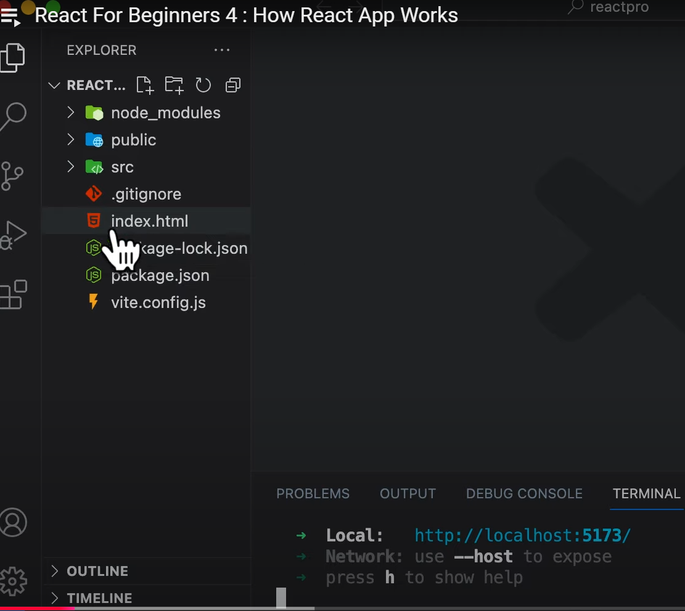

#### Create React App using Vite

```jsx
npm create vite@4.1.0
npm install
npm run dev
```

- React is called a single page application. In the entire project structure of React, we only have one html file called `index.html`




