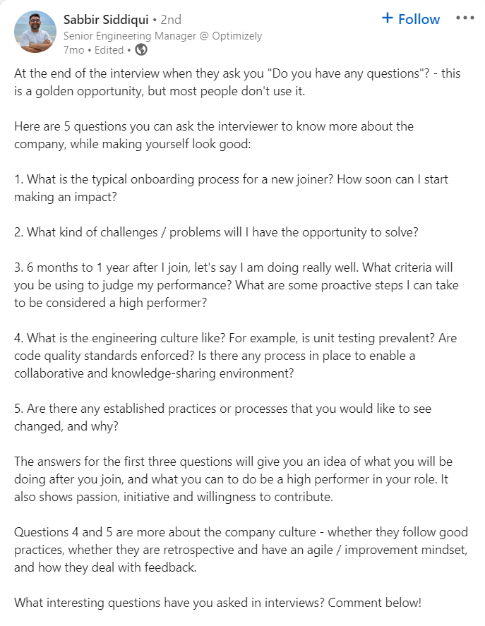
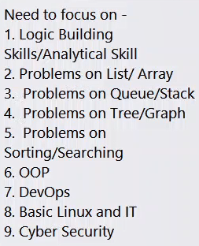

1. ask chatGPT to give you interview oop questions also to give you something to implement with oop that would cover most oop interview questions basics and help to become fluent with oop

2. what is std:: in C++?

3. namespace n C++

4. I know stuff like static keyword, when to use and not to use, but I better learn some characteristics (for example, you can call that static method from any other class without creating any instance) - review such characteristics for other java and oop stuffs

5. LinkedList

6. SDLC

7. bitwise operators

8. Heap

9. file read/write

10. why software engineer?

11. what is backwards compatibility api or code? (amigoscode: interface with default keyword and then override the method of default keyword in the implemented classes if necessary)

12. singly/ single directional linked list reverse order e print korte hobe konorokom data structure chara.

13. LinkedList **************

14. include namespace std; and :: operator

15. pass by reference and pass by value in both java and C++

16. OOP
    
    * Difference Between Interface and class?
    
    * jekono ekta class er modhe field declare korbo and then interface use korbo. Then why do I need interface? I can just use the class
    
    * so what is the difference between interface and abstract class? when should we use what?
    
    * amake polymorphism ta bujhayte parba?
    
    * polymorphism er ekta practical example deo.

17. Backend developer er ekta API call er whole lifecycle ta jana uchit. serokom ekta frontend/js developer er bolte hobe, js browser e kivabe run hoy? process ta ki?

18. probability

19. world e jokhon kono technology ashe, kono kisu solve korar jonnoi. so what problem react solved after it arrived?

20. why java then why spring boot?

21. why backend web development? why not mobile app or frontend or database etc.

22. company somporke search, company'r product somporke jana and linkedin e employee background check and kaoke jigges kora and reference if possible... company'r culture and company'r future nie idea.

23. sdlc ta rakute e kivabe manage korba? --- rakuten e waterfall follow kore.

24. put and patch er difference ki! put/patch etc er request status code, 

25. implement that list from this video https://youtu.be/Af3s3KsxStY?list=PL_c9BZzLwBRLW7Kw8bqc_PJqAnjCJI63P

```java
ArrayList<User> users = new ArrayList<User>();
List<User> users = new ArrayList<User>(); // does ArrayList implements list?
                                    //so that we can use it like this line?
                                  //I'm talking about List being the Super class
                                //and ArrayList extends List
```

23. Git and Github
24. default method and static method. what are they again? they are declared in interfaces.
25. class within a class in java
26. lambda expression .. stream loop .. for each type er loop
27. comparable<Integer>
28. List<Integer> or List<int> ? which is correct and why
29. java essentials course from amigos (teaches about generics and methods, return types,  of java and stuff)
30. java streams course from amigos (functional programming in java, streams etc.)
31. Number is an abstract class in java. Search for why Number is an abstract class in java to know better about abstract classes.
32. streams is part of functional programming
33. diff between jar and war
34. What is a java class file?
* A Java class file is a file (with the .class filename extension) containing Java bytecode that can be executed on the Java Virtual Machine (JVM). A Java class file is usually produced by a Java compiler from Java programming language source files (.java files) containing Java classes (alternatively, other JVM languages can also be used to create class files).
35. <u>*class inside a class:*</u>

```java
public class Main {

    // Outer class (Main class) members and methods

    // Inner class
    class InnerClass {
        // Inner class members and methods

        void display() {
            System.out.println("Inside InnerClass");
        }
    }

    public static void main(String[] args) {
        // Creating an instance of the outer class
        Main outerObj = new Main();

        // Creating an instance of the inner class
        InnerClass innerObj = outerObj.new InnerClass();

        // Calling a method of the inner class
        innerObj.display();
    }
}
```

* Another example is given below. Here, even though the attribute name and price of Vehicle class is  private, I can directly access these fields from the Main class because Vehicle is a nested class of Main class.

```java
package com.nayemtech;

public class Main {
    public static void main(String[] args) {
        Person Rahim = new Person("Rahim", 23);
        Person Karim = new Person("Karim", 33);

        System.out.println(Rahim.getName() + " " + Rahim.getAge());
        System.out.println(Karim.getName() + " " + Karim.getAge());

        Main main = new Main();
        Vehicle car = main.new Vehicle("Audi", 34000);
        System.out.println(car.name);
    }

    public class Vehicle {
        private String name;
        private int price;

        public Vehicle(String name, int price) {
            this.name = name;
            this.price = price;
        }

        public String getName() {
            return name;
        }
        public int getPrice() {
            return price;
        }
    }
}
```

* Even deeper Nested class:

```java
package com.nayemtech;

public class Main {

    // Outer class (Main class) members and methods

    // Inner class
    class InnerClass {
        // Inner class members and methods

        void display() {
            System.out.println("Inside InnerClass");

            // Creating an instance of the nested class
            NestedClass nestedObj = new NestedClass();
            nestedObj.show();
        }

        // Nested class inside InnerClass
        class NestedClass {
            // Nested class members and methods

            void show() {
                System.out.println("Inside NestedClass");
            }
        }
    }

    public static void main(String[] args) {
        // Creating an instance of the outer class
        Main outerObj = new Main();

        // Creating an instance of the inner class
        InnerClass innerObj = outerObj.new InnerClass();

        // Calling a method of the inner class, which in turn calls a method of the nested class
        innerObj.display();
    }
}
```

* Inner class accessing outer class's attributes and methods:

```java
public class Main {

    private int outerVariable = 10;

    // Outer class method
    public void outerMethod() {
        System.out.println("Outer method: " + outerVariable);
    }

    // Inner class
    class InnerClass {
        private int innerVariable = 20;

        // Inner class method accessing outer class members
        public void innerMethod() {
            System.out.println("Inner method: " + outerVariable); // Accessing outer class variable
            outerMethod(); // Accessing outer class method
            System.out.println("Inner variable: " + innerVariable);
        }
    }

    public static void main(String[] args) {
        // Creating an instance of the outer class
        Main outerObj = new Main();

        // Creating an instance of the inner class
        InnerClass innerObj = outerObj.new InnerClass();

        // Calling the inner class method
        innerObj.innerMethod();
    }
}
```

* Inner classes are not visible outside of their containing class, which can limit their reuse in other parts of the code.
36. Tightly coupled vs losely coupled. When is a code tightly coupled? What happens when tightly coupled? ************

37. Palindrome problems

38. # Validating Indian vehicle number plate using Regular Expression

39. Design database schema like japanese e commerce ******

40. nested class nie ektu interview question ghataghati kora lagbe ****

41. nested method? ****

42. review some spring boot interview questions.

43. amar ideone er code gulo

44. java literals

45. sort a linked list

46. Therap (BD) Ltd. [is a US-based software company that has been registered in Bangladesh](https://therapbd.com/)[1](https://therapbd.com/). Here are some key points about the company:
    
    - **Established in 2004**, Therap (BD) Ltd. [has been operating for nearly two decades](https://www.glassdoor.co.uk/Overview/Working-at-Therap-BD-EI_IE2085669.11,20.htm)[2](https://www.glassdoor.co.uk/Overview/Working-at-Therap-BD-EI_IE2085669.11,20.htm).
    - [The company provides **Software as a Service (SaaS)** to government and private organizations globally](https://www.glassdoor.co.uk/Overview/Working-at-Therap-BD-EI_IE2085669.11,20.htm)[2](https://www.glassdoor.co.uk/Overview/Working-at-Therap-BD-EI_IE2085669.11,20.htm).
    - [Their primary focus is on supporting people with developmental disabilities](https://therapbd.com/)[1](https://therapbd.com/).
    - [They have built an **Internet-scale application using Java EE technologies**](https://therapbd.com/)[1](https://therapbd.com/).
    - [The company has its office in Dhaka, Bangladesh, and affiliate offices in the USA and Canada](https://www.glassdoor.co.uk/Overview/Working-at-Therap-BD-EI_IE2085669.11,20.htm)[2](https://www.glassdoor.co.uk/Overview/Working-at-Therap-BD-EI_IE2085669.11,20.htm).
    - [Therap is a global team of professionals with diverse expertise working together across the USA and Bangladesh](https://www.addressschool.com/company/3644/therap-bd-ltd)[3](https://www.addressschool.com/company/3644/therap-bd-ltd).
    
    It’s important to understand the company’s mission, values, and the technologies they use. You might also want to familiarize yourself with Java EE technologies, as they are a key part of their software development.

47. search for java default class examples for all oop concepts jut like Map is an interface

48. optionals in java

49. controller vs restcontroller

50. serialization and deserialization ******

51. Spring Actuator

52. Java EE/J2EE  -- Java SE/J2SE -- Java ME/J2ME

53. what is maven? why do we need it? ****

54. HashTable

55. tight coupling and lose coupling in spring boot and java.

56. sdlc, solid, acid, git, Docker

57. Trie ****

58. https://chat.openai.com/share/788f30ac-8458-4547-ba13-ddae1e5b7e12

59. give me interview questions on backend

60.

Yes, there are other problems where the head of the linked list is not given. For example, some of the problems are:

- How to find the middle node of a linked list without the head pointer?
- How to reverse a linked list without the head pointer?
- How to detect a loop in a linked list without the head pointer?
- How to remove duplicates from a sorted linked list without the head pointer?

You can find more examples and solutions from the following sources:

- [Linked List Problems - Stanford University](http://cslibrary.stanford.edu/105/LinkedListProblems.pdf)
- [Top 50 Problems on Linked List Data Structure asked in SDE Interviews - GeeksforGeeks](https://www.geeksforgeeks.org/delete-a-node-from-linked-list-without-head-pointer/)
- [Delete a Node from linked list without head pointer - GeeksforGeeks](https://stackoverflow.com/questions/43574231/linked-list-troubles-list-not-linking-to-head-pointer)

61.

- In Therap(BD), I'm attending "Associate Software Engineer" written interview of 2 hours durion.
  
  Please give me some related questions.

Hello, this is Copilot. I’m an AI companion that can help you with various tasks and topics. 😊

I see that you are preparing for an Associate Software Engineer written interview at Therap(BD). That’s exciting! 🎉

[According to some web sources](https://www.glassdoor.co.uk/Interview/Therap-BD-Interview-Questions-E2085669.htm)[1](https://www.glassdoor.co.uk/Interview/Therap-BD-Interview-Questions-E2085669.htm)[2](https://www.glassdoor.com/Interview/Therap-BD-Bangladesh-Interview-Questions-EI_IE2085669.0,9_IL.10,20_IN27.htm), the written interview may consist of multiple-choice questions and coding problems on data structures, algorithms, and databases. Some of the topics that you may encounter are:

- Binary trees, heaps, stacks, queues, linked lists, hash maps, graphs, etc.
- Sorting and searching algorithms, such as merge sort, quick sort, binary search, etc.
- SQL queries, joins, indexes, normalization, etc.
- Object-oriented programming concepts, such as inheritance, polymorphism, abstraction, etc.
- Java or C# syntax, data types, operators, control structures, exceptions, etc.

Here are some sample questions that you can practice with:

- What is the difference between BFS and DFS? Explain with an example.
- Write a SQL query to find the name and salary of the highest-paid employee in each department.
- Write a Java or C# program to implement a stack using an array.
- What is the advantage of using a hash map over an array? What is the drawback?
- How would you check if a binary tree is balanced or not?

I hope this helps you prepare for your interview. Good luck! 🍀

[](https://www.glassdoor.co.uk/Interview/Therap-BD-Interview-Questions-E2085669.htm)[1](https://www.glassdoor.co.uk/Interview/Therap-BD-Interview-Questions-E2085669.htm)[: Therap BD Interview Questions (2024) | Glassdoor](https://www.glassdoor.com/Interview/Therap-BD-Bangladesh-Interview-Questions-EI_IE2085669.0,9_IL.10,20_IN27.htm) [2](https://www.glassdoor.com/Interview/Therap-BD-Bangladesh-Interview-Questions-EI_IE2085669.0,9_IL.10,20_IN27.htm): Therap BD Interview Questions in Bangladesh | Glassdoor

62. Rokomari
- vjudge(graph-topological sort, dijkstra, bellman ford, floyd warshall, ..)

- vjudge(number theory), bigmod, gcd, 

- famous problems: n-queen, travelling salesman

- cses dp(coin change variations), spoj classicals from my profile(candy, segmented sieve), ideone history (all possible combination, permutation, combination(nCr)-lightoj, Longest increasing subsequence in O(logn)).

- SOLID principles

- CV topics

- Project (SSLCommerz connection etc, login, etc.), docker, maven, more about view of mvc

- tmp.md

- collection framework

- github (on docs some info by raka and me)

- database acid, database transaction, database languages (ddl, dml, dql etc.)

- Java generics and related stuff that I forgot.

- *<u>Real good idea about pointers in C++ vs why not in java, bst in C++ vs in java</u>*
63. Sure, here are the answers to the questions:
    
    1. **ArrayList vs LinkedList**: `ArrayList` and `LinkedList` are both implementations of the `List` interface in Java. The main difference is how they internally store elements. `ArrayList` is backed by an array, so it provides fast random access and is efficient when resizing is infrequent. `LinkedList`, on the other hand, is implemented as a doubly linked list, providing efficient add/remove operations, but slower get operations.
    
    2. **Final Keyword**: In Java, the `final` keyword can be used in several contexts. When used with a variable, the variable becomes unmodifiable. When used with a method, the method cannot be overridden in a subclass. When used with a class, the class cannot be subclassed.
    
    3. **Memory Management**: Java handles memory management using garbage collection. Objects are created on the heap, and when they are no longer referenced by the application, the garbage collector frees their memory.
    
    4. **Equals() and hashCode()**: The `equals()` method checks if two objects are equal in terms of their state (values), while `hashCode()` returns an integer that represents the object’s memory address. These methods are often overridden together. If two objects are equal according to the `equals()` method, they must have the same `hashCode()`.
    
    5. **Abstract Classes vs Interfaces**: Both are used for abstraction, but an `abstract class` can have method implementations and variables, while an `interface` can only declare methods and constants. A class can implement multiple interfaces but can only extend one abstract class.
    
    6. **Multithreading**: Multithreading in Java is a feature that allows concurrent execution of two or more parts of a program (threads) for maximum utilization of CPU.
    
    7. **Java Reflection**: Reflection is a feature in Java that allows an executing Java program to examine or modify the runtime behavior of applications. It’s used in various Java frameworks like Spring and Hibernate.
    
    8. **Exception Handling**: Java uses try-catch blocks for exception handling. Code that might throw exceptions is put in a `try` block, and the exceptions are caught and handled in `catch` blocks.
    
    9. **Checked vs Unchecked Exceptions**: Checked exceptions are exceptions that need to be declared in the `throws` clause of a method or caught within the method. Unchecked exceptions (runtime exceptions) don’t need to be declared or caught.
    
    10. **Java Collections Framework**: The Java Collections Framework provides a set of interfaces and classes for storing and manipulating a group of objects. Examples include `ArrayList`, `HashSet`, `HashMap`, etc.

64. what is event driven?

65. does your bst able to handle duplicates?

66. Sure, here are some sample interview questions from each of the topics you mentioned:
    
    **Data Structures and Algorithms (DSA):**
    
    1. What is the difference between a stack and a queue?
    2. Can you explain how a hash table works and where it can be used?
    3. [Describe a situation where it’s better to use a linked list than an array](https://www.geeksforgeeks.org/top-100-data-structure-and-algorithms-dsa-interview-questions-topic-wise/)[1](https://www.geeksforgeeks.org/top-100-data-structure-and-algorithms-dsa-interview-questions-topic-wise/)[2](https://www.springboard.com/blog/software-engineering/data-structures-and-algorithms-interview-questions/)[3](https://sg.indeed.com/career-advice/interviewing/data-structures-and-algorithms-interview-questions).
    
    **Object-Oriented Programming (OOP):**
    
    1. Can you explain the concept of inheritance in OOP?
    2. What is polymorphism and how is it implemented in OOP?
    3. [How does encapsulation improve code security and flexibility](https://www.geeksforgeeks.org/top-100-data-structure-and-algorithms-dsa-interview-questions-topic-wise/)[4](https://www.geeksforgeeks.org/oops-interview-questions/)[5](https://www.interviewbit.com/oops-interview-questions/)[6](https://hk.indeed.com/career-advice/interviewing/object-oriented-programming-interview-questions)[7](https://www.indeed.com/career-advice/interviewing/object-oriented-programming-interview-questions)?
    
    **Database:**
    
    1. What is the difference between SQL and NoSQL databases?
    2. Can you explain what a database transaction is and why it’s important?
    3. [How would you design a database schema for a blog website](https://www.geeksforgeeks.org/top-100-data-structure-and-algorithms-dsa-interview-questions-topic-wise/)[8](https://www.indeed.com/career-advice/interviewing/database-interview-questions)[9](https://www.softwaretestinghelp.com/database-interview-questions/)[10](https://au.indeed.com/career-advice/interviewing/database-interview-questions)[11](https://www.indeed.com/career-advice/interviewing/dba-interview-questions)?
    
    **Operating Systems (OS):**
    
    1. What is the role of a scheduler in an operating system?
    2. Can you explain how virtual memory works in an OS?
    3. [What is the difference between a process and a thread](https://www.geeksforgeeks.org/top-100-data-structure-and-algorithms-dsa-interview-questions-topic-wise/)[12](https://www.geeksforgeeks.org/operating-systems-interview-questions/)[13](https://www.interviewbit.com/operating-system-interview-questions/)[14](https://in.indeed.com/career-advice/interviewing/operating-system-interview-questions)[15](https://www.indeed.com/career-advice/interviewing/operating-system-interview-questions)?
    
    **Computer Networks (CN):**
    
    1. What is the difference between TCP and UDP?
    2. Can you explain how the DNS resolution process works?
    3. [What is the role of a router in a network](https://www.geeksforgeeks.org/top-100-data-structure-and-algorithms-dsa-interview-questions-topic-wise/)[16](https://www.geeksforgeeks.org/networking-interview-questions/)[17](https://www.simplilearn.com/computer-networks-interview-questions-article)[18](https://in.indeed.com/career-advice/interviewing/network-interview-questions)[19](https://ca.indeed.com/career-advice/interviewing/networking-interview-questions)?
    
    Remember, these are just sample questions. The actual questions you might be asked in an interview can vary greatly depending on the role, the interviewer, and the specific needs of the company. It’s always a good idea to understand the fundamentals of each topic and be prepared to discuss your relevant experiences. Good luck with your interview preparation!

67. 

68. <mark>Is every BST a balanced Binary Tree? how to make a tree balanced?</mark>

69. is version control system important in software development? why?

70. what is BRD (**Business Requirement Documents**)

71. During Software Development, did you face any errors/challenges? some experience you can share with me?

72. what is NULL?

73. Biggest challenges an industry can face? (from collecting BRD, making SRS, Software Development, Testing, Implementation)

# ------------------ DeadLine 18th Feb -------------------

1. in your BST code, if you add negative value or duplicate, then what happens

2. about pointers you used in your BST code

3. Given incomplete Java code of BST, implement the rest.

4. make a binary tree into a balanced binary tree

5. kubernetes e kivabe dhukano hoysilo and azure e kivabe upload dewa hoysilo.

6. what is thread safety(synchronized) in java

7. Testing (blackbox and Junit) ****

8. questions on different areas of computer science

9. what is Software Quality Assurance? (SQA)

10. Interviewer asked to create a database schema given a scenario.

11. Given a fixed delimiter, you have to split a string into multiple words.

12. abstract class and interface in java

13. convert digit to binary, print a tree

14. You want to implement a Set in Java that can store objects of user-defined classes. How can you achieve that?

15. below:
- 1. Random integer in range l,r without rand function.
  2. Sum of digit until becoming 1 digit number.
  3. Concat integers to make the largest integer.
  4. Check which version is latest
  5. find the height of a binary tree
  6. Bug in a Java code.
  7. Reverse a linked list
  8. Every integer occurs twice except an integer find that integer

- 9. Why you are interested to join therap
16. pointers in C++

17. # tricky java questions
    
    - [How can you create an immutable class in Java?](https://www.testgorilla.com/blog/tricky-java-interview-questions-answers/)[1](https://www.testgorilla.com/blog/tricky-java-interview-questions-answers/)
    
    - [What is the difference between a checked and an unchecked exception in Java?](https://www.javacodestuffs.com/2020/05/top-20-tricky-java-interview-questions.html)[2](https://www.javacodestuffs.com/2020/05/top-20-tricky-java-interview-questions.html)
    
    - [How does the HashMap class work internally in Java?](https://bing.com/search?q=similar+tricky+interview+questions+in+java)[3](https://bing.com/search?q=similar+tricky+interview+questions+in+java)
    
    - [What is the difference between the == and the equals() methods in Java?](https://talent500.co/blog/java-tricky-interview-questions/)[4](https://talent500.co/blog/java-tricky-interview-questions/)
    
    - [How can you implement a singleton design pattern in Java?](https://codequotient.com/blog/java-programming-questions-interview/)[5](https://codequotient.com/blog/java-programming-questions-interview/)
    
    - [What is the difference between a shallow copy and a deep copy in Java?](https://www.javaguides.net/2021/11/java-string-tricky-interview-coding.html)[6](https://www.javaguides.net/2021/11/java-string-tricky-interview-coding.html)
    
    - How can you avoid memory leaks in Java?
    
    - What is the difference between a static and a dynamic binding in Java?
    
    - How can you achieve multiple inheritance in Java?
    
    - What is the difference between a final, a finally, and a finalize keyword in Java?
    
    - [How can you achieve multiple inheritance in Java?](https://codequotient.com/blog/java-programming-questions-interview/)[3](https://codequotient.com/blog/java-programming-questions-interview/)
    
    - [What is the difference between a final, a finally, and a finalize keyword in Java?](https://data-flair.training/blogs/tricky-java-interview-questions/)[4](https://data-flair.training/blogs/tricky-java-interview-questions/)
    
    - How can you create a custom exception class in Java?

# ----------- March -----

- white box, black box testing etc.

- travelling salesman, n-queen problem etc.

- design pattern.

# ----- after written -----

db: schema practice with copilot + youtube, normalization on youtube, transaction, acid, indexing and other concepts

java: pdfs in downloads-d, javatechie hashmap framework video, normal array+map+etc. implement, pair in java

problem solving: welldev, 10most common, neetcode, 



-------

1. db schema

2. implement queue, stack, .... and so on in Java.

3. agile

4. white box, black box testing etc.

5. arrays in java (char array ..)

6. design pattern

7. time complexity of every single algorithm.

8. using namespace std (cout class std namespace er modhe ase.
   
   class ke access er jonno dot dewa lage, but namespace ke access er jonno colon dewa lage.)

9. <mark>6-8</mark>:java,<mark> 8-10</mark>:interviewQuestions on Glassdoor, <mark>10-12</mark>:database

10. **<u>java garbage collection:</u>** Unlike C++, where we need to use free() to deallocate memory, java does it automatically through it's garbage collection.

11. optionals in java

12. Time complexity of algos and ds

13. how do you create a custom hash function for hashmap?

14. ----------

15. --------------bjet

------

1. bipatite graph

2. prefix and postfix

3. 
