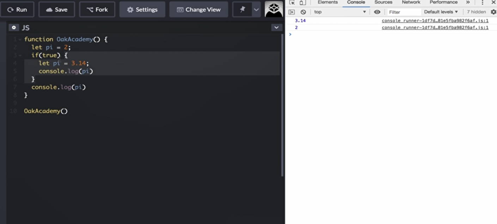
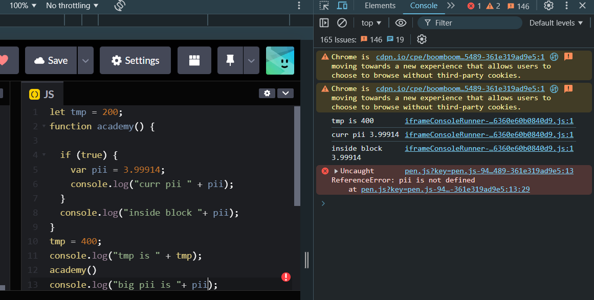
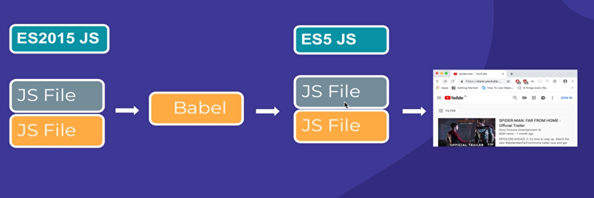

- let, const are block scopes. They only exist within the closest block that surround them. 

- if `var` variable is declared within a function, even in an inner block of that function, that `var` variable can be accessed anywhere within that function including outer blocks.

- difference between let, const : const variables are immutable.
  

- Babel is a popular JavaScript compiler that allows developers to write modern JavaScript (ECMAScript 2015+ or ES6+ and beyond) while still ensuring compatibility with older JavaScript environments that may not support the latest syntax and features.

- Babel Ensures that your modern JavaScript code runs smoothly in older browsers that don't support the latest features.

