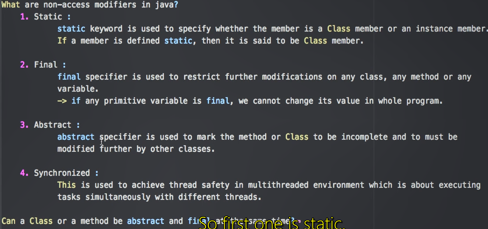
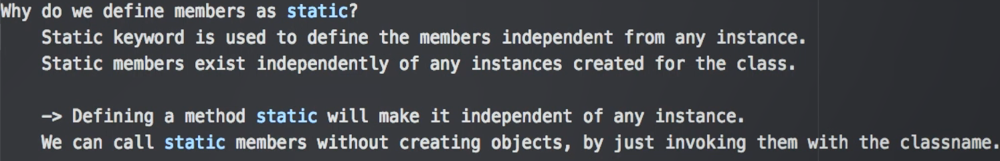
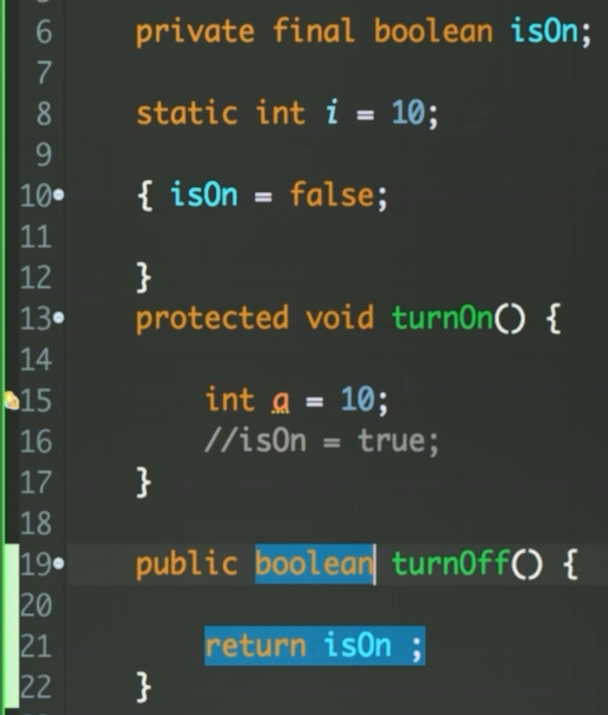
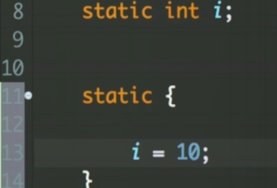
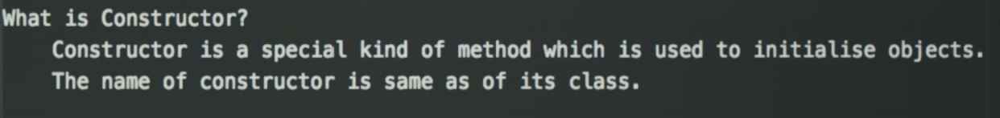
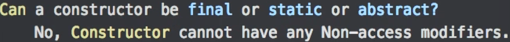
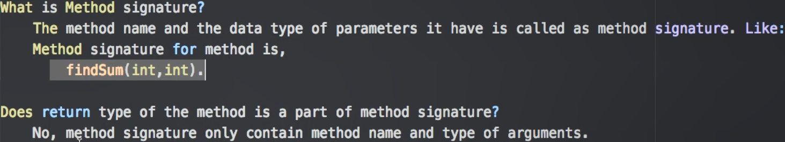
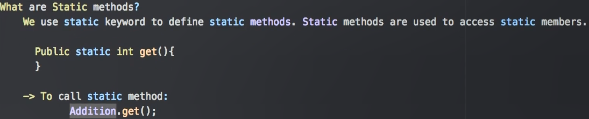
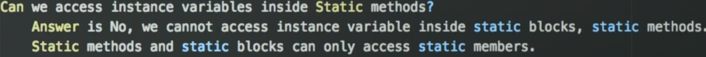
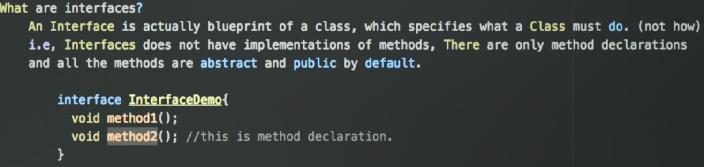

1. Identifiers in java are package name, class name, variable name, method name etc.

2. for every primitive type, there's a wrapper class in java.

3. private and protected not allowed in top level class

4. we can have default class in java, but no protected class is allowed in java why?
- to differentiate the protected class from default access modifers

- In Java, a top-level class with a default (or package-private) access modifier is accessible to all classes within the same package12. This is useful when you want to group related classes together in the same package and allow them to interact with each other, but you don’t want to expose the classes to the outside world.
5. what are Non access modifiers in java?
* Static, Final, Abstract, Synchronized

* 
6. [In Java, `super` is a keyword that refers to the superclass (parent class) of the current object](https://www.w3schools.com/java/ref_keyword_super.asp)[1](https://www.w3schools.com/java/ref_keyword_super.asp)[2](https://www.geeksforgeeks.org/super-keyword/). It is used in three main contexts:
   
   1. [**To call a superclass method**: If a subclass has a method with the same name as a method in its superclass, `super` can be used to call the superclass’s method](https://www.w3schools.com/java/ref_keyword_super.asp)[1](https://www.w3schools.com/java/ref_keyword_super.asp)[2](https://www.geeksforgeeks.org/super-keyword/). [This is useful when the subclass wants to use the implementation of the method in the superclass in addition to its own implementation](https://www.geeksforgeeks.org/super-keyword/)[2](https://www.geeksforgeeks.org/super-keyword/).
   
   ```java
   class Animal {
       public void animalSound() {
           System.out.println("The animal makes a sound");
       }
   }
   
   class Dog extends Animal {
       public void animalSound() {
           super.animalSound(); // Call the superclass method
           System.out.println("The dog says: bow wow");
       }
   }
   ```
   
   2. [**To access a superclass field**: If a subclass has a field with the same name as a field in its superclass, `super` can be used to refer to the field in the superclass](https://www.geeksforgeeks.org/super-keyword/)[2](https://www.geeksforgeeks.org/super-keyword/).
   
   ```java
   class Vehicle {
       int maxSpeed = 120;
   }
   
   class Car extends Vehicle {
       int maxSpeed = 180;
   
       void display() {
           System.out.println("Maximum Speed: " + super.maxSpeed); // Refers to maxSpeed in Vehicle
       }
   }
   ```
   
   3. [**To call a superclass constructor**: `super` can be used in a subclass’s constructor to call the constructor of its superclass](https://www.w3schools.com/java/ref_keyword_super.asp)[2](https://www.geeksforgeeks.org/super-keyword/). [This must be the first statement in the constructor](https://www.w3schools.com/java/ref_keyword_super.asp)[2](https://www.geeksforgeeks.org/super-keyword/).
   
   ```java
   class Animal {
       String color;
   
       Animal(String color) {
           this.color = color;
       }
   }
   
   class Dog extends Animal {
       String breed;
   
       Dog(String color, String breed) {
           super(color); // Call the superclass constructor
           this.breed = breed;
       }
   }
   ```
   
   [In summary, the `super` keyword is a powerful tool for managing inheritance in Java, allowing subclasses to access and build upon the functionality of their superclasses](https://www.w3schools.com/java/ref_keyword_super.asp)[1](https://www.w3schools.com/java/ref_keyword_super.asp)[2](https://www.geeksforgeeks.org/super-keyword/).

7. static keyword is applicable only for class members, not for classes. nested class can be static because that class is a member of the top level class.



8. [In Java, there are three main types of variables: instance variables, local variables, and static variables](https://learnjava.co.in/what-is-the-difference-between-a-local-instance-and-static-variable-in-java/)[1](https://learnjava.co.in/what-is-the-difference-between-a-local-instance-and-static-variable-in-java/)[2](https://www.geeksforgeeks.org/difference-between-instance-variable-and-local-variable/)[3](https://stackoverflow.com/questions/21204589/static-vs-instance-variables-difference)[4](https://www.javatpoint.com/java-variables)[5](https://www.onlinetutorialspoint.com/java/java-variable-types.html).
   
   1. [**Instance Variables**: These are declared within a class but outside any method, constructor, or block](https://www.geeksforgeeks.org/difference-between-instance-variable-and-local-variable/)[2](https://www.geeksforgeeks.org/difference-between-instance-variable-and-local-variable/). [They are created when an object is instantiated and are accessible to all constructors, methods, or blocks in the class](https://www.geeksforgeeks.org/difference-between-instance-variable-and-local-variable/)[2](https://www.geeksforgeeks.org/difference-between-instance-variable-and-local-variable/). [Each object will have its own copy of the instance variable](https://www.geeksforgeeks.org/difference-between-instance-variable-and-local-variable/)[2](https://www.geeksforgeeks.org/difference-between-instance-variable-and-local-variable/). [If not initialized, they are given a default value based on their data type](https://learnjava.co.in/what-is-the-difference-between-a-local-instance-and-static-variable-in-java/)[2](https://www.geeksforgeeks.org/difference-between-instance-variable-and-local-variable/).
   
   ```java
   class Car {
       String color; // Instance variable
   }
   ```
   
   2. [**Local Variables**: These are declared within a method, constructor, or block](https://learnjava.co.in/what-is-the-difference-between-a-local-instance-and-static-variable-in-java/)[2](https://www.geeksforgeeks.org/difference-between-instance-variable-and-local-variable/). [They are created when the method or constructor is called and are destroyed once it exits](https://learnjava.co.in/what-is-the-difference-between-a-local-instance-and-static-variable-in-java/)[2](https://www.geeksforgeeks.org/difference-between-instance-variable-and-local-variable/). [Their scope is limited to the method in which they are declared](https://learnjava.co.in/what-is-the-difference-between-a-local-instance-and-static-variable-in-java/)[2](https://www.geeksforgeeks.org/difference-between-instance-variable-and-local-variable/). [They must be initialized before use](https://learnjava.co.in/what-is-the-difference-between-a-local-instance-and-static-variable-in-java/)[2](https://www.geeksforgeeks.org/difference-between-instance-variable-and-local-variable/).
   
   ```java
   void myMethod() {
       int x = 10; // Local variable
   }
   ```
   
   3. [**Static Variables**: These are declared within a class but outside any method with the `static` keyword](https://learnjava.co.in/what-is-the-difference-between-a-local-instance-and-static-variable-in-java/)[3](https://stackoverflow.com/questions/21204589/static-vs-instance-variables-difference)[5](https://www.onlinetutorialspoint.com/java/java-variable-types.html). [They are created when the program starts and destroyed when the program stops](https://stackoverflow.com/questions/21204589/static-vs-instance-variables-difference)[3](https://stackoverflow.com/questions/21204589/static-vs-instance-variables-difference)[5](https://www.onlinetutorialspoint.com/java/java-variable-types.html). Unlike instance variables, they are not tied to an instance of the class. [Instead, they belong to the class itself, so all instances of the class share the same static variable](https://stackoverflow.com/questions/21204589/static-vs-instance-variables-difference)[3](https://stackoverflow.com/questions/21204589/static-vs-instance-variables-difference)[5](https://www.onlinetutorialspoint.com/java/java-variable-types.html).
   
   ```java
   class Car {
       static int carCount; // Static variable
   }
   ```

9. Can we declare `final` variable without initialization?

10. **instance block:** whenever an object is created, the instance block also gets executed. you declare final variable like this. you must instantiate it by an instance block or constructor.
* 
11. **static block:** 

12. 

13. 

14. Constructors can be private!!!
    
    * 
    
    * so, if we define constructor as private and we want to create objects, the only way we can do that is create a method inside that class itself and call that method to creat objects from outside world.

15. 

16. 
    
    * Here, Addition is the Class name and that's how we call the get static method directly by the Class name itself.

17. 

18. 

19. 
    
    -------
    
    -------

20. constructor calling must be the first statement inside the constructor/method.

21. for example, `this()` calls the default constructor and `super()` calls the parent class of current subclass.

22. below:

```java
package com.nayemtech;
public class Main {
    public static void main(String[] args) {
        // Creating an instance of the Bird interface using an anonymous class
        Bird bird = new Bird() {
            @Override
            public void chirp() {
                System.out.println("This is from Bird interface");
            }
        };

        bird.chirp(); // Calling the chirp method on the Bird instance

        // Creating an instance of the Animal abstract class using an anonymous class
        Animal animal = new Animal() {
            @Override
            public void roar() {
                System.out.println("This is from Animal abstract class");
            }

            @Override
            public void fly() { //must implement all the abstract methods

            }
        };

        animal.roar(); // Calling the roar method on the Animal instance
        System.out.println(animal.eat()); //wow works!!! eat() is not an abstract method and
                //I did not override it intside the anonymous class above but it
                //still can be invoked just like Animal being a normal class
    }
}


package com.nayemtech;
public interface Bird {
    void chirp();
}


package com.nayemtech;
public abstract class Animal {
    private boolean isHunting;
    private String name;

    public abstract void roar();
    public void notRoaring() {
        System.out.println("Animals that don't roar!");
    }
    public abstract void fly();
    public String eat() {
        return "Grass";
    }
}
```

* Here, you are creating an instance of the `Bird` interface using the `new Bird() {...}` syntax. The code inside the curly braces represents the anonymous class that implements the `Bird` interface.
23. if we extend an abstract class or implement an interface, we must either override the abstract methods or make the subclass also an abstract class or an interface that `extends` the parent interface. this is called **Layered Abstraction** . We need **Layered Abstraction** because, there can be a case : abstract bird lays eggs -> abstract eggs has protein -> abstract protein is good for health -> concrete class human eats it.

24.    In Java, you cannot declare a field as `abstract`. The `abstract` keyword is used for methods and classes, not for fields.

25. Association and it's forms -> Composition and segregation:

26. compile time polymorphism or early binding = method overloading

27. Runtime polymorphism or late binding = method overriding.
