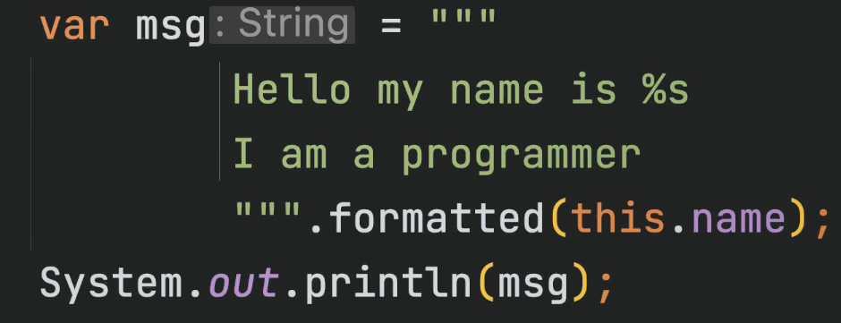

# 1. Vector in C++ to Java

1. convert below C++ code to Java:
   
   ```c
   #include <bits/stdc++.h>
   using namespace std;
   
   int main() {
       vector<int> v;
       v.push_back(45);
       v.push_back(34);
       v.pop_back();
       v.push_back(46);
   
       for (auto X: v) cout << X << ' ';
   }
   ```
   
   ```java
   import java.util.ArrayList;
   import java.util.List;
   
   public class Main {
       public static void main(String[] args) {
           List<Integer> v = new ArrayList<>();
           v.add(45);
           v.remove(v.size() - 1); //last index element
           v.add(34);
           v.remove(0); // Remove the first index element
           v.add(46);
   
           for (int X : v) {
               System.out.print(X + " ");
           }
       }
   }
   ```

```java
import java.util.ArrayList;

public class Main {
    public static void main(String[] args) {
        ArrayList<Integer> v = new ArrayList<Integer>();
        v.add(45);
        v.add(34);
        v.remove(v.size() - 1); //last index
        v.add(46);
        v.remove(0); // This line removes the first element
        for (int X : v) System.out.print(X + " ");
    }
}
```

# 

# 2. Set

Sure, here is the equivalent Java code for your C++ code:

```java
import java.util.*;

public class Main {
    public static void main(String[] args) {
        TreeSet<Integer> st = new TreeSet<>();
        st.add(5);
        st.add(3);
        st.add(5);
        st.add(2);

        for (Integer X : st) {
            System.out.println(X);
        }

        System.out.println();

        if (st.contains(3)) {
            st.remove(3);
        }

        for (Integer X : st) {
            System.out.println(X);
        }
        System.out.println();

        Integer it = st.ceiling(3);
        if (it != null) {
            System.out.println(it);
        }

        it = st.higher(2);
        if (it != null) {
            System.out.println(it);
        }

        it = st.higher(it);
        if (it != null) {
            System.out.println(it);
        }
    }
}
```

This Java code does the same thing as your C++ code. It creates a `TreeSet`, adds elements to it, and then iterates over the set, printing each element. If the element `3` exists in the set, it removes it. Then it prints the remaining elements in the set. It then finds and prints the smallest element in the set that is greater than or equal to `3`, the smallest element that is strictly greater than `2`, and the next smallest element after that. Note that unlike C++, Java uses `System.out.println` for console output. Also, Java doesn’t have an equivalent to C++'s `set`, so we use a `TreeSet` instead. The `add` method is used to add an element to the set. In Java, sets automatically remove duplicate elements, so adding `5` twice only adds one element to the set. This is the same behavior as in C++. The `TreeSet` class in Java ensures that the elements in the set are sorted, which is also the default behavior of `set` in C++. The `for` loop in Java is equivalent to the range-based `for` loop in C++. The `:` operator in Java is equivalent to the `:` operator in C++, and is used to iterate over each element in a collection. The `contains` method is used to check if an element exists in the set, and the `remove` method is used to remove an element from the set. The `ceiling` method is used to find the smallest element in the set that is greater than or equal to a given element, and the `higher` method is used to find the smallest element in the set that is strictly greater than a given element.


# 3. Multiset

Sure, here is the equivalent Java code for your C++ code:

```java
import java.util.*;

public class Main {
    public static void main(String[] args) {
        TreeMap<Integer, Integer> st = new TreeMap<>();
        st.put(5, st.getOrDefault(5, 0) + 1);
        st.put(3, st.getOrDefault(3, 0) + 1);
        st.put(5, st.getOrDefault(5, 0) + 1);
        st.put(2, st.getOrDefault(2, 0) + 1);

        for (Map.Entry<Integer, Integer> X : st.entrySet()) {
            for (int i = 0; i < X.getValue(); i++) {
                System.out.println(X.getKey());
            }
        }

        System.out.println();

        if (st.containsKey(3)) {
            int count = st.get(3);
            if (count > 1) {
                st.put(3, count - 1);
            } else {
                st.remove(3);
            }
        }

        for (Map.Entry<Integer, Integer> X : st.entrySet()) {
            for (int i = 0; i < X.getValue(); i++) {
                System.out.println(X.getKey());
            }
        }
        System.out.println();

        Integer it = st.ceilingKey(3);
        if (it != null) {
            System.out.println(it);
        }

        it = st.higherKey(2);
        if (it != null) {
            System.out.println(it);
        }

        it = st.higherKey(it);
        if (it != null) {
            System.out.println(it);
        }
    }
}
```

This Java code does the same thing as your C++ code. It creates a `TreeMap`, adds elements to it, and then iterates over the map, printing each key the number of times it appears in the map. If the key `3` exists in the map, it decreases its count by one or removes it if its count is one. Then it prints the remaining keys in the map the number of times they appear in the map. It then finds and prints the smallest key in the map that is greater than or equal to `3`, the smallest key that is strictly greater than `2`, and the next smallest key after that. Note that unlike C++, Java uses `System.out.println` for console output. Also, Java doesn’t have an equivalent to C++'s `multiset`, so we use a `TreeMap` where each key maps to its count. The `put` method is used to add a key to the map or update its count. The `getOrDefault` method is used to get the count of a key or a default value if the key does not exist in the map. The `containsKey` method is used to check if a key exists in the map, and the `remove` method is used to remove a key from the map. The `ceilingKey` method is used to find the smallest key in the map that is greater than or equal to a given key, and the `higherKey` method is used to find the smallest key in the map that is strictly greater than a given key.


# 4. Map

 In Java, you can’t use primitive types as generic arguments So, instead of `Map<int, int>`, you should use `Map<Integer, Integer>`.


```java
import java.util.*;

public class Main {
    public static void main(String[] args) {
        Map<Integer, Integer> mp = new HashMap<>();
        mp.put(3, 100);
        mp.put(4, 200);

        for (Map.Entry<Integer, Integer> X : mp.entrySet()) {
            System.out.println(X.getKey() + " " + X.getValue());
        }

        if (mp.containsKey(4)) {
            mp.remove(4);
        }

        System.out.println();
        for (Map.Entry<Integer, Integer> X : mp.entrySet()) {
            System.out.println(X.getKey() + " " + X.getValue());
        }
    }
}

```

# 

# 5. Multimap not available in Java

```java
import java.util.*;

public class Main {
    public static void main(String[] args) {
        TreeMap<Integer, List<Integer>> mp = new TreeMap<>();
        mp.putIfAbsent(3, new ArrayList<>());
        mp.get(3).add(200);
        mp.putIfAbsent(4, new ArrayList<>());
        mp.get(4).add(200);
        mp.putIfAbsent(0, new ArrayList<>());
        mp.get(0).add(100);
        mp.get(4).add(80);

        for (Map.Entry<Integer, List<Integer>> X : mp.entrySet()) {
            for (Integer value : X.getValue()) {
                System.out.println(X.getKey() + " " + value);
            }
        }

        if (mp.containsKey(4)) {
            mp.remove(4);
        }

        System.out.println();
        for (Map.Entry<Integer, List<Integer>> X : mp.entrySet()) {
            for (Integer value : X.getValue()) {
                System.out.println(X.getKey() + " " + value);
            }
        }
    }
}

```


------------------------

-----------------------------

# binary search in java

```java
 List<Integer> store = new ArrayList<>(Arrays.asList(3,1,-4,0,-9,4,3,9,-4,0,3,7,7,5,3,2,8));
        Collections.sort(store);
        System.out.println(store);

        int startDistance = Collections.binarySearch(store, 3);
        System.out.println("startDistance " + startDistance);
```


# *. Print paragraphs which includes newline:



# 3. Set

---------------------------

------------------

# Java Itself

* **To chatGPT:** why error in CalculateArea class? Explain with details and help me understand java in details with code.

```java
package com.nayemtech;

public interface Shape {
    double area();
}


package com.nayemtech;

public class Circle implements Shape {
    double radius;

//    public Circle() {
//    }

    public Circle(double radius) {
        this.radius = radius;
    }

    public double getRadius() {
        return radius;
    }

    public void setRadius(double radius) {
        this.radius = radius;
    }

    @Override
    public double area() {
        return Math.PI * Math.pow(this.radius, 2);
    }
}


package com.nayemtech;

public class Triangle implements Shape {
    private double base;
    private double height;

    public Triangle(double base, double height) {
        this.base = base;
        this.height = height;
    }

    public double getBase() {
        return base;
    }

    public void setBase(double base) {
        this.base = base;
    }

    public double getHeight() {
        return height;
    }

    public void setHeight(double height) {
        this.height = height;
    }

    @Override
    public double area() {
        return 0.5 * this.base * this.height;
    }
}


package com.nayemtech;

import java.util.ArrayList;

public class CalculateArea {
    ArrayList<Shape> shapes = new ArrayList<>(Shape);
    Shape circle = new Circle(3);
    Shape circle2 = new Circle(5);
    Shape triangle = new Triangle(5, 7);

    shapes.add(circle);
    shapes.add(circl2);
    shapes.add(triangle);
}
```

**chatGPT:**

There are a couple of errors in your `CalculateArea` class. Let's go through them step by step:

1. **ArrayList Initialization:** The initialization of the `ArrayList` is incorrect. You need to specify the type of elements that the `ArrayList` will hold, but in your case, you are passing the `Shape` interface directly to the constructor. Instead, you should use diamond brackets (`<>`) to indicate the generic type.

```java
ArrayList<Shape> shapes = new ArrayList<>();
```

1. **Method Invocation:** The code that adds shapes to the `ArrayList` should be placed inside a method or a constructor. You cannot have statements like `shapes.add(...)` directly at the class level. Let's create a constructor for the `CalculateArea` class and move the shape initialization and addition logic into it.

```java
package com.nayemtech;

import java.util.ArrayList;

public class CalculateArea {
    private ArrayList<Shape> shapes = new ArrayList<>();

    public CalculateArea() {
        Shape circle = new Circle(3);
        Shape circle2 = new Circle(5);
        Shape triangle = new Triangle(5, 7);

        shapes.add(circle);
        shapes.add(circle2);
        shapes.add(triangle);
    }

    // Add any other methods if needed

    public static void main(String[] args) {
        // You can create an instance of CalculateArea here if needed
        // CalculateArea calculator = new CalculateArea();
    }
}
```

**Alhamdulillah** Now It works!

```java
package com.nayemtech;

import java.util.ArrayList;
import java.util.List;

public class Main {
    public static void main(String[] args) {
        ArrayList<Shape> shapes = new ArrayList<>();
        Shape circle = new Circle(3);
        Shape circle2 = new Circle(5);
        Shape triangle = new Triangle(5, 7);

        shapes.add(circle);
        shapes.add(circle2);
        shapes.add(triangle);

        List<Shape> shapes2 = List.of(circle, triangle, circle2);

        CalculateArea calculateArea = new CalculateArea();
        System.out.println(calculateArea.totalArea(shapes));
        System.out.println(calculateArea.totalArea(shapes2));
    }
} 


package com.nayemtech;
import java.util.ArrayList;

public class CalculateArea {
    public double totalArea(List<Shape> shapes) { //using List works for ArrayList too
        double sum = 0;
        for (Shape X: shapes) {
            sum +=  X.area();
        }
        return sum;
    }
}


package com.nayemtech;

public class Circle implements Shape {
    double radius;

//    public Circle() {
//    }

    public Circle(double radius) {
        this.radius = radius;
    }

    public double getRadius() {
        return radius;
    }

    public void setRadius(double radius) {
        this.radius = radius;
    }

    @Override
    public double area() {
        return Math.PI * Math.pow(this.radius, 2);
    }
}  

package com.nayemtech;

public class Triangle implements Shape {
    private double base;
    private double height;

    public Triangle(double base, double height) {
        this.base = base;
        this.height = height;
    }

    public double getBase() {
        return base;
    }

    public void setBase(double base) {
        this.base = base;
    }

    public double getHeight() {
        return height;
    }

    public void setHeight(double height) {
        this.height = height;
    }

    @Override
    public double area() {
        return 0.5 * this.base * this.height;
    }
}
```

# Final keyword

- The `Person` class has a `final` field called `name`. Once a `final` field is assigned a value in the constructor, it cannot be changed.
- The `performAction` method is declared as `final`, indicating that it cannot be overridden by subclasses.

```java
public class Person {
    // Instance variables
    private final String name;
    private int age;

    // Constructor
    public Person(String name, int age) {
        this.name = name;
        this.age = age;
    }

    // Getter for the name field
    public String getName() {
        return name;
    }

    // Getter and setter for the age field
    public int getAge() {
        return age;
    }

    public void setAge(int age) {
        this.age = age;
    }

    // Method to display information about the person
    public void displayInfo() {
        System.out.println("Name: " + name);
        System.out.println("Age: " + age);
    }

    // Example of a final method
    public final void performAction() {
        System.out.println(name + " is performing an action.");
    }

    // Example of a static method
    public static void staticMethod() {
        System.out.println("This is a static method.");
    }

    public static void main(String[] args) {
        // Create an instance of the Person class
        Person person1 = new Person("John", 25);

        // Display information using the displayInfo method
        person1.displayInfo();

        // Call the final method
        person1.performAction();

        // Call the static method using the class name
        Person.staticMethod();
    }
}
```

# Static keyword

* you can not use this keyword inside a static method because, `this` keyword refers to the current instance of the class, and it cannot be used inside a static method because static methods are associated with the class itself, not with a specific instance.

* Static methods are called on the class rather than an instance

### Useful Example(when to use Static): Utility Methods

Suppose you are working on a utility class that performs common mathematical operations. In this case, you might want to use static methods because these operations are not tied to a specific instance of the utility class.

```java
public class MathUtils {
    // Private constructor to prevent instantiation
    private MathUtils() {}

    // Static method for addition
    public static int add(int a, int b) {
        return a + b;
    }

    // Static method for multiplication
    public static int multiply(int a, int b) {
        return a * b;
    }
}

// Usage example
public class MathApp {
    public static void main(String[] args) {
        int sum = MathUtils.add(3, 5);
        System.out.println("Sum: " + sum);

        int product = MathUtils.multiply(4, 6);
        System.out.println("Product: " + product);
    }
}
```

In this example, the `MathUtils` class contains static methods for addition and multiplication. These methods can be used without creating an instance of the `MathUtils` class, making them convenient for general utility functions.

In this example, the `sqrt` and `cos` methods of the `Math` class are static, allowing you to use them without creating an instance of the `Math` class.

```java
public class MathExample {
    public static void main(String[] args) {
        // Using static methods from the Math class
        double squareRoot = Math.sqrt(25.0);
        System.out.println("Square root: " + squareRoot);

        double cosineValue = Math.cos(Math.PI);
        System.out.println("Cosine of PI: " + cosineValue);
    }
}
```

### How java itself uses static

The `Math` class in Java is a utility class that provides mathematical operations. The methods in the `Math` class are `static` because they perform generic mathematical operations and do not depend on maintaining state across instances.

### When Not to use static - Managing State

Suppose you have a `Counter` class that needs to keep track of the count for different instances. Using static for the counter might seem like a solution, but it has drawbacks, especially if you need multiple independent counters.

```java
public class Counter {
    private static int count = 0;

    public Counter() {
        count++;
    }

    public static int getCount() {
        return count;
    }
}

// Usage example
public class CounterApp {
    public static void main(String[] args) {
        Counter counter1 = new Counter();
        Counter counter2 = new Counter();

        System.out.println("Count: " + Counter.getCount()); // Output: 2
    }
}
```

Instead, A better approach for managing state in multiple instances would be to make the count instance-specific: (In this improved example, each instance of the `Counter` class maintains its own count.)

```java
public class Counter {
    private int count = 0;

    public Counter() {
        count++;
    }

    public int getCount() {
        return count;
    }
}

// Usage example
public class CounterApp {
    public static void main(String[] args) {
        Counter counter1 = new Counter();
        Counter counter2 = new Counter();

        System.out.println("Count for counter1: " + counter1.getCount()); // Output: 1
        System.out.println("Count for counter2: " + counter2.getCount()); // Output: 1
    }
}
```

orthat, kono method/attribute er functionality jodi oi class er shokol instance er jonnoi eek e hoy, then we should use static.

### Summary

- **Use `static` when:**
  
  - You have utility methods that perform general operations and do not require an instance.
  - You want to provide convenient access to functionality without the need for object instantiation.

- **Avoid `static` when:**
  
  - You need instance-specific behavior or state.
  - There are modern alternatives available that encourage better practices (e.g., using the `java.time` package for date and time operations).

Java's standard libraries demonstrate a balance between static and non-static methods based on the intended use cases and design principles.

---

----

# Java List

Certainly! The `List` interface in Java is part of the Java Collections Framework and provides an ordered collection. Here are various examples demonstrating the usage of `List` in Java:

### 1. Creating a List:

```java
import java.util.ArrayList;
import java.util.List;

// Creating an ArrayList
List<String> stringList = new ArrayList<>();
```

### 2. Adding Elements to a List:

```java
stringList.add("Apple");
stringList.add("Banana");
stringList.add("Orange");
```

### 3. Iterating Through a List:

```java
for (String fruit : stringList) {
    System.out.println(fruit);
}
```

### 4. Accessing Elements by Index:

```java
String firstFruit = stringList.get(0);
System.out.println("First fruit: " + firstFruit);
```

### 5. Removing Elements from a List:

```java
stringList.remove("Banana");
```

### 6. Checking if an Element Exists in the List:

```java
boolean containsOrange = stringList.contains("Orange");
System.out.println("Contains Orange: " + containsOrange);
```

### 7. Size of the List:

```java
int size = stringList.size();
System.out.println("Size of the list: " + size);
```

### 8. Clearing the List:

```java
stringList.clear();
```

### 9. Creating a List with Initial Values:

```java
List<Integer> integerList = List.of(1, 2, 3, 4, 5);
```

### 10. Copying One List to Another:

```java
List<String> copyList = new ArrayList<>(stringList);
```

### 11. Sorting a List:

```java
import java.util.Collections;

Collections.sort(stringList);
```

### 12. Checking if a List is Empty:

```java
boolean isEmpty = stringList.isEmpty();
System.out.println("Is the list empty? " + isEmpty);
```

### 13. Sublist Operations:

```java
List<String> sublist = stringList.subList(0, 2);
```

### 14. Using List Iterator:

```java
import java.util.ListIterator;

ListIterator<String> listIterator = stringList.listIterator();
while (listIterator.hasNext()) {
    System.out.println(listIterator.next());
}
```

These examples cover a range of common operations you can perform with a `List` in Java. Keep in mind that there are multiple implementations of the `List` interface in Java, such as `ArrayList`, `LinkedList`, and `Vector`. The choice of implementation depends on the specific requirements of your application.

# Pair and custom sort with cmp

Sure, here is the equivalent Java code for your C++ code:

```java
import java.util.*;

public class Main {
    public static void main(String[] args) {
        List<Pair> store = new ArrayList<>();
        store.add(new Pair(2,1));
        store.add(new Pair(22,11));
        store.add(new Pair(19,12));
        store.add(new Pair(13,122));
        store.add(new Pair(211,-10));
        store.add(new Pair(4,0));
        store.add(new Pair(-4,9));

        Collections.sort(store, new PairComparator());

        for (Pair X: store) {
            System.out.println(X.first + " " + X.second);
        }
    }
}

class Pair {
    int first;
    int second;

    Pair(int first, int second) {
        this.first = first;
        this.second = second;
    }
}

class PairComparator implements Comparator<Pair> {
    public int compare(Pair a, Pair b) {
        return b.second - a.second;
    }
}
```

In this Java code, I’ve created a `Pair` class to represent the `pair<int,int>` from your C++ code. The `PairComparator` class is used to sort the `Pair` objects in the `store` list based on their `second` values in descending order, which is equivalent to the `cmp` function in your C++ code. The `Collections.sort` method is used to sort the list. The `System.out.println` method is used to print the `first` and `second` values of each `Pair` in the list, which is equivalent to the `cout` statement in your C++ code. The `add` method is used to add `Pair` objects to the `store` list, which is equivalent to the `push_back` method in your C++ code. I hope this helps! Let me know if you have any other questions.


-------

-----


```java
import java.util.ArrayList;
import java.util.List;
import java.util.Map;
import java.util.HashMap;

public class Main {
    public static void main(String[] args) {
        List<Map.Entry<Integer, Integer>> vp = new ArrayList<>();
        vp.add(Map.entry(3, 4));
        vp.add(Map.entry(9, 12));

        for (Map.Entry<Integer, Integer> entry : vp) {
            System.out.println(entry.getKey() + " " + entry.getValue());
        }
    }
}
```

* Pair custom implementation - Easier Alhamdulillah

In Java, there isn't a built-in `Pair` class like in C++. One common approach is to use the `Map.Entry` interface provided by the `Map` interface to represent key-value pairs. This is what was demonstrated in the previous Java code.

However, if you want a custom implementation similar to C++'s `pair`, you can create a simple class to represent a pair of elements. Here's an example:

```java
public class Pair<K, V> {
    private final K first;
    private final V second;

    public Pair(K first, V second) {
        this.first = first;
        this.second = second;
    }

    public K getFirst() {
        return first;
    }

    public V getSecond() {
        return second;
    }

    @Override
    public String toString() {
        return "(" + first + ", " + second + ")";
    }
}
```

Then, you can use this `Pair` class in your code:

```java
import java.util.ArrayList;
import java.util.List;

public class Main {
    public static void main(String[] args) {
        List<Pair<Integer, Integer>> pairs = new ArrayList<>();
        pairs.add(new Pair<>(3, 4));
        pairs.add(new Pair<>(9, 12));

        for (Pair<Integer, Integer> pair : pairs) {
            System.out.println(pair.getFirst() + " " + pair.getSecond());
        }
    }
}
```

This custom `Pair` class provides a more explicit way to represent pairs in Java, similar to C++.
