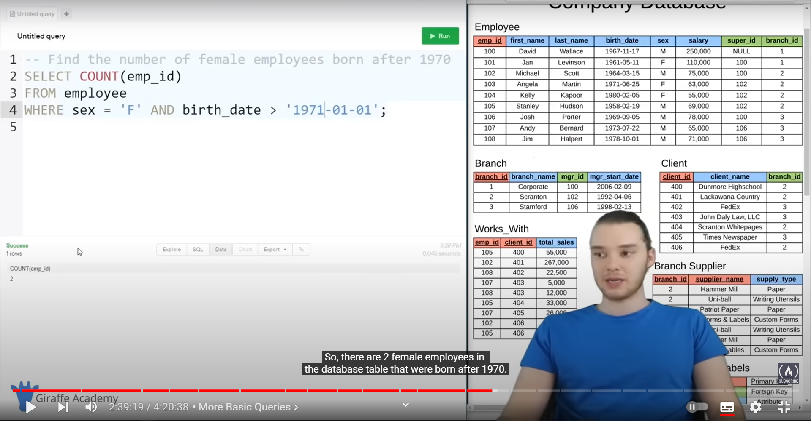

# SQL

1. Primary key = Not NULL + UNIQUE

2. if somebody didn't enter a major, instead of that field being left as NULL, it will be filled `undecided` by default because of `default` keyword

3. Auto increment the primary key instead of manually putting it in everytime creating a row.

4. update a specific column with update keyword:

* If I don't use a condition whith `where` keyword, all the rows will be affected:

5. Delete Row

* if we don't use the `Where` clause, all the rows/entries will be deleted but the table will be still there:

# Query

1. 

2.   

3. 

4. Names are in sorted order

5. sort names in desc order

6. result would show in terms of sorted student id

7. Limit the result shown:

# Query with filtering

1. 

2. 

3. 

4. all student with major not equal to chemistry:

* 

* 

* 

* ***IN keyword:***

# Company database (Relational Database) :

composite key: multiple primary key is necessary because. For example, only marks may not uniquely identify each row, you might need a username too.

or,

emp_id sold 500,000 worth of product to client_id. in this case, we need emp_id and client_id both as primary key because both needs to match with each other for their sales info.(how much emp x sold to client y)

1. 

2. 

3. 

4. 

5. 

6. 

7. Distinct Keyword

# SQL Functions

1. Count()

2. AVG()

3. SUM()

# Aggregation:

* And aggregation is basically where we can use the above functions and we can display the data that we get back in a more helpful way.

* How much each client spent:

# WildCards

* in the example below, % means there wil be any number of characters and it needs to match with LLC at the end of the string.

* this time, it will match any substring that matches with Label

* here, 4 underscore means 4 characters, we did it for year

# Union

