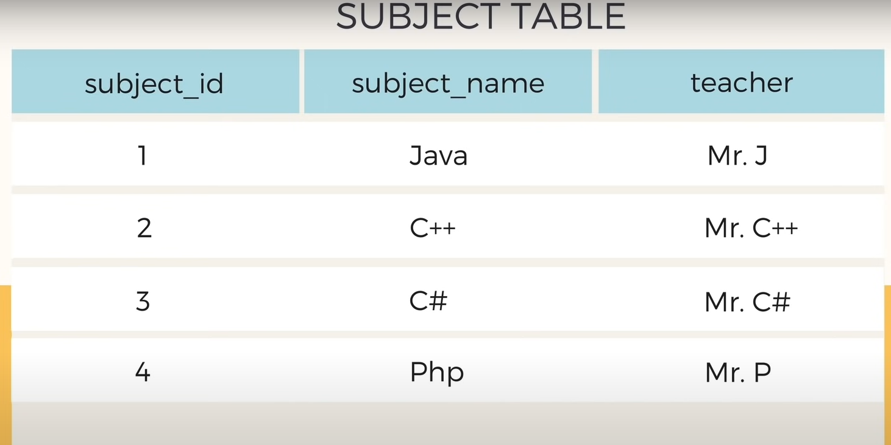

# SQL

1. 

2. 

3. Add Column


4. Delete Column
   
   

------

--------

1. Primary key = Not NULL + UNIQUE


2. if somebody didn't enter a major, instead of that field being left as NULL, it will be filled `undecided` by default because of `default` keyword


3. Auto increment the primary key instead of manually putting it in everytime creating a row.


4. update a specific column with update keyword:


* If I don't use a condition whith `where` keyword, all the rows will be affected:


5. Delete Row


* if we don't use the `Where` clause, all the rows/entries will be deleted but the table will be still there:


# Query

1. 

2. 

3. 

4. Names are in sorted order


5. sort names in desc order


6. result would show in terms of sorted student id


7. Limit the result shown:


# Query with filtering

1. 

2. 

3. 

4. all student with major not equal to chemistry:


* 

* 

* 

* ***IN keyword:***


# Company database (Relational Database) :

composite key: multiple primary key is necessary because. For example, only marks may not uniquely identify each row, you might need a username too.

or,

emp_id sold 500,000 worth of product to client_id. in this case, we need emp_id and client_id both as primary key because both needs to match with each other for their sales info.(how much emp x sold to client y)


1. 

2. 

3. 

4. 

5. 

6. 

7. Distinct Keyword


# SQL Functions

1. Count()


2. AVG()


3. SUM()


# Aggregation:

[In MySQL, an aggregate function performs a calculation on multiple values and returns a single value](https://www.mysqltutorial.org/mysql-aggregate-functions/)[1](https://www.mysqltutorial.org/mysql-aggregate-functions/). [These functions are often used with the `GROUP BY` clause to calculate an aggregate value for each group](https://www.mysqltutorial.org/mysql-aggregate-functions/)[1](https://www.mysqltutorial.org/mysql-aggregate-functions/). Here are some commonly used aggregate functions in MySQL:

- [`AVG()`: Returns the average value of the argument](https://www.mysqltutorial.org/mysql-aggregate-functions/)[2](https://dev.mysql.com/doc/refman/8.0/en/aggregate-functions.html).
- [`COUNT()`: Returns a count of the number of rows returned](https://www.mysqltutorial.org/mysql-aggregate-functions/)[2](https://dev.mysql.com/doc/refman/8.0/en/aggregate-functions.html).
- [`SUM()`: Returns the sum](https://www.mysqltutorial.org/mysql-aggregate-functions/)[2](https://dev.mysql.com/doc/refman/8.0/en/aggregate-functions.html).
- [`MAX()`: Returns the maximum value](https://www.mysqltutorial.org/mysql-aggregate-functions/)[2](https://dev.mysql.com/doc/refman/8.0/en/aggregate-functions.html).
- [`MIN()`: Returns the minimum value](https://www.mysqltutorial.org/mysql-aggregate-functions/)[2](https://dev.mysql.com/doc/refman/8.0/en/aggregate-functions.html).

[The syntax of an aggregate function is as follows](https://www.mysqltutorial.org/mysql-aggregate-functions/)[1](https://www.mysqltutorial.org/mysql-aggregate-functions/):

```sql
function_name(DISTINCT | ALL expression)
```

In this syntax:

- First, specify the name of the aggregate function (e.g., `AVG()`).
- Second, use `DISTINCT` if you want to calculate based on distinct values or `ALL` in case you want to calculate all values including duplicates. The default is `ALL`.
- [Third, specify an expression that can be a column or an expression that involves column and arithmetic operators](https://www.mysqltutorial.org/mysql-aggregate-functions/)[1](https://www.mysqltutorial.org/mysql-aggregate-functions/).

[For example, you can use the `AVG()` function to calculate the average buy price of all products in the products table by using the following query](https://www.mysqltutorial.org/mysql-aggregate-functions/)[1](https://www.mysqltutorial.org/mysql-aggregate-functions/):

```sql
SELECT AVG(buy_price) FROM products;
```

[This will return the average `buy_price` of all products in the `products` table](https://www.mysqltutorial.org/mysql-aggregate-functions/)[1](https://www.mysqltutorial.org/mysql-aggregate-functions/).

---------------------

* And aggregation is basically where we can use the above functions and we can display the data that we get back in a more helpful way.


* How much each client spent:


---------

-------

In SQL, both `GROUP BY` and `HAVING` are used in conjunction with aggregate functions like `COUNT()`, `SUM()`, `AVG()`, `MAX()`, `MIN()`, etc. However, they serve different purposes:

- **GROUP BY**: This is used to group rows that have the same values in specified columns into aggregated data. It is often used with aggregate functions (`COUNT`, `SUM`, `AVG`, `MAX`, `MIN`) to group the result-set by one or more columns. For example:
  
  ```sql
  SELECT COUNT(id), country
  FROM Customers
  GROUP BY country;
  ```
  
  This SQL statement lists the number of customers in each country.

- **HAVING**: This is used to filter the results of aggregate functions. `HAVING` is added after `GROUP BY` to restrict the groups of returned rows to only those whose the condition is `TRUE`. `HAVING` is often used with `GROUP BY`. For example:
  
  ```sql
  SELECT COUNT(id), country
  FROM Customers
  GROUP BY country
  HAVING COUNT(id) > 5;
  ```
  
  This SQL statement lists the number of customers in each country, but only include countries with more than 5 customers.

So, if you want to aggregate your data (i.e., group it together based on certain columns), you would use `GROUP BY`. If you want to filter the aggregated data, you would use `HAVING`. Often, you’ll use them together to aggregate your data and then filter the aggregated results. It’s not a matter of using one or the other; they’re used for different things and often used together.

# WildCards

* in the example below, % means there wil be any number of characters and it needs to match with LLC at the end of the string.


* this time, it will match any substring that matches with Label


* here, 4 underscore means 4 characters, we did it for year


# Union

- Union is used to combine the results of multiple select statements into one.

rule 1: you need to have the same number of columns in each select statement for Union to work. in below example, we select one column from first select statment and also same for the second select statement


* below code will show error because it does not satisfy rule 1 for UNION to work


Rule 2: they need to have similar data types. in above example, first name from first select statement and branch name from second select statements are both strings so they work

Example of 3 select statements with 2 unions:


* the column name of all these union operations is showing as first_name but because that's the first select statment. so let's change it:


Another Example:


make it more readable by adding the prefix of table name in front:


* another example:


# Join

* Join is used to combine rows from two or more tables, based on the related column.

* for example, employee_id from Employee table and manager_id from Branch table.


* There are 4 types of join: 
1. Inner join: the one we performed above.

2. Left Join: Includes all the fields from the left table even some of them are not present in the right table. (those not present in the right table will show null):


3. Right join is opposite of Left join:


4. Full join (no supported in mySQL): left join + right join


# Nested Queries

* Nested Query is something where we use multiple select statements in order to get specific information from the database where we need to use the results of one select statement to inform another select statements to perform queries.


# View

when we run select statement in sql, we can save the results with view:


-----------

-----

-----

# [25 Advanced SQL Query Examples](https://learnsql.com/blog/25-advanced-sql-query-examples/)

@@ Sure, I’d be happy to explain the ranking system used in the SQL query you provided.

The `RANK()` function in SQL is a <mark>window function</mark> that assigns a unique rank to each row within the partition of a result set. The rank of a row is determined by one or more ordering expressions.

Here’s how it works in the context of your query:

```sql
RANK() OVER (ORDER BY salary DESC) as ranking
```

This part of the query calculates a rank for each row (employee) based on their salary:

- `RANK()`: This is the function that will generate the ranks.
- `OVER (ORDER BY salary DESC)`: This is called a window clause. It defines the window or set of rows the function will operate on. In this case, it’s ordering the employees by their salary in descending order. So, the employee with the highest salary is first in the window.
- `as ranking`: This simply renames the new column as “ranking”.

The function operates as follows:

1. It orders the employees by their salary in descending order.
2. It then goes through the ordered list and assigns a rank to each row. The employee with the highest salary gets a rank of 1. The employee with the second highest salary gets a rank of 2, and so on.
3. If two (or more) employees have the same salary, they get the same rank. The next salary down will skip a rank. For example, if two employees both have the highest salary, they both get a rank of 1, and the employee with the next highest salary gets a rank of 3.

So, the `RANK()` function provides a way to rank each row within a result set based on specific criteria. In your case, it’s ranking employees based on their salary. The final result is a list of employees along with their salaries and their rank among all employees based on salary. I hope this helps! 😊

@@ A window function in SQL is a type of function that performs a calculation across a set of rows that are related to the current row. This is called a “window”, hence the name “window function”. Unlike aggregate functions, which return a single result per group of rows, window functions return a single result for each row, based on the rows in its window.

Here’s the basic syntax of a window function:

```sql
window_function_name (expression) OVER (
  partition_clause
  order_clause
  frame_clause
)
```

- `window_function_name`: The name of the window function, such as `ROW_NUMBER()`, `RANK()`, `SUM()`, etc.
- `expression`: The column or expression that the window function will operate on.
- `OVER`: This keyword begins the window specification.
- `partition_clause`: This clause divides the rows into partitions or groups. The window function is applied separately to each partition.
- `order_clause`: This clause orders the rows within each partition.
- `frame_clause`: This clause further limits the rows within a partition to a certain range or “frame”. For example, you might want to include only the rows from the current row to the next 5 rows.

Here’s an example of a window function in action:

```sql
SELECT 
  first_name,  
  last_name,  
  salary, 
  SUM(salary) OVER (PARTITION BY dept ORDER BY salary DESC) as sum_salary 
FROM employees;
```

[In this query, the `SUM(salary) OVER (PARTITION BY dept ORDER BY salary DESC)` part is a window function that calculates the cumulative salary for each department (because we’re partitioning by `dept`), ordered by salary in descending order](https://www.sqltutorial.org/sql-window-functions/)[1](https://www.sqltutorial.org/sql-window-functions/)[2](https://learnsql.com/blog/sql-window-functions-examples/).

I hope this helps! If you have any more questions, feel free to ask. 😊

# Normalization

# 1NF (first Normal form)

1. There's no such thing in a relational database as row order. there needs to be a separate column for ordering. ([Learn Database Normalization - 1NF, 2NF, 3NF, 4NF, 5NF - YouTube](https://youtu.be/GFQaEYEc8_8?t=321)) 

2. mixing multiple datatypes within a single column. for example, mixing int and string in a column. (Beatle_height column)

3. designing a table without a primary key violates 1st Normal Form.

4. storing a repeating group of data items on a single row violates 1st Normal Form. (For example, a player's inventory can have hundreds of items, keeping them in a row would mean hundreds of different columns for different items.) (Another terrible idea is to keep all these hundreds of items in a single column as string, that way we can't perform queries) - so the solution is keep a single column as Item_type. and another column quantity. - here, primary key will be (player_id and item_type)

5. 


# 2NF - 2nd Normal Form

1. Each non-key attribute must depend on the entire primary key.


# 

# Normalization - 2 ([Basic Concept of Database Normalization - Simple Explanation for Beginners - YouTube](https://youtu.be/xoTyrdT9SZI?list=PLLGlmW7jT-nTr1ory9o2MgsOmmx2w8FB3))

### what is Normalization?

Normalization is a technique of organizing the data into multiple related tables to minimize data redundancy.

### Now, what is data redundancy and why should you reduce it?


Data redundancy is - repetition of similar data at multiple places.

- Repetition of data increases the size of database. Not only this, it also leads to multiple other issues like:

- - Insertion Anomaies, Deletion Anomalies, Updation Anomalies./modification Anomalies
1. Insertion Anomaly: We have a table here that has repeating data for branch, headOfDepartment, office_tel. Now we have 5 rows, but if we need to add 100 more students, we have to repeat these same data 100 more times, which leads to insertion anomaly. 


- Because the repetition of data will only increase, as we insert more entries to our table.
2. Deletion Anomaly: We have two types of data in our table - student info and branch info. Now, if we want to delete a student info, it would also delete the branch info.


3. Updation/ Modification Anomaly: Let's say, if Mr. X leaves and Mr. Y joins as new HOD, for CSE ..... So we need to update all the student records with the new name of the HOD, this is super inefficient!!!


During this huge amount of modification, even if a single record is left out, this will lead to inconsistent data. Hence, Updation Anomaly can lead to data inconsistency.


# Now, we want to know how Normalization solves these problems?


- Normalization is not about eliminating data redundancy, it's about minimizing data redundancy. because, we can see that, branch name is still getting repeated in the student table, but that's how it is.

- Now, if we need to update the hod or office_tel number of CSE, we just need to update in one single record in the branch table and the student table will automatically be updated bcz it's connected to the branch table.


Now, let's see what we could improve:

1. Now, if we need to add a new student, we just need to add the student id, student name and the branch name,  (we don't need to add the entire branch info, becz it's stored in a separe table and student table is linked to it)


2. When we need to delete student information, maybe bcz we need to add student of the new batch, even if we deleted all the student information, we'll still have the branch info in a separate table intact!


3. Now, if we have to update the name of the hod, we just need to modify one single record in the branch table, we don't need to touch the student table.


--------

### Result:


----------

# Types of Normalization:

- Normalization can be achieved in multiple ways. We have 3 basic normal forms in which we can achieve normalization.

### 1st Normal Form: (4 conditions)

1. each column can only have one value. In below table, all the 3 conditions of 1st NF are maintained except for one:


### 2nd Normal Form (2 conditions):


Partial Dependency: 


- Dependency is: we depend on primary key to uniquely identify the record.


We can see that, in the below table, if we want to uniquely identify a record, we need both student_id and subject_id to be as primary key but! if we wanted to identify teacher, teacher only depends on subject_id to identify teacher, it does not depend on student_id


And a table to be in 2nd Normal Form, this should Not Exist! (Partial Dependency)


- There can be many different solutions to remove partial dependency.

- Our objective is to remove teacher column from the score table. We can achieve it in different ways:

Way 1:


Now it becomes:



Way 2: we can create another table for teacher


### 3rd Normal Form (2 conditions):


This is Transitive dependency where total_marks depends on a non primary key column.


Solution: take exam_name and total_marks and create a separate table.


So, our Score table is now storing more information and it is now in 3rd normal form.


------------

# Testing my knowledge

- I'm preparing for a written test for software engineering position. Give me database written questions.

Sure, here are some database-related questions you might encounter in a written test for a software engineering position:

1. [**What are your approaches to write test cases for database testing?**](https://www.remoterocketship.com/advice/guide/qa-engineer/database-testing-interview-questions-and-answers)[1](https://www.remoterocketship.com/advice/guide/qa-engineer/database-testing-interview-questions-and-answers)
2. [**How do you ensure the accuracy of the data?**](https://www.remoterocketship.com/advice/guide/qa-engineer/database-testing-interview-questions-and-answers)[1](https://www.remoterocketship.com/advice/guide/qa-engineer/database-testing-interview-questions-and-answers)
3. [**What experience do you have with database design and development?**](https://interviewprep.org/database-engineer-interview-questions/)[2](https://interviewprep.org/database-engineer-interview-questions/)
4. [**Describe your experience working with relational databases such as MySQL, Oracle, or SQL Server.**](https://www.remoterocketship.com/advice/guide/qa-engineer/database-testing-interview-questions-and-answers)[2](https://interviewprep.org/database-engineer-interview-questions/)
5. [**Are you familiar with NoSQL databases such as MongoDB or Cassandra?**](https://www.remoterocketship.com/advice/guide/qa-engineer/database-testing-interview-questions-and-answers)[2](https://interviewprep.org/database-engineer-interview-questions/)
6. [**How do you ensure data integrity when designing a database?**](https://interviewprep.org/database-engineer-interview-questions/)[2](https://interviewprep.org/database-engineer-interview-questions/)
7. [**What is Database testing/Back-end testing?**](https://www.softwaretestinghelp.com/31-best-database-testing-interview-questions-and-answers-for-qa-testers/)[3](https://www.softwaretestinghelp.com/31-best-database-testing-interview-questions-and-answers-for-qa-testers/)
8. [**What is Data Validity testing?**](https://www.remoterocketship.com/advice/guide/qa-engineer/database-testing-interview-questions-and-answers)[3](https://www.softwaretestinghelp.com/31-best-database-testing-interview-questions-and-answers-for-qa-testers/)
9. [**What is Data Integrity testing?**](https://www.remoterocketship.com/advice/guide/qa-engineer/database-testing-interview-questions-and-answers)[3](https://www.softwaretestinghelp.com/31-best-database-testing-interview-questions-and-answers-for-qa-testers/)
10. [**What is Database Performance testing?**](https://www.softwaretestinghelp.com/31-best-database-testing-interview-questions-and-answers-for-qa-testers/)[3](https://www.softwaretestinghelp.com/31-best-database-testing-interview-questions-and-answers-for-qa-testers/)
11. [**What is the testing of Procedure, Triggers, and Functions?**](https://www.softwaretestinghelp.com/31-best-database-testing-interview-questions-and-answers-for-qa-testers/)[3](https://www.softwaretestinghelp.com/31-best-database-testing-interview-questions-and-answers-for-qa-testers/)

Remember, it’s important to not only know the answers but also understand the concepts behind them. Good luck with your preparation!

# Database Indexing


1. primary Indexing: It is done based on the primary key.

2. secondary indexing: If we are indexing based on the candidate keys, it is called secondary indexing.

3. clustering indexing: when we do the indexing based on non key attributes. There can be multiple records within the table with the same countryname BD. So, if we take BD, we can make a cluster of it.
- So, if we want to search something that has countryname BD, we can just search among the records that has countryname BD. If we tried to search among all the records containing all the countries, it would be inefficient.

- This is how non key indexing - clustering indexing helps us by making a spearate cluster for a particular field.

-------

primary indexing is of 2 types: Dense Index & Sparse Index


1. Dense Index: store the corresponding primary key and it's memory location for every single search key value. so it requires more space.

2. 
