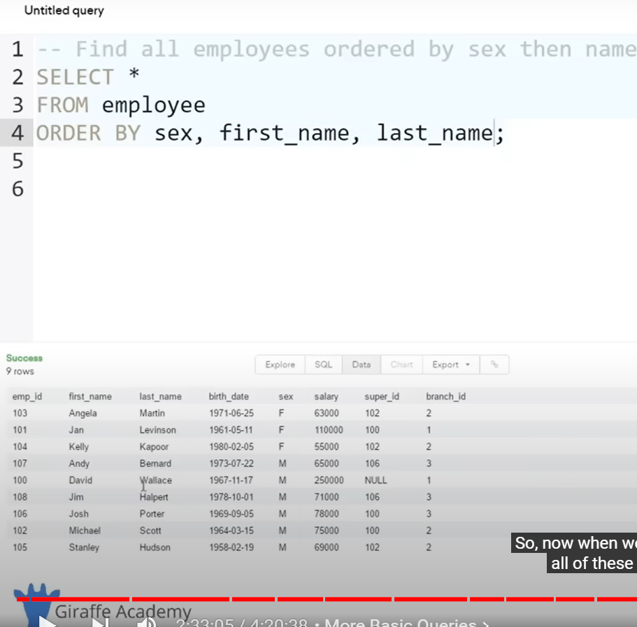

# SQL

1. 

2. 

3. Add Column


4. Delete Column
   
   

------

--------

1. Primary key = Not NULL + UNIQUE


2. if somebody didn't enter a major, instead of that field being left as NULL, it will be filled `undecided` by default because of `default` keyword


3. Auto increment the primary key instead of manually putting it in everytime creating a row.


4. update a specific column with update keyword:


* If I don't use a condition whith `where` keyword, all the rows will be affected:


5. Delete Row


* if we don't use the `Where` clause, all the rows/entries will be deleted but the table will be still there:


# Query

1. 

2. 

3. 

4. Names are in sorted order


5. sort names in desc order


6. result would show in terms of sorted student id


7. Limit the result shown:


# Query with filtering

1. 

2. 

3. 

4. all student with major not equal to chemistry:


* 

* 

* 

* ***IN keyword:***


# Company database (Relational Database) :

composite key: multiple primary key is necessary because. For example, only marks may not uniquely identify each row, you might need a username too.

or,

emp_id sold 500,000 worth of product to client_id. in this case, we need emp_id and client_id both as primary key because both needs to match with each other for their sales info.(how much emp x sold to client y)

1. 

2. 

3. 

4. 

5. 

6. 

7. Distinct Keyword


# SQL Functions

1. Count()


2. AVG()


3. SUM()


# Aggregation:

[In MySQL, an aggregate function performs a calculation on multiple values and returns a single value](https://www.mysqltutorial.org/mysql-aggregate-functions/)[1](https://www.mysqltutorial.org/mysql-aggregate-functions/). [These functions are often used with the `GROUP BY` clause to calculate an aggregate value for each group](https://www.mysqltutorial.org/mysql-aggregate-functions/)[1](https://www.mysqltutorial.org/mysql-aggregate-functions/). Here are some commonly used aggregate functions in MySQL:

- [`AVG()`: Returns the average value of the argument](https://www.mysqltutorial.org/mysql-aggregate-functions/)[2](https://dev.mysql.com/doc/refman/8.0/en/aggregate-functions.html).
- [`COUNT()`: Returns a count of the number of rows returned](https://www.mysqltutorial.org/mysql-aggregate-functions/)[2](https://dev.mysql.com/doc/refman/8.0/en/aggregate-functions.html).
- [`SUM()`: Returns the sum](https://www.mysqltutorial.org/mysql-aggregate-functions/)[2](https://dev.mysql.com/doc/refman/8.0/en/aggregate-functions.html).
- [`MAX()`: Returns the maximum value](https://www.mysqltutorial.org/mysql-aggregate-functions/)[2](https://dev.mysql.com/doc/refman/8.0/en/aggregate-functions.html).
- [`MIN()`: Returns the minimum value](https://www.mysqltutorial.org/mysql-aggregate-functions/)[2](https://dev.mysql.com/doc/refman/8.0/en/aggregate-functions.html).

[The syntax of an aggregate function is as follows](https://www.mysqltutorial.org/mysql-aggregate-functions/)[1](https://www.mysqltutorial.org/mysql-aggregate-functions/):

```sql
function_name(DISTINCT | ALL expression)
```

In this syntax:

- First, specify the name of the aggregate function (e.g., `AVG()`).
- Second, use `DISTINCT` if you want to calculate based on distinct values or `ALL` in case you want to calculate all values including duplicates. The default is `ALL`.
- [Third, specify an expression that can be a column or an expression that involves column and arithmetic operators](https://www.mysqltutorial.org/mysql-aggregate-functions/)[1](https://www.mysqltutorial.org/mysql-aggregate-functions/).

[For example, you can use the `AVG()` function to calculate the average buy price of all products in the products table by using the following query](https://www.mysqltutorial.org/mysql-aggregate-functions/)[1](https://www.mysqltutorial.org/mysql-aggregate-functions/):

```sql
SELECT AVG(buy_price) FROM products;
```

[This will return the average `buy_price` of all products in the `products` table](https://www.mysqltutorial.org/mysql-aggregate-functions/)[1](https://www.mysqltutorial.org/mysql-aggregate-functions/).

---------------------

* And aggregation is basically where we can use the above functions and we can display the data that we get back in a more helpful way.


* How much each client spent:


# WildCards

* in the example below, % means there wil be any number of characters and it needs to match with LLC at the end of the string.


* this time, it will match any substring that matches with Label


* here, 4 underscore means 4 characters, we did it for year


# Union

rule 1: you need to have the same number of columns in each select statement for Union to work. in below example, we select one column from first select statment and also same for the second select statement


* below code will show error because it does not satisfy rule 1 for UNION to work


Rule 2: they need to have similar data types. in above example, first name from first select statement and branch name from second select statements are both strings so they work

Example of 3 select statements with 2 unions:


* the column name of all these union operations is showing as first_name but because that's the first select statment. so let's change it:


Another Example:


make it more readable by adding the prefix of table name in front:


* another example:


# Join

* Join is used to combine rows from two or more tables, based on the related column.

* for example, employee_id from Employee table and manager_id from Branch table.


* There are 4 types of join: 
1. Inner join: the one we performed above.

2. Left Join: Includes all the fields from the left table even some of them are not present in the right table. (those not present in the right table will show null):


3. Right join is opposite of Left join:


4. Full join (no supported in mySQL): left join + right join


# Nested Queries

* Nested Query is something where we use multiple select statements in order to get specific information from the database where we need to use the results of one select statement to inform another select statements to perform queries.


# View

when we run select statement in sql, we can save the results with view:


-----------

-----

-----

# [25 Advanced SQL Query Examples](https://learnsql.com/blog/25-advanced-sql-query-examples/)

@@ Sure, I’d be happy to explain the ranking system used in the SQL query you provided.

The `RANK()` function in SQL is a <mark>window function</mark> that assigns a unique rank to each row within the partition of a result set. The rank of a row is determined by one or more ordering expressions.

Here’s how it works in the context of your query:

```sql
RANK() OVER (ORDER BY salary DESC) as ranking
```

This part of the query calculates a rank for each row (employee) based on their salary:

- `RANK()`: This is the function that will generate the ranks.
- `OVER (ORDER BY salary DESC)`: This is called a window clause. It defines the window or set of rows the function will operate on. In this case, it’s ordering the employees by their salary in descending order. So, the employee with the highest salary is first in the window.
- `as ranking`: This simply renames the new column as “ranking”.

The function operates as follows:

1. It orders the employees by their salary in descending order.
2. It then goes through the ordered list and assigns a rank to each row. The employee with the highest salary gets a rank of 1. The employee with the second highest salary gets a rank of 2, and so on.
3. If two (or more) employees have the same salary, they get the same rank. The next salary down will skip a rank. For example, if two employees both have the highest salary, they both get a rank of 1, and the employee with the next highest salary gets a rank of 3.

So, the `RANK()` function provides a way to rank each row within a result set based on specific criteria. In your case, it’s ranking employees based on their salary. The final result is a list of employees along with their salaries and their rank among all employees based on salary. I hope this helps! 😊

@@ A window function in SQL is a type of function that performs a calculation across a set of rows that are related to the current row. This is called a “window”, hence the name “window function”. Unlike aggregate functions, which return a single result per group of rows, window functions return a single result for each row, based on the rows in its window.

Here’s the basic syntax of a window function:

```sql
window_function_name (expression) OVER (
  partition_clause
  order_clause
  frame_clause
)
```

- `window_function_name`: The name of the window function, such as `ROW_NUMBER()`, `RANK()`, `SUM()`, etc.
- `expression`: The column or expression that the window function will operate on.
- `OVER`: This keyword begins the window specification.
- `partition_clause`: This clause divides the rows into partitions or groups. The window function is applied separately to each partition.
- `order_clause`: This clause orders the rows within each partition.
- `frame_clause`: This clause further limits the rows within a partition to a certain range or “frame”. For example, you might want to include only the rows from the current row to the next 5 rows.

Here’s an example of a window function in action:

```sql
SELECT 
  first_name,  
  last_name,  
  salary, 
  SUM(salary) OVER (PARTITION BY dept ORDER BY salary DESC) as sum_salary 
FROM employees;
```

[In this query, the `SUM(salary) OVER (PARTITION BY dept ORDER BY salary DESC)` part is a window function that calculates the cumulative salary for each department (because we’re partitioning by `dept`), ordered by salary in descending order](https://www.sqltutorial.org/sql-window-functions/)[1](https://www.sqltutorial.org/sql-window-functions/)[2](https://learnsql.com/blog/sql-window-functions-examples/).

I hope this helps! If you have any more questions, feel free to ask. 😊
