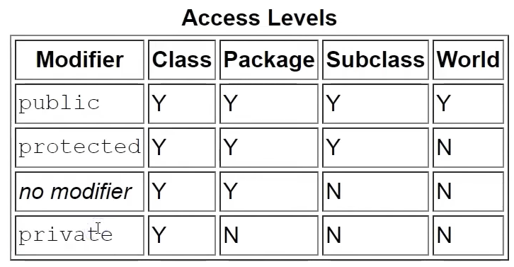

* Class Initialize korar jonno oi class er constructor call kora lage. for example:
  
  * ```java
    Car car = new Car(); //init by empty constructor
    Animal animal = new Animal("Dog", "brown", 2); //init by constructor with parameters
    ```

## java will force you to find entities which will have attributes and behaviours. That entity will be a java class.

class is a blueprint of an object which brings the question as what is object an object is basically an instance of the class.

a class is technically a logical entity

We can think of class as an entity in the world. we say that java is heavily inspired from real life examples and classes and objects are the reason we say that because whatever you see in the world is always basically

some entity - human beings are an entity, cars are an entity, students are an entity ,so all the actors which we see in the world are basically entities and we can map them as classes.

in java why do we want to map them - because these entities have basically

two kind of specifications - Every entity will have some attributes and it will have some behavior and actually that is how you identify an entity for example human

beings have attributes like we have hands we have eyes we have ears legs etc

these are our attributes. Then we have our behaviors. Behaviors are actions. Human being can speak so speaking is an action - it's abehavior. 

they can listen - is an action, it's a behavior. Can walk is an action is a behavior

similarly can eat is also an action or a behavior so that's how you basically represent an entity.

<u>*Entities have attributes and behaviors. if we see those two specifications in any entity we can map that entity or  write that enity as a class because a class in java - Will exactly have these two properties it will have some attributes which are called fields or member variables and it will have some behaviors which are called as methods so it will have attributes and behaviours similar to real-world entity*</u>

Together, the methods and fields of a class are commonly referred to as its members. Members encapsulate the behavior (methods) and state (fields) of the class. So, when discussing the components that make up a class in Java, you can use the term "class members" to encompass both methods and fields.

## why do we need it?

when a client provides me his requirements for a particular project, I will be able to identify the attributes and behaviors of the entities of that project and able to create classes according to the requirements. Thats how I would be able to transfer the real world requirements of a project into code.

# inside a class

* how do you initialize objects/attributes/fields in a classe? -> through setters and constructors.

## Access Modifiers



Access modifiers are used to only expose the attributes, methods and classes which are supposed to be exposed to the consumer.

# Inheritance

* When we have multiple classes to share similar behaviour(mehtods) and attributes(fields)

* For example, let's say we have banking system, we can have commercial account, personal account, loan account etc. In these classes, we have some common behavior but at the same time we also have some different behavior so whenever you have such scenario always think about applying the concept of inheritance.

* here's another simple way to spot whether inheritance can be used at a particular place or not: 
  
  Inheritance is also used when there's a relationship(relationship of a super class and subclass/'es) between two entities or classes. whenever you read the requirements from a client just try to find the words which use this particular phrase "is a"
  
  - for example car "is a" vehicle. 
  
  - savings account "is a" type of account.

# Encapsulation

* Encapsulation is basically to combine methods and attributes in a single unit, which is a class and protect  the attributes/properties of the class to the outside world(package) Which allows us to have full contol on how the outside world can access or modify the attributes.

* We have full control of the class:
  
  * We control the visibility/access of the attributes/fields
  
  * We control how they should be assigned through setters
  
  * We control how they should be accessed through getters

# Abstraction

* With abstraction, we can avoid duplicate codes and write better code. Let's say we have a parent class and we have multiple subclasses that extends from the parent class. All of these subclasses overrides the same method of the parent class and implements their own functionalities. Now, if that method in the parent class had any implemented code in it's method body, it would be wasted code since all the subclasses overrides it to implement their own functionalities. So we need to make that method an abstract method to avoid duplicates or unnecessary codes. Now, to make that method as an abstract method, we need to make that parent class abstract as well, which means we can not create any instance of the parent class, which is fine anyway and even better, because we are using it as a blueprint for the subclasses to organize the subclasses and we only need instance of the subclasses.
* abstract classes cannot be instantiated explicitly. They can only be instantiated by the child classes through the internal mechanisms of java itself (inheritance)
* Abstraction is necessary when we want subclasses to inherit from a super class and when we only need the objects of those subclasses. For example, we make a generic class for all type of Vehicles as Vehicle and Car, Bike, CNG etc. will extend from that class and in such cases we will only work with these subclasses. So we make Vehicle as an abstract class.
* So why we make Vehicle as abstract? Of course we will have some common methods and attributes inside the Vehicle class that all Vehicle should have, for example each vehicle has tires, but the layout or number of tires can be different, so we have some common characteristics but we cannot implement the exact type. So we should declare a common method and let the sub classes override it and implement their own functionalities. This is where we need to make Abstract methods. And of course to achieve this functionality, to avoid code duplication and write better code, we need to make the parent class abstract as well, only then we can use abstract methods.
* So why do we need to declare the abstract method in the parent class at all? the base classes can just create these methods on their own anyway. - The reason is, to organize and to enforce every subclass of class animal that every subclass must have.

<u>**other functionalities of abstraction aside for what I've just described:**</u>

Absolutely, abstraction in programming has several other important functionalities beyond what you’ve described:

1. [**Simplification**: Abstraction simplifies the process of understanding complex systems by allowing us to focus on high-level concepts rather than the details](https://www.freecodecamp.org/news/what-is-abstraction-in-programming/)[1](https://www.freecodecamp.org/news/what-is-abstraction-in-programming/)[2](https://www.freecodecamp.org/news/what-is-abstraction-in-programming-for-beginners/).

2. [**Code Reusability**: Abstraction helps to reduce code duplication and improves reusability](https://www.programmingcube.com/why-do-we-use-abstraction-in-programming/)[3](https://www.programmingcube.com/why-do-we-use-abstraction-in-programming/). By creating abstract classes or interfaces, we can define common methods and properties that can be shared across multiple classes.

3. [**Security**: Abstraction contributes to the security of an application by exposing only necessary information to the user](https://www.programmingcube.com/why-do-we-use-abstraction-in-programming/)[3](https://www.programmingcube.com/why-do-we-use-abstraction-in-programming/). This is often referred to as data hiding or encapsulation.

4. [**Code Maintainability**: Abstraction fosters code maintainability](https://www.freecodecamp.org/news/what-is-abstraction-in-programming/)[4](https://www.geeksforgeeks.org/why-are-abstractions-important-in-system-design/). By separating concerns into different classes or modules, we can make changes to one part of the system without affecting others.

5. [**Collaboration**: Abstraction facilitates collaboration among developers](https://www.freecodecamp.org/news/what-is-abstraction-in-programming/)[4](https://www.geeksforgeeks.org/why-are-abstractions-important-in-system-design/). Developers can work concurrently on different components of the application, ensuring modularity and reducing dependencies.

6. **Understanding and Using Libraries/Frameworks**: You don’t need to know the inner workings of a function or framework in programming to use it. [But knowing how those things work can make you a better programmer](https://www.freecodecamp.org/news/what-is-abstraction-in-programming/)[1](https://www.freecodecamp.org/news/what-is-abstraction-in-programming/).

Remember, the goal of abstraction is to reduce complexity by breaking down problems into more manageable parts. It’s a fundamental concept in programming and is key to writing efficient, maintainable code.


**<u>Examples for these 6 functionalities:</u>**

Sure, let’s illustrate the six functionalities of abstraction with code examples in Java:

1. **Simplification**: Abstraction allows us to hide complex details behind simple interfaces. Here’s an example using a `Car` class:

```java
class Car {
    private Engine engine;

    public Car() {
        this.engine = new Engine();
    }

    public void start() {
        engine.start();
    }
}

class Engine {
    public void start() {
        // Complex code to start the engine
    }
}
```

In this example, the `Car` class simplifies the process of starting the engine. The user doesn’t need to know how the engine starts; they just need to call the `start` method of the `Car` class.

2. **Code Reusability**: Abstraction promotes code reusability through inheritance and interfaces. Here’s an example using a `Shape` abstract class and `Circle` and `Rectangle` classes:

```java
abstract class Shape {
    abstract void draw();
}

class Rectangle extends Shape {
    void draw() {
        System.out.println("Drawing rectangle");
    }
}

class Circle extends Shape {
    void draw() {
        System.out.println("Drawing circle");
    }
}
```

In this example, the `Shape` abstract class provides a method `draw()` that is implemented by each subclass. This promotes code reusability as the `draw()` method can be used by any shape.

3. **Security**: Abstraction contributes to the security of an application by exposing only necessary information to the user. This is often referred to as data hiding or encapsulation. Here’s an example:

```java
public class Employee {
    private String name;

    public String getName() {
        return name;
    }

    public void setName(String name) {
        this.name = name;
    }
}
```

In this example, the `name` field is private and can only be accessed through the `getName()` and `setName()` methods. This hides the internal implementation and protects the field from being directly accessed or modified.

4. **Code Maintainability**: Abstraction fosters code maintainability. By separating concerns into different classes or modules, we can make changes to one part of the system without affecting others. The `Car` and `Engine` example above also illustrates this point.

5. **Collaboration**: Abstraction facilitates collaboration among developers. Developers can work concurrently on different components of the application, ensuring modularity and reducing dependencies. The `Shape`, `Rectangle`, and `Circle` example above also illustrates this point.

6. **Understanding and Using Libraries/Frameworks**: You don’t need to know the inner workings of a function or framework in programming to use it. But knowing how those things work can make you a better programmer. For example, when using a library or framework in Java, you often use methods without needing to understand their internal implementation. This is possible because of abstraction.

Remember, the goal of abstraction is to reduce complexity by breaking down problems into more manageable parts. It’s a fundamental concept in programming and is key to writing efficient, maintainable code. 


**<u>By chatGPT</u>**

Yes, abstraction in object-oriented programming (OOP) serves several purposes beyond what you've described. Here are some additional functionalities and benefits of abstraction:

1. **Encapsulation:** Abstraction often goes hand-in-hand with encapsulation, another fundamental OOP concept. Encapsulation involves bundling the data (attributes) and methods (functions) that operate on the data into a single unit, known as a class. Abstraction helps define a clear interface (through abstract methods) for interacting with the object, and the details of the implementation are hidden from the outside world.

2. **Modularity:** Abstraction supports the creation of modular code by allowing you to break down a complex system into smaller, more manageable components. Each class represents a module with its own responsibilities, and the interactions between these modules are simplified through well-defined interfaces.

3. **Code Reusability:** Abstract classes and interfaces facilitate code reuse. Once you define a common interface through an abstract class or interface, you can create multiple concrete implementations (subclasses) that adhere to that interface. This promotes reuse of code, reducing redundancy and making maintenance easier.

4. **Polymorphism:** Abstraction enables polymorphism, which allows objects of different classes to be treated as objects of a common base class. This facilitates flexibility and extensibility in your code. Polymorphism is often achieved through the use of interfaces or abstract classes, allowing different objects to be used interchangeably.

5. **Framework Development:** Abstraction is crucial in the development of frameworks, where the framework provides a set of abstract classes or interfaces, and users of the framework provide concrete implementations. This separation allows developers to extend and customize the framework without modifying its core code.

6. **Understanding Complexity:** Abstraction allows you to focus on the essential features of an object while ignoring unnecessary details. It simplifies the mental model of a system, making it easier to understand and reason about. This is particularly valuable in large and complex software projects.

7. **Adaptability to Change:** Abstraction helps in managing changes more effectively. If you need to modify the behavior of a system, you can often do so by creating new subclasses or implementing new interfaces without affecting the existing code that relies on the abstract classes or interfaces.

In summary, abstraction is a powerful concept in OOP that goes beyond just avoiding duplicate code. It promotes good design principles, enhances code organization, and contributes to the overall maintainability and extensibility of software systems.

**<u>Example code for above chatGPT:</u>**

Certainly! Let's implement a similar geometric shapes framework in Java, exploring abstraction, encapsulation, modularity, code reusability, polymorphism, and framework development.

```java
// 1. Abstraction and Encapsulation
abstract class Shape {
    private String name;

    public Shape(String name) {
        this.name = name;
    }

    // Abstract method for calculating area
    public abstract double area();

    public String getName() {
        return name;
    }
}

// 2. Modularity and Code Reusability
class Circle extends Shape {
    private double radius;

    public Circle(String name, double radius) {
        super(name);
        this.radius = radius;
    }

    // Concrete implementation of the area method for Circle
    @Override
    public double area() {
        return Math.PI * radius * radius;
    }
}

class Square extends Shape {
    private double side;

    public Square(String name, double side) {
        super(name);
        this.side = side;
    }

    // Concrete implementation of the area method for Square
    @Override
    public double area() {
        return side * side;
    }
}

// 3. Polymorphism
class ShapePrinter {
    public static void printArea(Shape shape) {
        System.out.println("The area of " + shape.getName() + " is: " + shape.area());
    }
}

// 4. Framework Development
public class Main {
    public static void main(String[] args) {
        // Using polymorphism to create instances of different shapes
        Shape circle = new Circle("Circle 1", 5);
        Shape square = new Square("Square 1", 4);

        // Using polymorphism to print the areas of different shapes
        ShapePrinter.printArea(circle);
        ShapePrinter.printArea(square);
    }
}
```

Explanation:

1. **Abstraction and Encapsulation (Shape class):**
   
   - `Shape` is an abstract class with an abstract method `area`.
   - It has a private `name` field, demonstrating encapsulation. The `getName` method provides access to the name attribute.

2. **Modularity and Code Reusability (Circle and Square classes):**
   
   - `Circle` and `Square` are concrete classes that extend the abstract class `Shape`.
   - They provide their own implementations of the `area` method.
   - The constructors use `super(name)` to call the constructor of the base class, demonstrating code reuse.

3. **Polymorphism (ShapePrinter class):**
   
   - The `ShapePrinter` class has a static method `printArea` that takes a `Shape` object as a parameter and prints its area.
   - This demonstrates polymorphism, as the same method can be used for different shapes.

4. **Framework Development (Main class):**
   
   - The `main` method in the `Main` class creates instances of different shapes using the common `Shape` interface.
   - It then uses the `ShapePrinter` to print the areas of these shapes, demonstrating framework development and polymorphism.

This Java example mirrors the Python example but provides a more detailed explanation and additional code snippets to help illustrate each concept.

# Interface

- Interface defines the specifications or contract on how a class should act.

- A subclass can not have two superclasses in java. It can only be done through interface. 

- So, we say you cannot use multiple inheritance with classes in java - a child cannot have two parent or two base classes in java. It is also called the diamond problem because the child class does not know whether to follow the route of base-1 class or the base-2 class.

- To solve it, we need interfaces.

# Polymorphism

* Interface allows us to achieve Polymorphism.
* Polymorphism is a concept where we achieve different functionalities with a common code structure. For example, Interface allows us to achieve Polymorphism. What do we do in interface? We declare abstract methods in an interface and several other classes may implement that interface to override the methods. Here we see that same method, we achieve different functionalities in different classes based on implementation.
* Also, with Inheritance, we achieve similar results as we override the methods of the  super class in the base class as needed.
* Sometimes, we need to call same methods with different parameters - which we know as method overloading also achieves different functionalities with common code.
* Also, when we need to add two numbers, we use the + operator. And when we need to concatenate two strings, we also use + operator. - This is also another example where we achieve different functionalities with + operator in different scenarios.

**Interface allows us to achieve Polymorphism. - How?**

When we use interface, we declare abstract methods in it as necessary and when we implement that interface with different classes, we must override those abstract methods in the interface, achieving different functionalities as per our implementation.

# polymorphism example > shape interface

```java
package com.nayemtech;

import java.util.ArrayList;
import java.util.List;

public class Main {
    public static void main(String[] args) {
        ArrayList<Shape> shapes = new ArrayList<>();
        Shape circle = new Circle(3);
        Shape circle2 = new Circle(5);
        Shape triangle = new Triangle(5, 7);

        shapes.add(circle);
        shapes.add(circle2);
        shapes.add(triangle);

        List<Shape> shapes2 = List.of(circle, triangle, circle2);

        CalculateArea calculateArea = new CalculateArea();
        System.out.println(calculateArea.totalArea(shapes));
        System.out.println(calculateArea.totalArea(shapes2));
    }
} 

package com.nayemtech;
public interface Shape {
    double area();
}


package com.nayemtech;
import java.util.ArrayList;
public class CalculateArea {
    public double totalArea(List<Shape> shapes) { //using List works for ArrayList too
        double sum = 0;
        for (Shape X: shapes) {
            sum +=  X.area();
        }
        return sum;
    }
}


package com.nayemtech;
public class Circle implements Shape {
    double radius;

//    public Circle() {
//    }

    public Circle(double radius) {
        this.radius = radius;
    }

    public double getRadius() {
        return radius;
    }

    public void setRadius(double radius) {
        this.radius = radius;
    }

    @Override
    public double area() {
        return Math.PI * Math.pow(this.radius, 2);
    }
}  

package com.nayemtech;
public class Triangle implements Shape {
    private double base;
    private double height;

    public Triangle(double base, double height) {
        this.base = base;
        this.height = height;
    }

    public double getBase() {
        return base;
    }

    public void setBase(double base) {
        this.base = base;
    }

    public double getHeight() {
        return height;
    }

    public void setHeight(double height) {
        this.height = height;
    }

    @Override
    public double area() {
        return 0.5 * this.base * this.height;
    }
}
```

## Interface Example (Prey(Rabbit), Predator(Eagle), Fish(Prey, Predator))

```java
//********************************************
public class Main {

    public static void main(String[] args) {

        Fish fish = new Fish();

        fish.hunt();
        fish.flee();

    }
}
//********************************************
public interface Prey {

    void flee();
}
//********************************************
public interface Predator {

    void hunt();
}
//********************************************
public class Rabbit implements Prey{


    @Override
    public void flee() {
        System.out.println("*The rabbit is fleeing*");

        }
}
//********************************************
public class Hawk implements Predator{


    @Override
    public void hunt() {
        System.out.println("*The hawk is hunting*");

        }
}
//********************************************
public class Fish implements Prey,Predator{


    @Override
    public void hunt() {
        System.out.println("*The fish is hunting*");

    }

    @Override
    public void flee() {
        System.out.println("*The fish is fleeing*");

    }
}
//********************************************
```

# What's the difference between an abstract class and interface?

1. We can't inherit multiple parent class for a single subclass, but we can do that for interfaces

2. if we declare any fields in an interface, it will be of static final and so we need to initialize it like this `int age = 20` `String name = 'Karim'

3. Also, In abstract classes we can declare non abstract methods but in interfaces, we can only declare abstract methods, default methods or static methods.

4. **When Abstract Class:** When we have lots of subclasses having the same functionalities and same types of fields. (having "is a" relationship)

5. **When Interface:** When we have lots of unrelated classes want to do a certain thing, we can declare that method in an interface and these classes can then implement the interface to override that method to do that certain thing.
