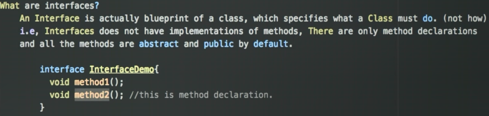

What is OOP

Object-Oriented Programming (OOP) is a programming principle that uses the concept of “objects” to design software. Objects are instances of classes, which are like blueprints. [Each object can have unique values for the properties defined in the class](https://www.educative.io/blog/object-oriented-programming)[1](https://www.educative.io/blog/object-oriented-programming)[2](https://en.wikipedia.org/wiki/Object-oriented_programming). Here are some key points you can mention during an interview:

1. **Definition**: OOP is a paradigm where the complete software operates as a bunch of objects talking to each other. [An object is a collection of data and the methods which operate on that data](https://www.geeksforgeeks.org/oops-interview-questions/)[3](https://www.geeksforgeeks.org/oops-interview-questions/).

2. **Advantages**: OOP provides better manageable code. It increases the overall understanding of the software as the distance between the language spoken by developers and that spoken by users is reduced. [It also eases maintenance by the use of encapsulation](https://www.educative.io/blog/object-oriented-programming)[3](https://www.geeksforgeeks.org/oops-interview-questions/).

3. **Class**: A class is a user-defined data type that contains the data members and member functions that operate on the data members. [It is like a blueprint or template of objects having common properties and methods](https://www.geeksforgeeks.org/oops-interview-questions/)[3](https://www.geeksforgeeks.org/oops-interview-questions/).

4. **Object**: An object is an instance of a class. Data members and methods of a class cannot be used directly. [We need to create an object (or instance) of the class to use them](https://www.educative.io/blog/object-oriented-programming)[3](https://www.geeksforgeeks.org/oops-interview-questions/).

5. [**Main Features**: The four main concepts or principles of OOPs are Encapsulation, Data Abstraction, Polymorphism, and Inheritance](https://www.geeksforgeeks.org/oops-interview-questions/)[3](https://www.geeksforgeeks.org/oops-interview-questions/).

Remember, it’s important to provide examples when explaining these concepts to demonstrate your practical understanding of OOP. Good luck with your interview! 😊

<u><strong>by Me:</strong></u> Object-Oriented Programming (OOP) is a programming method that uses the concept of “objects”. Now, what is object? Objects are instances of classes, We know classes as the blueprints from which we can create multiple objects.

# why do we need class?

# Class Initialize korar jonno oi class er constructor call kora lage. for example:

* ```java
  Car car = new Car(); //init by empty constructor
  Animal animal = new Animal("Dog", "brown", 2); //init by constructor with parameters
  ```

## java will force you to find entities which will have attributes and behaviours. That entity will be a java class.

class is a blueprint of an object which brings the question as what is object an object is basically an instance of the class.

a class is technically a logical entity

We can think of class as an entity in the world. we say that java is heavily inspired from real life examples and classes and objects are the reason we say that because whatever you see in the world is always basically

some entity - human beings are an entity, cars are an entity, students are an entity ,so all the actors which we see in the world are basically entities and we can map them as classes.

in java why do we want to map them - because these entities have basically

two kind of specifications - Every entity will have some attributes and it will have some behavior and actually that is how you identify an entity for example human

beings have attributes like we have hands we have eyes we have ears legs etc

these are our attributes. Then we have our behaviors. Behaviors are actions. Human being can speak so speaking is an action - it's abehavior. 

they can listen - is an action, it's a behavior. Can walk is an action is a behavior

similarly can eat is also an action or a behavior so that's how you basically represent an entity.

<u>*Entities have attributes and behaviors. if we see those two specifications in any entity we can map that entity or  write that enity as a class because a class in java - Will exactly have these two properties it will have some attributes which are called fields or member variables and it will have some behaviors which are called as methods so it will have attributes and behaviours similar to real-world entity*</u>

Together, the methods and fields of a class are commonly referred to as its members. Members encapsulate the behavior (methods) and state (fields) of the class. So, when discussing the components that make up a class in Java, you can use the term "class members" to encompass both methods and fields.

## why do we need it?

when a client provides me his requirements for a particular project, I will be able to identify the attributes and behaviors of the entities of that project and able to create classes according to the requirements. Thats how I would be able to transfer the real world requirements of a project into code.

# inside a class

* how do you initialize objects/attributes/fields in a classe? -> through setters and constructors.

## Access Modifiers


Access modifiers are used to only expose the attributes, methods and classes which are supposed to be exposed to the consumer.

# Inheritance

* Inheritance is a key principle of Object-Oriented Programming (OOP) where one class acquires the properties (fields) and behaviors (methods) of another class

* When we have multiple classes to share similar behaviour(mehtods) and attributes(fields)

* For example, let's say we have banking system, we can have commercial account, personal account, loan account etc. In these classes, we have some common behavior but at the same time we also have some different behavior so whenever you have such scenario always think about applying the concept of inheritance.

* here's another simple way to spot whether inheritance can be used at a particular place or not: 
  
  Inheritance is also used when there's a relationship(relationship of a super class and subclass/'es) between two entities or classes. whenever you read the requirements from a client just try to find the words which use this particular phrase "is a"
  
  - for example car "is a" vehicle. 
  
  - savings account "is a" type of account.

# Encapsulation

* Encapsulation is basically to combine methods and attributes in a single unit which we know as a class and protect  the attributes/properties of the class to the outside world(package) by using different access modifiers Which allows us to have full contol on how the outside world can access or modify the attributes.

* We have full control of the class:
  
  * We control the visibility/access of the attributes/fields
  
  * We control how they should be assigned through setters
  
  * We control how they should be accessed through getters

# Abstraction

* Abstraction is a concept of (OOP) that hides the implementation details and shows only the essential features. We achieve it through different mechanisms: abstract classes, abstract methods, interfaces and encapsulation.
* Abstraction in object-oriented programming (OOP) is a process of hiding the implementation details from the user and providing only the functionality to the user.
* With abstraction, we can avoid duplicate codes and write better code. Let's say we have a parent class and we have multiple subclasses that extends from the parent class. All of these subclasses overrides the same method of the parent class and implements their own functionalities. Now, if that method in the parent class had any implemented code in it's method body, it would be wasted code since all the subclasses overrides it to implement their own functionalities. So we need to make that method an abstract method to avoid duplicates or unnecessary codes. Now, to make that method as an abstract method, we need to make that parent class abstract as well, which means we can not create any instance of the parent class, which is fine anyway and even better, because we are using it as a blueprint for the subclasses to organize the subclasses and we only need instance of the subclasses.
* abstract classes cannot be instantiated explicitly. They can only be instantiated by the child classes through the internal mechanisms of java itself (inheritance)
* Abstraction is necessary when we want subclasses to inherit from a super class and when we only need the objects of those subclasses. For example, we make a generic class for all type of Vehicles as Vehicle and Car, Bike, CNG etc. will extend from that class and in such cases we will only work with these subclasses. So we make Vehicle as an abstract class.
* So why we make Vehicle as abstract? Of course we will have some common methods and attributes inside the Vehicle class that all Vehicle should have, for example each vehicle has tires, but the layout or number of tires can be different, so we have some common characteristics but we cannot implement the exact type. So we should declare a common method and let the sub classes override it and implement their own functionalities. This is where we need to make Abstract methods. And of course to achieve this functionality, to avoid code duplication and write better code, we need to make the parent class abstract as well, only then we can use abstract methods.
* So why do we need to declare the abstract method in the parent class at all? the base classes can just create these methods on their own anyway. - The reason is, to organize and to enforce every subclass of class animal that every subclass must have.

<u>**other functionalities of abstraction aside for what I've just described:**</u>

Absolutely, abstraction in programming has several other important functionalities beyond what you’ve described:

1. [**Simplification**: Abstraction simplifies the process of understanding complex systems by allowing us to focus on high-level concepts rather than the details](https://www.freecodecamp.org/news/what-is-abstraction-in-programming/)[1](https://www.freecodecamp.org/news/what-is-abstraction-in-programming/)[2](https://www.freecodecamp.org/news/what-is-abstraction-in-programming-for-beginners/).

2. [**Code Reusability**: Abstraction helps to reduce code duplication and improves reusability](https://www.programmingcube.com/why-do-we-use-abstraction-in-programming/)[3](https://www.programmingcube.com/why-do-we-use-abstraction-in-programming/). By creating abstract classes or interfaces, we can define common methods and properties that can be shared across multiple classes.

3. [**Security**: Abstraction contributes to the security of an application by exposing only necessary information to the user](https://www.programmingcube.com/why-do-we-use-abstraction-in-programming/)[3](https://www.programmingcube.com/why-do-we-use-abstraction-in-programming/). This is often referred to as data hiding or encapsulation.

4. [**Code Maintainability**: Abstraction fosters code maintainability](https://www.freecodecamp.org/news/what-is-abstraction-in-programming/)[4](https://www.geeksforgeeks.org/why-are-abstractions-important-in-system-design/). By separating concerns into different classes or modules, we can make changes to one part of the system without affecting others.

5. [**Collaboration**: Abstraction facilitates collaboration among developers](https://www.freecodecamp.org/news/what-is-abstraction-in-programming/)[4](https://www.geeksforgeeks.org/why-are-abstractions-important-in-system-design/). Developers can work concurrently on different components of the application, ensuring modularity and reducing dependencies.

6. **Understanding and Using Libraries/Frameworks**: You don’t need to know the inner workings of a function or framework in programming to use it. [But knowing how those things work can make you a better programmer](https://www.freecodecamp.org/news/what-is-abstraction-in-programming/)[1](https://www.freecodecamp.org/news/what-is-abstraction-in-programming/).

Remember, the goal of abstraction is to reduce complexity by breaking down problems into more manageable parts. It’s a fundamental concept in programming and is key to writing efficient, maintainable code.

**<u>Examples for these 6 functionalities:</u>**

Sure, let’s illustrate the six functionalities of abstraction with code examples in Java:

1. **Simplification**: Abstraction allows us to hide complex details behind simple interfaces. Here’s an example using a `Car` class:

```java
class Car {
    private Engine engine;

    public Car() {
        this.engine = new Engine();
    }

    public void start() {
        engine.start();
    }
}

class Engine {
    public void start() {
        // Complex code to start the engine
    }
}
```

In this example, the `Car` class simplifies the process of starting the engine. The user doesn’t need to know how the engine starts; they just need to call the `start` method of the `Car` class.

# but I did not use any abstract class, abstract method or interface. Then how is it abstraction?

Great question! Abstraction in object-oriented programming (OOP) is not only about using `abstract` classes, `abstract` methods, or interfaces. It’s a broader concept.

Abstraction is about simplifying complex systems by breaking them down into smaller, more manageable parts and exposing only what is necessary for the interaction. It’s about hiding the details and complexity and providing a simpler interface.

In your code, the `Car` class doesn’t need to know the details of how the engine starts. It only needs to know that it can call the `start` method of the `Engine` class. The details of how the engine starts are hidden inside the `Engine` class. This is abstraction.

Even though you didn’t use `abstract` classes or interfaces, you’ve achieved abstraction by encapsulating the details within your classes and exposing only what’s necessary. This makes your code easier to use and understand, and that’s the essence of abstraction in OOP.

2. **Code Reusability**: Abstraction promotes code reusability through inheritance and interfaces. Here’s an example using a `Shape` abstract class and `Circle` and `Rectangle` classes:

```java
abstract class Shape {
    abstract void draw();
}

class Rectangle extends Shape {
    void draw() {
        System.out.println("Drawing rectangle");
    }
}

class Circle extends Shape {
    void draw() {
        System.out.println("Drawing circle");
    }
}
```

In this example, the `Shape` abstract class provides a method `draw()` that is implemented by each subclass. This promotes code reusability as the `draw()` method can be used by any shape.

3. **Security**: Abstraction contributes to the security of an application by exposing only necessary information to the user. This is often referred to as data hiding or encapsulation. Here’s an example:

```java
public class Employee {
    private String name;

    public String getName() {
        return name;
    }

    public void setName(String name) {
        this.name = name;
    }
}
```

In this example, the `name` field is private and can only be accessed through the `getName()` and `setName()` methods. This hides the internal implementation and protects the field from being directly accessed or modified.

```java
//another simple example
public class BankAccount {
    private double balance;  // Private attribute

    public BankAccount(double balance) {
        this.balance = balance;
    }

    public void deposit(double amount) {
        if (amount > 0) {
            balance += amount;
        }
    }

    public void withdraw(double amount) {
        if (amount > 0 && balance >= amount) {
            balance -= amount;
        }
    }

    public double getBalance() {
        return balance;
    }
}
```

# your example shows encapsulation. How is it abstraction?

You're correct that the example demonstrates encapsulation, but it's important to note that encapsulation is a form of abstraction. Here's how:

In object-oriented programming, **abstraction** is the process of hiding the complex details and providing a simpler interface. It allows us to represent complex systems via more understandable and manageable concepts.

**Encapsulation** is one way to achieve abstraction. It involves bundling the data (attributes) and the methods that operate on the data into a single unit, a class, and controlling the access to the data by making it private and providing public methods for interaction.

In the `BankAccount` example, the `balance` attribute and the methods that operate on it (`deposit`, `withdraw`, `getBalance`) are encapsulated within the `BankAccount` class. The `balance` attribute is private, and can only be accessed and modified through the public methods. This hides the internal state of the `BankAccount` object and provides a simple interface for interaction (the public methods), which is the essence of abstraction.

So, while encapsulation is the technique used in the example, the result is an abstraction of a bank account. The user of the class doesn't need to know the internal workings of the `BankAccount` class to use it. They interact with the bank account through the provided methods, which is a simpler and more abstract interface. This is how encapsulation contributes to abstraction. 

I hope this clarifies the relationship between encapsulation and abstraction!

---------

4. **Code Maintainability**: Abstraction fosters code maintainability. By separating concerns into different classes or modules, we can make changes to one part of the system without affecting others. The `Car` and `Engine` example above also illustrates this point.

5. **Collaboration**: Abstraction facilitates collaboration among developers. Developers can work concurrently on different components of the application, ensuring modularity and reducing dependencies. The `Shape`, `Rectangle`, and `Circle` example above also illustrates this point.

6. **Understanding and Using Libraries/Frameworks**: You don’t need to know the inner workings of a function or framework in programming to use it. But knowing how those things work can make you a better programmer. For example, when using a library or framework in Java, you often use methods without needing to understand their internal implementation. This is possible because of abstraction.

Remember, the goal of abstraction is to reduce complexity by breaking down problems into more manageable parts. It’s a fundamental concept in programming and is key to writing efficient, maintainable code. 

**<u>By chatGPT</u>**

Yes, abstraction in object-oriented programming (OOP) serves several purposes beyond what you've described. Here are some additional functionalities and benefits of abstraction:

1. **Encapsulation:** Abstraction often goes hand-in-hand with encapsulation, another fundamental OOP concept. Encapsulation involves bundling the data (attributes) and methods (functions) that operate on the data into a single unit, known as a class. Abstraction helps define a clear interface for interacting with the object, and the details of the implementation are hidden from the outside world.

2. **Modularity:** Abstraction supports the creation of modular code by allowing you to break down a complex system into smaller, more manageable components. Each class represents a module with its own responsibilities, and the interactions between these modules are simplified through well-defined interfaces.

3. **Code Reusability:** Abstract classes and interfaces facilitate code reuse. Once you define a common interface through an abstract class or interface, you can create multiple concrete implementations (subclasses) that adhere to that interface. This promotes reuse of code, reducing redundancy and making maintenance easier.

4. **Polymorphism:** Abstraction enables polymorphism, which allows objects of different classes to be treated as objects of a common base class. This facilitates flexibility and extensibility in your code. Polymorphism is often achieved through the use of interfaces or abstract classes, allowing different objects to be used interchangeably.

5. **Framework Development:** Abstraction is crucial in the development of frameworks, where the framework provides a set of abstract classes or interfaces, and users of the framework provide concrete implementations. This separation allows developers to extend and customize the framework without modifying its core code.

6. **Understanding Complexity:** Abstraction allows you to focus on the essential features of an object while ignoring unnecessary details. It simplifies the mental model of a system, making it easier to understand and reason about. This is particularly valuable in large and complex software projects.

7. **Adaptability to Change:** Abstraction helps in managing changes more effectively. If you need to modify the behavior of a system, you can often do so by creating new subclasses or implementing new interfaces without affecting the existing code that relies on the abstract classes or interfaces.

In summary, abstraction is a powerful concept in OOP that goes beyond just avoiding duplicate code. It promotes good design principles, enhances code organization, and contributes to the overall maintainability and extensibility of software systems.

**<u>Example code for above chatGPT:</u>**

Certainly! Let's implement a similar geometric shapes framework in Java, exploring abstraction, encapsulation, modularity, code reusability, polymorphism, and framework development.

```java
// 1. Abstraction and Encapsulation
abstract class Shape {
    private String name;

    public Shape(String name) {
        this.name = name;
    }

    // Abstract method for calculating area
    public abstract double area();

    public String getName() {
        return name;
    }
}

// 2. Modularity and Code Reusability
class Circle extends Shape {
    private double radius;

    public Circle(String name, double radius) {
        super(name);
        this.radius = radius;
    }

    // Concrete implementation of the area method for Circle
    @Override
    public double area() {
        return Math.PI * radius * radius;
    }
}

class Square extends Shape {
    private double side;

    public Square(String name, double side) {
        super(name);
        this.side = side;
    }

    // Concrete implementation of the area method for Square
    @Override
    public double area() {
        return side * side;
    }
}

// 3. Polymorphism
class ShapePrinter {
    public static void printArea(Shape shape) {
        System.out.println("The area of " + shape.getName() + " is: " + shape.area());
    }
}

// 4. Framework Development
public class Main {
    public static void main(String[] args) {
        // Using polymorphism to create instances of different shapes
        Shape circle = new Circle("Circle 1", 5);
        Shape square = new Square("Square 1", 4);

        // Using polymorphism to print the areas of different shapes
        ShapePrinter.printArea(circle);
        ShapePrinter.printArea(square);
    }
}
```

Explanation:

1. **Abstraction and Encapsulation (Shape class):**
   
   - `Shape` is an abstract class with an abstract method `area`.
   - It has a private `name` field, demonstrating encapsulation. The `getName` method provides access to the name attribute.

2. **Modularity and Code Reusability (Circle and Square classes):**
   
   - `Circle` and `Square` are concrete classes that extend the abstract class `Shape`.
   - They provide their own implementations of the `area` method.
   - The constructors use `super(name)` to call the constructor of the base class, demonstrating code reuse.

3. **Polymorphism (ShapePrinter class):**
   
   - The `ShapePrinter` class has a static method `printArea` that takes a `Shape` object as a parameter and prints its area.
   - This demonstrates polymorphism, as the same method can be used for different shapes.

4. **Framework Development (Main class):**
   
   - The `main` method in the `Main` class creates instances of different shapes using the common `Shape` interface.
   - It then uses the `ShapePrinter` to print the areas of these shapes, demonstrating framework development and polymorphism.

This Java example mirrors the Python example but provides a more detailed explanation and additional code snippets to help illustrate each concept.

----------

- demonstrate code in java and explain every single way abstraction is achieved. Give me all type of code.

Abstraction in Java is a concept that allows you to hide the complexity of a system and only show the necessary details to the user. This is achieved through various mechanisms such as abstract classes, interfaces, and encapsulation. Here's an example that demonstrates these concepts:

```java
// Abstract class
abstract class Shape {
    // Abstract method
    abstract double area();
}

// Concrete class implementing the abstract class
class Circle extends Shape {
    private double radius;

    // Constructor
    public Circle(double radius) {
        this.radius = radius;
    }

    // Implementing the abstract method
    @Override
    double area() {
        return Math.PI * radius * radius;
    }
}

// Interface
interface Drawable {
    void draw();
}

// Concrete class implementing the interface
class Square implements Drawable {
    private double side;

    // Constructor
    public Square(double side) {
        this.side = side;
    }

    // Implementing the interface method
    @Override
    public void draw() {
        System.out.println("Drawing a square with side " + side);
    }
}

// Main class
public class Main {
    public static void main(String[] args) {
        // Using abstraction
        Shape circle = new Circle(5);
        System.out.println("Area of circle: " + circle.area());

        Drawable square = new Square(10);
        square.draw();
    }
}
```

Explanation:

1. **Abstract Class**: `Shape` is an abstract class that defines an abstract method `area()`. This method is not implemented in the `Shape` class but must be implemented in its subclasses.

2. **Concrete Class**: `Circle` is a concrete class that extends the `Shape` abstract class. It implements the `area()` method to calculate the area of a circle.

3. **Interface**: `Drawable` is an interface that defines a method `draw()`. Classes that implement this interface must provide an implementation for the `draw()` method.

4. **Concrete Class Implementing Interface**: `Square` is a concrete class that implements the `Drawable` interface. It provides an implementation for the `draw()` method.

5. **Encapsulation**: The `Circle` and `Square` classes encapsulate the data (radius and side length, respectively) and provide methods to access and modify this data.

6. **Polymorphism**: In the `main` method, we create instances of `Circle` and `Square` and store them in variables of type `Shape` and `Drawable`, respectively. This demonstrates polymorphism, where objects of different types can be treated as objects of a common superclass or interface.

7. **Abstraction in Action**: The `main` method uses the `Shape` and `Drawable` abstractions to interact with the `Circle` and `Square` objects without needing to know the specific details of their implementations. This allows for flexibility and modularity in the code.

# Interface



- Interface defines the specifications or contract on how a class should act.

- A subclass can not have two superclasses in java. It can only be done through interface. 

- So, we say you cannot use multiple inheritance with classes in java - a child cannot have two parent or two base classes in java. It is also called the diamond problem because the child class does not know whether to follow the route of base-1 class or the base-2 class.

- To solve it, we need interfaces.

- private methods in interfaces should have method body:

```java
package com.nayemtech;

public interface Vehicle {
    private Long aboutVehicle() {
        return null;
    }
}
```

# Interface - why?: Java has Map interface

- For example, in Java we have Map or Set as interface, why? in order to enforce or ensure that the implemented classes must follow the same structure defined in the interface. So, the HashSet, LinkedHashSet or TreeSet, these classes that implements the Set interface, must follow the structure and need to have the functionalities defined in the Set interface.

# why Java chose to use interface instead of abstract classes for Map or Set

Great question! The choice between using an interface or an abstract class in Java depends on the design requirements. Here are some reasons why `Map` and `Set` are interfaces instead of abstract classes:

1. **Multiple Inheritance**: Java does not support multiple inheritance of classes, which means a class can only extend one other class. However, a class can implement multiple interfaces. If `Map` and `Set` were abstract classes, a class like `HashMap` or `HashSet` wouldn’t be able to extend any other class.

2. **Flexibility**: Interfaces are more flexible because they allow classes to implement the methods in any way they choose, as long as they adhere to the method signatures. Abstract classes can provide a default implementation that may not be suitable for all subclasses.

3. **Design Principle**: Interfaces are a key part of the design principle “program to an interface, not an implementation.” This principle encourages you to write code that depends on abstract types (interfaces), not concrete types (classes). This makes your code more flexible and easier to change.

Here’s an example to illustrate these points:

```java
interface Flyable {
    void fly();
}

interface Eatable {
    void eat();
}

// A class can implement multiple interfaces
class Bird implements Flyable, Eatable {
    public void fly() {
        System.out.println("Bird is flying");
    }

    public void eat() {
        System.out.println("Bird is eating");
    }
}

// If Flyable and Eatable were abstract classes, this wouldn't be possible
// because a class can only extend one other class in Java.
```

In this example, `Bird` can implement both `Flyable` and `Eatable` because they are interfaces. If they were abstract classes, `Bird` could only extend one of them.

# Polymorphism

* Interface allows us to achieve Polymorphism.
* Polymorphism allows objects of different classes to be treated as objects of a common superclass. This allows for the same method to behave differently based on the object that calls it. This leads to more flexible and easily managed code.
* Polymorphism is a concept where we achieve different functionalities with a common code structure. For example, Interface allows us to achieve Polymorphism. What do we do in interface? We declare abstract methods in an interface and several other classes may implement that interface to override the methods. Here we see that same method, we achieve different functionalities in different classes based on implementation.
* Also, with Inheritance, we achieve similar results as we override the methods of the  super class in the base class as needed.
* Sometimes, we need to call same methods with different parameters - which we know as method overloading also achieves different functionalities with common code.
* Also, when we need to add two numbers, we use the + operator. And when we need to concatenate two strings, we also use + operator. - This is also another example where we achieve different functionalities with + operator in different scenarios.

**Interface allows us to achieve Polymorphism. - How?**

When we use interface, we declare abstract methods in it as necessary and when we implement that interface with different classes, we must override those abstract methods in the interface, achieving different functionalities as per our implementation.

# polymorphism example > shape interface

```java
package com.nayemtech;

import java.util.ArrayList;
import java.util.List;

public class Main {
    public static void main(String[] args) {
        ArrayList<Shape> shapes = new ArrayList<>();
        Shape circle = new Circle(3);
        Shape circle2 = new Circle(5);
        Shape triangle = new Triangle(5, 7);

        shapes.add(circle);
        shapes.add(circle2);
        shapes.add(triangle);

        List<Shape> shapes2 = List.of(circle, triangle, circle2);

        CalculateArea calculateArea = new CalculateArea();
        System.out.println(calculateArea.totalArea(shapes));
        System.out.println(calculateArea.totalArea(shapes2));
    }
} 

package com.nayemtech;
public interface Shape {
    double area();
}


package com.nayemtech;
import java.util.ArrayList;
public class CalculateArea {
    public double totalArea(List<Shape> shapes) { //using List works for ArrayList too
        double sum = 0;
        for (Shape X: shapes) {
            sum +=  X.area();
        }
        return sum;
    }
}


package com.nayemtech;
public class Circle implements Shape {
    double radius;

//    public Circle() {
//    }

    public Circle(double radius) {
        this.radius = radius;
    }

    public double getRadius() {
        return radius;
    }

    public void setRadius(double radius) {
        this.radius = radius;
    }

    @Override
    public double area() {
        return Math.PI * Math.pow(this.radius, 2);
    }
}  

package com.nayemtech;
public class Triangle implements Shape {
    private double base;
    private double height;

    public Triangle(double base, double height) {
        this.base = base;
        this.height = height;
    }

    public double getBase() {
        return base;
    }

    public void setBase(double base) {
        this.base = base;
    }

    public double getHeight() {
        return height;
    }

    public void setHeight(double height) {
        this.height = height;
    }

    @Override
    public double area() {
        return 0.5 * this.base * this.height;
    }
}
```

---------

-------

- in your previous chat response, you said "This leads to more flexible and easily managed code." how is your example doing that?

Polymorphism leads to more flexible and easily managed code in several ways:

1. **Code Reusability**: You can write one method or class and use it in multiple places in your code. In the example, the `sound()` method is defined once in the `Animal` class but used for both `Dog` and `Cat` objects.

2. **Flexibility**: Polymorphism allows you to treat any subclass object as an object of the superclass, making it easier to switch out objects. In the example, the `Animal` reference `myAnimal` can point to either a `Dog` or a `Cat` object, allowing you to change the type of animal easily.

3. **Simplicity**: When you use polymorphism, you can write more general and simpler code that works with superclass references, instead of writing separate code for each subclass. In the example, you can call `myAnimal.sound()` without knowing or caring whether `myAnimal` is a `Dog` or a `Cat`.

4. **Expandability**: If you want to add a new subclass, you don’t need to change the existing code that uses superclass references. You just add the new subclass and the existing code will still work. For example, you could add a `Bird` subclass to the `Animal` class, and the existing code that calls `sound()` on `myAnimal` would still work.

These benefits make your code more robust, easier to read and maintain, and more adaptable to change. This is why polymorphism is a fundamental concept in Object-Oriented Programming (OOP).

--------

- you said in your previous responses that this helps: 
  
  - Animal myAnimal = new Dog(); // Dog object treated as an Animal myAnimal.sound(); // Executes the sound method in Dog classs 
  
  - but, what's the benefit? I can just do this, Cat cat = new Cat(). why do I need to go through all this trouble?

That’s a great question! While it’s true that you can directly create objects of specific classes like `Dog` or `Cat`, using polymorphism and treating these objects as their superclass `Animal` has several advantages, especially in larger and more complex programs:

1. **Code Generalization**: When you write code that operates on superclass references (like `Animal`), that code can work with any subclass object (`Dog`, `Cat`, etc.). You don’t need to write separate code for each subclass. This makes your code more general, more reusable, and easier to maintain.

2. **Dynamic Method Binding**: In Java, the actual method that gets called is determined at runtime based on the actual type of the object, not the reference type. This means you can write code that doesn’t need to know the specific subclass type, but it will still call the right methods for that type.

3. **Flexibility for Future Expansion**: If you decide to add a new subclass (like `Bird`) in the future, you won’t need to change your existing code that works with `Animal` references. You just create the new `Bird` class, and your existing code will be able to handle it without any modifications.

4. **Design Principles**: Using superclass references instead of specific subclass references is in line with the design principle of “programming to an interface, not an implementation”. This principle leads to more flexible and maintainable code.

So while it might seem like more trouble at first, using polymorphism can make your code much more robust and adaptable in the long run. It’s a key part of good object-oriented design.

- <u>Give me code examples in java for your above ridiculous claim in your previous chat response.</u>

Sure, I’d be happy to provide a code example to illustrate the benefits of polymorphism in Java. Let’s consider a scenario where we have different types of `Animal` and we want to make them all make a sound:

```java
// Define the superclass
abstract class Animal {
    abstract void sound();
}

// Define the Dog subclass
class Dog extends Animal {
    void sound() {
        System.out.println("The dog says: woof woof");
    }
}

// Define the Cat subclass
class Cat extends Animal {
    void sound() {
        System.out.println("The cat says: meow meow");
    }
}

// Define the Bird subclass
class Bird extends Animal {
    void sound() {
        System.out.println("The bird says: tweet tweet");
    }
}

public class Main {
    public static void main(String[] args) {
        // Create an array of Animal references
        Animal[] animals = new Animal[3];
        animals[0] = new Dog();
        animals[1] = new Cat();
        animals[2] = new Bird();

        // Make all animals sound
        for (Animal animal : animals) {
            animal.sound();
        }
    }
}
```

In this example, we have an `Animal` array that can hold any type of `Animal` (including `Dog`, `Cat`, and `Bird`). We can loop through the array and call the `sound()` method on each animal, regardless of its actual type. This is possible because of polymorphism.

If we add a new animal type in the future (like `Fish`), we just need to create the `Fish` class and add it to the `Animal` array. We don’t need to change the loop that makes all animals sound. This shows how polymorphism can make your code more flexible and easier to maintain. It also illustrates the principle of “programming to an interface, not an implementation”. The code works with any object that implements the `Animal` interface, not just specific implementations.

- you said, in your previous responses, <u>"In Java, the actual method that gets called is determined at runtime based on the actual type of the object, not the reference type."</u> what is meant by object type and reference type? how do I determine this? and give me in depth knowledge on this.

In Java, every variable has two types: a **reference type** and an **object type**.

The **reference type** is the type that you declare the variable to be. It determines what methods and fields are accessible to the Java compiler at compile time.

The **object type**, also known as the actual or runtime type, is the type of the object that the variable refers to at runtime. It determines what methods and fields are accessible to the Java Virtual Machine (JVM) at runtime.

Here’s an example to illustrate this:

```java
Animal myAnimal = new Dog();
```

In this line of code, `myAnimal` is a variable with a reference type of `Animal`. This means that at compile time, the Java compiler will only allow you to call methods and access fields that are declared in the `Animal` class (or its superclasses).

However, `myAnimal` refers to a new `Dog` object, so its object type is `Dog`. This means that at runtime, the JVM will use the methods and fields from the `Dog` class (or its superclasses). If there’s a method in `Dog` that overrides a method in `Animal`, the JVM will use the `Dog` version of the method.

This is why in Java, the actual method that gets called is determined at runtime based on the object type, not the reference type. This behavior is known as **dynamic method dispatch** or **runtime polymorphism**.

To determine the object type of a variable at runtime, you can use the `getClass()` method, which is inherited from the `Object` class. Here’s how you can do it:

```java
System.out.println(myAnimal.getClass().getName());
```

This line of code will print `Dog`, which is the object type of `myAnimal`.

This feature of Java provides a great deal of flexibility and is a fundamental part of object-oriented programming. It allows you to write more general code that works with superclass references, while still taking advantage of the specific behaviors of each subclass.

-----

-----

**I'll provide a comprehensive explanation of object type, reference type, and how they relate to method calls in Java, incorporating insights from expert ratings and addressing potential issues:**

**Object Type vs. Reference Type:**

- **Object Type:** The actual class of the object in memory. It determines the object's structure (fields) and behavior (methods).
- **Reference Type:** The declared type of the variable that holds the object's reference (address). It determines what methods and fields the compiler allows you to access through that variable, but it doesn't guarantee the actual object's type.

**Key Points:**

- **Declaration vs. Assignment:** The reference type is determined at compile time based on the variable's declaration (`Animal animalRef;`), while the object type is determined at runtime based on the object's creation (`animalRef = new Dog();`).
- **Polymorphism:** The ability to treat objects of different classes as objects of a shared parent class or interface relies on this distinction.
- **Dynamic Method Dispatch:** *<u>Java decides which method to call at runtime based on the object's actual type, not the reference type. This enables flexible and adaptable code.</u>*

**Determining Object Type:**

- **The `instanceof` operator:** Checks if an object is an instance of a particular class or interface. (`animalRef instanceof Dog`)
- **The `getClass()` method:** Returns an object's `Class` object, which provides information about its runtime type. (`animalRef.getClass().getName()`)

**Example:**

```java
Animal animalRef = new Dog();  // Reference type: Animal, Object type: Dog
animalRef.makeSound();        // Calls Dog's makeSound() method (runtime decision)

if (animalRef instanceof Dog) {
    // Code specific to Dog objects
}
```

**In-Depth Understanding:**

- **Memory Allocation:** Objects are stored in the heap, while references are stored in the stack.
- **Casting:** Changing a reference type to a more specific type, allowed only if the object type is compatible.
- **Abstract Classes and Interfaces:** Primarily used for reference types, as you cannot create objects of them directly.
- **Upcasting vs. Downcasting:** Upcasting (assigning a subclass object to a superclass reference) is implicit, while downcasting requires an explicit cast.
- **Overriding vs. Overloading:** Overriding replaces a method in a subclass, while overloading creates multiple methods with the same name but different parameter lists.

**Remember:**

- Understanding object and reference types is crucial for effective OOP in Java.
- Leverage polymorphism and dynamic dispatch to write flexible and adaptable code.
- Use `instanceof` and `getClass()` for type checking and object information.
- Be mindful of casting and type compatibility to avoid runtime errors.

## Interface Example (Prey(Rabbit), Predator(Eagle), Fish(Prey, Predator))

```java
//********************************************
public class Main {

    public static void main(String[] args) {

        Fish fish = new Fish();

        fish.hunt();
        fish.flee();

    }
}
//********************************************
public interface Prey {

    void flee();
}
//********************************************
public interface Predator {

    void hunt();
}
//********************************************
public class Rabbit implements Prey{


    @Override
    public void flee() {
        System.out.println("*The rabbit is fleeing*");

        }
}
//********************************************
public class Hawk implements Predator{


    @Override
    public void hunt() {
        System.out.println("*The hawk is hunting*");

        }
}
//********************************************
public class Fish implements Prey,Predator{


    @Override
    public void hunt() {
        System.out.println("*The fish is hunting*");

    }

    @Override
    public void flee() {
        System.out.println("*The fish is fleeing*");

    }
}
//********************************************
```

# What's the difference between an abstract class and interface?

1. We can't inherit multiple parent class for a single subclass, but we can do that for interfaces

2. if we declare any fields in an interface, it will be of static final and so we need to initialize it like this `int age = 20` `String name = "Karim"`

3. Also, In abstract classes we can declare non abstract methods but in interfaces, we can only declare abstract methods, default methods or static methods.

4. **When Abstract Class:** When we have lots of subclasses having the same functionalities and same types of fields. (having "is a" relationship)

5. **When Interface:** When we have lots of unrelated classes want to do a certain thing, we can declare that method in an interface and these classes can then implement the interface to override that method to do that certain thing.

-------------

- from [Multiple Inheritance in Java | DigitalOcean](https://www.digitalocean.com/community/tutorials/multiple-inheritance-in-java)

```java
package com.nayemtech;
public interface InterfaceA {
    void doSomething();
}  

package com.nayemtech;
public interface InterfaceB {
    void doSomething();
}

package com.nayemtech;
public interface InterfaceC {
    void doSomething();
}


package com.nayemtech;
public class TmpMain implements InterfaceA, InterfaceB, InterfaceC {

    @Override
    public void doSomething() {
        System.out.println("doSomething is called from TmpMain class");
    }
} 


package com.nayemtech;

public class Main implements InterfaceA, InterfaceB, InterfaceC {
    @Override
    public void doSomething() {
        System.out.println("doSomething implementation from Main class");
    }
    public static void main(String[] args) {
        InterfaceA interfaceA = new Main();
        interfaceA.doSomething();


        InterfaceB interfaceB = new TmpMain();
        interfaceB.doSomething();

        Main main = new Main();
        main.doSomething();

        TmpMain tmpMain = new TmpMain();
        tmpMain.doSomething();
    }

}
```

- output: 
  doSomething implementation from Main class
  doSomething is called from TmpMain class

----------

- ***<u>Compositon and aggregation in java:</u>***

- Composition and aggregation in Java is a design technique to implement a has-a relationship between classes.

The difference between the two examples is that they illustrate two different types of relationships between classes in Java: composition and aggregation. In case of composition, the books cannot exist without the library, because the library owns the books and controls their lifetime. In case of aggregation, the books can exist without the library, because the library does not own the books and does not control their lifetime. The books can be borrowed by other entities, such as customers or other libraries.*<u> Composition implies a strong and exclusive ownership, while aggregation implies a weak and shared ownership.</u>*

- **Composition**: This is a strong relationship where the composed object’s lifecycle is controlled by the composing object. If the composing object is destroyed, so are its composed objects. In your example, if the Library (composing object) ceases to exist, so do the Books (composed objects).

- **Aggregation**: This is a weaker relationship where the aggregated objects can exist independently of the aggregating object. The aggregating object does not control the lifecycle of the aggregated objects. In your example, Books (aggregated objects) can exist independently of the Library (aggregating object).

This distinction is important in object-oriented programming as it helps in building more flexible and reusable code.

-----

Sure, I can provide some code examples to illustrate the concepts of composition and aggregation in Java.

**Composition Example:**

```java
class Book {
    String title;
    String author;

    Book(String title, String author) {
        this.title = title;
        this.author = author;
    }
}

class Library {
    // library contains list of books.
    private final List<Book> books;

    Library(List<Book> books) {
        this.books = books; // Books are created when Library is created
    }
}
```

In this example, the `Library` class has a composition relationship with the `Book` class. If a `Library` object is destroyed, all `Book` objects associated with it will also be destroyed.

**Aggregation Example:**

```java
class Book {
    String title;
    String author;

    Book(String title, String author) {
        this.title = title;
        this.author = author;
    }
}

class Library {
    // library contains a list of books.
    private List<Book> books;

    Library() {
        this.books = new ArrayList<>(); // Empty book list
    }

    void addBook(Book book) {
        this.books.add(book); // Book can exist without Library
    }
}
```

In this example, the `Library` class has an aggregation relationship with the `Book` class. `Book` objects can exist independently of the `Library` object. If a `Library` object is destroyed, the `Book` objects can continue to exist.

Sure, I’d be happy to clarify the difference between the two examples.

In the **composition** example:

```java
Library(List<Book> books) {
    this.books = books; // Books are created when Library is created
}
```

The `Library` object is initialized with a `List<Book>` at the time of its creation. The `Library` has full control over this list of books. If the `Library` object is destroyed, the specific list of `Book` objects that it was holding cannot be accessed anymore, as the reference to that list is lost. This is why we say in composition, the lifecycle of the composed objects (books) is tied to the composing object (library).

In the **aggregation** example:

```java
void addBook(Book book) {
    this.books.add(book); // Book can exist without Library
}
```

The `Library` object has a method to add `Book` objects to its list. The `Book` objects can exist independently of the `Library`, and they can be added to the `Library` at any time, not just when the `Library` is created. If the `Library` object is destroyed, the `Book` objects it was holding can still exist if there are other references to these `Book` objects elsewhere in your program. This is why we say in aggregation, the aggregated objects (books) can exist independently of the aggregating object (library).

So, the key difference lies in the lifecycle of the `Book` objects relative to the `Library` object. In composition, the `Book` objects are tightly coupled with the `Library` object, while in aggregation, the `Book` objects can exist independently.

- in your prvious respoinse, you said "the Book objects it was holding can still exist if there are other references to these Book objects elsewhere in your program." give me example with code

Sure, I can provide a code example to illustrate this concept. Let’s consider a scenario where we have a `Library` and a `Customer`. Both can have references to a `Book`.

```java
class Book {
    String title;
    String author;

    Book(String title, String author) {
        this.title = title;
        this.author = author;
    }
}

class Library {
    private List<Book> books;

    Library() {
        this.books = new ArrayList<>(); // Empty book list
    }

    void addBook(Book book) {
        this.books.add(book); // Book can exist without Library
    }
}

class Customer {
    private List<Book> borrowedBooks;

    Customer() {
        this.borrowedBooks = new ArrayList<>(); // Empty book list
    }

    void borrowBook(Book book) {
        this.borrowedBooks.add(book); // Customer can borrow a book
    }
}
```

In this example, a `Book` object can be created independently and then added to a `Library` object. A `Customer` can also borrow the `Book` from the `Library`. If the `Library` object is destroyed, the `Book` object can still exist because the `Customer` still has a reference to it.

Here’s how you might use these classes in a program:

```java
Book book1 = new Book("Title1", "Author1");
Library library = new Library();
library.addBook(book1); // Add the book to the library

Customer customer = new Customer();
customer.borrowBook(book1); // Customer borrows the book

library = null; // Destroy the library

// The book still exists because the customer has a reference to it
System.out.println(customer.borrowedBooks.get(0).title);
```

In this code, even after the `Library` object is destroyed, the `Book` object `book1` continues to exist because the `Customer` object still has a reference to it. This is an example of aggregation, where the `Book` objects can exist independently of the `Library` object.

-------------

# Example of a class which implements multiple interface and extends from a super class

```java
// Superclass
class Animal {
    void makeSound() {
        System.out.println("Some generic animal sound");
    }
}

// First interface
interface Walks {
    void walk();
}

// Second interface
interface Swims {
    void swim();
}

// Class implementing multiple interfaces and extending a superclass
class Dog extends Animal implements Walks, Swims {
    @Override
    void makeSound() {
        System.out.println("Bark! Bark!");
    }

    @Override
    public void walk() {
        System.out.println("Dog is walking");
    }

    @Override
    public void swim() {
        System.out.println("Dog is swimming");
    }
}

public class Main {
    public static void main(String[] args) {
        // Create an instance of Dog
        Dog myDog = new Dog();

        // Call methods from the superclass and interfaces
        myDog.makeSound();
        myDog.walk();
        myDog.swim();
    }
}
```

# Upcasting and Downcasting in java

```java
class Animal { }
class Dog extends Animal { }

// Upcasting
Animal animal = new Dog();

// Downcasting
Dog dog = (Dog) animal; // Explicit downcasting (downcating the dog object)
Dog dog = new Animal(); // Implicit downcasting generates compiler error!
```

### Upcasting

- In below code, I can't use the Child class methods because the child class Manager is upcasted to Employee class:

```java
package com.nayemtech;

public class Main {
    public static void main(String[] args) {
       Employee nazrul = new Manager(30);

        System.out.println(nazrul.getAge()); //Error can not access getAge method of the child class Manager
    }
} 


package com.nayemtech;

public class Employee {
    private String name;

    public Employee() {
    }

    public Employee(String name) {
        this.name = name;
    }

    public String getName() {
        return name;
    }

    public void setName(String name) {
        this.name = name;
    }
} 

package com.nayemtech;

public class Manager extends Employee {
    private int age;

    public Manager(int age) {
        this.age = age;
    }

    public int getAge() {
        return age;
    }

    public void setAge(int age) {
        this.age = age;
    }
}
```

- ***<u><mark>The error displayed in above code is a fundamental concept of Java</mark></u>***

This is because you’re trying to access the `getAge()` method through a reference of type `Employee`.

In your code, `Employee` is the superclass and `Manager` is a subclass of `Employee`. The `Manager` class has a `getAge()` method, but the `Employee` class does not. When you create the `nazrul` object with `Employee nazrul = new Manager(30);`, you’re creating a `Manager` object, but the reference type is `Employee`.

*<u>In Java, you can only call methods that are part of the reference type (in this case, `Employee`). Since `getAge()` is not a method in the `Employee` class, you get a compile-time error.</u>*

If you want to call `getAge()`, you would need to either:

1. Change the reference type to `Manager` like so: `Manager nazrul = new Manager(30);` or
2. Use downcasting to cast the `Employee` reference to a `Manager` reference like so: `System.out.println(((Manager) nazrul).getAge());`

### Donwcasting

- and this is downcasting:

```java
package com.nayemtech;

public class Main {
    public static void main(String[] args) {
       Employee employee = new Employee(); //need to declare it first then downcast the object employee, not the class

        Employee nazrul = (Manager)employee; //implicit downcasting

       System.out.println(nazrul.getName());

    }
}
```

# Serialization and Deserialization

# Misc.


# Spring Boot

* API

* REST API

* RESTful services

* different Annotations

* difference between patch and put

------------

----------

Sure, here’s the full code with an anonymous class that overrides the `startEngine` method in the `Vehicle` abstract class:

```java
// Abstract class
abstract class Vehicle {
    // Abstract method (does not have a body)
    public abstract void startEngine();
}

// Subclass for Car
class Car extends Vehicle {
    public void startEngine() {
        System.out.println("The car's engine starts with a key.");
    }
}

// Subclass for Motorcycle
class Motorcycle extends Vehicle {
    public void startEngine() {
        System.out.println("The motorcycle's engine starts with a button.");
    }
}

// Main class
public class Main {
    public static void main(String[] args) {
        // Create a Car object
        Car myCar = new Car();
        myCar.startEngine();  // Outputs "The car's engine starts with a key."

        // Create a Motorcycle object
        Motorcycle myMotorcycle = new Motorcycle();
        myMotorcycle.startEngine();  // Outputs "The motorcycle's engine starts with a button."

        // Create an anonymous class that overrides the startEngine method
        Vehicle myVehicle = new Vehicle() {
            @Override
            public void startEngine() {
                System.out.println("The vehicle starts with a remote control.");
            }
        };
        myVehicle.startEngine();  // Outputs "The vehicle starts with a remote control."
    }
}
```

In this code, `myVehicle` is an instance of an anonymous subclass of `Vehicle`. The `startEngine` method is overridden in this anonymous subclass. When `myVehicle.startEngine()` is called, it will print “The vehicle starts with a remote control.” This demonstrates how you can use an anonymous class to override a method without explicitly declaring a new named subclass. Let me know if you have any other questions! 😊

# SOLID by Javatechie

### 1. Single Responsibility principle

- currently this BankService class does not follow single responsibility principle. Because this class is responsible for too many tasks to perform.

- To achieve the goal of this single responsibility principle, we need a separate class for each single functionality.
