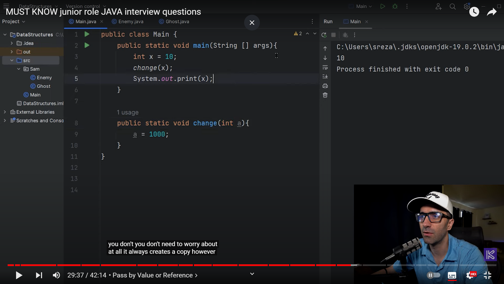
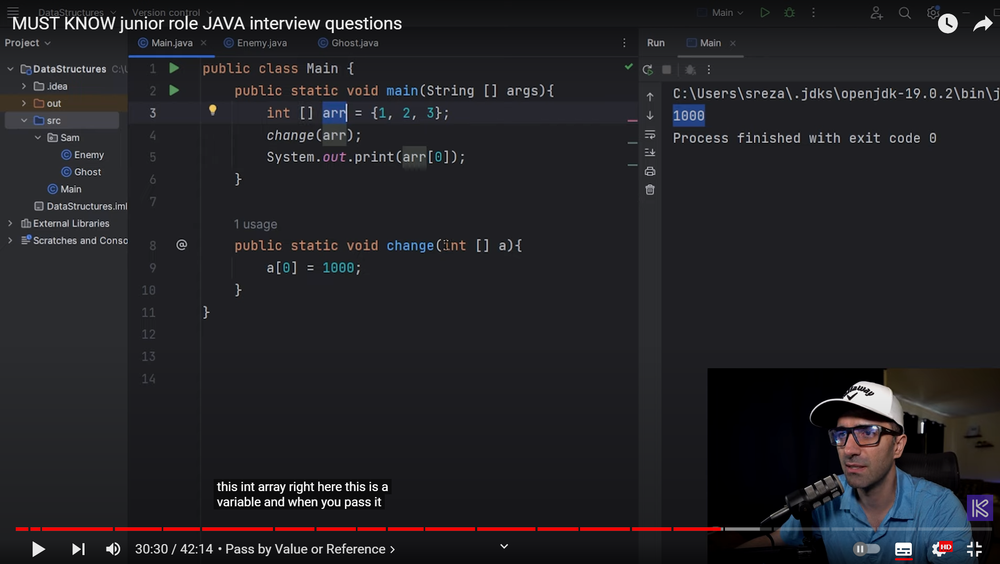
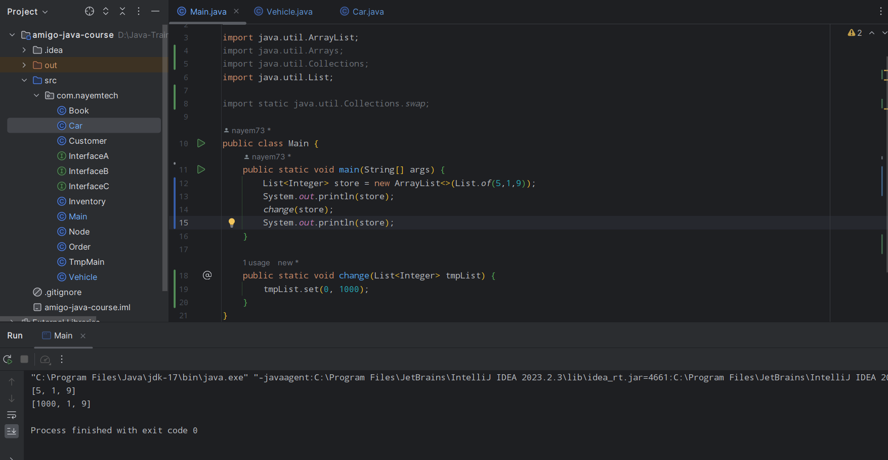

[Utilizing Java Arrays](https://chat.openai.com/share/2ac999dc-1484-4aef-8e2c-f67f8bf0b09b)

how do I utilize these two types of array? int[] a and Cat[] cats and what is their difference with int arr = new int[5]
package com.nayemtech;
public class Main {
 public static void main(String[] args) {
 Cat cat = new Cat("Jupyter", "White");
 System.out.println(cat.getName());
 System.out.println(cat);
 Cat cat2 = new Cat("Jupyter", "White");
 System.out.println(cat2);
 System.out.println(cat == cat2);
 System.out.println(cat.equals(cat2));
 int[] a;
 Cat[] cats;
 int arr[] = new int[5];
 }
}

ChatGPT

ChatGPT

In your Java code, you've declared three different types of arrays: `int[] a`, `Cat[] cats`, and `int[] arr`. Let me explain each of them:

1. **int[] a:**
   
   - This declares an array of integers named `a`. However, you haven't initialized it yet, so it's currently just a reference to an array of integers.
   
   - To use it, you need to initialize it by assigning a new array to it. For example:
     
     javaCopy code
     
     `int[] a = new int[3]; // Creates an integer array of size 3 a[0] = 1; a[1] = 2; a[2] = 3;`
   
   - Now, you can access and modify elements in the array using indices (e.g., `a[0]`, `a[1]`, etc.).

2. **Cat[] cats:**
   
   - This declares an array of `Cat` objects named `cats`. Similar to the `int` array, you need to initialize it before using it.
   
   - Assuming you have a `Cat` class with a constructor that takes name and color parameters, you can initialize the array like this:
     
     javaCopy code
     
     `Cat[] cats = new Cat[2]; // Creates an array of Cat objects with a size of 2 cats[0] = new Cat("Jupyter", "White"); cats[1] = new Cat("Mittens", "Black");`
   
   - Now, `cats` is an array containing two `Cat` objects.

3. **int arr[] = new int[5]:**
   
   - This declares and initializes an array of integers named `arr` with a size of 5. It's equivalent to `int[] arr = new int[5];`.
   - You can access and modify elements in this array using indices just like with the `int[] a` array.

In summary, the main difference between `int arr[] = new int[5]` and the other two declarations (`int[] a` and `Cat[] cats`) is that the former initializes the array at the time of declaration, while the latter two need separate initialization statements to assign a new array to them. Additionally, `int[] a` is an array of integers, and `Cat[] cats` is an array of objects of type `Cat`.

You

Also, what is the difference with above 3 different array types with int[] a2 = {5,6};

ChatGPT

ChatGPT

The declaration `int[] a2 = {5, 6};` is a shorthand syntax for creating and initializing an integer array in a single line. Let's compare it with the previous three array types:

1. **int[] a:**
   
   javaCopy code
   
   `int[] a;`
   
   - This declares an array of integers but doesn't initialize it. You need a separate statement to create a new array and assign it to `a`.

2. **int arr[] = new int[5]:**
   
   javaCopy code
   
   `int arr[] = new int[5];`
   
   - This declares and initializes an array of integers named `arr` with a size of 5 in a single line.

3. **int[] a2 = {5, 6};:**
   
   javaCopy code
   
   `int[] a2 = {5, 6};`
   
   - This declares and initializes an array of integers named `a2` with elements 5 and 6. It's a more concise way of creating and initializing an array.

The main difference lies in the initialization syntax. The third option, `int[] a2 = {5, 6};`, is a convenient way to create a small array with specific values directly. It's equivalent to the following more verbose code:

javaCopy code

`int[] a2 = new int[2]; a2[0] = 5; a2[1] = 6;`

So, in summary, the main difference is the shorthand initialization syntax for arrays with specific values in the case of `int[] a2 = {5, 6};`, making the code more concise and readable when you know the values at the time of declaration.

---------------------------------------------------------------------

# `null` is a special keyword representing the **absence of a reference to an object.** It's not an object itself, nor a type.

# Diff between C++ and Java:

Sure, let’s compare C++ and Java, two powerful programming languages:

**Programming Paradigm**:

1. - [**C++**: It supports both structured and object-oriented programming](https://www.javatpoint.com/features-of-java)[1](https://www.javatpoint.com/features-of-java).
   - [**Java**: It is a purely object-oriented programming language](https://www.javatpoint.com/features-of-java)[1](https://www.javatpoint.com/features-of-java).

**Inheritance**:

2. - [**C++**: It supports both single and multiple inheritance](https://www.javatpoint.com/features-of-java)[1](https://www.javatpoint.com/features-of-java).
   - [**Java**: It only supports single inheritance](https://www.javatpoint.com/features-of-java)[1](https://www.javatpoint.com/features-of-java).

3. **Pointers**:
   
   - [**C++**: It supports explicit pointers](https://www.javatpoint.com/features-of-java)[1](https://www.javatpoint.com/features-of-java).
   - **Java**: It does not support explicit pointers. [This feature is removed to prevent unauthorized access to memory](https://www.javatpoint.com/features-of-java)[1](https://www.javatpoint.com/features-of-java).

4. **Memory Management**:
   
   - **C++**: Developers have direct control over memory management. [This means they are responsible for allocating and deallocating memory](https://www.javatpoint.com/features-of-java)[1](https://www.javatpoint.com/features-of-java).
   - [**Java**: It handles memory management automatically using garbage collection](https://www.javatpoint.com/features-of-java)[1](https://www.javatpoint.com/features-of-java).

5. **Platform Dependency**:
   
   - [**C++**: It is platform-dependent](https://www.javatpoint.com/features-of-java)[1](https://www.javatpoint.com/features-of-java).
   - [**Java**: It is platform-independent, which means Java follows the WORA rule (Write Once, Run Anywhere)](https://www.javatpoint.com/features-of-java)[1](https://www.javatpoint.com/features-of-java).

**Use Cases**:

6. - [**C++**: It is commonly used for system programming, game development, and embedded systems](https://www.javatpoint.com/features-of-java)[1](https://www.javatpoint.com/features-of-java).
   - [**Java**: It is widely used for web applications, enterprise applications, mobile applications, server-side technology, and big data analytics](https://www.interviewbit.com/blog/features-of-java/)[2](https://www.interviewbit.com/blog/features-of-java/).

Both languages have their strengths and are better suited to different types of tasks. The choice between C++ and Java depends on the specific requirements of the project.

# why pointer is not used in Java? give me code examples with in depth detail explanation.

Java deliberately chose not to include pointers, and there are several key reasons for this:

**1. Security:**

- Pointers allow direct access to memory addresses, which can be dangerous and lead to security vulnerabilities. By not having pointers, Java makes it harder for malicious code to exploit memory access and manipulate data.
- Imagine a pointer pointing to a private variable. By manipulating the pointer, unauthorized access and modification of the variable becomes possible, bypassing access controls.

**2. Simplicity and Readability:**

- Pointers can be complex to understand and use, especially for beginners. Java aims to be a relatively simple and readable language, and removing pointers helps achieve that goal.
- Code using pointers can be more challenging to debug and maintain.

**3. Automatic Garbage Collection:**

- With pointers, memory management becomes the programmer's responsibility, leading to potential memory leaks and dangling pointers. Java uses automatic garbage collection (GC), which automatically frees memory that is no longer needed, simplifying memory management and reducing errors.

**Code Examples:**

**Example 1: Accessing data through references vs. pointers (C vs. Java):**

C++

```
int* ptr = &x; // pointer to memory address of x
*ptr = 10; // change value at memory address pointed to by ptr

int y = 5;
ptr = &y; // now ptr points to y's memory address
*ptr = 20; // change value of y
```

Java

```
int x = 5;
// Java doesn't allow direct pointer manipulations

int y = 10;
// Java references automatically update objects when assigned
x = y; // x now refers to the same object as y (value becomes 10)
```

**Example 2: Memory Leak (C vs. Java):**

C++

```
int* ptr = malloc(100); // allocate memory (not automatically freed)
*ptr = 42;

// forget to free memory pointed to by ptr
// memory leak occurs

free(ptr); // proper memory deallocation
```

Java

```
int[] arr = new int[100]; // allocate memory (automatically freed)
arr[0] = 42;

// no need to manually free memory

// Java GC automatically reclaims unused objects and arrays
```

These examples showcase how pointers can lead to complex memory management and potential issues, while Java simplifies things by using references and automatic garbage collection.

**Additional Notes:**

- While Java doesn't have explicit pointers, it internally uses them for some tasks like accessing native code.
- Other languages like C# offer similar benefits to Java without completely excluding pointers, providing more flexibility for experienced programmers.

I hope this comprehensive explanation clarifies why pointers are not used in Java and the benefits of this design choice.

# Wrapper class vs primitives

Great question! In Java, `int` and `Integer` are used in different scenarios due to their nature. Here’s a comparison:

1. **`int`**:
   
   - `int` is a **primitive data type** in Java.
   - It is used to store integer values (whole numbers without a decimal point).
   - It has a default value of 0.
   - It does not have methods associated with it because it’s not an object.

2. **`Integer`**:
   
   - `Integer` is a **wrapper class** for the `int` primitive data type.
   - It is used when you need an object representation of an `int`.
   - It can hold `null` value, which is not possible with `int`.
   - It has several useful methods for operations such as converting to string, comparing two numbers, etc.

Here’s why you might use `Integer` instead of `int`:

- **Nullability**: If you need to represent a variable that can be `null`, you would use `Integer`. An `int` cannot be `null`.
- **Collections**: Java’s collection classes, like `ArrayList` and `HashMap`, cannot hold primitive types. They can only hold objects. So if you want to store `int` values in these collections, you would need to use `Integer`.
- **Generics**: Java’s generic types do not work with primitive types. If you’re writing generic code, you would need to use `Integer`.

So, while `int` and `Integer` can both be used to hold integer values, they have different uses and are not always interchangeable. The choice between `int` and `Integer` depends on what you need for your specific situation.

# is Integer in java immutable like String in java? Are all the wrapper class in Java immutable?

[Yes, all wrapper classes in Java are immutable](https://prutor.ai/primitive-wrapper-classes-are-immutable-in-java/)[1](https://prutor.ai/primitive-wrapper-classes-are-immutable-in-java/). [This includes `Integer`, `Byte`, `Long`, `Float`, `Double`, `Character`, `Boolean`, and `Short`](https://prutor.ai/primitive-wrapper-classes-are-immutable-in-java/)[1](https://prutor.ai/primitive-wrapper-classes-are-immutable-in-java/). [Once an object of these classes is created, its state cannot be changed](https://prutor.ai/primitive-wrapper-classes-are-immutable-in-java/)[2](https://stackoverflow.com/questions/4117793/are-java-wrapper-classes-really-immutable)[1](https://prutor.ai/primitive-wrapper-classes-are-immutable-in-java/).

For example, consider the following code:

```java
Integer a = 5;  // An Integer object is created with the value 5.
a = a + 10;     // A new Integer object is created with the value 15. The original object remains unmodified.
```

In this example, when we do `a = a + 10`, we’re not changing the original `Integer` object that `a` was referencing. [Instead, we’re creating a new `Integer` object with the value `15` and updating `a` to reference this new object](https://prutor.ai/primitive-wrapper-classes-are-immutable-in-java/)[3](https://stackoverflow.com/questions/12370544/why-are-java-wrapper-classes-immutable)[2](https://stackoverflow.com/questions/4117793/are-java-wrapper-classes-really-immutable).

The immutability of wrapper classes in Java is a design decision that provides several benefits, such as:

- [**Thread Safety**: Immutable objects are inherently thread-safe as they cannot change state after construction](https://prutor.ai/primitive-wrapper-classes-are-immutable-in-java/)[3](https://stackoverflow.com/questions/12370544/why-are-java-wrapper-classes-immutable).
- [**Hashing**: Immutable objects are good Map keys and Set elements, as their hashcode doesn’t change once created](https://prutor.ai/primitive-wrapper-classes-are-immutable-in-java/)[3](https://stackoverflow.com/questions/12370544/why-are-java-wrapper-classes-immutable).
- [**Security**: Immutable objects are inherently protected from modification by malicious code or accidents](https://stackoverflow.com/questions/12370544/why-are-java-wrapper-classes-immutable)[3](https://stackoverflow.com/questions/12370544/why-are-java-wrapper-classes-immutable).

# Autoboxing and Unboxing

Autoboxing is a feature in Java that allows automatic conversion of primitive data types into their corresponding wrapper class objects, and vice versa. This feature was introduced to simplify the process of working with primitive types and their corresponding wrapper classes, making the code more concise and readable.

Here's how autoboxing works:

1. **Primitive to Wrapper Conversion**: When you assign a primitive value to a reference variable of its corresponding wrapper class, autoboxing automatically converts the primitive value into an object of the wrapper class.

2. **Wrapper to Primitive Conversion**: Similarly, when you assign an object of a wrapper class to a variable of its corresponding primitive type, autoboxing automatically extracts the primitive value from the wrapper object.

Autoboxing is particularly useful in scenarios where you need to work with collections that only accept objects, such as `ArrayList` or `HashMap`, but you want to use primitive types.

Here's an example to illustrate autoboxing:

```java
public class AutoboxingExample {
    public static void main(String[] args) {
        //No autoboxing
        Integer var = new Integer(20); // A new Integer object is created with the value 20.
        var = new Integer(30); // A new Integer object is created with the value 30.


        // Autoboxing: primitive to wrapper conversion
        Integer numWrapper = 10; // Autoboxing: int to Integer
        Double doubleWrapper = 3.14; // Autoboxing: double to Double
        Boolean boolWrapper = true; // Autoboxing: boolean to Boolean

        // Unboxing: wrapper to primitive conversion
        int numPrimitive = numWrapper; // Unboxing: Integer to int
        double doublePrimitive = doubleWrapper; // Unboxing: Double to double
        boolean boolPrimitive = boolWrapper; // Unboxing: Boolean to boolean

        System.out.println("numWrapper: " + numWrapper);
        System.out.println("doubleWrapper: " + doubleWrapper);
        System.out.println("boolWrapper: " + boolWrapper);

        System.out.println("numPrimitive: " + numPrimitive);
        System.out.println("doublePrimitive: " + doublePrimitive);
        System.out.println("boolPrimitive: " + boolPrimitive);
    }
}
```

In this example:

- Autoboxing occurs when primitive values (`int`, `double`, `boolean`) are assigned directly to wrapper class variables (`Integer`, `Double`, `Boolean`).
- Unboxing occurs when wrapper class objects are assigned directly to primitive variables.
- Autoboxing and unboxing simplify the code by automatically converting between primitive types and their corresponding wrapper classes as needed.

# How Hashmap works under the hood

# Stack memory Vs Heap memory

A strong answer to the interviewer's question about stack vs heap memory in Java should cover several key points:

**1. Explain the different purposes:**

- **Stack:**
  
  - Stores method call information (local variables, parameters, return address)
  - Faster access due to LIFO (Last-In-First-Out) ordering
  - Limited size and short-lived memory (automatically deallocated when method exits)

- **Heap:**
  
  - Stores objects and their data
  - Dynamically allocated and deallocated by the garbage collector
  - Larger size but slower access than stack

**2. Highlight key differences:**

- **Memory management:** Stack is automatic (LIFO), heap requires garbage collection.
- **Accessibility:** Stack is thread-specific, heap is globally accessible.
- **Data types:** Stack stores primitives and references, heap stores objects.
- **Size:** Stack is smaller and fixed, heap is larger and dynamic.
- **Performance:** Stack is faster for simple data, heap is slower but suitable for larger objects.

**3. Provide real-world examples:**

- Use common Java scenarios to illustrate when each memory type is used.
- For example, explain how local variables in a method reside on the stack, while objects created within the method live on the heap.

**4. Go beyond the basics:**

- Briefly mention advanced topics like generational garbage collection in the heap.
- Show awareness of potential issues like stack overflow and memory leaks.

**5. Tailor your answer to the interviewer:**

- Consider the interviewer's background and the specific role you're applying for.
- If possible, connect your explanation to the requirements of the position.

**Bonus:**

- If time allows, share your understanding of potential trade-offs when choosing between stack and heap for specific situations.

**Remember:**

- Be confident and concise in your explanation.
- Use clear and technical terms accurately.
- Show enthusiasm and willingness to learn more.

By following these tips, you can deliver a comprehensive and impressive answer to the "stack vs heap memory in Java" question, showcasing your understanding of Java memory management concepts.

# Literal = Constant

- Constant values that appear directly in a program.

- for example:

```java
String s = "Hello";
System.our.println("How are you?");
```

in above example, `Hello` is a String literal as well as `How are you?` is also a String literal.

similaryl, there are character literals, Double, Integer etc. literals

# Garbage Collection

- **Define Garbage Collection:** Explain that it's an automatic process in Java that identifies and reclaims unused memory occupied by objects. This eliminates the need for manual memory management like in C/C++.
- **Describe its Working:** Highlight the key steps:
  - Objects are created on the heap, a dedicated memory region.
  - The Garbage Collector (GC) tracks object references and determines reachability (objects still used by the program).
  - Unreachable objects are marked for deletion.
  - GC reclaims their memory, making it available for new objects.

# Exception Handling

# Shallow Copy VS Deep Copy

1. Shallow Copy:

```java
ArrayList<String> originalList = new ArrayList<String>();
originalList.add("element 1");
originalList.add("element 2");

ArrayList<String> shallowCopy = originalList;
// ---- or ----
Vehicle vehicle1 = new Vehicle();
Vehicle vehicle2 = vehicle1; //Shallow copy
```

2. Deep Copy:

```java
ArrayList<String> originalList = new ArrayList<String>();
originalList.add("element 1");
originalList.add("element 2");

ArrayList<String> deepCopy = new ArrayList<String>(originalList);
```

# did not think it was recursion!!

```java
package com.nayemtech;

public class Car extends Vehicle{
    public String brand;

    public Car(String vehicleType, String brand) {
        super(vehicleType);
        this.brand = brand;
    }

    public Car() {
    }

    @Override
    public void RealVehicle() {
        //super.RealVehicle();
        System.out.println("ok from Car");
        System.out.println("ok from Car");
        RealVehicle();
    }
}
```

# Strongly Typed Language - Java

Java is considered a strongly typed language. [This means that every variable must be declared with a data type](https://www.thoughtco.com/strongly-typed-2034295)[1](https://www.thoughtco.com/strongly-typed-2034295). [Once a variable is declared, its data type cannot change](https://www.thoughtco.com/strongly-typed-2034295)[1](https://www.thoughtco.com/strongly-typed-2034295). This is important for a few reasons:

1. **Type Safety**: Strong typing prevents type errors. [For example, you can’t assign a string to an integer variable](https://stackoverflow.com/questions/66756725/java-being-strongly-typed)[2](https://stackoverflow.com/questions/66756725/java-being-strongly-typed). [This helps catch errors at compile time rather than at runtime](https://stackoverflow.com/questions/2690544/what-is-the-difference-between-a-strongly-typed-language-and-a-statically-typed)[3](https://stackoverflow.com/questions/2690544/what-is-the-difference-between-a-strongly-typed-language-and-a-statically-typed).

2. [**Predictability**: Because each variable has a specific type, you can predict how it will behave in different situations](https://coderanch.com/t/522430/java/Strongly-typed-Weakly-typed-languages)[4](https://coderanch.com/t/522430/java/Strongly-typed-Weakly-typed-languages).

3. [**Readability and Maintainability**: When reading code, knowing the type of each variable can make the code easier to understand](https://coderanch.com/t/522430/java/Strongly-typed-Weakly-typed-languages)[4](https://coderanch.com/t/522430/java/Strongly-typed-Weakly-typed-languages).

Here’s an example of strong typing in Java:

```java
int x = 10; // This is valid
x = "Hello"; // This will cause a compile-time error
```

In the above example, `x` is declared as an `int`. [Trying to assign a `String` to `x` will result in a compile-time error, demonstrating Java’s strong typing](https://stackoverflow.com/questions/66756725/java-being-strongly-typed)[2](https://stackoverflow.com/questions/66756725/java-being-strongly-typed).

[It’s important to note that while Java is strongly typed, it does allow for certain type conversions, but they must be done explicitly](https://stackoverflow.com/questions/66756725/java-being-strongly-typed)[2](https://stackoverflow.com/questions/66756725/java-being-strongly-typed). [For example, you can convert an `int` to a `long`, but you have to do it explicitly like this: `long y = (long) x;`](https://stackoverflow.com/questions/66756725/java-being-strongly-typed)[2](https://stackoverflow.com/questions/66756725/java-being-strongly-typed).

# Generics. What is it and why we need it.

# Difference between .equals() and == in java

- .equals() is a method where == is a comparison operator.

- == is used for reference comparison. It checks if two objects have the same address. where the .equals() method is for comparing the contents inside that memory address.

- so, we know strings are immutable in java thats why using == wont work

### something to note:

```java
If both String and Integer are immutable then why these two different behaviour?


//String behaviour: prints that s and t are different
public static void main(String[] args) {

    String s = "ok";
    String t = "o";
    t += "k";

    if (s == t) {
      System.out.println("same");
    } else {
      System.out.println("different");
      System.out.println(s + t);
    }
  }


//Integer behaviour: prints that s and t are same
public static void main(String[] args) {

    Integer s = 100;
    Integer t = 10;

    t *= 10;

    if (s == t) {
      System.out.println("same");
    } else {
      System.out.println("different");
      System.out.println(s + t);
    }
  }


//Wow! not it prints different!!!!!!
```

- Here's the reason for above 3 behaviour:

The difference in behavior you’re seeing is due to how Java handles `String` and `Integer` objects, and the difference between using `==` and `.equals()` for comparison.

In the `String` example, when you do `t += "k";`, a new `String` object is created because `String` is immutable. So `s` and `t` are not the same object, they are two different objects that contain the same sequence of characters. When you use `==` to compare `s` and `t`, it checks whether they refer to the exact same object, not whether they have the same value. Since `s` and `t` are different objects, `s == t` is `false`, and “different” is printed.

In the `Integer` example, `Integer` objects are also immutable, so when you do `t *= 10;`, a new `Integer` object is created. However, Java does some behind-the-scenes optimizations for small `Integer` values. All `Integer` objects with values between -128 and 127 are cached and reused by Java for efficiency. So when `t` is set to `100`, it actually refers to the same `Integer` object as `s`. That’s why `s == t` is `true`, and “same” is printed.

If you want to compare the values of `String` or `Integer` objects, you should use the `.equals()` method, which checks whether the objects have the same value, not whether they are the same object. For example, `s.equals(t)` would be `true` in the `String` example, because `s` and `t` have the same value, even though they are different objects.

Here’s how you can modify the `String` example to use `.equals()`:

```java
public static void main(String[] args) {
    String s = "ok";
    String t = "o";
    t += "k";

    if (s.equals(t)) {
        System.out.println("same");
    } else {
        System.out.println("different");
    }
}
```

This will print “same”, because `s` and `t` have the same value.

# Java is Pass by Value, not pass by reference

- When you work with primitives, you don't worry because it always makes copy. However, confusion arises when you work with object or reference types.

- This figure shows you don't need to worry about primitives:



- The below figure shows, it works like pass by reference for arrays as well as List:





# java.util.collections

Sure, the `java.util.Collections` class provides several utility methods for Collection classes. Here are a few examples:

1. **Sorting**: You can use `Collections.sort(list)` to sort a list in ascending order. If you want to sort in descending order, you can use `Collections.sort(list, Collections.reverseOrder())`.

```java
List<Integer> numbers = new ArrayList<>(List.of(5,3,1));
Collections.sort(numbers);
System.out.println(numbers);  // prints [1, 3, 5]
Collections.sort(numbers, Collections.reverseOrder());
System.out.println(numbers);  // prints [5, 3, 1]
```

2. **Searching**: `Collections.binarySearch(list, key)` can be used to search for a key in a sorted list. It returns the index of the key if it exists in the list, otherwise it returns `-(insertion point - 1)`.

```java
List<Integer> numbers = new ArrayList<>(List.of(1,3,5));
int index = Collections.binarySearch(numbers, 3);
System.out.println(index);  // prints 1
```

3. **Finding Min and Max**: `Collections.min(collection)` and `Collections.max(collection)` return the minimum and maximum element of a collection respectively.

```java
List<Integer> numbers = new ArrayList<>(List.of(5,3,1));
int min = Collections.min(numbers);
int max = Collections.max(numbers);
System.out.println(min);  // prints 1
System.out.println(max);  // prints 5
```

4. **Shuffling**: `Collections.shuffle(list)` randomly permutes the elements in a list.

```java
List<Integer> numbers = new ArrayList<>(List.of(5,3,1));
Collections.shuffle(numbers);
System.out.println(numbers);  // prints the list in random order
```

5. **Filling**: `Collections.fill(list, obj)` replaces all of the elements of a list with the specified object.

```java
List<Integer> numbers = new ArrayList<>(List.of(5,3,1));
Collections.fill(numbers, 0);
System.out.println(numbers);  // prints [0, 0, 0]
```

These are just a few examples. The `Collections` class provides many more utility methods that you might find useful. Remember to import the `java.util.Collections` class at the beginning of your code to use these methods. Also, some of these methods, like `binarySearch`, work properly only on certain types of lists (like ArrayList), and may throw an exception on others (like LinkedList). So, always check the Java documentation for the method you’re using to understand its behavior.

# Singleton class

- It is a class where only one instance of that class can ever exist! This is typically done by:
  
  - 1. Ensuring all the constructors are private
    
    2. Creating a method that returns a reference to the instance.

```java
package com.nayemtech;

public class Singleton {
    private static Singleton singleton = new Singleton();

    private Singleton() {

    }

    public static Singleton getSingleton() {
        return singleton;
    }
} 

package com.nayemtech;

public class Main {
    public static void main(String[] args) {
        Singleton singleton;
        Singleton singleton1;

        singleton = Singleton.getSingleton();
        singleton1 = Singleton.getSingleton();

        System.out.println(singleton); //both are same
        System.out.println(singleton1); //both are same
    }
}
```

# static vs non static call rules

- static methods or fields belong to the class itself, hence, an instance of a class should be able to access anything that belongs to the class

- you can not access an instance field or method from a static method.

# static block

- static block gets executed at the time of class loading. So, it gets executed before the main method runs. so static block should be outside any method, constructor, or other block.

```java
package com.nayemtech;

public class Main {
    public static void main(String[] args) {
        System.out.println("from main method");
    }

    static {
        System.out.println("from static");
    }
}
```

- In the below code, "from instance block" will not be printed because:

```java
public class Main {
    public static void main(String[] args) {
        System.out.println("from main method");

    }

    {
        System.out.println("from instance block");
    }
}


//this code will print it though. ignore it now to understand above
public class Main {
    public static void main(String[] args) {
        System.out.println("from main method");
        {
            System.out.println("from instance block");
        }
    }
}
```

In your code, the block `{ System.out.println("from instance block"); }` is not a static block, but an instance initializer block. Instance initializer blocks are used to initialize instance variables and are executed each time the class is instantiated.

However, in your `Main` class, you never create an instance of the class. Therefore, the instance initializer block is never executed, and “from instance block” is never printed.

If you want “from instance block” to be printed each time an instance of the class is created, you should create an instance of the class in your `main` method:

```java
public class Main {
    {
        System.out.println("from instance block");
    }

    public static void main(String[] args) {
        System.out.println("from main method");
        new Main();
    }
}


//output:
from main method
from instance block
```

In this code, “from instance block” will be printed each time `new Main();` is executed because it creates a new instance of the `Main` class, which triggers the instance initializer block.

# Comparator and Comparable

# other lesser known features in Java:

- I did not know about this blocks. So tell me if there is anything uncommon like this in java that maybe i am unaware of?

Sure, here are some lesser-known features and concepts in Java that you might find interesting:

1. **Anonymous Classes:** These are classes that are declared and instantiated at the same time, usually when you need to use a class only once. They’re often used in GUI programming.
   
   ```java
   new Thread() {
      public void run() {
          System.out.println("Hello from the anonymous class!");
      }
   }.start();
   ```

2. **Lambda Expressions:** Introduced in Java 8, lambda expressions provide a clear and concise way to represent one method interface using an expression. They are commonly used with functional interfaces and streams.
   
   ```java
   List<String> list = Arrays.asList("A", "B", "C");
   list.forEach(element -> System.out.println(element));
   ```

3. **Method References:** Also introduced in Java 8, method references provide a way to refer to a method without executing it. They’re often used with functional interfaces and streams.
   
   ```java
   List<String> list = Arrays.asList("A", "B", "C");
   list.forEach(System.out::println);
   ```

4. **Try-With-Resources:** This feature, introduced in Java 7, allows you to declare resources to be used in a try block with the assurance that the resources will be closed when they are no longer needed.
   
   ```java
   try (BufferedReader br = new BufferedReader(new FileReader("file.txt"))) {
      // Use the BufferedReader
   } catch (IOException e) {
      // Handle the exception
   }
   ```

5. **Var Keyword:** Introduced in Java 10, the `var` keyword allows you to declare a local variable without specifying its type. The compiler will infer the type based on the value of the variable.
   
   ```java
   var list = new ArrayList<String>();  // The compiler infers that list is of type ArrayList<String>
   ```

6. **Default and Static Methods in Interfaces:** Since Java 8, interfaces can have default and static methods, allowing behavior to be added to interfaces without breaking existing implementations.
   
   ```java
   interface MyInterface {
      default void defaultMethod() {
          System.out.println("This is a default method");
      }
   
      static void staticMethod() {
          System.out.println("This is a static method");
      }
   }
   ```

7. **Optional Class:** Introduced in Java 8, the `Optional` class is a container object that may or may not contain a non-null value. It’s used to represent nullable return types and help prevent `NullPointerException`.
   
   ```java
   Optional<String> optional = Optional.ofNullable(getStringThatMayReturnNull());
   ```

These are just a few examples. Java is a rich language with many features, and it’s always evolving with new versions. I hope you find these examples helpful and interesting! 😊

- thanks fo giving me. can you give some more that are asked in interviews?

Absolutely, here are some more advanced Java concepts that are often brought up in interviews:

1. **Java Memory Model:** Understanding how Java manages memory can be crucial, especially when dealing with multi-threading and performance optimization. Key concepts include the stack and heap, garbage collection, and how Java handles memory leaks.

2. **Concurrency and Multi-threading:** Java provides built-in support for multi-threaded programming and synchronization, which is a common topic in interviews. Key concepts include the `Thread` class, the `Runnable` interface, synchronized blocks, and the `wait` and `notify` methods.

3. **Java Collections Framework:** The Collections Framework is a set of classes and interfaces that implement commonly reusable collection data structures. Understanding the differences between `List`, `Set`, `Map`, and knowing when to use each, is important.

4. **Generics:** Generics add stability to your code by allowing you to specify the exact type of your collections at compile time.

5. **Exception Handling:** Knowing how to handle exceptions is crucial for writing robust and fault-tolerant programs. Key concepts include checked vs unchecked exceptions, error handling strategies, and custom exceptions.

6. **Java I/O:** Java’s Input/Output (I/O) is based on streams, which can represent many different kinds of data sources and targets. Key concepts include byte streams, character streams, buffered streams, standard I/O, file I/O, and object serialization.

7. **Java 8 Features:** Java 8 introduced many new features like lambda expressions, method references, functional interfaces, Stream API, and more. These are now commonly used and often asked about in interviews.

8. **JVM Internals:** Understanding the internals of Java Virtual Machine (JVM) can be important, especially for performance tuning and debugging. Key concepts include the class loader subsystem, runtime data areas, execution engine, and garbage collector.

9. **Design Patterns:** Design patterns represent the best practices used by experienced object-oriented software developers. They are solutions to general problems that software developers faced during software development.

10. **JDBC, JPA, Hibernate:** These technologies are used for interacting with databases. Understanding them is crucial for back-end development roles.

Remember, the depth of your knowledge in each of these areas can depend on the specific role you’re interviewing for. For example, a back-end developer role might require more knowledge of databases and server-side technologies, while a front-end role might require more knowledge of GUI development. Good luck with your interviews! 😊


- <u>***if an interviewer asks me, "How can you create an immutable class in Java?" - How should I answer?***</u>

To create an immutable class in Java, you need to follow several key principles:

1. Declare the class as `final` to prevent inheritance.
2. Declare all fields as `private` and `final` to ensure they cannot be modified after object construction.
3. Do not provide any setter methods for modifying the state of the object.
4. If the class contains mutable fields (e.g., if you're dealing with mutable objects like arrays or collections), make sure to return copies of these fields instead of returning the original references.
5. If any methods return mutable objects held by the class, ensure that they return copies of those objects instead of the originals.

Here's an example demonstrating these principles:

```java
public final class ImmutableClass {
    private final int immutableField;
    private final String immutableString;
    private final List<Integer> immutableList;

    public ImmutableClass(int immutableField, String immutableString, List<Integer> immutableList) {
        this.immutableField = immutableField;
        this.immutableString = immutableString;
        // Creating a copy of the list to maintain immutability
        this.immutableList = new ArrayList<>(immutableList);
    }

    public int getImmutableField() {
        return immutableField;
    }

    public String getImmutableString() {
        return immutableString;
    }

    // Returning a copy of the list to maintain immutability
    public List<Integer> getImmutableList() {
        return new ArrayList<>(immutableList);
    }
}
```

With this implementation, once an object of `ImmutableClass` is created, its state cannot be changed, ensuring immutability.

- in your above response, what did you mean by point 4 and point 5? explain with your above code example.

Certainly! Let's break down points 4 and 5 in the context of the provided code example:

Point 4: If the class contains mutable fields, return copies instead of originals.
In the `ImmutableClass` example, suppose we have a field that is a mutable object, like a `List<Integer>` called `immutableList`. To maintain immutability, we don't want external code to modify the contents of this list. Therefore, in the constructor, instead of directly assigning the reference of `immutableList`, we create a new `ArrayList` and copy the contents of the provided list into it. This ensures that changes made to the original list outside the class won't affect the internal state of the `ImmutableClass` object.

```java
public ImmutableClass(int immutableField, String immutableString, List<Integer> immutableList) {
    this.immutableField = immutableField;
    this.immutableString = immutableString;
    // Creating a copy of the list to maintain immutability
    this.immutableList = new ArrayList<>(immutableList);
}
```

Point 5: If methods return mutable objects held by the class, return copies instead of originals.
In the `ImmutableClass` example, the `getImmutableList()` method returns a reference to the internal list `immutableList`. To ensure immutability, we don't want external code to directly modify this list. Therefore, instead of returning the original list reference, we return a copy of the list using `new ArrayList<>(immutableList)`. This way, modifications made to the returned list by external code won't affect the internal state of the `ImmutableClass` object.

```java
public List<Integer> getImmutableList() {
    return new ArrayList<>(immutableList);
}
```

By following these practices, you ensure that even if your class contains mutable fields or returns mutable objects, the overall immutability of the class is maintained, preventing unintended modifications to its state.
