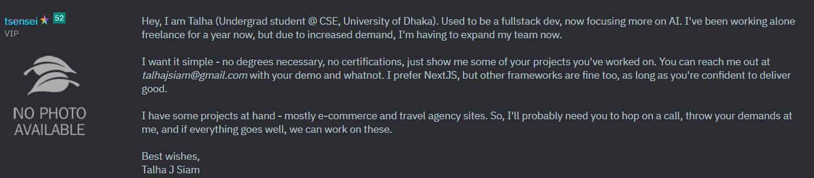
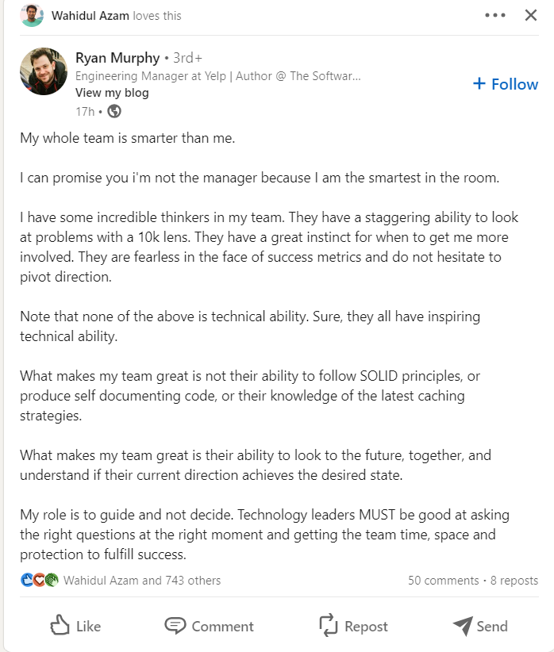
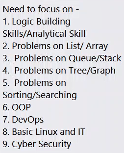

1. [Facebook](https://www.facebook.com/groups/techjobsbd)

2. cefalo, enosis, selise, bjit, DSI

3. hrd@rokomari.com

4. bjit academy - 4 month unpaid training

5. [Ajit Kumar on LinkedIn: #career #software #design #technology #microsoft #google #jobs #ai #sap… | 46 comments](https://www.linkedin.com/posts/ajitcodes_career-software-design-activity-7148938936994705408-_KaE?utm_source=share&utm_medium=member_desktop)

# Remote

Forget LinkedIn and Fiverr!  

More than millions remote jobs out there.  

These 10 websites can pays in USD for remote jobs:  

1. Working Nomads  
   Link: [https://workingnomads.com](https://workingnomads.com/)  

2. Remote Ok  
   Link: [https://remoteok.com](https://remoteok.com/)  

3. JustRemote:  
   Link: [https://justremote.co](https://justremote.co/)  

4. RemoteHunt  
   Link: [remotehunt.com](http://remotehunt.com/)  

5. WorkingNomads  
   [workingnomads.co](http://workingnomads.co/)  

6. Wellfound  
   Link : [https://wellfound.com](https://wellfound.com/)  

7. Weworkremotely  
   Link: [weworkremotely.com](http://weworkremotely.com/)  

8. Working Nomads  
   Link: [https://workingnomads.com](https://workingnomads.com/)  

9. JS Remotely  
   Link : [https://jsremotely.com](https://jsremotely.com/)  

10. FlexJobs  
    Link: [https://flexjobs.com](https://flexjobs.com/)  

I hope that this will help you.  

Like & Repost, if you find this helpful.  

Share your thoughts in the comments.  

Don't forget to follow [Hasan Toor ✪](https://www.linkedin.com/in/ACoAADpeKY0B1uX5gp5hm8hw3EWkiqqxbZXhw4s)

# ATS friendly resume create tips

[How to create an AI-friendly resume? | LinkedIn](https://www.linkedin.com/news/story/how-to-create-an-ai-friendly-resume-5947988/)

------

--------

[Rajesh KumarRajesh Kumar• 3rd+• 3rd+Software Engineer | Sharing content on AI Tools, prompts, Programming, Web Development, and Remote Jobs | Open for CollaborationsSoftware Engineer | Sharing content on AI Tools, prompts, Programming, Web Development, and Remote Jobs | Open for Collaborations](https://www.linkedin.com/in/therjrajesh?miniProfileUrn=urn%3Ali%3Afs_miniProfile%3AACoAACq6gaABysrk8Os0k7NNUaiTBTeL-GP8wYg)[

8h • 8h •

](https://www.linkedin.com/in/therjrajesh?miniProfileUrn=urn%3Ali%3Afs_miniProfile%3AACoAACq6gaABysrk8Os0k7NNUaiTBTeL-GP8wYg)

Follow

This Resume has an ATS score of more than 90  

I have personally used this single-column resume in my job hunting and got amazing results.  

I am sharing the exact editable template for this  

To get it:-  

1. Follow me (So that I can DM)  
2. Like & Repost  
3. Reply "Send"  

👇 Check out our meticulously crafted templates:  

🌐 Meta Resume Template for Software Engineers  

Ideal for those seeking versatility in their resume to cater to diverse tech companies' requirements.  

Get it here: https://lnkd.in/gU6QZsBu  

🍏 Apple Resume Template for Software Engineers  

Tailored to align with Apple's unique culture and values, this template highlights the skills Apple cherishes.  

Get it here: [Apple Resume Template for Software Engineer | Tips &amp; Tricks | ATS GrabAjobs.co](https://lnkd.in/gW-8ab9z)  

📦 Amazon Resume Template for Software Engineers  

Crafted to match Amazon's expectations, this template empowers you to showcase your qualifications effectively.  

Get it here: [Amazon: Resume Template for Software Engineer | Tips &amp; Tricks | ATS GrabAjobs.co](https://lnkd.in/gP-YZyfD)  

🍿 Netflix Resume Template for Software Engineers  

Impress Netflix recruiters with a resume that spotlights your most relevant skills and experiences.  

Get it here: [Netflix: Resume Template for Software Engineer | Tips &amp; Tricks | ATS GrabAjobs.co](https://lnkd.in/g6FWDNZF)  

🌟 Google Resume Template for Software Developers  

If Google is your dream destination, this template will help you craft a resume that aligns perfectly with your expectations.  

Get it here: [LinkedIn](https://lnkd.in/gC99M-Ba)  

Don't miss this opportunity to leave a lasting impression. Choose the template that aligns with your career aspirations, and take one step closer to your dream job. ✨  

𝐉𝐨𝐢𝐧 𝐭𝐡𝐢𝐬 Telegram 𝐠𝐫𝐨𝐮𝐩 𝐟𝐨𝐫 𝐩𝐫𝐞𝐦𝐢𝐮𝐦 𝐉𝐨𝐛𝐬/Notes: [Telegram: Contact @yourcareer0](https://t.me/yourcareer0)  

Follow [Rajesh Kumar](https://www.linkedin.com/in/ACoAACq6gaABysrk8Os0k7NNUaiTBTeL-GP8wYg) for more such content  

[#SoftwareEngineering](https://www.linkedin.com/feed/hashtag/?keywords=softwareengineering&highlightedUpdateUrns=urn%3Ali%3Aactivity%3A7169005329886760961)  
[#ResumeTemplates](https://www.linkedin.com/feed/hashtag/?keywords=resumetemplates&highlightedUpdateUrns=urn%3Ali%3Aactivity%3A7169005329886760961)  
[#DreamJob](https://www.linkedin.com/feed/hashtag/?keywords=dreamjob&highlightedUpdateUrns=urn%3Ali%3Aactivity%3A7169005329886760961)  
[#maang](https://www.linkedin.com/feed/hashtag/?keywords=maang&highlightedUpdateUrns=urn%3Ali%3Aactivity%3A7169005329886760961)  
[#resumetemplates](https://www.linkedin.com/feed/hashtag/?keywords=resumetemplates&highlightedUpdateUrns=urn%3Ali%3Aactivity%3A7169005329886760961)

# look for job in this order:

There's a paradox in the job search process.  

Companies typically look for candidates in this order:  

⮑ Advertise internally, and promote people internally  
⮑ Referrals from employees  
⮑ Networking  
⮑ Recruiters  
⮑ Job boards  

They might advertise on job boards at the start, but they'll prioritise candidates from other sources before looking at applications.  

Paradoxically, candidates typically apply for jobs like this:  

⮑ Job boards  
⮑ Recruiters  
⮑ Networking  
⮑ Seeking out referrals  

The best way to stand out as a candidate is to prioritise building relationships and networking, alongside applying for jobs. Meet the hiring managers in the middle.

# written

