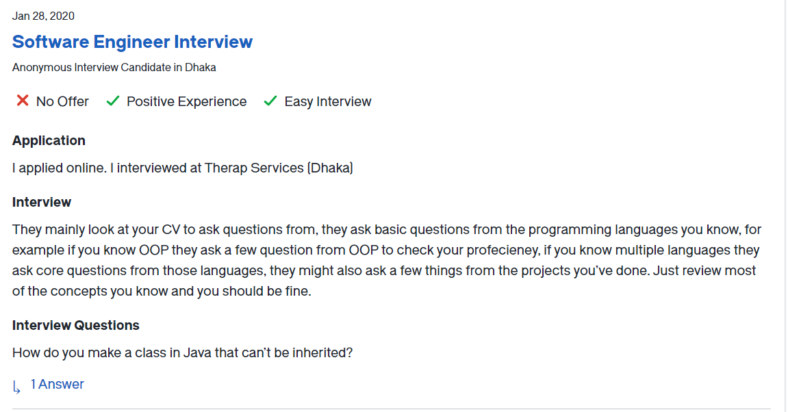

1. difference between bfs and dfs. 2.what is hash map? 3. complete binary tree

2. Write code for the merge function of merge sort.

3. twosum/threesum

4. Why Did You Decide to Become a Software Engineer? ...
   What programming languages do you prefer? ...
   What's important when checking a team member's code? ...
   What project management tools have you used? ...
   Talk about a project you completed successfully.

5. Write a recursive function that prints a string backwards

6. How would you implement Hashmap without using any library or built-in structure?

7. Where do you want to see yourself after 5 years?

8. 

9. recursion, binary tree, and hash map, pattern matching, binary search, and tree traversal

10. SQL Query, design a database schema.

11. - Memory handling in OOP
    - Principle OOP strategies
    - Collections Framework
    - Exceptions
    - Design pattern
    - a few basic questions on networking.
    - basics of operating systems.

12. 
