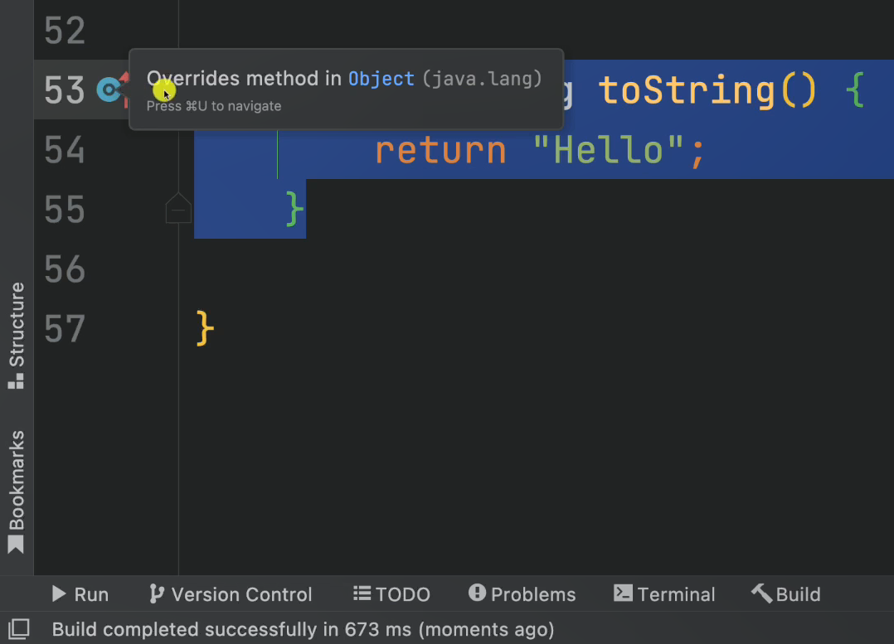

### In Java, everything is an Object !!!!!!!!!!

1.
 compiler vs interpreter: python is an interpreter language while C++ is
 compiled language. compile korle ki hoy? puro code ekbare compile/run 
hoy. but enterpreter is like python e jemon line by line execute kora 
jay jupyter e oirokom.  
2. So, for python and JS, when you run your 
code, it does not need to be compiled. so it is dynamic type checking 
and java and C++ are static type checking.  
3. A language is 
statically-typed if the type of a variable is known at compile time 
instead at run time. This allows many type-errors to be caught before 
running the code.  
4. A Java class file is a file (with the . class 
filename extension) containing Java bytecode that can be executed on the
 Java Virtual Machine (JVM).  
5. by compiling and running the code , it generates a main.class in out folder.  
6. public static void main << this method is must. but public class Main can be changed to other names.  
7.
 primitive data types and reference data types in java. when we want to 
store simple values, we use primitive data types. like int num = 5; but 
when we want to store complex values, reference types and objects come 
into play.  
8. Point pointA = new Point(2,5); pointA here is an object which is a reference type.  
9. Heap:  

- Space is used to store objects and JRE classes at runtime.  

- New objects are always created in heap space.  

- References to these objects are store in Stack memory.  
10. Stack memory:  
- Stack memory in java is used for static memory allocation and the execution of a thread LIFO.  

- Frame (stack frame) contains all the data for one function call.  

10.

11. All the instruction 
    written in a Dockerfile are instructions to docker for setting up the 
    image. Now keep in mind, the image is the template for the container. 
    The image is what you don't run in the end, You run a container based on
    a image.  

12. for primitives, default values are 0 and for Reference types, default value is null  

13. static keyword before any method or attribute means it belongs to the class and not the instance itself.  

14. static means no need to create an instance of that class. the static method can be invoked directly.  

15. 

16. enums in java:  
    enum Gender {  
    MALE,  
    FEMALE  
    }  

** Also just like creating class, in intellij you get to select enums:  
public enum Gender {  
MALE,  
FEMALE  
}  

final keyword use na kore enum use korar reason holo ei same type er constant gulo ekta group e rakha jasse  

19.
 Each of the primitives(int, float .. ) there is a corresponding Wrapper
 class. the Wrapper class allows us to use the corresponding primitives 
as object. (need to touch on generics in amigos video for more)  

- by 
  using the object (i mean Wrapper class like Integer) you get a bunch of 
  functionalities for example: int n = Integer.min(5,6) ... int n = 
  Integer.ParseInt(someString) ... String s = Integer.toString(55); .. and
  more.  
20. String literals vs String objects  

21. String 
    formattedString = String.format("like printing Strings in C & extra 
    feature: numToString=%s, num=%s\n", numToString, num);  

22. for money, never use double.  

23. Throwable is a superclass of all types of Errors and Exceptions.  

24. so, Error and Exception are the subclass of Throwable  

25. 

26. Object -> Throwable -> Exception -> RuntimeException  

27. checked exception = compile time exception  

28. unchecked exception = runtime exception  

------------------------------------

29. <mark>Checked Exception</mark> and <mark>Unchecked Exception</mark> causing trouble.

30. below code shows error during compile because Exception << this is checked exception meaning compile time exception

```java
package com.nayemtech;

public class Main {
    public static void main(String[] args) {
        neg(3, 10);
    }

    public static void neg(int a, int b) throws Exception {
        if (b >= a) {
            throw new Exception("can not subtract b from a because b is bigger than a");
        }

        a -= b;
        System.out.println(a);
    }
}
```

but to fix above checked Exception we need to use:

- try catch block

- throws keyword in the method signature

we already got the throws keyword . now we need try catch:

```java
package com.nayemtech;

public class Main {
    public static void main(String[] args) {
        try {
            neg(3, 10);
        } catch (Exception e) {
            System.out.println("Exception caught: " + e.getMessage());
        }
    }

    public static void neg(int a, int b) throws Exception {
        if (b >= a) {
            throw new Exception("Can not subtract b from a because b is bigger than a");
        }

        a -= b;
        System.out.println(a);
    }
}
```

so this works.

31. *Recaping the Exceptions from amigos:*
    
    **Multiple catch block and converge all the catch block into one, later.**
    
    below catch block will not catch error, because the error that's occuring is Arithmetic Exception, but in the catch block, I'm catching for NumberFormatException only.
    
    ```java
    public class Main {
        public static void main(String[] args) {
            System.out.println("before error");
            try {
                int y = 5/0;
                System.out.println("After Error");
            } catch (NumberFormatException e) {
                System.out.println("Nayem printing the error message by e.getMessage(): " + e.getMessage());
            }
        }
    }
    ```

This works:

```java
package com.nayemtech;

public class Main {
    public static void main(String[] args) {
        System.out.println("before error");
        try {
            int y = 5/0;
            System.out.println("After Error");
        } catch (NumberFormatException | ArithmeticException e) {
            System.out.println("Nayem printing the error message by e.getMessage(): " + e.getMessage());
        }
    }
}
```

but better way is:

```java
package com.nayemtech;

public class Main {
    public static void main(String[] args) {
        System.out.println("before error");
        try {
            int y = 5/0;
            System.out.println("After Error");
        } catch (Exception e) {
            System.out.println("Nayem printing the error message by e.getMessage(): " + e.getMessage());
        }
    }
}
```

### 31. Difference Between Error and Exception ()


* *An error is a subclass of Throwable that indicates serious problems that a reasonable application should not try to catch*

* eita mane holo, try catch die exception detect kora hoy, error na.

* ekhon abar arek bisoy. Exception abar 2 dhoroner. Checked(compile time) & Unchecked (runtime) Exception. 
  
  * try-catch charao runtime exception declare kora jay
  
  * but to declare compile time exception(checked e), we need to define it with try catch. because before the code runs, the compiler need to detect if any error. And the way it does is by try-catch :
  
  * 
  
  * If we don't handle the checked exception with try-catch(for the compile to detect errors during compile) then when we declare any checked exception, it won't even compile, we will get error, so we either need to add exception to the method signature by throws clause or we need to use try-catchss
  
  * ```java
    package com.nayemtech;
    
    import java.io.File;
    
    public class Main {
        public static void main(String[] args) {
            File file = new File("src/tmp.txt");
            if (!file.exists()) {
                file.createNewFile();
            }
        }
    }
    ```
- - Here, I'm not even allowed to compile, because it will show error. because ioexcepton is checked exception (compile time).  
    So I either need to declare throws in the method signature or use try-catch
  
  - ```java
    //this is working by adding exception to the method signature with throws clause
    package com.nayemtech;
    
    import java.io.File;
    import java.io.IOException;
    
    public class Main {
        public static void main(String[] args) throws IOException {
            File file = new File("src/tmp.txt");
            if (!file.exists()) {
                file.createNewFile();
            }
        }
    }
    ```

- - ```java
    // this is working by adding try-catch
    package com.nayemtech;
    
    import java.io.File;
    import java.io.IOException;
    
    public class Main {
        public static void main(String[] args) {
            try {
                File file = new File("src/tmp.txt");
                if (!file.exists()) {
                    file.createNewFile();
                }
            } catch (IOException e) {
                System.out.println(e.getMessage());
            }
        }
    }
    ```

- In this case, this works because I'm throwing IllegalArgumentException which is a runtime exception(unchecked e).
  
  - ```java
    package com.nayemtech;
    
    public class Main {
        public static void main(String[] args) {
            System.out.println(divide(10, 0));
        }
    
        public static int divide(int a, int b) throws IllegalArgumentException {
            if (b == 0) {
                throw new IllegalArgumentException("can not divide by 0");
            } else {
                return a/b;
            }
        }
    }
    ```

- But this time it does not work because, i'm throwing Exception, it can be either runtime(unchecked) or compile time (checked).
  
  - ```java
    package com.nayemtech;
    
    public class Main {
        public static void main(String[] args) {
            System.out.println(divide(10, 0));
        }
    
        public static int divide(int a, int b) throws Exception {
            if (b == 0) {
                throw new IllegalArgumentException("can not divide by 0");
            } else {
                return a/b;
            }
        }
    }
    ```
* In order to make it work, we need to do the same, add Exception to the method signature or add try-catch:
  
  * ```java
    //working by adding Exception on the method signature
    //warning! don't add Exception to the method signature of main method.
    // if you do, it will be Process finished with exit code 1 but should have been exit code 0.
    //cz the main method needs to run without issues. if problem happens
    //within the main method, then it will stop with exit code 1.
    package com.nayemtech;
    
    public class Main {
        public static void main(String[] args) throws Exception {
            System.out.println(divide(10, 0));
        }
    
        public static int divide(int a, int b) throws Exception {
            if (b == 0) {
                throw new IllegalArgumentException("can not divide by 0");
            } else {
                return a/b;
            }
        }
    }
    ```
- - ```java
    //working by adding try-catch
    package com.nayemtech;
    
    public class Main {
        public static void main(String[] args) {
            try {
                System.out.println(divide(10, 0));
            } catch (Exception e) {
                e.printStackTrace();
            }
        }
    
        public static int divide(int a, int b) throws Exception {
            if (b == 0) {
                throw new Exception("can not divide by 0");
            } else {
                return a/b;
            }
        }
    }
    ```

- Always let the caller deal with the exception.

- Don't use throws on the main method because if problem happens, it may exit the program with exit code 1. In main method use try-catch, so it will exit with exit code 0.

- */warning! don't add Exception to the method signature of main method.
  // if you do, it will be Process finished with exit code 1 but should have been exit code 0.
  //cz the main method needs to run without issues. if problem happens
  //within the main method, then it will stop with exit code 1.*

- <u>A method can either deal with it's own Exception or the method can throw an exception with throws clause so that another method can receive that exception and deal with it.</u>
  
  - ```java
    //method john dealing with it's own exception(not throwing the exception to any other method)
    package com.nayemtech;
    
    public class Main {
        public static void main(String[] args) {
            john();
        }
    
        static void john() {
            try {
                divide(10, 0);
            } catch (Exception e) {
                e.printStackTrace();
            }
        }
    
        static void divide(int a, int b) throws Exception {
            if (b == 0) {
                throw new Exception("can not divide by 0");
            }
        }
    }
    ```
  
  - ```java
    // method john throws the exception to it's caller method karim() and karim() method handles the exception
    package com.nayemtech;
    
    public class Main {
        public static void main(String[] args) {
            karim();
        }
    
        static void karim() {
            try{
                john();
            } catch (Exception e) {
                e.printStackTrace();
            }
        }
    
        static void john() throws Exception { //throws the Exception to Karim
            divide(10, 0);
        }
    
        static void divide(int a, int b) throws Exception { //throws the Exception to John
            if (b == 0) {
                throw new Exception("can not divide by 0");
            }
        }
    }
    ```
31. File
- instead try-catch, use try-with-resources for closing and flusing the file automatically.

# Class and Objects

## toString()

```java
package com.nayemtech;

public class Main {
    public static void main(String[] args) {
        Cat cat = new Cat("Jupyter", 2, "White");
        System.out.println(cat.getName());
        System.out.println(cat);
    }
}


package com.nayemtech;

public class Cat {
    private String name;
    private int age;
    private String color;

    public Cat() {
    }

    public Cat(String name, int age, String color) {
        this.name = name;
        this.age = age;
        this.color = color;
    }

    public String getName() {
        return name;
    }

    public void setName(String name) {
        this.name = name;
    }

    public int getAge() {
        return age;
    }

    public void setAge(int age) {
        this.age = age;
    }

    public String getColor() {
        return color;
    }

    public void setColor(String color) {
        this.color = color;
    }

    //@Override
    public String toString() {
        return "Cat{" +
                "name='" + name + '\'' +
                ", age=" + age +
                ", color='" + color + '\'' +
                '}';
    }
}
```

## using other constructors inside a constructor

```java
    public Cat(String name, int age, String color) {
        this(age, color);
        this.name = name;
    }

    public Cat(int age, String color) {
        this.age = age;
        this.color = color;
    }
```

#### 'this' keyword referes to the current instance of the current class.

- In the code below, this.name = name; means:
  
  - here 'this' is referring to rocky object (current instance of the current class)
  
  - then when rose is initiated (Cat rose = new Cat("Rose", 1, "White");) then 'this' keyword refer to rose object

```java
package com.nayemtech;

public class Main {
    public static void main(String[] args) {

        Cat rocky = new Cat("Rocky", 5, "Red");
        Cat rose = new Cat("Rose", 1, "White");
    }
} 


package com.nayemtech;

public class Cat {
    private String name;
    private int age;
    private String color;

    public Cat(String name, String color) {
        this.name = name;
        this.age = 0;
        this.color = color;
    }
}
```

 <u>Code with no problem:</u>

```java
public Cat(String n) {
    name = n; // works cz not same
    name = name//wont work, in this case to make it work: this.name=name
}

public String getName() {
    return name; //no problem.
    return this.name; //no problem.
}
```

32. This icon in Intellij means current method is overriding another method. In the below pic, toString() in Cat class is overriding toString() in Object class.
* 
- Every class you create in java,  will have some other methods,(they come from Object class). so, <mark>Everything in Java is an Object.</mark> (and so all the class you create, they will inherit methods from Object class by default)
  
  - in the image below, we see the blurred methods are inherited from Object class by default.

- 
33. Important concept when it comes to comparing Objects:
- If you want to compare two objects, never do it like this : 

- ```java
  Cat cat = new Cat("Jupyter", "White");
  Cat cat2 = new Cat("Jupyter", "White");
  
  System.out.println(cat == cat2); //output = false
  ```

- the above == just compares the heap address or the reference, not the actual properties of the object having same characteristics.

- But output for below code is true:

- ```java
  Cat cat = new Cat("Jupyter", "White");
  Cat cat2 = cat
  
  System.out.println(cat == cat2); //output = true
  ```

- <mark>There is a generate equals() and hashcode() option close to generate getters and setters. </mark>
34. POJO(Plain Old Java Object) = a given object is an ordinary java object that has No association with any framework. in above example, the Cat class is a POJO. the Cat class does not Extend, Implement any class nor does it use any annotation like @Entity and else.

35. Java Bean is a <mark>class</mark> that has to obey 3 contracts so that other frameworks can do certain things with it. These are the 3 things that a java bean has to have:
- - A class must have a noarg constructor. (public)

- - All the properties/fields in the class must be private. To access the private properties of the class we must use getters and setters.

- - A class must implement Serializable (any class that implements Serializable, all it means is that objects can be written in streams(files, databases .. etc ..)). in below code, Car class implements something, so it no longer is a POJO. Rather, it's a Bean.

- ```java
  package com.nayemtech;
  
  import java.io.Serializable;
  import java.math.BigDecimal;
  
  public class Car implements Serializable {
      private String regNumber;
      private BigDecimal price;
  } 
  
  ///Also///
  
  package com.nayemtech;
  
  import java.io.Serializable;
  import java.math.BigDecimal;
  
  @Entity
  public class Car implements Serializable {
      private String regNumber;
      private BigDecimal price;
  } 
  ```

- So bean is used when(for example, in Spring Boot) you have a class that is dependent on a framework.
36. So, I think class in Spring Boot = bean and class in plain old java(without extends or implement other class) = POJO

37. # static keyword:
- static keyword means - property or method belongs to the class itself rather than the instance. For example, in below code, address is static field defined in Person class. So, in main method, when create an instance of Person class named alex or jakir, address can not be accessed through that instance: `System.out.println(jakir.getAddress());` . Because static field belongs to person so instead of instance jakir, we need to say person: `System.out.println(Person.getAddress());`

- ```java
  package com.nayemtech;
  
  import java.util.Arrays;
  
  public class Main {
      public static void main(String[] args) {
          Person alex = new Person("Alex", "Hunt", 33);
          Person jakir = new Person();
          System.out.println(jakir.getAddress()); //won't work.
          System.out.println(jakir.getLastName()); //works
          System.out.println(Person.getAddress()); // works
  
      }
  }
  
  package com.nayemtech;
  
  public class Person {
  private static String address = "Baltic Sea";
  private String firstName;
  private String lastName;
  private int age;
  
  public Person(String firstName, String lastName, int age) {
      this.firstName = firstName;
      this.lastName = lastName;
      this.age = age;
  }
  
  public Person() {
  }
  
  public static String getAddress() {
      return address;
  }
  
  public static void setAddress(String address) {
      Person.address = address;
  }
  
  public String getFirstName() {
      return firstName;
  }
  
  public void setFirstName(String firstName) {
      this.firstName = firstName;
  }
  
  public String getLastName() {
      return lastName;
  }
  
  public void setLastName(String lastName) {
      this.lastName = lastName;
  }
  
  public int getAge() {
      return age;
  }
  
  public void setAge(int age) {
      this.age = age;
  }
  }
  ```

```java
38. # static keyword of main method

JVM can access the main method directly without need to creating instance of main class from anywhere. for example:

package com.nayemtech;

import java.util.Arrays;

public class Main {
  public static void main(String[] args) {
  }
} 


package com.nayemtech;

public class Person {
  private static String address = "Baltic Sea";
  private String firstName;
  private String lastName;
  private int age;

  public static void meth() {
      Main.main();
  }

}
```

- if the above main method had no static keyword then we would have to do:

```java
package com.nayemtech;

import java.util.Arrays;

public class Main {
    public void main(String[] args) {
    }
} 

package com.nayemtech;

public class Person {
    private static String address = "Baltic Sea";
    private String firstName;
    private String lastName;
    private int age;

    public static void meth() {
        Main main = new Main();
        main.main();
    }

}
```

```java
39. # Question: when should you use static and when not?
- when you don't need an instance for using a particular method, you should use static. for example: 

Math.pi
Integer.parseInt()
.. etc are static methods where you don't need to create instances to use that method.
```

40. ## Utility classes
- Utility classes are classes which can be reused throughout every single package

- package: utils
41. User:
    if I write BigDecimal carPrice = new BigDecimal("1217000"); as BigDecimal carPrice = new BigDecimal(1217000); will it work?

ChatGPT:

In Java, the `BigDecimal` class has two constructors: one that takes a `String` as an argument and another that takes a `double` as an argument. The constructor that takes a `double` can lead to precision issues due to the way floating-point numbers are represented in binary.

If you use `BigDecimal carPrice = new BigDecimal(1217000);`, it will compile and run, but it may not give you the exact precision you expect. The `BigDecimal` constructor that takes a `double` is not recommended for precise calculations because of potential rounding errors inherent in floating-point representations.

To ensure precise representation of the decimal value, it is recommended to use the constructor that takes a `String`:

`BigDecimal carPrice = new BigDecimal("1217000");`

This way, you avoid the inaccuracies that can arise from using the `double` constructor. When dealing with currency or other situations where precision is crucial, it's generally safer to use the `String` constructor.

42. would you look at this! if I didn't add toString() to Car class then it wouldn't show the cars when I added `System.out.println(alex);` So I need toString() in all classes which are being used to construct alex (an instance of person class)

----

# Access Modifiers:

1. Protected: can be used for the class itself(Super class) as well as it's subclasses. (Within the same package too?)

-----

# Encapsulation

1. <u>*Encapsulation in Java is the process by which data (variables) and the code that acts upon them (methods) are integrated as a <mark>single unit</mark>. By encapsulating a class's variables, other classes cannot access them, and only the methods of the class can access them.*</u>
* ekta class e jevabe amra field declare kori and pore method toiri kore oi field gulo use kori .... ei jinisgulo je ekta class er vitor e ase .. eitai Encapsulation.

* Encapsulation in Java is a powerful mechanism for storing the data members and data methods of a class together. It is done in the form of a secure field accessible by only the members of the same class.

* Through Encapsulation we can <mark>*hide*</mark> data
2. * In the amigos example, if we don't use private in the BankAccount class, then we can access the amount from outside of that class. So by using private, we won't be able to access amount from outside of that class. Then we use getters and setters to access it but the main advantage here is: by using getters or setters, we can implement logic *<mark> inside the setter method</mark>* for setting the amount. This way, we have full control.

# Inheritance

1. Inheritance allows us to create a class based of an existing class. In below example, Programmer and Manager class are created based on Employee class (Inheriting the fields and methods from the Employee class)

2. Benefit of Inheritance is that we can remove duplicate codes:
   
   
   here, Programmer class and Manager class both inherits  Employee class. If not, then both the programmer class and manager class would need to have the same fields(fileds in Employee class) in both of them classes.

## Multi level Inheritance

# Abstract Keyword

1. It does not make sense to create an(instance of) Animal on it's own. Because we have Cat (class) and Dog (class) which inherits Animal class. So it does not make sense to create an instance of Animal class and we name it dog, because we already have Dog class which inherits Animal class.

1. ```java
   abstract public class Animal {
   
       private String name;
   
   }
   ```

  //inside main method
   Dog dog = new Dog("Foo")
   Animal dog = new Dog("Foo")

- Abstract keyword before a class or method means that class can not be instantiated.
3. Abstract keyword in a mehtod means, that method must be overridden by any subclass.

4. Abstract methods should only exist within abstract classes or interfaces. Abstract methods have no method body. A huge advantage of Abstract method is that, when declared in super class, all the subclasses can use that method in terms of their own variations.

5. 

6. Solid Principles: A class should be closed for modification but open for extension. an Abstract class helps in this regard because it helps avoid code duplication and increase reusability. The purpose is, we can have the class to act as a base for the subclasses. And then we can Encapsulate some common functionalities in one place and let the sub classes implement differences. This is Solid in action

# Interface

1. interface allows us to achieve polymorphism.

2. polymorphism = many forms

3. Interfaces is really useful to achieve polymorphic code. And also, when you want to test your application, Interfaces is useful.

4. an interface can contain these 4 things: (only public is allowed in interface. No private or anything is allowed.) 

also 4. static methods is allowed inside an interface

```java
package com.amigoscode;

public interface Vehicle {
    //constants
    //abstract methods
    //default methods
    //static methods
}
```

```java
public interface vehicle {
    public void foo(); //won't work because it is not from any of the 3 that is perssible for interfaces
    public abstract void foo(); //will work but there's no need to write abstract cz interface will autamitcally see/convert it as abstract
    void foo(); // correct. public by default and abstract by default
}
```

5. Car, electricScooter and Bicycle < they are a Vehicle and interfaces allows us to remove all of these complexity in here and write better code.

6. age Person class e Car, electricScooter, Bicycle field toiri kora lagtesilo but now with Interface, we will write

7. ```java
   private Vehicle[] vehicles;
   ```

8. default keyword in interface. If used, then all the implements will be able to use it as default.
