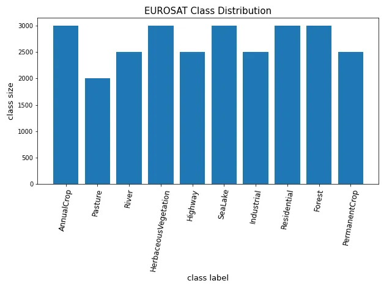

# EuroSat Dataset:

[The EuroSAT dataset](https://github.com/phelber/EuroSAT)[1](https://github.com/phelber/EuroSAT)[2](https://www.tensorflow.org/datasets/catalog/eurosat)[3](https://paperswithcode.com/dataset/eurosat) [is a publicly available remote sensing dataset of Sentinel-2 satellite images, which were captured over 13 spectral bands](https://rmnng.medium.com/satellite-images-classification-using-the-eurosat-dataset-13f7fd1edc42)[4](https://rmnng.medium.com/satellite-images-classification-using-the-eurosat-dataset-13f7fd1edc42). This dataset is a significant component of the hybrid model developed for large scale remote sensing image classification. [The EuroSAT dataset provides a comprehensive collection of geo-referenced images, covering ten different land cover classes, including residential areas, industrial areas, forests, pastures, and more](https://rmnng.medium.com/satellite-images-classification-using-the-eurosat-dataset-13f7fd1edc42)[4](https://rmnng.medium.com/satellite-images-classification-using-the-eurosat-dataset-13f7fd1edc42).

[The EuroSAT dataset is based on Sentinel-2 satellite images](https://github.com/phelber/EuroSAT)[1](https://github.com/phelber/EuroSAT)[2](https://www.tensorflow.org/datasets/catalog/eurosat)[3](https://paperswithcode.com/dataset/eurosat). [The Sentinel-2 satellite images are openly and freely accessible, provided in the Earth observation program Copernicus](https://github.com/phelber/EuroSAT)[1](https://github.com/phelber/EuroSAT). [The dataset consists of 27,000 labeled and geo-referenced samples](https://www.tensorflow.org/datasets/catalog/eurosat)[2](https://www.tensorflow.org/datasets/catalog/eurosat). [Two versions of the dataset are offered: one containing only the optical R, G, B frequency bands encoded as a JPEG image (referred to as the ‘rgb’ version), and another containing all 13 bands in the original value range (float32), referred to as the ‘all’ version](https://www.tensorflow.org/datasets/catalog/eurosat)[2](https://www.tensorflow.org/datasets/catalog/eurosat).

The EuroSAT dataset was utilized in this study due to its extensive coverage of different land cover classes and its high-quality Sentinel-2 satellite images. The images from the EuroSAT dataset were preprocessed and resized to 128x128 pixels to be compatible with the input requirements of the hybrid model. The labels provided with the EuroSAT dataset were used as the ground truth for training the model.

The EuroSAT dataset’s contribution to the study is significant. It provided a diverse range of images that helped in training the model to accurately classify different land cover classes. The high accuracy achieved by the model on the testing set demonstrates the effectiveness of the EuroSAT dataset in training robust land cover classification models.

In conclusion, the EuroSAT dataset has proven to be an invaluable resource for this study. Its diverse and high-quality images have played a crucial role in the successful development and performance of the hybrid model for large scale remote sensing image classification.

Please note that you should adjust the text to fit the style and requirements of your thesis. [Also, remember to cite the EuroSAT dataset appropriately in your references](https://github.com/phelber/EuroSAT)[1](https://github.com/phelber/EuroSAT)[2](https://www.tensorflow.org/datasets/catalog/eurosat)[3](https://paperswithcode.com/dataset/eurosat).

from EuroSAT paper

**Satellite Image Acquisition**

We have downloaded satellite images taken by the satellite Sentinel-2A via Amazon S3. We chose satellite images
associated with the cities covered in the European Urban
Atlas. The covered cities are distributed over the 34 European countries: Austria, Belarus, Belgium, Bulgaria, Cyprus,
Czech Republic (Czechia), Denmark, Estonia, Finland, France,
Germany, Greece, Hungary, Iceland, Ireland, Italy / Holy See,
Latvia, Lithuania, Luxembourg, Macedonia, Malta, Republic
of Moldova, Netherlands, Norway, Poland, Portugal, Romania,

//pic of all classes images

Slovakia, Slovenia, Spain, Sweden, Switzerland, Ukraine and
United Kingdom.
In order to improve the chance of getting valuable image
patches, we selected satellite images with a low cloud level.
Besides the possibility to generate a cloud mask, ESA provides
a cloud level value for each satellite image allowing to quickly
select images with a low percentage of clouds covering the
land scene.
We aimed for the objective to cover as many countries
as possible in the EuroSAT dataset in order to cover the
high intra-class variance inherent to remotely sensed images.
Furthermore, we have extracted images recorded all over the
year to get a variance as high as possible inherent in the
covered land use and land cover classes. Within one class of
the EuroSAT dataset, different land types of this class are represented such as different types of forests in the forest class or
different types of industrial buildings in the industrial building
class. Between the classes, there is a low positive correlation.
The classes most common to each other are the two presented
agricultural classes and the two classes representing residential
and industrial buildings. The composition of the individual
classes and their relationships are specified in the mapping
guide of the European Urban Atlas [40]. An overview diagram
of the dataset creation process is shown in Fig. 3

