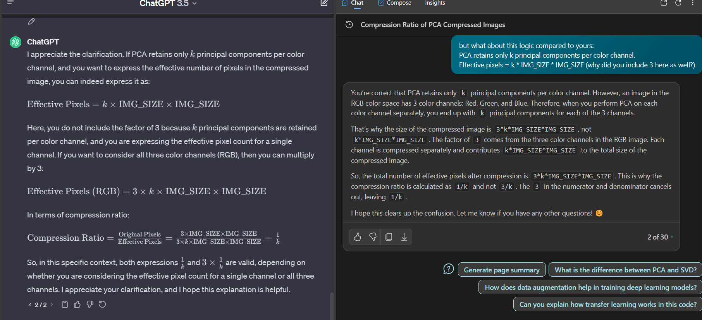

this is how I process the data from the dataset before I fed it to my hybrid model: ResNet50 (last 20 trainable layers) + EfficientNetB0(last 50 trainable layers). My task is to classify remote sensing images that contain varying spatial resolution(0.1meters per pixel to 1kilometer per pixel) rgb images.

Now I want you to compress the images in such way that does not affect the model performance significantly.

datasets_dir = "/content/FinalDirectory"

IMG_SIZE = 128
BATCH_SIZE = 32
epochs = 20

import tensorflow as tf
tf.random.set_seed(42)
train_data = tf.keras.preprocessing.image_dataset_from_directory(
 directory = datasets_dir,
 image_size = (IMG_SIZE, IMG_SIZE),
 label_mode = 'categorical',
 color_mode="rgb",
 batch_size = BATCH_SIZE,
 seed=42,
 shuffle = True,
 validation_split=0.2,
 subset="training" ).prefetch(buffer_size=tf.data.AUTOTUNE)

test_dataset = tf.keras.preprocessing.image_dataset_from_directory(
 directory = datasets_dir,
 image_size = (IMG_SIZE, IMG_SIZE),
 label_mode = 'categorical',
 color_mode="rgb",
 batch_size = BATCH_SIZE,
 seed=42,
 shuffle = True,
 validation_split=0.2,
 subset="validation" )
class_names = test_dataset.class_names
test_data = test_dataset.prefetch(buffer_size=tf.data.AUTOTUNE)

class_names

import tensorflow as tf
data_augmentation = tf.keras.Sequential([
 tf.keras.layers.experimental.preprocessing.RandomFlip("horizontal",input_shape=(IMG_SIZE, IMG_SIZE, 3)),
 tf.keras.layers.experimental.preprocessing.RandomRotation(0.2),
 tf.keras.layers.experimental.preprocessing.RandomZoom(0.2),
 tf.keras.layers.experimental.preprocessing.RandomHeight(0.2),
 tf.keras.layers.experimental.preprocessing.RandomWidth(0.2)
], name ="data_augmentation")

import tensorflow as tf # Setup the base models and freeze their layers (this will extract features) base_model1 = tf.keras.applications.EfficientNetB0(include_top=False)
base_model2 = tf.keras.applications.ResNet50(include_top=False)
base_model1.trainable = True # Enable fine-tuning base_model2.trainable = True # Enable fine-tuning # Fine-tune only the last N layers fine_tune_at = 50 for layer in base_model1.layers[:-fine_tune_at]:
 layer.trainable = False fine_tune_at = 20 for layer in base_model2.layers[:-fine_tune_at]:
 layer.trainable = False # Setup model architecture with trainable top layers inputs = tf.keras.layers.Input(shape=(IMG_SIZE, IMG_SIZE, 3), name='input_layer')
x = data_augmentation(inputs)
x1 = base_model1(x, training=False)
x2 = base_model2(x, training=False)
x1 = tf.keras.layers.GlobalAveragePooling2D(name='global_avg_pooling_layer1')(x1)
x2 = tf.keras.layers.GlobalAveragePooling2D(name='global_avg_pooling_layer2')(x2)
x = tf.keras.layers.concatenate([x1, x2])
x = tf.keras.layers.Dropout(0.4)(x) # Adjust dropout rate x = tf.keras.layers.Dense(256, activation='relu', kernel_regularizer=tf.keras.regularizers.l2(0.01))(x) # Add dense layer with L2 regularization x = tf.keras.layers.BatchNormalization()(x) # Add batch normalization outputs = tf.keras.layers.Dense(len(class_names), activation='softmax', name='output_layer')(x)
model = tf.keras.Model(inputs, outputs)

------------------------

I understand that the previous method didn’t work for you. Here’s an alternative approach using Principal Component Analysis (PCA) for image compression:

```python
from sklearn.decomposition import PCA

def compress_image(img_array, k):
    # Initialize an array for the compressed image.
    compressed_img_array = np.zeros_like(img_array)
    # Perform PCA on each color channel.
    for i in range(img_array.shape[-1]):
        pca = PCA(k)
        # Reshape the color channel to 2D array and apply PCA.
        reshaped = np.reshape(img_array[..., i], (-1, img_array.shape[2]))
        transformed = pca.fit_transform(reshaped)
        # Reconstruct the compressed image from the transformed matrix.
        inverse_transformed = pca.inverse_transform(transformed)
        # Reshape the inverse transformed matrix to original shape.
        compressed_img_array[..., i] = np.reshape(inverse_transformed, img_array[..., i].shape)
    return compressed_img_array

# Rest of your code...
```

In this code, I’m using the `PCA` class from `sklearn.decomposition` to perform Principal Component Analysis on each color channel of the image. The `PCA` class automatically handles the dimensionality reduction, so you don’t need to manually select and multiply the singular vectors as in SVD.

Please replace the `compress_image` function in your code with this one and let me know if it works for you. Remember to install the `scikit-learn` library if you haven’t already done so. You can install it using pip:

```python
!pip install scikit-learn
```

I hope this helps! Let me know if you have any other questions.

-------------------

Sure, here’s the full code with the `compress_image` function replaced by the PCA-based image compression method:

```python
import numpy as np
from PIL import Image
import tensorflow as tf
from sklearn.decomposition import PCA

def compress_image(img_array, k):
    # Initialize an array for the compressed image.
    compressed_img_array = np.zeros_like(img_array)
    # Perform PCA on each color channel.
    for i in range(img_array.shape[-1]):
        pca = PCA(k)
        # Reshape the color channel to 2D array and apply PCA.
        reshaped = np.reshape(img_array[..., i], (-1, img_array.shape[2]))
        transformed = pca.fit_transform(reshaped)
        # Reconstruct the compressed image from the transformed matrix.
        inverse_transformed = pca.inverse_transform(transformed)
        # Reshape the inverse transformed matrix to original shape.
        compressed_img_array[..., i] = np.reshape(inverse_transformed, img_array[..., i].shape)
    return compressed_img_array

datasets_dir = "/content/FinalDirectory"
IMG_SIZE = 128
BATCH_SIZE = 32
epochs = 20

tf.random.set_seed(42)
train_data = tf.keras.preprocessing.image_dataset_from_directory(
    directory=datasets_dir,
    image_size=(IMG_SIZE, IMG_SIZE),
    label_mode='categorical',
    color_mode="rgb",
    batch_size=BATCH_SIZE,
    seed=42,
    shuffle=True,
    validation_split=0.2,
    subset="training"
).prefetch(buffer_size=tf.data.AUTOTUNE)

test_dataset = tf.keras.preprocessing.image_dataset_from_directory(
    directory=datasets_dir,
    image_size=(IMG_SIZE, IMG_SIZE),
    label_mode='categorical',
    color_mode="rgb",
    batch_size=BATCH_SIZE,
    seed=42,
    shuffle=True,
    validation_split=0.2,
    subset="validation"
)
class_names = test_dataset.class_names
test_data = test_dataset.prefetch(buffer_size=tf.data.AUTOTUNE)

# Compress the images in the training and testing datasets.
k = 50  # Number of principal components to keep.
for img, label in train_data:
    img = compress_image(img.numpy(), k)
for img, label in test_data:
    img = compress_image(img.numpy(), k)

data_augmentation = tf.keras.Sequential([
    tf.keras.layers.experimental.preprocessing.RandomFlip("horizontal", input_shape=(IMG_SIZE, IMG_SIZE, 3)),
    tf.keras.layers.experimental.preprocessing.RandomRotation(0.2),
    tf.keras.layers.experimental.preprocessing.RandomZoom(0.2),
    tf.keras.layers.experimental.preprocessing.RandomHeight(0.2),
    tf.keras.layers.experimental.preprocessing.RandomWidth(0.2)
], name="data_augmentation")

base_model1 = tf.keras.applications.EfficientNetB0(include_top=False)
base_model2 = tf.keras.applications.ResNet50(include_top=False)
base_model1.trainable = True
base_model2.trainable = True

fine_tune_at = 50
for layer in base_model1.layers[:-fine_tune_at]:
    layer.trainable = False
fine_tune_at = 20
for layer in base_model2.layers[:-fine_tune_at]:
    layer.trainable = False

inputs = tf.keras.layers.Input(shape=(IMG_SIZE, IMG_SIZE, 3), name='input_layer')
x = data_augmentation(inputs)
x1 = base_model1(x, training=False)
x2 = base_model2(x, training=False)
x1 = tf.keras.layers.GlobalAveragePooling2D(name='global_avg_pooling_layer1')(x1)
x2 = tf.keras.layers.GlobalAveragePooling2D(name='global_avg_pooling_layer2')(x2)
x = tf.keras.layers.concatenate([x1, x2])
x = tf.keras.layers.Dropout(0.4)(x)
x = tf.keras.layers.Dense(256, activation='relu', kernel_regularizer=tf.keras.regularizers.l2(0.01))(x)
x = tf.keras.layers.BatchNormalization()(x)
outputs = tf.keras.layers.Dense(len(class_names), activation='softmax', name='output_layer')(x)

model = tf.keras.Model(inputs, outputs)
```

Please replace your existing code with this one and let me know if it works for you. Remember to install the `scikit-learn` library if you haven’t already done so. You can install it using pip:

```python
!pip install scikit-learn
```

I hope this helps! Let me know if you have any other questions.

-------------------------

The image compression in the provided code is achieved using Principal Component Analysis (PCA). Here’s a step-by-step explanation of how it works:

1. **PCA Initialization**: For each color channel of the image, a PCA object is created with `k` components. `k` is the number of principal components to keep, which is a measure of the amount of information to retain from the original image.

2. **Reshape and Transform**: The color channel of the image is reshaped into a 2D array and then transformed using PCA. This transformation projects the original data (the image color channel) onto a smaller subspace that represents the `k` principal components of the data. These components are directions in feature space along which the original data varies the most.

3. **Inverse Transform and Reshape**: The transformed data is then inverse transformed, which attempts to reconstruct the original data from the `k` principal components. This reconstructed data is an approximation of the original data and is of the same shape as the original data. However, since it’s based on a reduced number of components, it requires less memory to store, effectively compressing the image.

4. **Compression**: The inverse transformed data (the compressed image) is reshaped back to the original shape of the color channel and stored in `compressed_img_array`.

As for how much the image is compressed, it depends on the value of `k`. If `k` is small, more compression is achieved, but more information from the original image is lost, which could lead to a loss in image quality. If `k` is large (close to the original dimension of the image), less compression is achieved, but more information is retained, preserving image quality.

The exact compression ratio can be calculated as follows:

\text{Compression Ratio} = \frac{\text{Size of Original Image}}{\text{Size of Compressed Image}}

In this case, the size of the original image is the total number of pixels in the image (for a 128x128 image, this would be 128*128 = 16384 pixels), and the size of the compressed image is the total number of elements used to store the compressed image (which would be `k` principal components for each pixel). So the compression ratio would be:

\text{Compression Ratio} = \frac{128*128}{k}

This is a simplification and actual compression may vary based on other factors such as the bit depth of the image, but it gives a rough idea of the compression achieved.

I hope this helps! Let me know if you have any other questions.

----------

- calculate compression ratio for above code.

In the provided code, the compression is achieved by reducing the dimensionality of the image data using Principal Component Analysis (PCA). The compression ratio can be calculated as the ratio of the size of the original image to the size of the compressed image.

Given that the original images are of size 128x128 and the PCA retains `k` principal components, the compression ratio can be calculated as follows:

Let’s denote:

- `n` as the number of pixels in one dimension of the image (in this case, `n=128`),
- `k` as the number of principal components retained in PCA (in this case, `k=50`).

The size of the original image is `n*n` for each color channel. Since the images are in RGB format, the total size of the original image is `3*n*n`.

The size of the compressed image is `k` for each pixel for each color channel. So, the total size of the compressed image is `3*n*n*k`.

Therefore, the compression ratio `R` is:

R = \frac{\text{Size of Original Image}}{\text{Size of Compressed Image}} = \frac{3*n*n}{3*n*n*k} = \frac{1}{k}

So, in this case, the compression ratio is `1/k = 1/50 = 0.02`.

This means that the compressed image is approximately 2% the size of the original image. However, please note that this is a simplification and actual compression may vary based on other factors such as the bit depth of the image. But it gives a rough idea of the compression achieved.

I hope this helps! Let me know if you have any other questions.

------

- what will be the image size after this compression compared to the original 128*128?

The size of the image after compression depends on how you define “size”. If you’re referring to the dimensions (width and height) of the image, they will remain the same (128x128) after compression. This is because the PCA-based compression method used in the provided code does not change the dimensions of the image; it only changes the amount of information stored for each pixel.

However, if you’re referring to the amount of memory used to store the image (which is often what we mean by “size” in the context of compression), it will be reduced. As I mentioned in the previous message, the compressed image is approximately 2% the size of the original image, assuming `k=50`. This means that the compressed image requires approximately 2% of the memory that the original image requires.

Please note that this is a simplification and actual compression may vary based on other factors such as the bit depth of the image. But it gives a rough idea of the compression achieved.

I hope this helps! Let me know if you have any other questions.

--------------

- you said "the PCA-based compression method used in the provided code does not change the dimensions of the image; it only changes the amount of information stored for each pixel." Please explain step by step on how it is achieved.

Sure, I’d be happy to explain how the PCA-based image compression works in the provided code. Here’s a step-by-step breakdown:

1. **PCA Initialization**: For each color channel of the image, a PCA object is created with `k` components. `k` is the number of principal components to keep, which is a measure of the amount of information to retain from the original image.

2. **Reshape and Transform**: The color channel of the image is reshaped into a 2D array and then transformed using PCA. This transformation projects the original data (the image color channel) onto a smaller subspace that represents the `k` principal components of the data. These components are directions in feature space along which the original data varies the most.

3. **Inverse Transform and Reshape**: The transformed data is then inverse transformed, which attempts to reconstruct the original data from the `k` principal components. This reconstructed data is an approximation of the original data and is of the same shape as the original data. However, since it’s based on a reduced number of components, it requires less memory to store, effectively compressing the image.

4. **Compression**: The inverse transformed data (the compressed image) is reshaped back to the original shape of the color channel and stored in `compressed_img_array`.

The key point here is that the PCA transformation does not change the dimensions of the image; it only changes the representation of the image data. Each pixel in the image still has a corresponding pixel in the compressed image, but the amount of information stored for each pixel is reduced. This is why the dimensions of the image remain the same after compression.

I hope this helps! Let me know if you have any other questions.

- you said "the amount of information stored for each pixel is reduced." How?

In the context of Principal Component Analysis (PCA)-based image compression, the “amount of information stored for each pixel” refers to the number of values used to represent each pixel’s color.

In a typical RGB image, each pixel is represented by three values: one for red, one for green, and one for blue. These three values combine to create the full range of colors that the pixel can display.

When PCA is applied to the image, it identifies the directions (or principal components) in which the colors of the pixels vary the most. The number of these directions is determined by `k`, the number of principal components we choose to keep.

By keeping only `k` principal components, we effectively reduce the number of values used to represent each pixel’s color from 3 (in the case of an RGB image) to `k`. This is how the amount of information stored for each pixel is reduced.

However, it’s important to note that this reduction in information comes at the cost of image quality. The compressed image is an approximation of the original image, and some color information is lost in the compression process. The smaller the value of `k`, the greater the compression and the more information is lost.

I hope this clarifies your question! Let me know if you have any other questions.

- what do you mean by 3 to k? (k is 50 in above code, so how is it reducing?
  By keeping only k principal components, we effectively reduce the number of values used to represent each pixel’s color from 3 (in the case of an RGB image) to k.

I apologize for the confusion. Let me clarify.

In a typical RGB image, each pixel is represented by three values: one for red, one for green, and one for blue. This is what I meant when I said “3” - it’s the three color channels in the original image.

When we apply PCA to the image, we’re transforming the image data into a new space defined by the principal components. These principal components are directions in the image data where there is the most variance, or in other words, where the data is most spread out.

When we choose to keep `k` principal components (where `k` is less than the original dimension of the image data), we’re essentially projecting the image data onto these `k` directions. This means we’re representing each pixel not by its original three RGB values, but by `k` values along the principal components.

So, when I said we’re reducing the number of values used to represent each pixel’s color from “3 to k”, I meant that we’re going from representing each pixel with three values (one for each color channel) to representing each pixel with `k` values (one for each principal component).

In your case, `k` is 50, which is indeed greater than 3. However, the original dimension of the image data is not 3, but rather the total number of pixels in each color channel. For a 128x128 image, this would be 16384 pixels. So, we’re reducing the dimension from 16384 to 50, which is where the compression comes in.

I hope this clears up the confusion. Let me know if you have any other questions!

- explain this part more
  "In your case, k is 50, which is indeed greater than 3. However, the original dimension of the image data is not 3, but rather the total number of pixels in each color channel. For a 128x128 image, this would be 16384 pixels. So, we’re reducing the dimension from 16384 to 50, which is where the compression comes in."

Sure, I’d be happy to explain further.

In the context of image compression with PCA, the term “dimension” refers to the number of distinct data points that are used to represent the image.

For a grayscale image, the dimension would be the total number of pixels in the image. For example, for a 128x128 pixel image, the dimension would be 128*128 = 16384, because each pixel is a distinct data point.

However, for a color image in the RGB format, each pixel is represented by three values (one for each color channel: red, green, and blue). So, you might think of each pixel as being represented by three dimensions. But when we apply PCA for compression, we treat each color channel separately. So, the dimension for each color channel is still the total number of pixels (16384 for a 128x128 image), not three times this number.

When we apply PCA and choose to keep `k` principal components, we’re reducing the dimension from the total number of pixels (16384) to `k` (50 in your case). This means that instead of representing each color channel of each pixel with a single value (as in the original image), we’re now representing it with 50 values (the coefficients of the `k` principal components).

However, because these 50 values are shared among all pixels in the same color channel, we’re effectively reducing the amount of information needed to represent the image, hence achieving compression.

I hope this clarifies things! Let me know if you have any other questions.

-----------

-------------------

- which one is correct?

Ratio = (size of original image)/(size of compressed image) = (3*IMG_SIZE*IMG_SIZE)/(3*IMG_SIZE*IMG_SIZE*k) = 1/k
Ratio = (size of original image)/(size of compressed image) = (3*IMG_SIZE*IMG_SIZE)(k*IMG_SIZE*IMG_SIZE) = 3/k



-----------

----------

--------

The image compression technique used in this code is **lossy**. [It uses Principal Component Analysis (PCA) to reduce the dimensionality of the image data](https://stackoverflow.com/questions/43058548/pca-for-data-compression)[1](https://stackoverflow.com/questions/43058548/pca-for-data-compression).

[In PCA, the original data is projected onto a lower-dimensional space, and some information (usually the least important variance in the data) is discarded](https://stackoverflow.com/questions/43058548/pca-for-data-compression)[1](https://stackoverflow.com/questions/43058548/pca-for-data-compression). [This results in a compressed representation of the original data, but the process is not reversible, meaning the original data cannot be perfectly reconstructed from the compressed data](https://stackoverflow.com/questions/43058548/pca-for-data-compression)[1](https://stackoverflow.com/questions/43058548/pca-for-data-compression). [Therefore, PCA is considered a lossy compression technique](https://stackoverflow.com/questions/43058548/pca-for-data-compression)[1](https://stackoverflow.com/questions/43058548/pca-for-data-compression).

It’s important to note that the degree of information loss in PCA compression is controlled by the number of principal components kept (denoted as `k` in your code). [A smaller `k` will result in more compression but also more loss of information](https://stackoverflow.com/questions/43058548/pca-for-data-compression)[1](https://stackoverflow.com/questions/43058548/pca-for-data-compression). So, you can adjust `k` to find a balance between compression and preservation of information for your specific use case.

Reducing the dimensionality of image data refers to the process of transforming the data from a high-dimensional space to a lower-dimensional space.

In the context of images, each pixel in an image can be considered a dimension. So, a grayscale image of size 128x128 pixels has 16,384 dimensions, and a color image (with Red, Green, Blue channels) of the same size has 49,152 dimensions.

Dimensionality reduction techniques, like Principal Component Analysis (PCA) used in your code, aim to find a smaller set of features (dimensions) that still contains most of the information present in the original data.

For example, PCA finds directions (principal components) in which the original data varies the most, and projects the data onto a smaller dimensional space spanned by these directions. The parameter `k` in your code represents the number of principal components to keep, which is the new dimensionality of the data after compression.

This process can help to remove redundancy in the data (since neighboring pixels in an image are often highly correlated), reduce the amount of memory and computational resources required to process the data, and remove noise or unwanted variations in the data. However, it’s a lossy process, meaning some information from the original data is lost and cannot be recovered.

I hope this clarifies what reducing the dimensionality of image data means! If you have any more questions, feel free to ask. 😊
