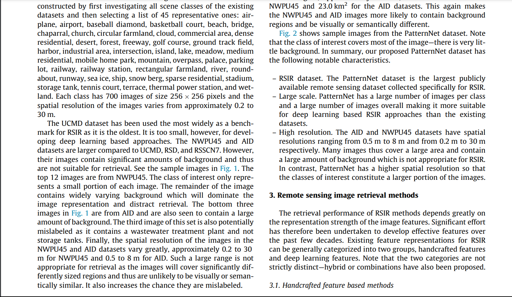

datasets:

1. [EuroSat Dataset | Kaggle](https://www.kaggle.com/datasets/apollo2506/eurosat-dataset/data)
- 10 meters per pixel. (spatial resolution)
1. [UCMerced Dataset - Land-Use Scene Classification | Kaggle](https://www.kaggle.com/datasets/apollo2506/landuse-scene-classification/data)
- 0.3 meters per pixel
1. [NWPU-RESISC45 Dataset | Kaggle](https://www.kaggle.com/datasets/happyyang/nwpu-data-set)
- 0.2 meters to 30 meters per pixel
1. [So2Sat LCZ42 | TensorFlow Datasets](https://www.tensorflow.org/datasets/catalog/so2sat)

2. [PatternNet](https://sites.google.com/view/zhouwx/dataset?authuser=0)
- 0.1 to 1.2 m

----

1. [AID: A scene classification dataset | Kaggle](https://www.kaggle.com/datasets/jiayuanchengala/aid-scene-classification-datasets)
- 0.5 to 8
2. WHU-RS19 dataset
- at most 0.5 m
3. RSSCN7 Dataset
- Unknown

-------

[In remote sensing, the terms “large scale” and “small scale” refer to the “map-to-ground ratio” of the images](https://natural-resources.canada.ca/maps-tools-and-publications/satellite-imagery-and-air-photos/tutorial-fundamentals-remote-sensing/satellites-and-sensors/spatial-resolution-pixel-size-and-scale/9407)[1](https://natural-resources.canada.ca/maps-tools-and-publications/satellite-imagery-and-air-photos/tutorial-fundamentals-remote-sensing/satellites-and-sensors/spatial-resolution-pixel-size-and-scale/9407).

**Large-scale remote sensing images** have larger “map-to-ground ratios” (e.g., 1:5,000), meaning each pixel represents a small area on the ground. [For example, SPOT data, with a spatial resolution of 10m or 20m, is considered large scale](https://gisrsstudy.com/remote-sensing-resolution/)[2](https://gisrsstudy.com/remote-sensing-resolution/).

On the other hand, **small-scale remote sensing images** have smaller “map-to-ground ratios” (e.g., 1:100,000), meaning each pixel represents a larger area on the ground. [An example of this is the Advanced Very High Resolution Radiometer (AVHRR) data, with a spatial resolution of 1.1 km](https://gisrsstudy.com/remote-sensing-resolution/)[2](https://gisrsstudy.com/remote-sensing-resolution/).

[The **spatial resolution** of an image refers to the size of the smallest possible feature that can be detected](https://natural-resources.canada.ca/maps-tools-and-publications/satellite-imagery-and-air-photos/tutorial-fundamentals-remote-sensing/satellites-and-sensors/spatial-resolution-pixel-size-and-scale/9407)[1](https://natural-resources.canada.ca/maps-tools-and-publications/satellite-imagery-and-air-photos/tutorial-fundamentals-remote-sensing/satellites-and-sensors/spatial-resolution-pixel-size-and-scale/9407). [It’s the size of one pixel in terms of ground dimensions](https://www.amnh.org/content/download/74353/1391447/file/ScaleAndResolution_Final.pdf)[3](https://www.amnh.org/content/download/74353/1391447/file/ScaleAndResolution_Final.pdf). [For instance, if a sensor has a spatial resolution of 20 meters, each pixel represents an area of 20m x 20m on the ground](https://natural-resources.canada.ca/maps-tools-and-publications/satellite-imagery-and-air-photos/tutorial-fundamentals-remote-sensing/satellites-and-sensors/spatial-resolution-pixel-size-and-scale/9407)[1](https://natural-resources.canada.ca/maps-tools-and-publications/satellite-imagery-and-air-photos/tutorial-fundamentals-remote-sensing/satellites-and-sensors/spatial-resolution-pixel-size-and-scale/9407).

[In summary, large-scale images have high spatial resolution and can detect smaller features, while small-scale images have low spatial resolution and represent larger areas but with less detail](https://natural-resources.canada.ca/maps-tools-and-publications/satellite-imagery-and-air-photos/tutorial-fundamentals-remote-sensing/satellites-and-sensors/spatial-resolution-pixel-size-and-scale/9407)[1](https://natural-resources.canada.ca/maps-tools-and-publications/satellite-imagery-and-air-photos/tutorial-fundamentals-remote-sensing/satellites-and-sensors/spatial-resolution-pixel-size-and-scale/9407)[2](https://gisrsstudy.com/remote-sensing-resolution/).

