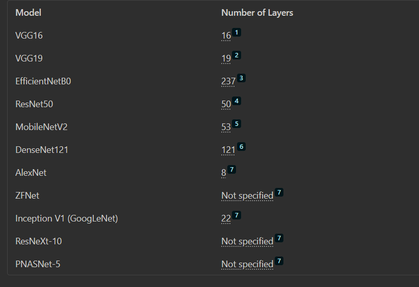

# 

# datasets:

1. [EuroSat Dataset | Kaggle](https://www.kaggle.com/datasets/apollo2506/eurosat-dataset/data)
- 10 meters per pixel. (spatial resolution)
1. [UCMerced Dataset - Land-Use Scene Classification | Kaggle](https://www.kaggle.com/datasets/apollo2506/landuse-scene-classification/data)
- 0.3 meters per pixel
1. [NWPU-RESISC45 Dataset | Kaggle](https://www.kaggle.com/datasets/happyyang/nwpu-data-set)
- 0.2 meters to 30 meters per pixel
1. [So2Sat LCZ42 | TensorFlow Datasets](https://www.tensorflow.org/datasets/catalog/so2sat) 

2. [PatternNet](https://sites.google.com/view/zhouwx/dataset?authuser=0)
- 0.1 to 1.2 m

------

[In remote sensing, the terms “large scale” and “small scale” refer to the “map-to-ground ratio” of the images](https://natural-resources.canada.ca/maps-tools-and-publications/satellite-imagery-and-air-photos/tutorial-fundamentals-remote-sensing/satellites-and-sensors/spatial-resolution-pixel-size-and-scale/9407)[1](https://natural-resources.canada.ca/maps-tools-and-publications/satellite-imagery-and-air-photos/tutorial-fundamentals-remote-sensing/satellites-and-sensors/spatial-resolution-pixel-size-and-scale/9407).

**Large-scale remote sensing images** have larger “map-to-ground ratios” (e.g., 1:5,000), meaning each pixel represents a small area on the ground. [For example, SPOT data, with a spatial resolution of 10m or 20m, is considered large scale](https://gisrsstudy.com/remote-sensing-resolution/)[2](https://gisrsstudy.com/remote-sensing-resolution/).

On the other hand, **small-scale remote sensing images** have smaller “map-to-ground ratios” (e.g., 1:100,000), meaning each pixel represents a larger area on the ground. [An example of this is the Advanced Very High Resolution Radiometer (AVHRR) data, with a spatial resolution of 1.1 km](https://gisrsstudy.com/remote-sensing-resolution/)[2](https://gisrsstudy.com/remote-sensing-resolution/).

[The **spatial resolution** of an image refers to the size of the smallest possible feature that can be detected](https://natural-resources.canada.ca/maps-tools-and-publications/satellite-imagery-and-air-photos/tutorial-fundamentals-remote-sensing/satellites-and-sensors/spatial-resolution-pixel-size-and-scale/9407)[1](https://natural-resources.canada.ca/maps-tools-and-publications/satellite-imagery-and-air-photos/tutorial-fundamentals-remote-sensing/satellites-and-sensors/spatial-resolution-pixel-size-and-scale/9407). [It’s the size of one pixel in terms of ground dimensions](https://www.amnh.org/content/download/74353/1391447/file/ScaleAndResolution_Final.pdf)[3](https://www.amnh.org/content/download/74353/1391447/file/ScaleAndResolution_Final.pdf). [For instance, if a sensor has a spatial resolution of 20 meters, each pixel represents an area of 20m x 20m on the ground](https://natural-resources.canada.ca/maps-tools-and-publications/satellite-imagery-and-air-photos/tutorial-fundamentals-remote-sensing/satellites-and-sensors/spatial-resolution-pixel-size-and-scale/9407)[1](https://natural-resources.canada.ca/maps-tools-and-publications/satellite-imagery-and-air-photos/tutorial-fundamentals-remote-sensing/satellites-and-sensors/spatial-resolution-pixel-size-and-scale/9407).

[In summary, large-scale images have high spatial resolution and can detect smaller features, while small-scale images have low spatial resolution and represent larger areas but with less detail](https://natural-resources.canada.ca/maps-tools-and-publications/satellite-imagery-and-air-photos/tutorial-fundamentals-remote-sensing/satellites-and-sensors/spatial-resolution-pixel-size-and-scale/9407)[1](https://natural-resources.canada.ca/maps-tools-and-publications/satellite-imagery-and-air-photos/tutorial-fundamentals-remote-sensing/satellites-and-sensors/spatial-resolution-pixel-size-and-scale/9407)[2](https://gisrsstudy.com/remote-sensing-resolution/).

-----

| Final        | EuroSat                   | UC Merced                                              | NWPU-Resisc45                         |
| ------------ | ------------------------- | ------------------------------------------------------ | ------------------------------------- |
| Agricultural | AnnualCrop, PermanentCrop | agricultural                                           |                                       |
| Forest       | forest                    | forest                                                 | forest                                |
|              | river                     | river                                                  |                                       |
| industrial   | industrial                |                                                        | industrial_area                       |
| residential  | residential               | mediumresidential, denseresidential, sparseresidential | medium_residential, dense_residential |
| airplane     |                           | airplane                                               | airplane                              |
|              |                           | baseballdiamond                                        | baseball_diamond                      |
|              |                           | beach                                                  | beach                                 |
|              |                           | mobilehomepark                                         | mobile_home_park                      |
|              |                           | intersection                                           | intersection                          |
|              |                           | overpass                                               | overpass                              |
|              |                           | buildings                                              | commercial_area                       |
|              |                           | chaparral                                              | chaparral                             |
|              | Highway                   | freeway                                                | freeway                               |
|              |                           | golfcourse                                             | golf_course                           |
|              |                           | harbor                                                 | harbor                                |
|              |                           | intersection                                           | intersection                          |
|              |                           | parkinglot                                             | parking_lot                           |
|              |                           |                                                        |                                       |
|              |                           |                                                        |                                       |
|              |                           |                                                        |                                       |
|              |                           |                                                        |                                       |
|              |                           |                                                        |                                       |

EfficientNetB0 + VGG16 = super slow

 ----

# Todo

1. 

2. 

3. 

4. ADDITIONAL DATASET INFORMATION (from all dataset merged pdf)

5. [Image Classification Techniques in Remote Sensing (gisgeography.com)](https://gisgeography.com/image-classification-techniques-remote-sensing/)

6. 

7. 

**

# what is imagenet, hyperparameter,

# how many layers in EfficentNet and resnet?

- feature extraction, y_true, confusion matrix

| Class Name   | EuroSAT                                                              | UC Merced                                                         | RESISC45                                                             | PatternNet                                                             |
| ------------ | -------------------------------------------------------------------- | ----------------------------------------------------------------- | -------------------------------------------------------------------- | ---------------------------------------------------------------------- |
| agricultural | One image from Eurosat agriculture class((if class is available)  | One image from UC Merced agriculture class(if class is available) | One image from RESISC45 agriculture class(if class is available)  | One image from PatternNet agriculture class(if class is available)  |
| airplane     | One image from Eurosat airplane class((if class is available)        | One image from UC Merced airplane class((if class is available)   | One image from RESISC45 airplane class((if class is available)       | One image from PatternNet airplane class((if class is available)       |

**

<mark>same type</mark>: 

nursing home + church + commercial

pasture + harbaciousVegetation+

railway+railway_station

agriculture+rectangular_farmland_circular_farmland

freeway+runway

stadium+football_field+basketball_field

mobile_home_park+residential

# models

1. InceptionV3 = low accuracy

2. VGG16, 19 = huge computational power needed (slow as hell)

-----

---

**Abstract:**

emote sensing is a powerful technology that captures information about the Earth’s surface from a distance, enabling various applications such as environmental management, urban planning, and disaster response. However, classifying remote sensing images into meaningful categories is a challenging task, especially when dealing with large-scale and diverse datasets. In this work, we present a novel hybrid model designed for accurate classification across 64 land cover and land use categories, addressing the complexity of large-scale remote sensing datasets.

The proposed model utilizes two pre-trained convolutional neural networks (CNNs), EfficientNetB0, and ResNet50, to extract deep features from the land use and land cover/remote sensing(which one should I use) images.The deep features extracted from each CNN are then fused using the concatenation technique to produce a more complex feature set from which the model can learn better about the dataset.

To construct a comprehensive dataset for training and evaluation, we merge four distinct datasets—EuroSAT, UCMerced, NWPU-RESISC45, and PatternNet—resulting in a total of 99,400 images across 64 classes. Data augmentation techniques, including random flips, rotations, zooms, and adjustments in height and width were used to add variations to the images in the dataset used to train the model, increasing the variety and number of the images and enabling the model to learn more complex cases of the data. The obtained result of this work is compared with other pre-trained CNN models, namely ResNet152 and InceptionV3

The proposed hybrid model achieves an accuracy of 95.37%, which is compare with other pre trained models with fine-tuning, namely EfficientNetB0 (95.02%) and ResNet50 (93.90%). Additionally, we tested other hybrid architectures and compared it with our proposed model which proves to be the most optimal among them.

Our model's architecture involves fine-tuning selected CNNs, global average pooling for feature extraction, and strategic use of dropout layers for regularization. We implemented and evaluated the model on Google Colab, leveraging a T4 GPU for scalability and efficiency. The incorporation of early stopping and a learning rate schedule further enhances generalization and convergence.

Comparative analysis against existing benchmarks demonstrates the superiority of our hybrid model in handling the combined dataset. Our research contributes to advancing the state-of-the-art in remote sensing image classification, showcasing the potential of deep learning models to identify diverse land cover and land use categories accurately. Future investigations into transfer learning and model interpretability may unveil additional capabilities and improvements in our proposed hybrid model.

----

write about fine tuning my model:

**SoftMax Activation Function**

In multi-class classification problems, the SoftMax activation function is With fine-tuning methods, DCNNs can now perform specific 
tasks beyond its original purpose without the need for tremendous computing resources that 
can even assist in the field of medical image analysis [20]. Currently, several works have 
explored such methods to perform the automated task of detecting malaria parasites from 
blood cell images. DCNNs through the years have kept getting better to cope up with various 
demands not just in classification accuracy but also in overall efficiency and scalability. 
However, not much study had employed transfer learning and fine-tuning to recently released
DCNN models to perform the task of malaria parasite detection. Therefore, in our work, we 
focused on employing these methods to recent DCNNs for malaria parasite detection in blood 
smears to yield new findings and conclusions that may establish a new perspective for future 
researchers that may also tackle such a difficult task.

--------------

                           +----------+
                           |         |

+------------------+      | Global Avg |  (EfficientNetB0)
| Concatenate      |------->| Pooling   | (1280 features)
+------------------+      |         |
                           |         |
+------------------+      | Global Avg |  (ResNet50)
| Concatenate      |------->| Pooling   | (2048 features)
+------------------+      |         |
                           |         |
                           +----------+
                                  |
                                  | (3328 features)
+---------------------------------+
| Dropout (40% chance of dropping elements)
+---------------------------------+
                                  |
+-------------------------------------------------+
| Dense (256 neurons, ReLU activation, L2 reg.) |
+-------------------------------------------------+
                                  |
+-------------------------------------------------+
| Batch Normalization (normalizes activations)    |
+-------------------------------------------------+
                                  |
+--------------------------+-----------------------+
| Dense (64 neurons, softmax activation)            |
| (predicts class & assigns probabilities)          |
+--------------------------+-----------------------+

----

| Class                      | Precision | Recall | F1-Score | Support |
| -------------------------- | --------- | ------ | -------- | ------- |
| agricultural               | 0.98      | 0.97   | 0.98     | 1256    |
| airplane                   | 0.99      | 0.98   | 0.98     | 415     |
| airport                    | 0.95      | 0.81   | 0.88     | 134     |
| baseball_diamond           | 0.99      | 0.99   | 0.99     | 421     |
| basketball_court           | 0.93      | 0.92   | 0.92     | 313     |
| beach                      | 0.96      | 0.99   | 0.97     | 359     |
| bridge                     | 0.96      | 0.97   | 0.96     | 297     |
| cemetery                   | 0.92      | 1.00   | 0.96     | 177     |
| chaparral                  | 0.99      | 1.00   | 0.99     | 424     |
| christmas_tree_farm        | 1.00      | 0.99   | 1.00     | 149     |
| church                     | 0.71      | 0.78   | 0.74     | 144     |
| circular_farmland          | 0.99      | 0.95   | 0.97     | 149     |
| closed_road                | 0.97      | 0.98   | 0.98     | 165     |
| cloud                      | 1.00      | 0.92   | 0.96     | 145     |
| coastal_mansion            | 0.78      | 0.99   | 0.88     | 159     |
| commercial                 | 0.94      | 0.87   | 0.90     | 267     |
| crosswalk                  | 1.00      | 0.95   | 0.98     | 148     |
| desert                     | 0.92      | 0.95   | 0.94     | 153     |
| ferry_terminal             | 0.86      | 0.88   | 0.87     | 152     |
| football_field             | 0.95      | 0.98   | 0.96     | 181     |
| forest                     | 0.98      | 0.99   | 0.98     | 972     |
| freeway                    | 0.95      | 0.95   | 0.95     | 886     |
| golf_course                | 1.00      | 0.93   | 0.96     | 411     |
| ground_track_field         | 0.93      | 0.88   | 0.90     | 130     |
| harbor                     | 0.95      | 0.99   | 0.97     | 360     |
| herbaceous_vegetation      | 0.97      | 0.96   | 0.97     | 589     |
| industrial                 | 0.99      | 0.92   | 0.95     | 637     |
| intersection               | 0.91      | 0.98   | 0.94     | 405     |
| island                     | 0.98      | 0.95   | 0.96     | 155     |
| lake                       | 0.94      | 0.97   | 0.95     | 162     |
| meadow                     | 0.89      | 0.84   | 0.86     | 130     |
| mobile_home_park           | 0.97      | 0.97   | 0.97     | 349     |
| mountain                   | 0.95      | 0.86   | 0.90     | 125     |
| nursing_home               | 0.95      | 0.85   | 0.90     | 169     |
| oil_gas_field              | 0.99      | 0.98   | 0.99     | 171     |
| oil_well                   | 1.00      | 1.00   | 1.00     | 178     |
| overpass                   | 0.98      | 0.97   | 0.97     | 394     |
| palace                     | 0.81      | 0.70   | 0.75     | 134     |
| parking_lot                | 0.92      | 0.99   | 0.95     | 391     |
| parking_space              | 1.00      | 0.99   | 0.99     | 156     |
| pasture                    | 0.97      | 0.96   | 0.97     | 400     |
| railway                    | 0.89      | 0.97   | 0.92     | 271     |
| railway_station            | 0.86      | 0.87   | 0.86     | 132     |
| rectangular_farmland       | 0.89      | 0.88   | 0.88     | 136     |
| residential                | 0.93      | 0.97   | 0.95     | 1613    |
| river                      | 0.97      | 0.95   | 0.96     | 911     |
| roundabout                 | 0.93      | 0.94   | 0.93     | 113     |
| runway                     | 0.98      | 0.96   | 0.97     | 398     |
| runway_marking             | 0.99      | 0.99   | 0.99     | 174     |
| sea_ice                    | 0.99      | 0.99   | 0.99     | 149     |
| sealake                    | 1.00      | 0.98   | 0.99     | 614     |
| ship                       | 0.90      | 0.94   | 0.92     | 146     |
| shipping_yard              | 0.99      | 0.98   | 0.99     | 175     |
| snowberg                   | 0.96      | 0.99   | 0.97     | 152     |
| solar_panel                | 0.93      | 1.00   | 0.96     | 149     |
| stadium                    | 0.94      | 0.96   | 0.95     | 136     |
| storage_tanks              | 0.98      | 0.96   | 0.97     | 390     |
| swimming_pool              | 0.99      | 0.97   | 0.98     | 171     |
| tennis_court               | 0.97      | 0.82   | 0.89     | 392     |
| terrace                    | 0.87      | 0.92   | 0.89     | 132     |
| thermal_power_station      | 0.91      | 0.94   | 0.93     | 132     |
| transformer_station        | 0.81      | 0.98   | 0.88     | 164     |
| wastewater_treatment_plant | 0.98      | 1.00   | 0.99     | 170     |
| wetland                    | 0.92      | 0.85   | 0.88     | 148     |
| Accuracy                   |           |        | 0.95     | 19880   |
| Macro Avg                  | 0.94      | 0.94   | 0.94     | 19880   |
| Weighted Avg               | 0.96      | 0.95   | 0.95     | 19880   |

------------

---------------

# Final Defense

Sure, here are some popular image classification models along with their number of layers:

| Model                    | Number of Layers                                                                                                                                                                                                                                                         |
| ------------------------ | ------------------------------------------------------------------------------------------------------------------------------------------------------------------------------------------------------------------------------------------------------------------------ |
| VGG16                    | [16](https://datagen.tech/guides/computer-vision/vgg16/)[1](https://datagen.tech/guides/computer-vision/vgg16/)                                                                                                                                                          |
| VGG19                    | [19](https://iq.opengenus.org/vgg19-architecture/)[2](https://iq.opengenus.org/vgg19-architecture/)                                                                                                                                                                      |
| EfficientNetB0           | [237](https://datagen.tech/guides/computer-vision/vgg16/)[3](https://stackoverflow.com/questions/70554242/what-is-the-number-of-layers-in-efficientnetb2)                                                                                                                |
| ResNet50                 | [50](https://datagen.tech/guides/computer-vision/vgg16/)[4](https://datagen.tech/guides/computer-vision/resnet-50/)                                                                                                                                                      |
| MobileNetV2              | [53](https://datagen.tech/guides/computer-vision/vgg16/)[5](https://www.mathworks.com/help/deeplearning/ref/mobilenetv2.html)                                                                                                                                            |
| DenseNet121              | [121](https://datagen.tech/guides/computer-vision/vgg16/)[6](https://iq.opengenus.org/architecture-of-densenet121/)                                                                                                                                                      |
| AlexNet                  | [8](https://datagen.tech/guides/computer-vision/vgg16/)                                                                                     |
| ZFNet                    | [Not specified](https://datagen.tech/guides/computer-vision/vgg16/)[7](https://machinelearningknowledge.ai/popular-image-classification-models-in-imagenet-challenge-ilsvrc-competition-history/)                                                                        |
| Inception V1 (GoogLeNet) | [22](https://datagen.tech/guides/computer-vision/vgg16/)[7](https://machinelearningknowledge.ai/popular-image-classification-models-in-imagenet-challenge-ilsvrc-competition-history/)                                                                                   |
| ResNeXt-10               | [Not specified](https://machinelearningknowledge.ai/popular-image-classification-models-in-imagenet-challenge-ilsvrc-competition-history/)[7](https://machinelearningknowledge.ai/popular-image-classification-models-in-imagenet-challenge-ilsvrc-competition-history/) |
| PNASNet-5                | [Not specified](https://datagen.tech/guides/computer-vision/vgg16/)[7](https://machinelearningknowledge.ai/popular-image-classification-models-in-imagenet-challenge-ilsvrc-competition-history/)                                                                        |

Please note that the number of layers can vary depending on the specific implementation and configuration of the model. The numbers provided here are based on common implementations and configurations. Also, the number of layers typically refers to the layers with learnable parameters (i.e., convolutional and fully connected layers), but it may also include other types of layers in some contexts.

### Inception v1

[Inception V1, also known as GoogLeNet, is indeed a popular model for image classification](https://machinelearningknowledge.ai/popular-image-classification-models-in-imagenet-challenge-ilsvrc-competition-history/)[1](https://machinelearningknowledge.ai/popular-image-classification-models-in-imagenet-challenge-ilsvrc-competition-history/)[2](https://medium.com/that-feeling-when-it-is-compiler-fault/using-modified-inception-v3-cnn-for-video-processing-and-video-classification-b0c145baa1fc). [It won the ImageNet Large Scale Visual Recognition Challenge (ILSVRC) in 2014 with a top-5 error rate of 6.67%](https://machinelearningknowledge.ai/popular-image-classification-models-in-imagenet-challenge-ilsvrc-competition-history/)[1](https://machinelearningknowledge.ai/popular-image-classification-models-in-imagenet-challenge-ilsvrc-competition-history/). [However, whether it is the “most” popular can depend on various factors such as the specific task, computational resources, and the amount of data available](https://machinelearningknowledge.ai/popular-image-classification-models-in-imagenet-challenge-ilsvrc-competition-history/)[1](https://machinelearningknowledge.ai/popular-image-classification-models-in-imagenet-challenge-ilsvrc-competition-history/).

Since its inception, there have been several other models that have also gained popularity in the field of image classification. [For instance, AlexNet, VGGNet, ResNet, and DenseNet are all widely used and have achieved state-of-the-art performance on various datasets](https://machinelearningknowledge.ai/popular-image-classification-models-in-imagenet-challenge-ilsvrc-competition-history/)[1](https://machinelearningknowledge.ai/popular-image-classification-models-in-imagenet-challenge-ilsvrc-competition-history/)[3](https://jonascleveland.com/best-image-classification-models/). [More recent models like EfficientNet and MobileNetV2 are also gaining traction due to their efficiency and performance](https://machinelearningknowledge.ai/popular-image-classification-models-in-imagenet-challenge-ilsvrc-competition-history/)[3](https://jonascleveland.com/best-image-classification-models/).

[Therefore, while Inception V1 is a popular and influential model in the field of image classification, it’s hard to definitively say if it’s the “most” popular given the wide variety of models available and the specific needs of different tasks](https://machinelearningknowledge.ai/popular-image-classification-models-in-imagenet-challenge-ilsvrc-competition-history/)[1](https://machinelearningknowledge.ai/popular-image-classification-models-in-imagenet-challenge-ilsvrc-competition-history/)[3](https://jonascleveland.com/best-image-classification-models/). [It’s always a good idea to experiment with different models and choose the one that best suits your needs](https://machinelearningknowledge.ai/popular-image-classification-models-in-imagenet-challenge-ilsvrc-competition-history/)[1](https://machinelearningknowledge.ai/popular-image-classification-models-in-imagenet-challenge-ilsvrc-competition-history/)[3](https://jonascleveland.com/best-image-classification-models/). Let me know if you have any other questions! 😊

### Inception v3

[Yes, there are several versions of the Inception model, each with iterative improvements over the previous one](https://iq.opengenus.org/inception-pre-trained-cnn-model/)[1](https://iq.opengenus.org/inception-pre-trained-cnn-model/). Here are some of them:

1. [**Inception V1 (GoogLeNet)**: This was the state-of-the-art architecture at ILSRVRC 2014](https://www.geeksforgeeks.org/inception-v2-and-v3-inception-network-versions/)[2](https://www.geeksforgeeks.org/inception-v2-and-v3-inception-network-versions/).
2. [**Inception V2 & V3**: These versions introduced several improvements to increase accuracy and decrease the complexity of the model](https://www.geeksforgeeks.org/inception-v2-and-v3-inception-network-versions/)[2](https://www.geeksforgeeks.org/inception-v2-and-v3-inception-network-versions/).
3. [**Inception V4 and Inception-ResNet**: These versions further improved the performance](https://iq.opengenus.org/inception-pre-trained-cnn-model/)[1](https://iq.opengenus.org/inception-pre-trained-cnn-model/).

As for which version is the most popular for image classification, it can depend on various factors such as the specific task, computational resources, and the amount of data available. [However, Inception V3 is widely used for image classification with a pre-trained deep neural network](https://medium.com/that-feeling-when-it-is-compiler-fault/using-modified-inception-v3-cnn-for-video-processing-and-video-classification-b0c145baa1fc)[3](https://medium.com/that-feeling-when-it-is-compiler-fault/using-modified-inception-v3-cnn-for-video-processing-and-video-classification-b0c145baa1fc). [It has been shown to attain greater than 78.1% accuracy on the ImageNet dataset](https://iq.opengenus.org/inception-pre-trained-cnn-model/)[4](https://cloud.google.com/tpu/docs/inception-v3-advanced)[5](https://itsmayankshrivastava.medium.com/image-classification-using-pretrained-inception-v3-model-50a8d4f89ff2).

Remember, the “best” or “most popular” model can vary depending on the specific needs of different tasks. [It’s always a good idea to experiment with different models and choose the one that best suits your needs](https://iq.opengenus.org/inception-pre-trained-cnn-model/)[2](https://www.geeksforgeeks.org/inception-v2-and-v3-inception-network-versions/)[6](https://iq.opengenus.org/inception-v3-model-architecture/)[1](https://iq.opengenus.org/inception-pre-trained-cnn-model/)[4](https://cloud.google.com/tpu/docs/inception-v3-advanced)[7](https://machinelearningknowledge.ai/popular-image-classification-models-in-imagenet-challenge-ilsvrc-competition-history/)[8](https://www.analyticsvidhya.com/blog/2020/08/top-4-pre-trained-models-for-image-classification-with-python-code/)[3](https://medium.com/that-feeling-when-it-is-compiler-fault/using-modified-inception-v3-cnn-for-video-processing-and-video-classification-b0c145baa1fc)[5](https://itsmayankshrivastava.medium.com/image-classification-using-pretrained-inception-v3-model-50a8d4f89ff2). Let me know if you have any other questions! 😊

----

I need to write a thesis paper titled "A hybrid model for large scale remote sensing image classification". I collected four datasets (EuroSAT Dataset, UCMerced Dataset - Land-Use Scene Classification, NWPU-RESISC45 Dataset, PatternNet Dataset) and I merged all the datasets and got a total 64 different class (for example: residential area, river, forest, highway, industrial area etc.). These total of 64 classes include a total of 99400 images. Now, I developed a hybrid model for accurately classifying these 64 classes.

This is the Abstract I've written for my thesis paper:
My previous Abstract: Remote sensing is a powerful technology that captures information about the Earth’s surface from a distance, enabling various applications such as environmental management, urban planning, and disaster response. However, classifying remote sensing images into meaningful categories is a challenging task, especially when dealing with large-scale and diverse datasets. This thesis proposes a novel hybrid model that leverages the strengths of two pre-trained deep convolutional neural networks (DCNNs): EfficientNetB0 and ResNet50, to achieve high performance in large-scale remote sensing image classification. The hybrid model uses a comprehensive dataset of 64 classes with a total of 99,400 images, created by combining four diverse datasets: EuroSAT, UCMerced, NWPU-RESISC45, and PatternNet. The model applies data augmentation techniques to handle variations in lighting, angle, and scale, enhancing the robustness of the model. The architecture involves fine-tuning the selected DCNNs and using a global average pooling layer for feature extraction. The hybrid model achieves promising results with a training accuracy of 98.49% and a testing accuracy of 96.09%. The model also incorporates early stopping and a learning rate schedule to improve its generalization and convergence. The model was implemented and tested on Google Colab using a T4 GPU, demonstrating its scalability and efficiency. Our work contributes to the field by presenting a scalable and accurate solution for large-scale remote sensing image classification, demonstrating the potential of deep learning models to identify diverse land cover and land use categories. We compare our hybrid model’s performance with existing benchmarks, showing its superiority in handling the combined dataset. This research advances the state-of-the-art in remote sensing image classification and provides insights into the transferability of deep learning models across diverse datasets. The implications of this work extend to applications where accurate and scalable image classification is crucial. Further exploration of transfer learning and model interpretability may yield additional improvements and insights into the proposed hybrid model’s capabilities.

But I've found a paper and followed it's idea. Here's the abstract of that paper:
ABSTRACT I followed: Plant diseases compose a great threat to global food security. However, the rapid identification
of plant diseases remains challenging and time-consuming. It requires experts to accurately identify if the
plant is healthy or not and identify the type of infection. Deep learning techniques have recently been used
to identify and diagnose diseased plants from digital images to help automate plant disease diagnosis and
help non-experts identify diseased plants. While many deep learning applications have been used to identify
diseased plants and aims to increase the detection rate, the limitation of the large parameter size in the models
persist. In this paper, an end-to-end deep learning model is developed to identify healthy and unhealthy corn
plant leaves while taking into consideration the number of parameters of the model. The proposed model
utilizes two pre-trained convolutional neural networks (CNNs), EfficientNetB0, and DenseNet121, to extract
deep features from the corn plant images.The deep features extracted from each CNN are then fused using
the concatenation technique to produce a more complex feature set from which the model can learn better
about the dataset. In this paper, data augmentation techniques were used to add variations to the images in
the dataset used to train the model, increasing the variety and number of the images and enabling the model
to learn more complex cases of the data. The obtained result of this work is compared with other pre-trained
CNN models, namely ResNet152 and InceptionV3, which have a larger number of parameters than the
proposed model and require more processing power. The proposed model is able to achieve a classification
accuracy of 98.56% which shows the superiority of the proposed model over ResNet152 and InceptionV3
that achieved a classification accuracy of 98.37% and 96.26% respectively.

Now, like the above paper I further experimented with fine tuned EfficientNetB0 having accuracy: 95.02%, fine tuned ResNet50 having accuracy: 93.90%, fine tuned DenseNet121 having accuracy: 75.63%, fine tuned MobileNetV2 having accuracy: 61.10%

Next I experimented with 3 hybrid models:
Concatenating EfficientNetB0 with ResNet50 having accuracy: 95.37%
Concatenating EfficientNetB0 with MobileNetV2 having accuracy: 95.02%
Concatenating EfficientNetB0 with DenseNet121 having accuracy: 94.87%

and after computing and analyzing the train and test accuracy, computing, precision, recall, and f1-score values for their predictions on the test data I decided that Concatenating EfficientNetB0 with ResNet50 having accuracy: 95.37% is my proposed model

Now follow the abstract that I followed and by following it's writing style, include and replace my work described above to my previous abstract I've given in the beginning for my thesis paper. Also here's my current code of my proposed model:

datasets_dir = "/content/FinalDirectory"
IMG_SIZE = 128
BATCH_SIZE = 32
epochs = 20

import tensorflow as tf
tf.random.set_seed(42)
train_data = tf.keras.preprocessing.image_dataset_from_directory(
 directory = datasets_dir,
 image_size = (IMG_SIZE, IMG_SIZE),
 label_mode = 'categorical',
 color_mode="rgb",
 batch_size = BATCH_SIZE,
 seed=42,
 shuffle = True,
 validation_split=0.2,
 subset="training"
).prefetch(buffer_size=tf.data.AUTOTUNE)
test_dataset = tf.keras.preprocessing.image_dataset_from_directory(
 directory = datasets_dir,
 image_size = (IMG_SIZE, IMG_SIZE),
 label_mode = 'categorical',
 color_mode="rgb",
 batch_size = BATCH_SIZE,
 seed=42,
 shuffle = True,
 validation_split=0.2,
 subset="validation"
)
class_names = test_dataset.class_names
test_data = test_dataset.prefetch(buffer_size=tf.data.AUTOTUNE)

import tensorflow as tf
data_augmentation = tf.keras.Sequential([
 tf.keras.layers.experimental.preprocessing.RandomFlip("horizontal",input_shape=(IMG_SIZE, IMG_SIZE, 3)),
 tf.keras.layers.experimental.preprocessing.RandomRotation(0.2),
 tf.keras.layers.experimental.preprocessing.RandomZoom(0.2),
 tf.keras.layers.experimental.preprocessing.RandomHeight(0.2),
 tf.keras.layers.experimental.preprocessing.RandomWidth(0.2)
], name ="data_augmentation")

import tensorflow as tf

# Setup the base models and freeze their layers (this will extract features)

base_model1 = tf.keras.applications.EfficientNetB0(include_top=False)
base_model2 = tf.keras.applications.DenseNet121(include_top=False)
base_model1.trainable = True # Enable fine-tuning
base_model2.trainable = True # Enable fine-tuning

# Fine-tune only the last N layers

fine_tune_at = 50
for layer in base_model1.layers[:-fine_tune_at]:
 layer.trainable = False

fine_tune_at = 20
for layer in base_model2.layers[:-fine_tune_at]:
 layer.trainable = False

# Setup model architecture with trainable top layers

inputs = tf.keras.layers.Input(shape=(IMG_SIZE, IMG_SIZE, 3), name='input_layer')
x = data_augmentation(inputs)
x1 = base_model1(x, training=False)
x2 = base_model2(x, training=False)
x1 = tf.keras.layers.GlobalAveragePooling2D(name='global_avg_pooling_layer1')(x1)
x2 = tf.keras.layers.GlobalAveragePooling2D(name='global_avg_pooling_layer2')(x2)
x = tf.keras.layers.concatenate([x1, x2])
x = tf.keras.layers.Dropout(0.5)(x) # Add dropout for regularization
outputs = tf.keras.layers.Dense(len(class_names), activation='softmax', name='output_layer')(x)
model = tf.keras.Model(inputs, outputs)

# Compile the model

model.compile(
 loss='categorical_crossentropy',
 optimizer=tf.keras.optimizers.Adam(learning_rate=0.0001), # Adjust the learning rate
 metrics=['accuracy']
)

# Early stopping callback

early_stopping = tf.keras.callbacks.EarlyStopping(
 monitor='val_accuracy',
 patience=5,
 restore_best_weights=True
)

# Learning rate schedule callback

reduce_lr = tf.keras.callbacks.ReduceLROnPlateau(
 monitor='val_loss',
 factor=0.2,
 patience=3,
 min_lr=1e-7,
 verbose=1
)

model.evaluate(train_data), model.evaluate(test_data)
2485/2485 [==============================] - 167s 67ms/step - loss: 0.0857 - accuracy: 0.9731
622/622 [==============================] - 41s 66ms/step - loss: 0.2039 - accuracy: 0.9487

---

---

I need to write a thesis paper titled "A hybrid model for large scale remote sensing image classification". I collected four datasets (EuroSAT Dataset, UCMerced Dataset - Land-Use Scene Classification, NWPU-RESISC45 Dataset, PatternNet Dataset) and I merged all the datasets and got a total 64 different class (for example: residential area, river, forest, highway, industrial area etc.). These total of 64 classes include a total of 99400 images. Now, I developed a hybrid model for accurately classifying these 64 classes. Here's the model:

IMG_SIZE = 128
BATCH_SIZE = 32
epochs = 30

import tensorflow as tf
tf.random.set_seed(42)

train_data = tf.keras.preprocessing.image_dataset_from_directory(
 directory = datasets_dir,
 image_size = (IMG_SIZE, IMG_SIZE),
 label_mode = 'categorical',
 color_mode="rgb",
 batch_size = BATCH_SIZE,
 seed=42,
 shuffle = True,
 validation_split=0.2,
 subset="training"

).prefetch(buffer_size=tf.data.AUTOTUNE)

test_dataset = tf.keras.preprocessing.image_dataset_from_directory(
 directory = datasets_dir,
 image_size = (IMG_SIZE, IMG_SIZE),
 label_mode = 'categorical',
 color_mode="rgb",
 batch_size = BATCH_SIZE,
 seed=42,
 shuffle = True,
 validation_split=0.2,
 subset="validation"

)
class_names = test_dataset.class_names
test_data = test_dataset.prefetch(buffer_size=tf.data.AUTOTUNE)

import tensorflow as tf

data_augmentation = tf.keras.Sequential([
 tf.keras.layers.experimental.preprocessing.RandomFlip("horizontal",input_shape=(IMG_SIZE, IMG_SIZE, 3)),
 tf.keras.layers.experimental.preprocessing.RandomRotation(0.2),
 tf.keras.layers.experimental.preprocessing.RandomZoom(0.2),
 tf.keras.layers.experimental.preprocessing.RandomHeight(0.2),
 tf.keras.layers.experimental.preprocessing.RandomWidth(0.2)
], name ="data_augmentation")

# Setup the base models and freeze their layers (this will extract features)

base_model1 = tf.keras.applications.EfficientNetB0(include_top=False)
base_model2 = tf.keras.applications.ResNet50(include_top=False)

base_model1.trainable = True # Enable fine-tuning
base_model2.trainable = True # Enable fine-tuning

# Fine-tune only the last N layers

fine_tune_at = 50
for layer in base_model1.layers[:-fine_tune_at]:
 layer.trainable = False

fine_tune_at = 20
for layer in base_model2.layers[:-fine_tune_at]:
 layer.trainable = False

# Setup model architecture with trainable top layers

inputs = tf.keras.layers.Input(shape=(IMG_SIZE, IMG_SIZE, 3), name='input_layer')
x = data_augmentation(inputs)
x1 = base_model1(x, training=False)
x2 = base_model2(x, training=False)
x1 = tf.keras.layers.GlobalAveragePooling2D(name='global_avg_pooling_layer1')(x1)
x2 = tf.keras.layers.GlobalAveragePooling2D(name='global_avg_pooling_layer2')(x2)
x = tf.keras.layers.concatenate([x1, x2])
x = tf.keras.layers.Dropout(0.5)(x) # Add dropout for regularization
outputs = tf.keras.layers.Dense(len(class_names), activation='softmax', name='output_layer')(x)
model = tf.keras.Model(inputs, outputs)

# Compile the model

model.compile(
 loss='categorical_crossentropy',
 optimizer=tf.keras.optimizers.Adam(learning_rate=0.0001), # Adjust the learning rate
 metrics=['accuracy']
)

# Early stopping callback

early_stopping = tf.keras.callbacks.EarlyStopping(
 monitor='val_accuracy',
 patience=10,
 restore_best_weights=True
)

# Learning rate schedule callback

reduce_lr = tf.keras.callbacks.ReduceLROnPlateau(
 monitor='val_loss',
 factor=0.2,
 patience=3,
 min_lr=1e-7,
 verbose=1
)

# Train the model with the learning rate schedule

history = model.fit(
 train_data,
 epochs=epochs,
 steps_per_epoch=len(train_data),
 validation_data=test_data,
 validation_steps=len(test_data),
 callbacks=[early_stopping, reduce_lr]
)

Training Accuracy: 0.9849094748497009
Testing Accuracy: 0.9609155058860779

Based on above information, write me an abstract for a thesis paper.

------

1. Image compression

2. undersampling

3. oversampling

---------

- dataset performance by spatial resolution

- performance by undersampling

- performance by oversampling

- performance after compression

- performance after resize to 64by64

- -----

so2sat, aid and others add.

-------------------------

------------

- After using PCA and k=2, even after 50% reduction in image quality we still get almost the same performance by our model, just somehere 0.3% accuracy loss. So then we changed our image size from 128x128 to 64x64, Then we notice accuracy loss upto 7%

## Impact of PCA and Image Resizing on Model Performance

In our research, we applied Principal Component Analysis (PCA) with `k=2` to our image dataset for dimensionality reduction. This resulted in a 50% reduction in image quality. However, the performance of our model was almost unaffected, with only a minor accuracy loss of approximately 0.3%. This demonstrates the robustness of our model to variations in image quality, and the effectiveness of PCA as a dimensionality reduction technique.

Subsequently, we experimented with reducing the image size from 128x128 to 64x64 pixels. This change led to a more significant impact on model performance, with an accuracy loss of up to 7%. This suggests that while our model can handle some level of reduction in image quality, it is more sensitive to changes in image resolution.

These findings highlight the importance of considering the trade-off between computational efficiency (achieved through dimensionality reduction and image resizing) and model performance when working with image datasets. They also underscore the potential of techniques like PCA in maintaining model performance even when working with compressed or lower-quality images.

--------

- my model is a hybrid of EfficientNetB0 (last 50 trainable layers) and ResNet50 (last 20 trainable layers). why is my model more sensitive to 64x64 where i see upto 7% accuracy loss and why not sensitive to 128x128 compressed images by PCA approach?

## Sensitivity of Hybrid Models to Image Size and Quality

The sensitivity of your hybrid model, which combines the last 50 trainable layers of EfficientNetB0 and the last 20 trainable layers of ResNet50, to changes in image size and quality can be attributed to several factors:

1. **Model Architecture**: Both EfficientNet and ResNet architectures have been designed and optimized for certain input image sizes. For instance, EfficientNetB0 and ResNet50 are typically used with input image sizes of 224x224 pixels. [When the input image size is reduced to 64x64 pixels, the model may lose important details that are critical for accurate classification](https://medium.com/neuronio/how-to-deal-with-image-resizing-in-deep-learning-e5177fad7d89)[1](https://medium.com/neuronio/how-to-deal-with-image-resizing-in-deep-learning-e5177fad7d89).

2. **Feature Extraction**: The convolutional layers in these models extract features from the input images. [When the image size is reduced, some features may become less discernible, especially those that are related to the spatial relationships between pixels](https://medium.com/neuronio/how-to-deal-with-image-resizing-in-deep-learning-e5177fad7d89)[1](https://medium.com/neuronio/how-to-deal-with-image-resizing-in-deep-learning-e5177fad7d89).

3. **PCA Compression**: When PCA is applied to the images, it reduces the dimensionality of the data by projecting it onto a lower-dimensional space. This process retains the directions (principal components) that capture the most variance in the data. As a result, even though the image quality is reduced, the most important features from the perspective of variance are preserved. [This is why your model does not show a significant drop in performance with PCA-compressed 128x128 images](https://link.springer.com/article/10.1007/s11063-021-10632-5)[2](https://link.springer.com/article/10.1007/s11063-021-10632-5)[3](https://ieeexplore.ieee.org/document/9297081/).

4. **Training Data**: The models were likely trained on datasets consisting of higher resolution images. [When we reduce the resolution, the model is being asked to make predictions on data that is quite different from what it was trained on](https://blog.roboflow.com/you-might-be-resizing-your-images-incorrectly/)[4](https://blog.roboflow.com/you-might-be-resizing-your-images-incorrectly/).

In conclusion, while PCA compression and reducing image size both serve to decrease computational load, their impact on model performance can vary. PCA, which prioritizes preservation of data variance, appears to have a lesser impact on model accuracy in this case compared to reducing image size, which may eliminate important features necessary for accurate classification.
