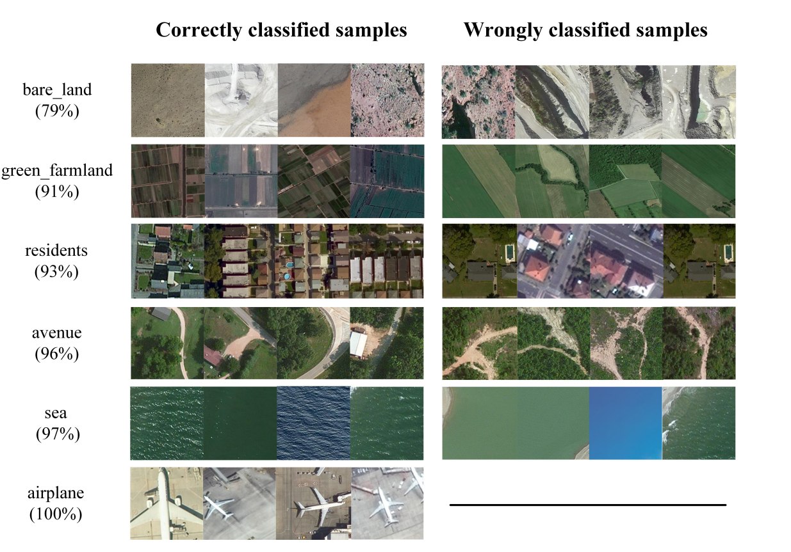
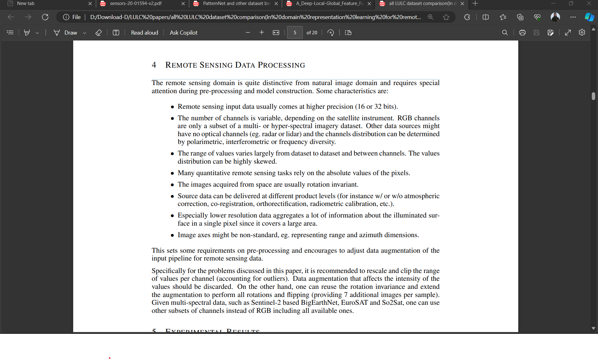
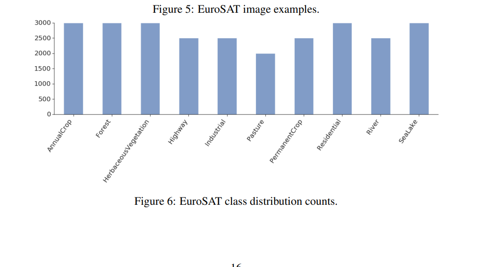
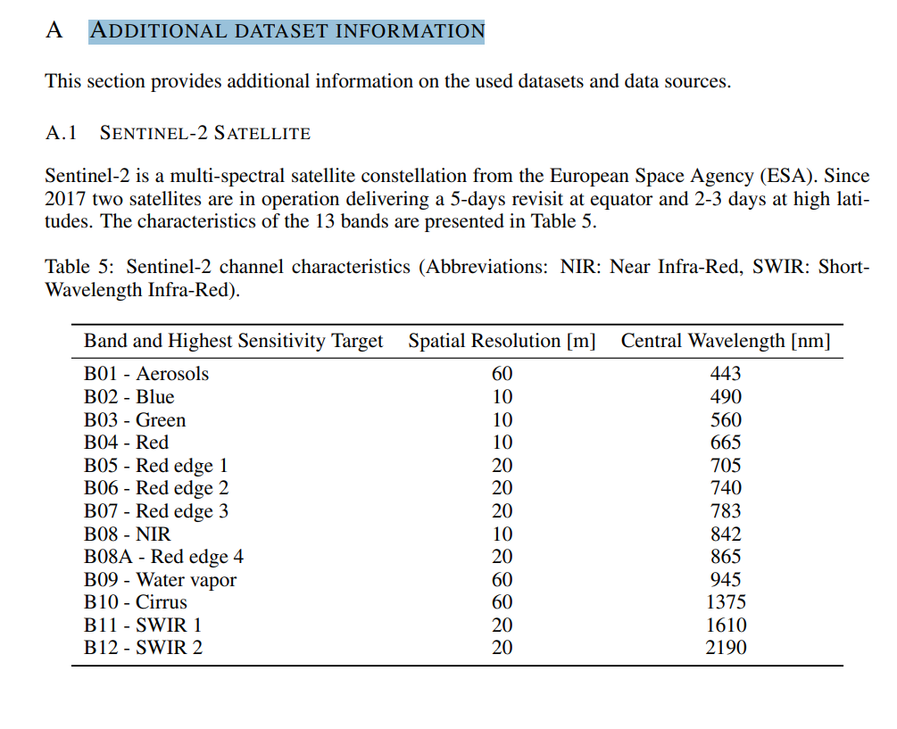
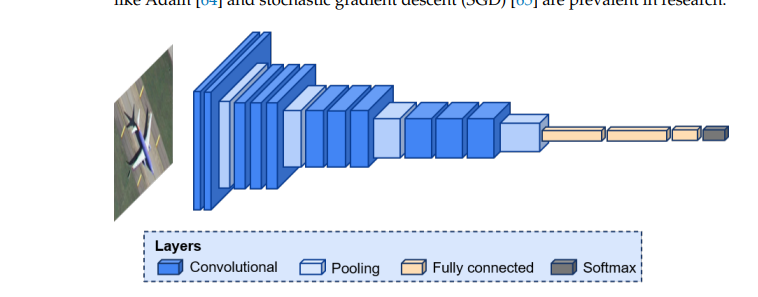

I need to write a thesis paper titled "A hybrid model for large scale remote sensing image classification". I collected four datasets (EuroSAT Dataset, UCMerced Dataset - Land-Use Scene Classification, NWPU-RESISC45 Dataset, PatternNet Dataset) and I merged all the datasets and got a total 64 different class (for example: residential area, river, forest, highway, industrial area etc.). These total of 64 classes include a total of 99400 images. Now, I developed a hybrid model for accurately classifying these 64 classes. Here's the model:

IMG_SIZE = 128
BATCH_SIZE = 32
epochs = 30

import tensorflow as tf
tf.random.set_seed(42)

train_data = tf.keras.preprocessing.image_dataset_from_directory(
 directory = datasets_dir,
 image_size = (IMG_SIZE, IMG_SIZE),
 label_mode = 'categorical',
 color_mode="rgb",
 batch_size = BATCH_SIZE,
 seed=42,
 shuffle = True,
 validation_split=0.2,
 subset="training"

).prefetch(buffer_size=tf.data.AUTOTUNE)

test_dataset = tf.keras.preprocessing.image_dataset_from_directory(
 directory = datasets_dir,
 image_size = (IMG_SIZE, IMG_SIZE),
 label_mode = 'categorical',
 color_mode="rgb",
 batch_size = BATCH_SIZE,
 seed=42,
 shuffle = True,
 validation_split=0.2,
 subset="validation"

)
class_names = test_dataset.class_names
test_data = test_dataset.prefetch(buffer_size=tf.data.AUTOTUNE)

import tensorflow as tf

data_augmentation = tf.keras.Sequential([
 tf.keras.layers.experimental.preprocessing.RandomFlip("horizontal",input_shape=(IMG_SIZE, IMG_SIZE, 3)),
 tf.keras.layers.experimental.preprocessing.RandomRotation(0.2),
 tf.keras.layers.experimental.preprocessing.RandomZoom(0.2),
 tf.keras.layers.experimental.preprocessing.RandomHeight(0.2),
 tf.keras.layers.experimental.preprocessing.RandomWidth(0.2)
], name ="data_augmentation")

# Setup the base models and freeze their layers (this will extract features)

base_model1 = tf.keras.applications.EfficientNetB0(include_top=False)
base_model2 = tf.keras.applications.ResNet50(include_top=False)

base_model1.trainable = True # Enable fine-tuning
base_model2.trainable = True # Enable fine-tuning

# Fine-tune only the last N layers

fine_tune_at = 50
for layer in base_model1.layers[:-fine_tune_at]:
 layer.trainable = False

fine_tune_at = 20
for layer in base_model2.layers[:-fine_tune_at]:
 layer.trainable = False

# Setup model architecture with trainable top layers

inputs = tf.keras.layers.Input(shape=(IMG_SIZE, IMG_SIZE, 3), name='input_layer')
x = data_augmentation(inputs)
x1 = base_model1(x, training=False)
x2 = base_model2(x, training=False)
x1 = tf.keras.layers.GlobalAveragePooling2D(name='global_avg_pooling_layer1')(x1)
x2 = tf.keras.layers.GlobalAveragePooling2D(name='global_avg_pooling_layer2')(x2)
x = tf.keras.layers.concatenate([x1, x2])
x = tf.keras.layers.Dropout(0.5)(x) # Add dropout for regularization
outputs = tf.keras.layers.Dense(len(class_names), activation='softmax', name='output_layer')(x)
model = tf.keras.Model(inputs, outputs)

# Compile the model

model.compile(
 loss='categorical_crossentropy',
 optimizer=tf.keras.optimizers.Adam(learning_rate=0.0001), # Adjust the learning rate
 metrics=['accuracy']
)

# Early stopping callback

early_stopping = tf.keras.callbacks.EarlyStopping(
 monitor='val_accuracy',
 patience=10,
 restore_best_weights=True
)

# Learning rate schedule callback

reduce_lr = tf.keras.callbacks.ReduceLROnPlateau(
 monitor='val_loss',
 factor=0.2,
 patience=3,
 min_lr=1e-7,
 verbose=1
)

# Train the model with the learning rate schedule

history = model.fit(
 train_data,
 epochs=epochs,
 steps_per_epoch=len(train_data),
 validation_data=test_data,
 validation_steps=len(test_data),
 callbacks=[early_stopping, reduce_lr]
)

Training Accuracy: 0.9849094748497009
Testing Accuracy: 0.9609155058860779

Based on above information, write me an abstract for a thesis paper.

# 

# datasets:

1. [EuroSat Dataset | Kaggle](https://www.kaggle.com/datasets/apollo2506/eurosat-dataset/data)

2. [UCMerced Dataset - Land-Use Scene Classification | Kaggle](https://www.kaggle.com/datasets/apollo2506/landuse-scene-classification/data)

3. [NWPU-RESISC45 Dataset | Kaggle](https://www.kaggle.com/datasets/happyyang/nwpu-data-set)

4. [So2Sat LCZ42 | TensorFlow Datasets](https://www.tensorflow.org/datasets/catalog/so2sat) 

5. [PatternNet](https://sites.google.com/view/zhouwx/dataset?authuser=0)

-----

| Final        | EuroSat                   | UC Merced                                              | NWPU-Resisc45                         |
| ------------ | ------------------------- | ------------------------------------------------------ | ------------------------------------- |
| Agricultural | AnnualCrop, PermanentCrop | agricultural                                           |                                       |
| Forest       | forest                    | forest                                                 | forest                                |
|              | river                     | river                                                  |                                       |
| industrial   | industrial                |                                                        | industrial_area                       |
| residential  | residential               | mediumresidential, denseresidential, sparseresidential | medium_residential, dense_residential |
| airplane     |                           | airplane                                               | airplane                              |
|              |                           | baseballdiamond                                        | baseball_diamond                      |
|              |                           | beach                                                  | beach                                 |
|              |                           | mobilehomepark                                         | mobile_home_park                      |
|              |                           | intersection                                           | intersection                          |
|              |                           | overpass                                               | overpass                              |
|              |                           | buildings                                              | commercial_area                       |
|              |                           | chaparral                                              | chaparral                             |
|              | Highway                   | freeway                                                | freeway                               |
|              |                           | golfcourse                                             | golf_course                           |
|              |                           | harbor                                                 | harbor                                |
|              |                           | intersection                                           | intersection                          |
|              |                           | parkinglot                                             | parking_lot                           |
|              |                           |                                                        |                                       |
|              |                           |                                                        |                                       |
|              |                           |                                                        |                                       |
|              |                           |                                                        |                                       |
|              |                           |                                                        |                                       |

EfficientNetB0 + VGG16 = super slow

 ----

# Todo

1. 

2. 

3. 

4. ADDITIONAL DATASET INFORMATION (from all dataset merged pdf)

5. [Image Classification Techniques in Remote Sensing (gisgeography.com)](https://gisgeography.com/image-classification-techniques-remote-sensing/)

6. 

7. 

**

| Class Name   | EuroSAT                                                              | UC Merced                                                         | RESISC45                                                             | PatternNet                                                             |
| ------------ | -------------------------------------------------------------------- | ----------------------------------------------------------------- | -------------------------------------------------------------------- | ---------------------------------------------------------------------- |
| agricultural | One image from Eurosat agriculture class((if class is available)  | One image from UC Merced agriculture class(if class is available) | One image from RESISC45 agriculture class(if class is available)  | One image from PatternNet agriculture class(if class is available)  |
| airplane     | One image from Eurosat airplane class((if class is available)        | One image from UC Merced airplane class((if class is available)   | One image from RESISC45 airplane class((if class is available)       | One image from PatternNet airplane class((if class is available)       |

**

<mark>same type</mark>: 

nursing home + church + commercial

pasture + harbaciousVegetation+

railway+railway_station

agriculture+rectangular_farmland_circular_farmland

freeway+runway

stadium+football_field+basketball_field

mobile_home_park+residential
