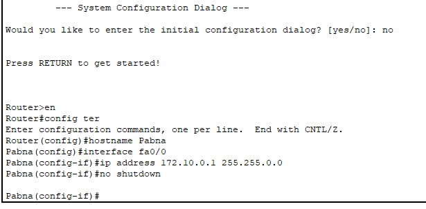
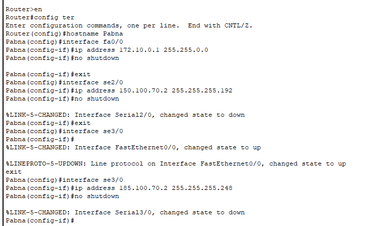

# kivabe packet jay from one computer to another computer.

### Step 1:

* first of all, ekta ICMP(Internet Control Message Protocol) packet generate korse.

* ICMP paket hosse ekta test packet jeta determine korte pare ei computer theke data arek computer e jabe ki jabe na.

### Step 2:

* capture and forward dile then packet ta switch e ashce.

# Q: Default Gateway charai tomake banai dekhate hobe

# Q: ekhane total koyta network ase?

- ek network theke arek network e data pathanor jonno router lagbe.

- dynamically host allocate korte holeo router dorkar.


---------------------

1. class-c te, first 24 bit is network id and last 8 bit is for host id. we can only change this host id.

2. if network id is different, then you can not find other device connected with a switch. for example. for pc0(192.168.10.2) to pc1(192.168.11.3) is not possible.

3. If we want to use different network ids, then we need router.


# Router CLI



### Router 1:

1. Router enable korte hobe. `Router>en`

2. `config ter`

3. `hostname Pabna`
* cli die kivabe router er password dewa jay?
4. prottekta interface e ip address dite hobe.
- `interface fa0/0`

- `ip address 172.10.0.1 255.255.0.0`

- eibar ei pin ta ke `up` korte hobe. router er kono port automatically up hoyna. so manually up korte hobe.

- `no shutdown`

----------------

* eibar baki 2 ta pin eo ip address dite hobe.

* `exit` (interface fa0/0 theke ber howar jonno karon ekhon interface se2/0 te kaj korte hobe)

* `interface se2/0`

* `ip address 150.100.70.2 255.255.255.192`

* `no shutdown`

* `exit`

-------------

- `interface se3/0`

- `ip address 185.100.70.2 255.255.255.248`

- `no shutdown`

- `exit`

- 

-------------------------------------

### Router 2 and 3 just like above.

5. eikhon capture and forward dile, router e eshe atke jabe, cz router gulote `routing protocol` add kora hoynay.
- routing protocol 2 dhoroner: static and dynamic
  
  - static routing protocol: network to network communication kore dey and er jonno CLI lagena, directly add kore dewa jay. but amra eta korbona, amra dynamic routing protocol add korbo.
  
  - `eigrp` namok routing protocol die amra kaj korbo.


### Add `eigrp` routing protocol:

- current router er shathe jotogulo network enable ase, oigulor prottektar network address current router ke bole dite hobe.

- ```javadoc
  en
  config ter
  router eigrp 20 //20 = latest version of eigrp
  network 172.10.0.0
  network 150.100.70.0
  network 185.100.70.0
  no shutdown
  ```
